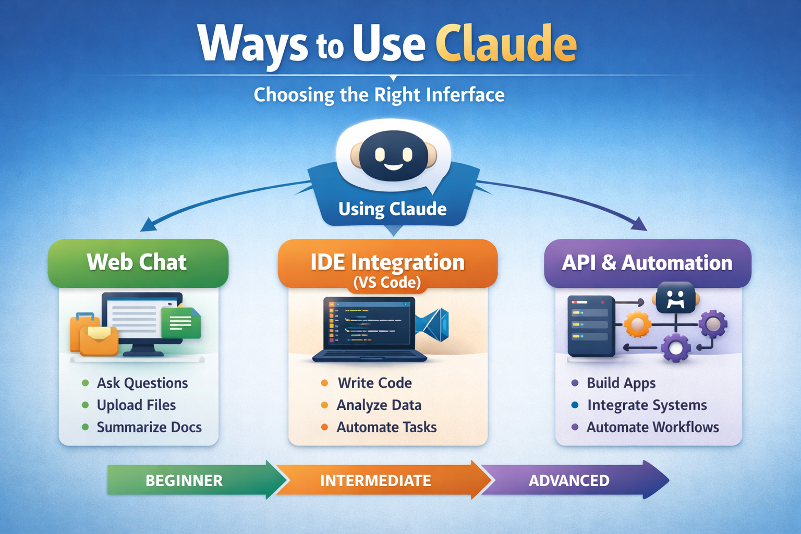
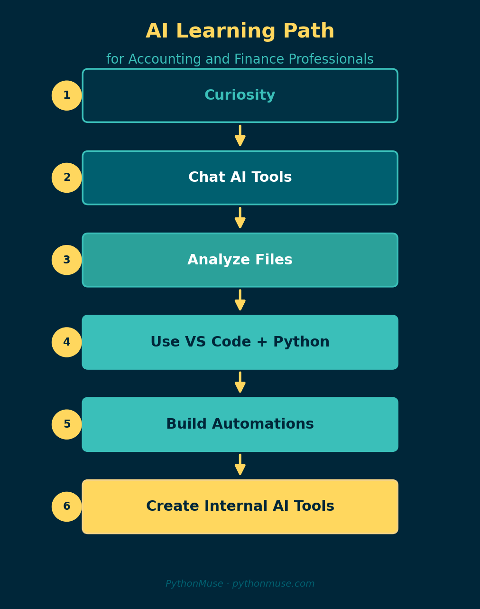

# Ways to Use Claude: Choosing the Right Interface

*A practical guide for accounting and finance professionals getting started with AI*

---

**By Svetlana Toohey**
*Published March 2026 -- Updated May 2026*

Many professionals hear about Claude and assume it's just another chatbot.

In reality, Claude can be reached through several different interfaces -- each one offering a different level of capability, and a very different posture toward your data. Understanding these options helps you move from simply asking AI questions to actually working alongside AI as a co-pilot, on files that never have to leave your workspace.

Below is a simple overview of the three primary ways to interact with Claude.


*From manual analysis to automated workflows -- Claude can assist at every stage.*

---

## Overview: Claude Interfaces


*Figure 1: The three ways to interact with Claude, from beginner to advanced.*

Think of these as levels of capability rather than complexity.

Most professionals start at Level 1 -- a browser chat -- and quickly hit a ceiling. The real shift comes at Level 2, where Claude works inside your workspace instead of inside a chat window.

---

## 1. Claude Web Chat -- The On-Ramp

The easiest way to start.

The browser interface at Claude's website lets anyone begin using AI immediately -- no software installation required. It is the right place to *learn the feel* of working with a capable model.

**Typical Uses**

- Asking research questions
- Summarizing documents
- Brainstorming ideas
- Drafting emails or reports
- Reviewing small spreadsheets or PDFs

**What works well**

- No setup required
- Supports file uploads
- Good for quick, one-off tasks on non-sensitive data

**Where it falls short**

- Whatever you paste or upload is sent to the cloud for processing
- Work is manual and hard to repeat
- No project structure, no rules, no audit trail

**Example for finance professionals**

Upload a small, non-sensitive trial balance or CSV export and ask:

```
Summarize unusual variances.
Identify large changes month-over-month.
Explain potential drivers of margin decline.
```

This is where most people first experience the power of AI, and it is a fine place to start.

It is **not** a fine place to stop.

---

## The Pivot -- Bring AI to Your Workspace, Not Your Data to the Cloud

There is a moment in every finance professional's AI journey where the browser interface stops working.

It is usually the moment a real client file enters the picture.

Pasting a trial balance into a chat window means that file -- names, account numbers, vendors, employees -- is processed somewhere outside your control. Even on a non-sensitive file, you have no project, no rules, no record of what was done. Every session starts from zero.

The fix is not to find a smarter chatbot. The fix is to **invert the direction of travel**.

Instead of uploading data into a chat that lives in the cloud, you open the folder that already contains the data in **Visual Studio Code**, and you let Claude work inside that folder under rules you set.

Same prompts. Same model. Different posture.

If you have not already set this up, [Getting the Right Tools Installed](../03-getting-the-right-tools-installed/) walks through exactly what to install and how to handle the IT conversation if your environment requires approval.

---

## 2. Claude Inside VS Code (via GitHub Copilot Chat)

This is where things become truly transformative -- and where most of the real PythonMuse work happens.

The setup is simpler than it sounds:

1. Install **Visual Studio Code**.
2. Install the **GitHub Copilot** extension and sign in.
3. Open Copilot Chat. In the model picker, **select a Claude model** (for example, Claude Sonnet or Opus). That same chat panel can now talk to Claude with your project folder as context.
4. Add a `CLAUDE.md` (or `AGENTS.md`) file at the root of your project. This is where you write the rules of the engagement -- before any prompt runs.

The result: Claude reads and writes inside the folder you opened, and only that folder. Your CSVs stay on your machine. Your outputs land in `/outputs/` with dated filenames. Every step is reviewable.

### What `CLAUDE.md` actually does

`CLAUDE.md` is a plain Markdown file Claude reads at the start of every session. It is where you set boundaries that the model is expected to honor for the rest of the conversation. Typical entries:

- **Propose before executing.** Claude must show a plan first; the human approves before any file is read or written.
- **Outputs go to `/outputs/`** with dated filenames; nothing in `/data/raw/` is ever modified.
- **No assumed thresholds.** Materiality, low-margin flags, period under review -- all must be confirmed, not inferred.
- **Mask sensitive fields** using a documented placeholder pattern before any content leaves the workspace.
- **Update `status_update.md`** after each milestone so the next session knows where you left off.

A working example lives in the [pythonmuse-workflow-kit `CLAUDE.md`](https://github.com/PythonMuse/pythonmuse-workflow-kit/blob/main/CLAUDE.md). Read it once. It is short, and it is the difference between Claude as a chatbot and Claude as a co-pilot.

### The same margin question, reframed as a workspace prompt

In a browser chat, the prompt was *"summarize unusual variances in this file I just uploaded."*

In VS Code, with the project folder already open, the same intent looks like this -- lifted directly from [demo-prompts.md](https://github.com/PythonMuse/pythonmuse-workflow-kit/blob/main/docs/demo-prompts.md) in the workflow kit:

```
Read the two CSV files in data/raw/ and summarize what we're working with --
time period, products, salespeople, vendors, and how the files relate.
```

Then:

```
Join the revenue and cost data on order_id.
Calculate gross profit and margin percentage.
Sort by lowest margin first and flag anything below 20%.
```

Two differences are worth pausing on:

- The data is **referenced by path**, not pasted. The files never leave the folder.
- Because of `CLAUDE.md`, Claude proposes a read-only plan first, names the threshold it is about to use, and waits for approval. You stay accountable for every number.

### Web chat vs. VS Code at a glance

| Question | Web Chat | VS Code + Claude |
|---|---|---|
| Where does my data go? | Uploaded to the cloud | Stays in your folder; referenced by path |
| Who sets the rules? | The chat platform | You, in `CLAUDE.md` |
| Can I repeat the same workflow next month? | Not really -- each chat is a fresh start | Yes -- prompts, skills, and scripts live in the repo |
| Is there an audit trail? | A chat transcript at best | Dated outputs, status updates, and version control |
| Can I work on real client data? | Almost never without masking and policy review | Yes, with `CLAUDE.md` boundaries and local files |

---

## How the Visuals in This Article Were Made

The figures you have been scrolling past were not designed in PowerPoint.

They were generated by Claude, inside VS Code, in the same workspace that holds this article. The pattern is the one taught throughout PythonMuse:

**Step 1 -- prompt the visual.** A prompt very close to Step 7 in [demo-prompts.md](https://github.com/PythonMuse/pythonmuse-workflow-kit/blob/main/docs/demo-prompts.md) asks Claude to produce a small set of charts as PNG files in `/visuals/`, with rules about colors, sort order, labels, and source-column citations. Claude proposes a single Python script first, per `CLAUDE.md`, so the work is reproducible -- not five ad-hoc renderings.

**Step 2 -- review and refine.** The human opens the PNGs, ties at least one labeled value back to source data, and adjusts the prompt if the chart misses the point.

**Step 3 -- promote the working prompt to a Skill.** Once a chart you like exists, you do not want to re-derive the prompt next quarter. So you ask Claude to capture the logic as a reusable skill. Lifted from Step 8 of `demo-prompts.md`:

```
Convert the chart-producing logic from Step 7 into a reusable skill at
/skills/visualize-margin/SKILL.md. Follow the format of the existing skills
in this repo (bank-reconciliation, margin-analysis, pdf-extract).

The SKILL.md must include use case, required input columns, the chart
specifications (purpose, x/y, sort order, highlight rule, required labels),
output naming convention, validation steps, and a short "do not" list
(no silent rounding, no inferred thresholds, no hardcoded periods).
```

A skill is the smallest unit of repeatability. Once it exists, any future session can reproduce the same charts on a new dataset by referencing the skill -- no need to remember which prompt worked.

That is the loop: **prompt -> result you trust -> skill**. Every visual in this article went through it.

---

## 3. Claude API (Embedding AI in Applications)

The most advanced interface is the Claude API.

This allows developers to integrate Claude into software products, internal tools, or fully automated workflows.

**Typical Uses**

- Automated document processing
- Financial analysis platforms
- Custom internal reporting tools

**What works well**

- Fully automated workflows
- Integrates with internal systems
- Highly scalable

For most finance professionals, the API is **not the next step**. The VS Code workflow gets you most of the way -- prompts you trust, skills you reuse, scripts you can rerun. The API matters once an automation needs to run without a human in the loop.

---

## A Simple Mental Model

| Interface | Best For | Where Your Data Lives | Skill Level |
|---|---|---|---|
| Web Chat | Learning and quick tasks on non-sensitive data | Cloud (whatever you paste) | Beginner |
| VS Code + Claude (Copilot Chat) | Real analysis and repeatable workflows | Your folder, under `CLAUDE.md` rules | Intermediate |
| API | Building AI systems | Wherever your application puts it | Advanced |



---

## Try This Yourself -- Two Paths

### 5 minutes -- Web chat (the on-ramp)

1. Open Claude in your browser.
2. Upload a small, non-sensitive CSV -- a sample trial balance or sales export.
3. Ask:

   ```
   Identify unusual transactions or large changes month-over-month.
   Explain possible reasons.
   ```

This shows you what the model can do. It does not show you what a workflow looks like.

### 15 minutes -- VS Code with Claude (the workflow)

1. Clone the [pythonmuse-workflow-kit](https://github.com/PythonMuse/pythonmuse-workflow-kit) repository.
2. Open the folder in VS Code.
3. In Copilot Chat, **select a Claude model** in the model picker.
4. Read the `CLAUDE.md` at the repo root -- this is the ruleset Claude will follow.
5. Open [docs/demo-prompts.md](https://github.com/PythonMuse/pythonmuse-workflow-kit/blob/main/docs/demo-prompts.md) and run **Step 1** and **Step 2**, one at a time. Approve each plan before Claude executes.

You will end up with the same margin analysis used in [Article 01](../01-ai-copilot-for-accounting/) -- but produced inside your workspace, on files that never left it, with an audit trail you can defend.

If you are coming here from the live demo, the rest of the steps you saw -- validation, year-over-year compression, charts, skill capture, scripting -- are all in `demo-prompts.md` to run on your own.

---

## The Real Shift

Many professionals think AI adoption begins with asking better prompts.

In reality, the bigger shift happens when you stop *visiting* AI in a browser tab and start *inviting* AI into your workspace -- under rules you wrote, on files you control, with outputs you can trace.

That is when AI becomes less of a chatbot, and more of a true co-pilot for analysis, automation, and problem solving.

If you want the full hands-on walkthrough, [Article 01](../01-ai-copilot-for-accounting/) shows exactly how this works on two CSV files and plain English questions. The [demo-prompts.md](https://github.com/PythonMuse/pythonmuse-workflow-kit/blob/main/docs/demo-prompts.md) in the workflow kit is the script -- twelve steps, copy-paste ready -- to try every move yourself.

---

*Related: [Workflow Kit (GitHub)](https://github.com/PythonMuse/pythonmuse-workflow-kit) | [Demo Prompts](https://github.com/PythonMuse/pythonmuse-workflow-kit/blob/main/docs/demo-prompts.md) | [Getting the Right Tools Installed](../03-getting-the-right-tools-installed/) | [Your AI Co-Pilot for Accounting](../01-ai-copilot-for-accounting/) | [AI in Accounting Is Not the Wild West Anymore](../04-ai-governance-in-accounting/) | [AI Governance for Controllers](../07-ai-governance-for-controllers/)*
