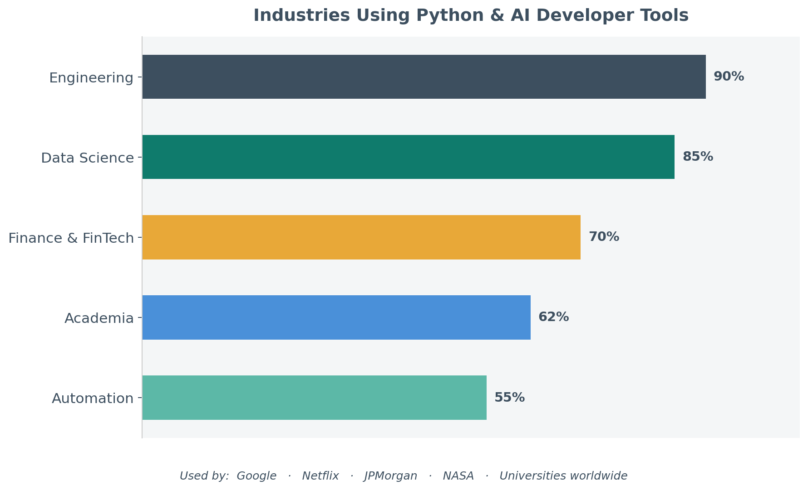
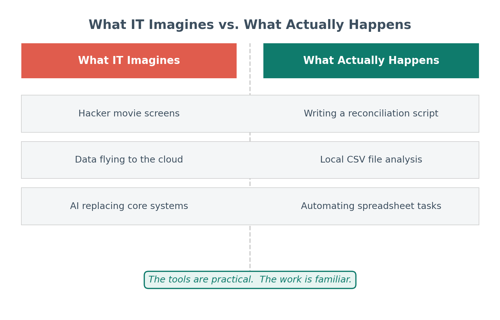
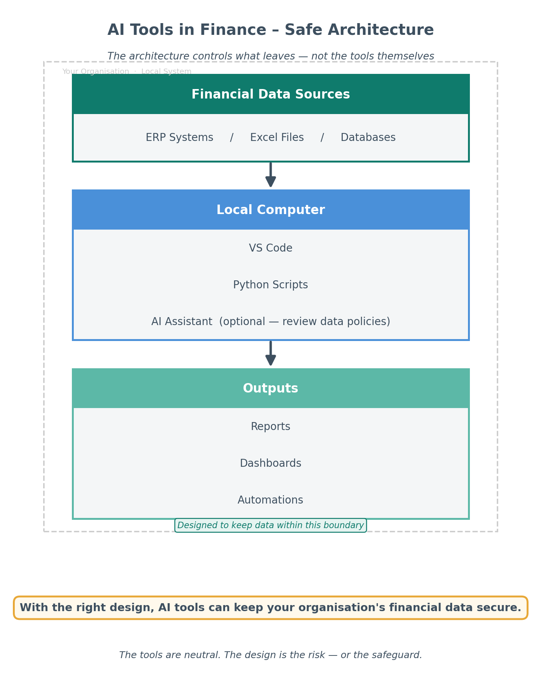
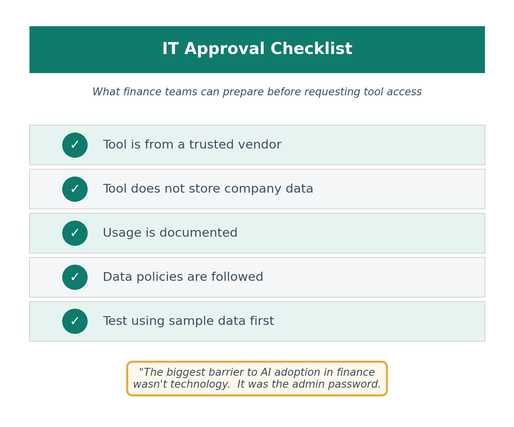

# Getting the Right Tools Installed: A Safe Starting Point for Accounting Teams

*A practical guide for finance professionals working with IT in secure corporate environments*

---

**By Svetlana Toohey**
*Published March 2026*

I thought learning Python would be the hard part.

It turns out the harder part was getting the tools installed in the first place.

If you work in accounting or finance inside a corporate environment, you probably know what I mean. The moment you start exploring automation or AI-assisted workflows, you quickly realize something surprising:

Most of the tools require administrator permissions to install.

Suddenly you find yourself asking IT for approval to install things like:

- Python
- Visual Studio Code
- AI assistants such as Copilot, Claude, or GPT-based tools

And the first reaction is often something like:

"Why do you need this?"

or

"Is this secure?"

Those are fair questions. Finance teams work with sensitive information, and IT departments are responsible for protecting the organization's systems and data.

But the good news is that many of the tools used in modern analytics and automation are well-established, widely trusted, and already used in enterprise environments.

The challenge is usually not the tools themselves.
The challenge is explaining how they will be used responsibly.

---

## The Tools I Recommend to Get Started

When accounting teams begin exploring automation and AI, I usually recommend starting with a very simple toolkit.

These tools are not exotic or experimental. They are widely used across technology, analytics, and data science communities.

### Visual Studio Code (VS Code)

Visual Studio Code is a lightweight development environment created and maintained by Microsoft.

It is one of the most widely used editors in the world for working with code, scripts, and structured data.

Finance teams often use it to:

- write small automation scripts
- analyze large datasets
- organize data workflows
- document processes

More information:
https://code.visualstudio.com/

If you want beginner-friendly setup guidance, see [Where to Start If You're Ready to Work With AI](../00.5-where-to-start-with-ai/), then use the detailed checklist in the [AI Getting Started Toolkit](../00.5-where-to-start-with-ai/ai-getting-started-toolkit.md).

### Python

Python is a programming language widely used for data analysis and automation.

In finance and accounting, Python can help with tasks such as:

- reconciling transactions
- analyzing large exports from ERP systems
- automating repetitive spreadsheet processes
- preparing data for dashboards or reports

Official website:
https://www.python.org/

For practical installation steps in a finance context, reference [Where to Start If You're Ready to Work With AI](../00.5-where-to-start-with-ai/).

For a deeper dive into Python libraries for accounting and annotated code examples, see the [AI Accounting Framework](https://github.com/PythonMuse/pythonmuse-ai-accounting-framework/tree/main/03-python-without-intimidation).

### AI Assistants

AI assistants can help generate code, explain file structures, and draft documentation.

Many development tools now integrate AI assistants such as:

- GitHub Copilot
- Claude-based assistants
- GPT-based tools

These assistants can significantly speed up tasks such as:

- writing scripts
- documenting processes
- understanding messy datasets

It is important to understand that AI features may involve sending prompts or file context to cloud-based models for processing. For that reason, organizations should define clear internal guardrails for how these tools are used.

If you are evaluating assistant options by interface (browser, VS Code, API), see [Ways to Use Claude: Choosing the Right Interface](../02-ways-to-use-claude/).

### Git (Version Control)

Git is a free version control system that tracks every change you make to your scripts and automation files.

If you have been in accounting for more than a week, you have seen a folder that looks like this:

```
reconciliation_v1.xlsx
reconciliation_v2.xlsx
reconciliation_v2_FINAL.xlsx
reconciliation_v2_FINAL_reviewed.xlsx
reconciliation_v2_FINAL_reviewed_USE_THIS_ONE.xlsx
```

And somewhere in one of those files, there are cells highlighted in yellow — the informal signal for "this is what changed." But yellow highlighting only tells you what someone *thought* changed. It does not tell you whether anything else shifted quietly in column C. It does not tell you who made the change, when, or why.

For accounting automation scripts, this matters in a direct and auditable way. When an auditor reviews and signs off on the script that runs your reconciliation, you need to be able to show them — precisely — that the version currently running is exactly what they reviewed. Not "mostly the same." Not "I think nothing else changed." Exactly.

Git does this. It records every change to every line of every file, who made it, and when. If an auditor reviewed version 3 of your reconciliation script, Git can show them the exact difference between that version and the one you are running today. No yellow highlighting. No guessing. A complete, timestamped record.

For accounting and finance teams, Git matters because:

- it creates a verifiable audit trail for automation scripts and workflow changes
- it lets you compare any two versions of a file with line-by-line precision
- it makes it safe to experiment without fear of losing working code
- it supports team collaboration without overwriting each other's work

Official website:
https://git-scm.com/

Git is often pre-installed on developer workstations. For corporate environments, IT may route it through GitHub, Azure DevOps, or a similar internal platform — worth confirming before installing.

> **Once you have version control, something changes.** You can improve, experiment, and iterate freely — knowing that any version that worked is still one step away. It is not just Ctrl+Z. It is Ctrl+Z that is tracked, named, and retrievable six months later. That confidence changes how you work.

This becomes especially relevant when your scripts are handling sensitive data. See [Don't Trust the Model to Find What You Already Know Is There](../23-schema-driven-sanitization/) for a deeper look at how version-controlled transformation scripts function as audit evidence in an AI data pipeline.

For a deeper understanding of version control and how to build a practical Git workflow for accounting automation, see [Version Control for Accountants](../20-version-control-for-accountants/) *(coming soon)*.


*Figure 1: Python and AI developer tools are not experimental. They are widely used across engineering, data science, finance, and academia — and trusted by organizations including Google, Netflix, JPMorgan, and NASA.*

---

## Why IT Often Pauses

When IT teams see requests for developer tools, they usually want to understand a few basic things:

- What does the software do?
- Who maintains it?
- How will it be used?
- Does it introduce security risk?

Those questions are not obstacles. They are part of responsible technology governance.

The easiest way to move forward is simply to be transparent about your intended use cases.

For example, you might explain that you want to explore automation for tasks like:

- bank reconciliations
- file structure documentation
- data cleaning for reports
- analysis of large exported datasets

These are practical improvements to existing workflows, not experimental system replacements.


*Figure 2: The reality of how finance teams use these tools is far more practical than IT might expect.*

---

## A Simple Starting Point: Begin With Safe Use Cases

When first adopting these tools, it helps to begin with very low-risk activities.

Examples include:

- working with sample or synthetic data
- documenting file structures
- building small automation scripts
- experimenting with non-sensitive datasets

This allows teams to learn how the tools work before using them on real financial information.

Starting small also helps build trust with IT teams and leadership.


*Figure 3: A simple local-first architecture that helps teams keep financial data inside organizational boundaries.*

---

## A Simple Message You Can Send to IT

If you are requesting installation of these tools, a short explanation like the one below can help.

**Subject:** Request to Install Tools for Finance Automation

Hi [IT Team],

I'm exploring ways to automate several finance workflows (such as reconciliations and data preparation) and would like to request installation of the following tools:

- Visual Studio Code
- Python
- Git (version control for scripts and automation files)

These are widely used tools for data analysis and automation.

The initial goal is to experiment with small workflow improvements using sample or non-sensitive datasets.

If helpful, I'd be happy to walk through the intended use cases and answer any questions.

Thank you for your help.

Best regards,
[Name]

---


*Figure 4: A simple checklist finance teams can use to approach IT conversations with confidence.*

---

## My Personal Experience

When I first started exploring automation and AI in finance, I assumed the biggest challenge would be learning the technology.

Instead, I discovered the real gatekeeper was much simpler.

The administrator password.

Once I explained to IT what the tools actually were and how they would be used, the conversation changed.

Instead of:

"Why do you need this?"

It became:

"Okay - show us what you're trying to build."

That's when real progress starts to happen.

---

## What Comes Next on PythonMuse

Getting the tools installed is only the first step.

In the next PythonMuse articles, we will explore two topics that often come up right after that:

### Using AI responsibly in accounting

Understanding when AI tools process information locally and when cloud models are involved, and how to avoid sending sensitive financial data where it doesn't belong.

### Making AI workflows audit-friendly

Designing automation that is documented, reviewable, and easier to support during internal review or audit.

### Tracking script changes with version control

Once your automation scripts start doing real work, you need a way to prove what ran, when, and what changed since the last review. A coming article will walk through Git and version control basics specifically for accounting and finance professionals.

My goal with PythonMuse is not just to encourage adoption of new tools, but to help finance teams adopt them responsibly, one step at a time.

If you want to go from setup to execution, [Your AI Co-Pilot for Accounting](../01-ai-copilot-for-accounting/) shows a full example analysis workflow using CSV files in VS Code.

---

*Related: [AI in Accounting Is Not the Wild West Anymore](../04-ai-governance-in-accounting/) | [Safe AI Data Workflows](../06-safe-ai-data-workflows/) | [Your AI Co-Pilot for Accounting](../01-ai-copilot-for-accounting/) | [VS Code Extensions for Accountants](../27-vscode-extensions-for-accountants/) | [Python Libraries for Accountants](../28-python-libraries-for-accountants/) | [Version Control for Accountants](../20-version-control-for-accountants/) | [AI Accounting Framework](https://github.com/PythonMuse/pythonmuse-ai-accounting-framework)*
