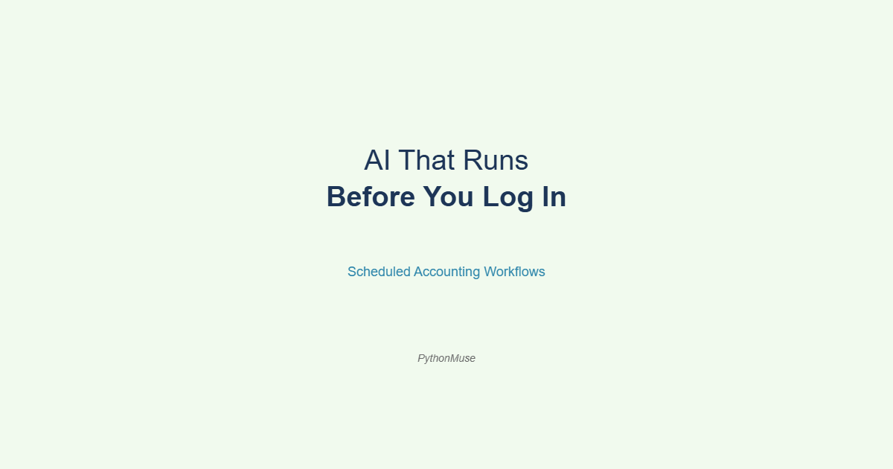
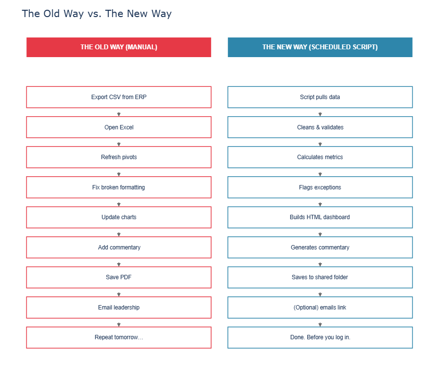
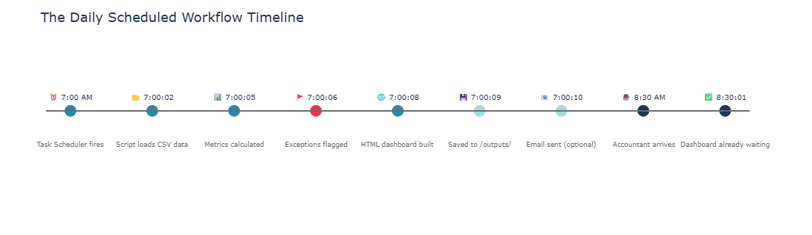

# AI That Runs Before You Log In

*How scheduled workflows are changing the way accountants show up to work — and what a daily sales dashboard built with AI actually looks like*

---

**PythonMuse LLC**
*Published May 2026*



---

> 🧰 **A quick note on tools and framework.** Everything in this article demonstrates the PythonMuse methodology — we are using Claude as the AI model, inside Visual Studio Code, through GitHub Copilot. But the concepts here — scheduled scripts, automated dashboards, trigger-based workflows — apply to whatever AI model and environment your organization has approved. Further down, we show how the same prompts look in ChatGPT and Google Gemini. The framework travels. The interface is just a detail.

---

## The Old Morning Routine

There was a time when "automation" in accounting meant:

- opening Excel,
- clicking Refresh All,
- waiting nervously,
- and praying nothing broke while you grabbed coffee.

If the spreadsheet opened without:

- circular reference warnings,
- broken links,
- or a mysterious tab named `FINAL_v2_USE_THIS_ONE_REAL.xlsx`

...that was already considered operational excellence.

But something quietly changed.

AI is no longer just helping accountants while we work.

Now it can work before we log in.

And honestly? That is where things start getting interesting.

---

## The Shift Nobody Is Talking About

Most AI discussions in accounting still focus on prompting.

> "Ask AI to summarize this."
> "Ask AI to explain a variance."
> "Ask AI to build a formula."

Useful? Absolutely.

But the real leap happens when accountants realize:

**AI workflows can run on schedules.**

Meaning:

- every morning,
- every Monday,
- every month-end,
- or whenever a trigger fires —

...the workflow wakes up and does the work automatically.

No one opening Excel. No one copying tabs. No one manually rebuilding dashboards for the 47th time this quarter.

Your accounting workflow becomes something closer to a night-shift analyst that never sleeps, never asks for PTO, and never accidentally overwrites the master tab.

*(Still review the outputs though. We are not giving the intern your ERP credentials unsupervised.)*

---

## The Old Dashboard Life

Let's be honest about what daily reporting often looks like today.

**The Traditional Workflow:**

1. Export CSV from ERP
2. Open Excel
3. Refresh pivots
4. Fix broken formatting
5. Update charts
6. Add commentary
7. Save PDF
8. Email leadership
9. Repeat tomorrow forever until retirement

Half the process is not even analysis. It is surviving the process itself.

And if someone asks:

> "Can we add a filter by region?"

Congratulations. You just inherited another permanent spreadsheet responsibility.

---

## The New Workflow

Now imagine this instead.

**At 7:00 AM every weekday:**

1. A Python script runs automatically
2. Pulls yesterday's sales and service data
3. Cleans and validates it
4. Flags unusual transactions
5. Builds an interactive HTML dashboard
6. Generates commentary
7. Saves the dashboard to a shared folder
8. Optionally emails the team a link

Before accounting even logs in.

That is not science fiction. That is literally a scheduled script.

And the AI helped build it — with prompts you could write today.

---

## "Wait… Dashboards Can Leave Excel?"

Yes.

This is one of the biggest mindset shifts accountants are about to experience.

For years we treated Excel as:

- the database,
- the dashboard,
- the workflow engine,
- the reporting tool,
- the reconciliation layer,
- and emotional support system.

But modern dashboards can be generated directly into **HTML**.

Meaning: filters, dropdowns, slicers, charts, commentary, and interactive visuals — all inside a browser window.

No broken formulas. No hidden columns. No "don't touch the yellow cells."



---

## The Demo: Daily Sales & Service Dashboard

Inside the [PythonMuse Workflow Kit](https://github.com/PythonMuse/pythonmuse-workflow-kit), we built a practical example.

### Step 1 — Load the Data

The workflow starts by loading sample CSV files:

```python
import pandas as pd
from pathlib import Path

DATA_DIR = Path(__file__).parent.parent / "data"

sales_df = pd.read_csv(DATA_DIR / "daily_sales.csv", parse_dates=["date"])
service_df = pd.read_csv(DATA_DIR / "service_calls.csv", parse_dates=["date"])
```

The CSVs are the training wheels. Here is what the SQL upgrade looks like when you are ready:

```python
# SQL version — swap these in when you're ready to connect to your database
# from sqlalchemy import create_engine
# engine = create_engine("mssql+pyodbc://server/database?driver=ODBC+Driver+17+for+SQL+Server")
# sales_df = pd.read_sql("SELECT * FROM daily_sales WHERE sale_date = CAST(GETDATE()-1 AS DATE)", engine)
# service_df = pd.read_sql("SELECT * FROM service_calls WHERE call_date = CAST(GETDATE()-1 AS DATE)", engine)
```

CSV first. SQL when the bike needs to go faster.

### Step 2 — Analyze the Data

The script calculates what accountants already look at every morning:

- revenue by branch vs. target
- gross margin by category
- service call volume by priority
- exception flags (revenue below 70% of target, open emergency calls)
- dynamic commentary

```python
yesterday = sales_df["date"].max()
daily = sales_df[sales_df["date"] == yesterday].copy()
daily["gross_margin"] = (daily["revenue"] - daily["cost"]) / daily["revenue"]
daily["vs_target_pct"] = (daily["revenue"] - daily["target_revenue"]) / daily["target_revenue"]

# Flag exceptions: branches more than 15% below target
exceptions = daily[daily["vs_target_pct"] < -0.15]
```

Exactly the same logic accountants use today. The difference is the workflow remembers how to do it tomorrow.

### Step 3 — Build the Interactive Dashboard

Using Plotly, the script generates an HTML file with interactive charts:

```python
import plotly.express as px
import plotly.graph_objects as go

fig = px.bar(
    branch_summary,
    x="branch",
    y=["revenue", "target_revenue"],
    barmode="group",
    title=f"Revenue vs. Target by Branch — {yesterday.strftime('%B %d, %Y')}",
    color_discrete_map={"revenue": "#2E86AB", "target_revenue": "#A8DADC"}
)
```

And yes — the script generates commentary automatically:

```python
top_branch = branch_summary.loc[branch_summary["revenue"].idxmax(), "branch"]
total_revenue = branch_summary["revenue"].sum()
total_target = branch_summary["target_revenue"].sum()
vs_target = (total_revenue - total_target) / total_target * 100

commentary = (
    f"Total revenue of ${total_revenue:,.0f} was "
    f"{'above' if vs_target > 0 else 'below'} target by {abs(vs_target):.1f}%, "
    f"led by the {top_branch} branch."
)
```

Five years ago that sentence alone would have sounded like a product demo.

Now it is about 12 lines of Python.

### Step 4 — Schedule the Workflow

This is where the magic happens.

**Windows Task Scheduler** (most accountants already have this and never knew it):

1. Open Task Scheduler → Create Basic Task
2. Set trigger: Daily, 7:00 AM, weekdays only
3. Action: Start a program → `python`
4. Arguments: `C:\path\to\run_scheduled_dashboard.py`

Done. The workflow now runs before coffee.



> 📋 **For IT and governance teams:** See the [scheduling setup guide in the Workflow Kit](https://github.com/PythonMuse/pythonmuse-workflow-kit) for Windows Task Scheduler, GitHub Actions, and Linux cron configuration with logging and audit trail requirements.

---

## How This Looks in Other AI Tools

> 🌐 **Framework reminder.** We built this workflow using Claude inside VS Code via GitHub Copilot. But every major AI tool can help you build the same thing. The prompts are nearly identical — the output varies slightly by tool, but the logic is the same.

Here is the starting prompt we used:

> *"I want to build a Python script that loads a CSV of daily sales data, calculates revenue vs. target by branch, flags exceptions, and saves an interactive HTML dashboard using Plotly. Use pandas and include comments showing where I could replace the CSV load with a SQL query later."*

**In GitHub Copilot (VS Code):** Paste the prompt into the Copilot Chat panel. It will read your workspace context, follow your `CLAUDE.md` rules, and generate code directly in your project.

**In ChatGPT:** Paste the same prompt at chatgpt.com. Attach your CSV file for context. It will generate the script — copy it into your project folder.

**In Google Gemini:** Same prompt at gemini.google.com. Gemini handles Python and Plotly well. Download the generated script to your project.

**In Microsoft Copilot (M365):** Available in some enterprise plans. Prompt behavior is similar — check your organization's approved use policy first.

The framework is the same everywhere:

1. Describe your workflow clearly
2. Provide sample data for context
3. Ask for modular, commented code
4. Review before running
5. Iterate with follow-up prompts

The tool is just the interface. **The thinking is yours.**

---

## "But Isn't This IT Stuff?"

A little.

But so was Excel once.

There was also a time when:

- pivot tables looked terrifying,
- VLOOKUP users were considered sorcerers,
- and macros were whispered about like forbidden magic.

Accounting professionals adapt faster than they realize.

The difference now: **AI dramatically lowers the technical barrier.**

You no longer need to know how to build everything from scratch. You need to know:

- how workflows fit together,
- how to review outputs,
- how to add controls,
- and how to think structurally.

That is a much more achievable learning curve than most people think.

---

## The Governance Part (Yes, We Have to Talk About It)

> ⚠️ **Important reality check.** None of this removes the need for accounting judgment. It actually increases the importance of governance.

Every scheduled workflow needs:

| Requirement | What It Looks Like in Practice |
|---|---|
| Approved logic | Documented calculation rules, reviewed by a senior accountant |
| Testing | Run against historical data before going live |
| Exception handling | What happens if the CSV is missing or empty? |
| Run logs | Timestamped record of every execution and output |
| Human review | Someone checks the dashboard before leadership sees it |
| Auditability | Can you reproduce exactly what ran on a given date? |

The accountant does not disappear.

The repetitive manual process does.

And honestly? Most accountants would happily trade "copying tabs into PowerPoint at 10 PM" for higher-value review and analysis work.

> 🔒 **Data safety reminder.** This demo uses sample data. Before connecting a scheduled workflow to real company data, review your organization's AI and data governance policies. See: **[How to Use AI Without Sending the Wrong Data →](../06-safe-ai-data-workflows/)**

---

## The Bigger Shift

This article is not really about dashboards.

It is about a change in mindset.

Most accountants still think:

> "How can AI help me do this task?"

The next level is:

> "How can this workflow run without me manually starting it?"

That is a completely different way of thinking.

And once you see it happen once — dashboard waiting in your folder at 7:01 AM — it becomes very hard to go back to manually refreshing spreadsheets and hoping Excel behaves.

---

## Ready to Wow Your New Boss?

Here is your starting point. No IT department required (yet).

**This week:**
- Download the [PythonMuse Workflow Kit](https://github.com/PythonMuse/pythonmuse-workflow-kit)
- Run `build_daily_dashboard.py` against the sample data in `/data/`
- Open `outputs/daily_dashboard/dashboard.html` in your browser
- Show someone what an AI-generated dashboard looks like

**Next week:**
- Replace the sample CSV with real (masked or anonymized) data from your ERP
- Tweak the commentary logic for your business context
- Schedule it with Windows Task Scheduler

**The week after:**
- Your dashboard is waiting for you when you arrive
- Your colleagues are asking how you did it
- Your new boss thinks you are a wizard

You did not write this from scratch.

You knew how to describe the problem clearly, how to review the output responsibly, and how to connect the workflow to something that runs itself.

That is the skill.

The accountants who learn to build workflows like this — even imperfect, even small ones — will feel very different from those still manually refreshing spreadsheets every morning hoping Excel behaves itself.

---

## Related Articles

- [From One-Time Analysis to Repeatable Workflows](../11-one-time-to-repeatable-workflows/README.md) — the nine-step pattern for turning a one-off task into a script that runs reliably
- [The Power of Skills and Agents](../17-skills-and-agents-for-accountants/README.md) — how to build reusable AI workflows beyond one-time prompts
- [Your First CLAUDE.md](../17b-your-first-claude-md/README.md) — how to give your AI a standing set of rules for your accounting environment
- [What the Heck Is a Script?](../25-what-the-heck-is-a-script/README.md) — if the code in this article felt unfamiliar, start here
- [How to Use AI Without Sending the Wrong Data](../06-safe-ai-data-workflows/README.md) — before connecting to real data, read this

---

## PythonMuse Workflow Kit

The full demo for this article — sample data, scripts, skills, and scheduling instructions — lives in the [PythonMuse Workflow Kit](https://github.com/PythonMuse/pythonmuse-workflow-kit):

```
pythonmuse-workflow-kit/
  data/raw/
    daily_sales.csv
    service_calls.csv
  src/
    build_daily_dashboard.py
    run_scheduled_dashboard.py
  skills/
    scheduled-dashboard/
      SKILL.md
  outputs/
    daily_dashboard/
```

Clone it. Run it. Modify it. That is the whole point.

---

*Published by [PythonMuse LLC](https://pythonmuse.com) | [GitHub](https://github.com/PythonMuse/ai-ledger)*
