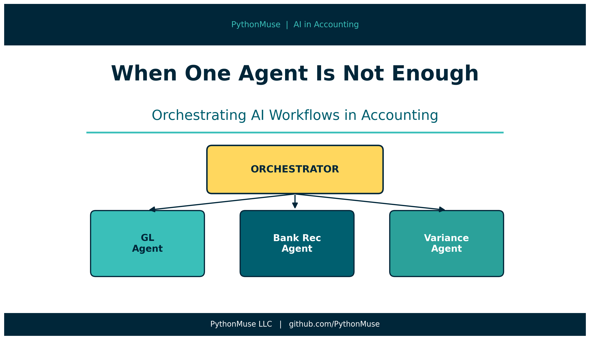
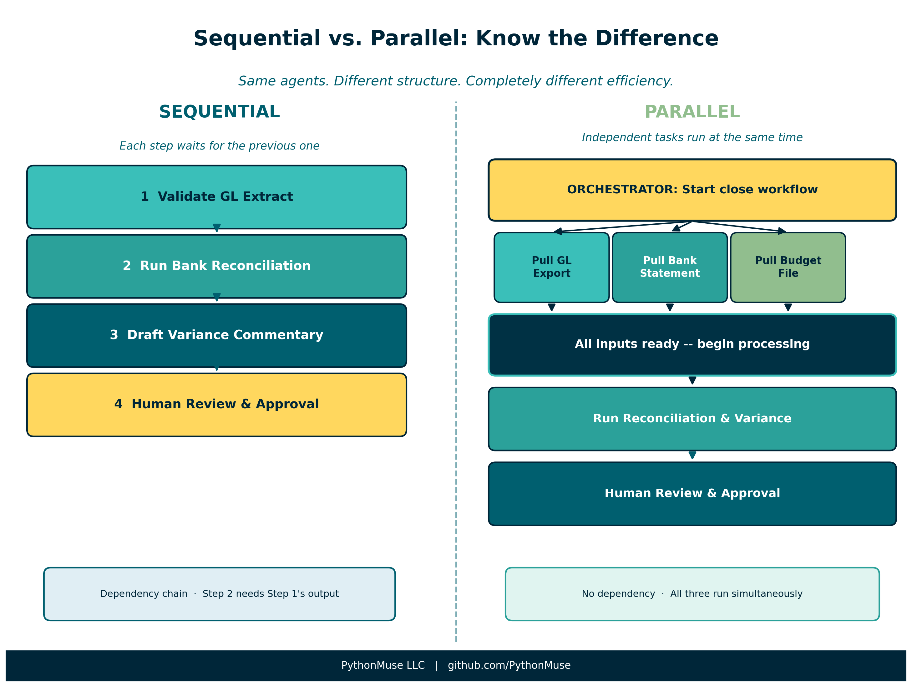
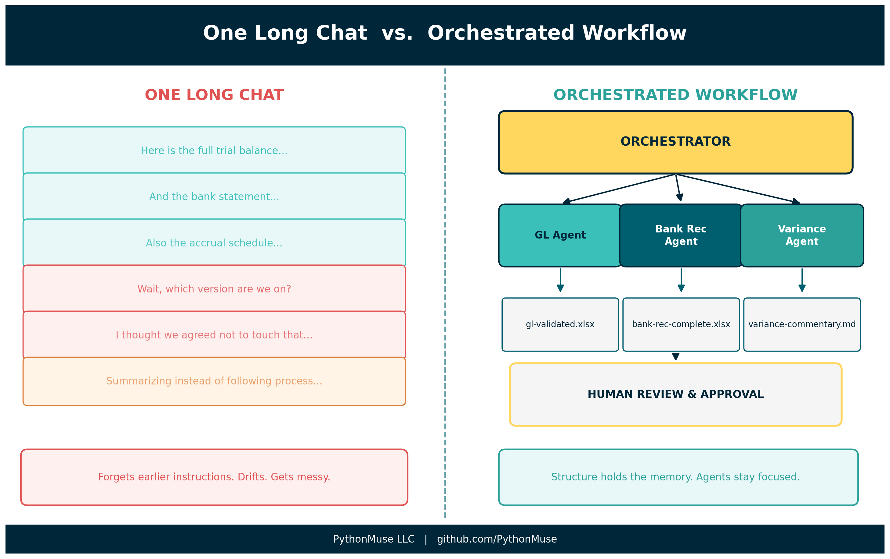
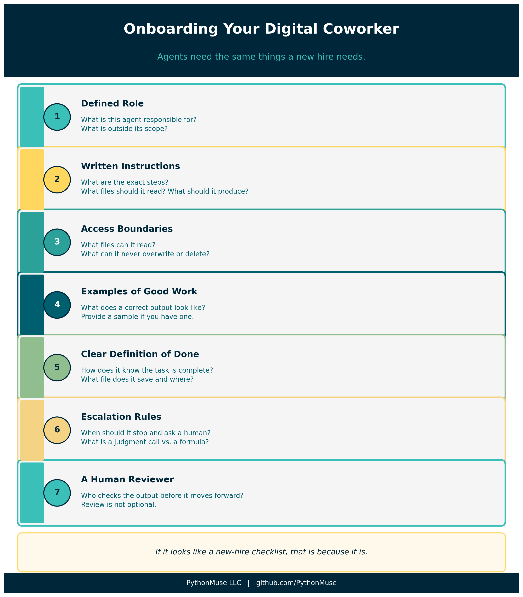
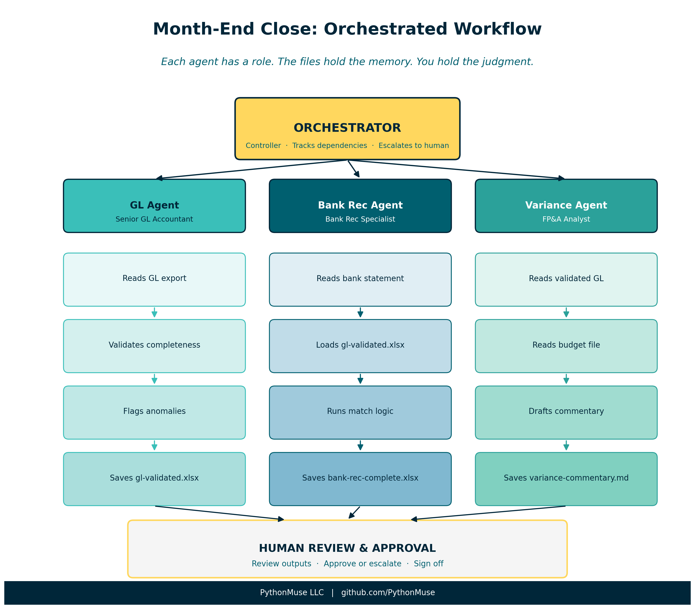

# When One Agent Is Not Enough: Orchestrating AI Workflows in Accounting

*From a single AI session to a coordinated team of digital specialists*

---

**PythonMuse LLC**
*Published May 2026*



---

Here is a scenario most accountants have experienced.

Month-end close. You open an AI chat. You paste in your trial balance, your bank statement, your expense reports, your accrual schedule, and your prior month variance notes. Then you type:

"Help me close the books."

What happens next falls somewhere between "surprisingly useful" and "how did it forget the instructions I gave it twenty minutes ago?"

Here is the problem. You have just handed one AI session an entire accounting department's worth of work, with no folder structure, no review checkpoints, and no way to hand off to a reviewer.

That is not a workflow. That is a very long email thread waiting to get messy.

Multi-agent orchestration is how we fix it.

---

> **A note on tools:** This article uses Claude as our AI model, accessed through GitHub Copilot inside Visual Studio Code. But the framework here -- orchestrators, subagents, handoffs, dependencies, structured outputs -- applies to any AI environment your organization uses. OpenAI users can apply the same patterns using GPT-4o and Assistants; Google Workspace users can apply them through Gemini; Microsoft 365 Copilot users can apply them through agent configuration and handoff logic. If your setup looks different, the underlying logic translates. The examples in this article use Claude and VS Code because that is how I work. Your harness may look different. Your workflow structure will not.

---

## You Already Know How to Orchestrate

Before we go any further: you have been orchestrating work your entire career.

Month-end close does not happen in one brain. You have a staff accountant pulling the bank statements. A senior running the reconciliations. A controller reviewing variances. An AP team processing invoices. A CFO approving the final package.

Each person has a role. Each role has defined inputs, defined outputs, and a defined handoff point.

That is orchestration.

Multi-agent AI orchestration is the same thing. Except instead of a team of humans, you have a team of AI agents -- each one assigned to a specific role, with specific instructions, specific inputs, and a specific definition of done.

The great news: you already understand this. You just have not seen it applied to AI yet.

---

## A Quick Glossary (Accounting Edition)

"Multi-agent orchestration" sounds like it belongs in a robotics lab, not a closing package. So let's get the vocabulary straight.

**Agent**
An AI with a defined role, specific instructions, and a clear scope of work. Think of an agent as a staff accountant you have briefed before they start. They know what they are doing, what they cannot touch, and what "done" looks like for their task.

If you have already read [The Power of Skills and Agents](../17-skills-and-agents-for-accountants/), you know that in Claude Code, the agent is not a separate app or a setting. It is a file -- your `CLAUDE.md`. The same principle applies here. Each agent in a multi-agent system has its own instructions file.

**Subagent**
A specialist agent called by another agent to do a specific sub-task. Like asking your AP specialist to handle invoices while your GL team handles reconciliations. They each stay in their lane.

**Orchestrator**
The agent that coordinates the others. The orchestrator knows the full workflow: what needs to happen, in what order, which agents to call, and when to stop and wait for a human decision.

Think of the orchestrator as your controller -- the one who sees the whole close binder, delegates the sections, checks dependencies, and flags anything that needs a judgment call.

---

## Sequential vs. Parallel Workflows

This is where it gets interesting -- because you already understand both modes.



**Sequential workflow** means one step cannot start until the previous one is done.

You cannot reconcile the bank account before you have the bank statement. You cannot close the GL before AP is done posting invoices. You cannot sign the variance analysis before the budget team has locked the numbers.

In a multi-agent system, sequential steps are handled by a dependency chain. Each agent knows what it needs as input and will not proceed until that input is available.

**Parallel workflow** means multiple tasks can happen at the same time -- they do not depend on each other.

While one agent is pulling the bank data, another can be pulling the GL export. While one is processing payroll, another is running the expense report validation. As long as the outputs do not depend on each other, they can run concurrently.

The key question for each step in your workflow:

> Does this step depend on a previous step being done? Or can it run independently?

That question determines your workflow structure.

---

## Dependencies and Handoffs

In an orchestrated workflow, every agent produces a defined output and hands it off to the next step.

Think of it like a workpaper checklist. When the bank rec agent finishes, it does not just "tell" the orchestrator it is done. It saves a structured output file -- a clean, versioned document -- to a specific folder. The orchestrator then checks that the file exists, validates it meets the definition of done, and moves to the next step.

This is the handoff.

Why does this matter? Because in a traditional AI chat, the handoff happens in memory. The model "remembers" what it processed in step one and "carries" that context into step two. Which works fine -- until the session gets long, the context fills up, or you need to stop and come back tomorrow.

In an orchestrated system, the handoff is in the files. The memory of the workflow lives outside the AI's session.

---

## Why Not Just Use One Long Chat?

Short answer: the context window.

The context window is the AI's working memory. It can only hold so much at one time -- instructions, file contents, prior decisions, assumptions, review notes, and outputs.

For small tasks, that is usually fine.

For accounting workflows, it gets messy fast.

Month-end close is not one simple question. It is a chain of tasks, files, exceptions, judgments, and approvals. If we try to keep the whole process inside one long chat, the model may eventually lose track of details, skip earlier instructions, or drift from the original objective.

(We have all seen this. "Wait, I thought we agreed not to touch the prepaid schedule.")



Orchestration helps by moving the memory of the workflow out of the chat and into the project structure:

- folders
- agent instruction files
- dependency rules
- status files
- output templates
- evidence folders
- human approval checkpoints

> The context window is the AI's working memory.
> Orchestration is the workflow's memory.

For a deeper explanation of how the context window works and why long AI sessions can drift, see:
[Why Claude "Forgets" -- And How to Fix It with Simple Project Files](../08-why-claude-forgets/)

For a practical look at how session design and SKILL files help you stay in control across long accounting workflows, see:
[When Your AI Enters Month-End Close Mode](../26-when-your-ai-enters-month-end-close-mode/)

---

## Working Alongside Agents

Here is the most important thing to understand about multi-agent orchestration right now.

The goal is not to disappear from the workflow.

The goal is to learn how to work alongside agents.

This is the same model you use when you bring on a new staff accountant. On day one, you do not hand them the full consolidation, sign-off authority, and the key to the filing cabinet.

You give them a defined task. You explain the process. You provide examples of what good looks like. You review their work. You correct misunderstandings. You slowly increase responsibility as trust is established.

Agents are exactly the same.

At first, they need clear role definitions, explicit instructions, access limits, examples, and regular review. Over time -- as your instruction files mature and your workflow structures get sharper -- they can handle more steps with less hand-holding.

But that does not remove the accountant.

It changes the accountant's role.

Instead of doing every manual step, we become the workflow designer, reviewer, exception handler, and judgment layer.



> Agents are not just tools we use.
> They are digital coworkers we will increasingly work beside.

And just like any coworker, they need:

- a defined role
- written instructions
- access boundaries
- examples of good work
- a clear definition of done
- escalation rules
- a human reviewer

If that list looks like an onboarding checklist for a new hire, that is not a coincidence.

---

## A Practical Example: Month-End Close

Let's make this concrete. Here is what a simple multi-agent close workflow looks like in practice.



**The cast:**

| Agent | Role | Accounting Analogy |
|-------|------|--------------------|
| Orchestrator | Manages the workflow, tracks dependencies, escalates to human | Controller |
| GL Agent | Validates GL extract, flags anomalies | Senior GL accountant |
| Bank Rec Agent | Matches bank statement to GL, documents variances | Bank rec specialist |
| Variance Agent | Compares actuals to budget, drafts commentary | FP&A analyst |

**The workflow:**

1. Orchestrator confirms source files are present (bank statement, GL export, budget)
2. GL Agent validates the GL extract and saves a clean version to `/outputs/gl-validated.xlsx`
3. Bank Rec Agent loads the bank statement and the clean GL, runs the match, saves reconciliation to `/outputs/bank-rec-complete.xlsx`
4. Variance Agent loads the validated GL and budget, drafts variance commentary, saves to `/outputs/variance-commentary.md`
5. Orchestrator checks all outputs exist, flags any open items, presents a summary for human review
6. Human reviews, approves, or escalates exceptions

At no point does any agent try to "remember" the entire close. Each agent reads its defined inputs, produces its defined output, and hands off through the file system.

The orchestrator holds the map. The files hold the memory. The accountant holds the judgment.

---

## What This Looks Like in a Real Project

You do not need to build this from scratch. The [PythonMuse Workflow Kit](https://github.com/PythonMuse/pythonmuse-workflow-kit) includes a `multi-agent/` demo folder that shows exactly what this structure looks like:

```
multi-agent/
  orchestrator.md             master workflow instructions
  agents/
    gl-agent.md               GL reconciliation role and rules
    bank-rec-agent.md         bank rec role and rules
    variance-agent.md         variance analysis role and rules
  status/
    workflow-status.md        shared handoff tracker
  outputs/                    where each agent drops its results
```

Clone the kit, open the `multi-agent/` folder, and read `orchestrator.md`. That file is the whole workflow, in plain language, ready to adapt to your own close process.

For a deeper look at how to set up your first instruction file, see [Your First CLAUDE.md](../17b-your-first-claude-md/).

---

## As Agents Become More Autonomous

One final thought -- and it is the one that matters most for the profession.

Today's agents still need a fair amount of direction. You define the task, you provide the files, you review the output.

Tomorrow's agents will be different. They will be able to monitor workflows, initiate tasks, check dependencies, and prepare outputs with less prompting. They will be more autonomous.

That does not mean accountants become less important.

It means our role moves upstream.

The accountants who will be best positioned for that future are not the ones who learned the most prompts. They are the ones who:

- Understand how to design workflows with clear roles and handoffs
- Know how to define what agents are allowed -- and not allowed -- to do
- Can review AI outputs with the same critical lens they apply to any junior team member's work
- Can build the governance structure that makes agent use auditable and defensible

> Before agents become more autonomous, accountants need to become better orchestrators.

The future is not "AI does accounting."

The future is accountants designing and supervising AI-powered workflows.

That future starts with understanding the structure. And the great news: you already understand it. You have been running coordinated workflows your entire career.

This is just a new kind of team.

---

## Final Thought

When I first heard the term "multi-agent orchestration," I thought it sounded like something from a computer science textbook.

Then I realized I had been doing it for twenty years.

Every time I assigned a task, set a deadline, reviewed a workpaper, and escalated a judgment call, I was orchestrating. The only new thing here is the team.

Start small. Pick one workflow you run every month. Break it into three or four distinct tasks. Write a simple instruction file for each one. Watch what happens when each task has a clear role, a clear input, and a clear output.

That is your first orchestrated workflow.

It does not have to be complicated to be powerful.

---

*Related: [The Power of Skills and Agents](../17-skills-and-agents-for-accountants/) | [Your First CLAUDE.md](../17b-your-first-claude-md/) | [Why Claude "Forgets"](../08-why-claude-forgets/) | [When Your AI Enters Month-End Close Mode](../26-when-your-ai-enters-month-end-close-mode/) | [Stop Using AI Like It Is Excel](../14-ai-team-for-accountants/) | [AI That Runs Before You Log In](../18-ai-runs-before-you-log-in/) | [From Reports to Requests](../34-model-context-protocol-for-accounting/) | [PythonMuse Workflow Kit](https://github.com/PythonMuse/pythonmuse-workflow-kit)*

---

**A note on how this article was made.** This article started with my experience and observations about how accounting teams coordinate work. ChatGPT helped organize those thoughts and explore how orchestration concepts translate from accounting practice to AI workflows. Claude Opus reviewed the technical accuracy of agent patterns and dependency modeling. I wrote and shaped every section, made all final editorial decisions, and synthesized the feedback into the framework you see here. The visuals were created using matplotlib and the PythonMuse brand guidelines. This process -- starting with real experience, using AI as a thinking partner, and maintaining editorial control throughout -- is how we built this series.

---

**PythonMuse LLC**
