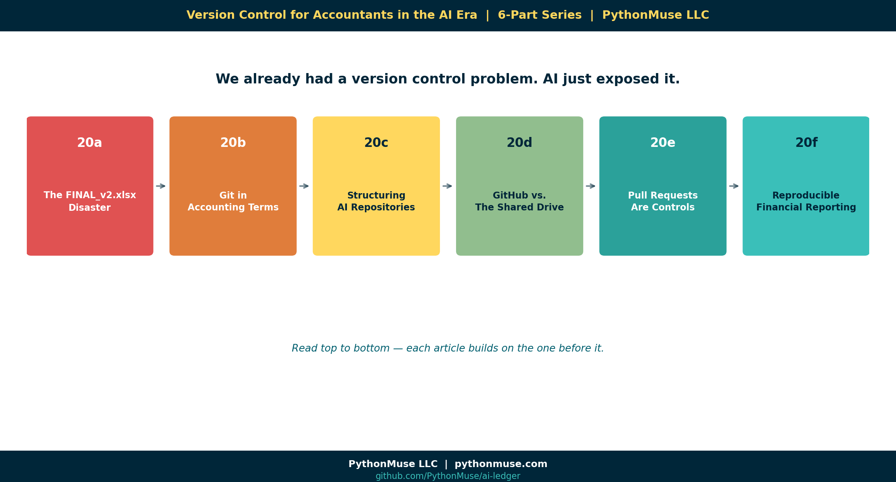

# Version Control for Accountants in the AI Era

*A six-part PythonMuse series on why version control becomes mandatory once AI enters finance workflows — and what it actually looks like in practice.*

---

**PythonMuse LLC**
*Series launch · 2026*

---

## The Series in One Line

> **We already had a version control problem. AI just exposed it.**

For decades, accountants have managed change with file names like `Budget_FINAL_v2_REAL_USE_THIS_ONE.xlsx`. That was awkward, but survivable. Then AI dropped the change-velocity of finance workflows by an order of magnitude — and the shared drive stopped being able to keep up.

This series walks accounting and finance professionals from "what is Git?" to **reproducible, audit-ready, AI-era financial workflows** — using analogies, light humor, and zero pressure to become a software engineer.

---

## The Six Articles

| # | Title | What you'll get out of it |
|---|---|---|
| **20a** | [The FINAL_v2.xlsx Disaster: Why AI Makes Version Control Mandatory for Accountants](../20a-final-v2-xlsx-disaster/README.md) | The emotional hook. The problem named. |
| **20b** | [Git Explained Using Accounting Terms](../20b-git-in-accounting-terms/README.md) | The Rosetta Stone — every Git word in accounting language. |
| **20c** | [How Finance Teams Should Structure AI Repositories](../20c-finance-repo-structure/README.md) | A folder layout you can adopt next Monday. |
| **20d** | [GitHub vs. The Shared Drive](../20d-github-vs-shared-drives/README.md) | Side-by-side. The eight-second audit answer. |
| **20e** | [Pull Requests Are Internal Controls](../20e-pull-requests-are-controls/README.md) | The governance article. Map PRs to COSO. |
| **20f** | [Reproducible Financial Reporting: Where Finance Is Heading](../20f-reproducible-financial-reporting/README.md) | The vision close. "Rerun the workflow." |

Each article is short (~4–6 min read), light in tone, and paired with a planned companion video.

---

## A Framework, Not a Tool

Every article carries the same reminder:

> **🛠️ This is a framework, not a product pitch.**
>
> We use **Git + GitHub** in this series because they're free, popular, and have the friendliest UI for non-engineers. But every concept — repos, commits, branches, PRs, tags — has a direct equivalent in **Azure DevOps Repos** and **AWS CodeCommit**. Pick what your IT team already uses. The framework doesn't change.

---

## Who This Series Is For

- Controllers and accounting managers trying to figure out how AI fits into close.
- Senior accountants who keep getting handed AI-generated scripts and don't know how to govern them.
- Internal auditors who need to ask the right questions about reproducibility.
- Anyone tired of `FINAL_v2_REAL_USE_THIS_ONE.xlsx`.

You will **not** need to:

- Install anything before you read.
- Use a terminal.
- Become a developer.

You **will** leave with:

- A new vocabulary.
- A defensible folder structure.
- A clear mental model for AI-era internal controls.
- One repo you can fork and learn from.

---

## How to Read This Series

In order, top-to-bottom, is best. Each article assumes you've read the previous one. But if you only have time for two:

- Start with **20a** (the emotional hook).
- Then jump to **20e** (the governance payoff).

The rest will pull you in.

---

## Related Reading Across PythonMuse

This series weaves together threads from across the catalog. Articles you'll see cross-referenced inside it include:

- [Reproducible Accounting](../05-reproducible-accounting/README.md)
- [AI Governance for Controllers](../07-ai-governance-for-controllers/README.md)
- [When to Trust AI to Run Your Accounting Workflows](../12-audit-ready-ai-workflows/README.md)
- [Zero Trust AI Accounting](../13-zero-trust-ai-accounting/README.md)
- [Skills and Agents for Accountants](../17-skills-and-agents-for-accountants/README.md)
- [Your First CLAUDE.md](../17b-your-first-claude-md/README.md)
- [The Workings Layer Method](../22-workings-layer-method/README.md)
- [What the Heck Is a Script?](../25-what-the-heck-is-a-script/README.md)
- [When Your AI Enters Month-End Close Mode](../26-when-your-ai-enters-month-end-close-mode/README.md)

---

**A note on how this series was made.** This series started with me. The pain, the analogies, and the series shape are mine — they came out of years of watching accountants try to govern AI workflows on top of shared drives that were never built for the job. GitHub Copilot (Claude Sonnet 5 and Opus 4.7) then built the final articles, the hub, and all visual concepts — working from my direction and feedback at each step. I reviewed every output, pushed back on things I didn't like, and made all final content decisions. That process — bringing your own experience, using AI to build and iterate, and staying in the editorial seat throughout — is exactly what this series is about.

---

*By Svetlana Toohey*