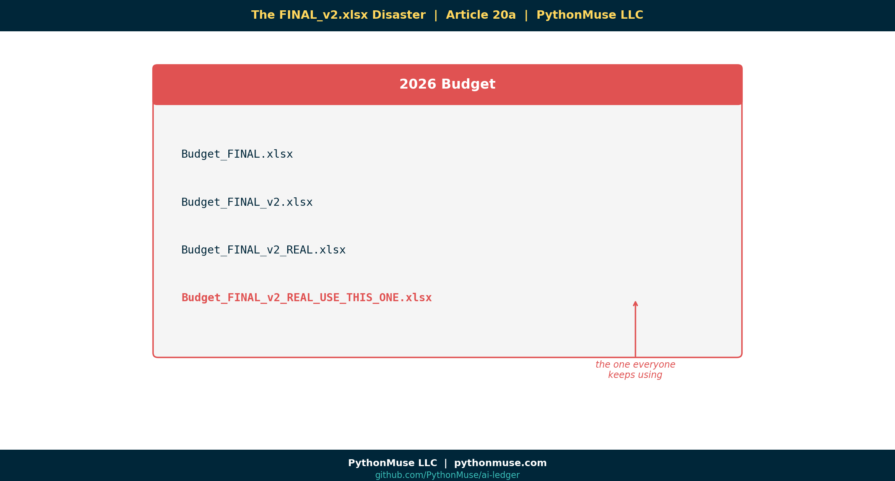

# 20a — The FINAL_v2.xlsx Disaster: Why AI Makes Version Control Mandatory for Accountants

*~7 min read · Part 1 of 6 in [Version Control for Accountants in the AI Era](../20-version-control-for-accountants/README.md)*

---

**PythonMuse LLC**
*Series launch · 2026*



🎬 *Companion video coming soon — "The FINAL_v2.xlsx Disaster" on the PythonMuse YouTube channel.*

---

## A Folder You've Definitely Seen Before

Open any accounting team's shared drive and somewhere in there lives a folder that looks like this:

```
📁 2026 Budget
   📄 Budget_FINAL.xlsx
   📄 Budget_FINAL_v2.xlsx
   📄 Budget_FINAL_v2_REAL.xlsx
   📄 Budget_FINAL_v2_REAL_USE_THIS_ONE.xlsx
   📄 Budget_FINAL_v2_REAL_USE_THIS_ONE_NEW.xlsx
   📄 Budget_FINAL_v2_REAL_USE_THIS_ONE_NEW_(2).xlsx
   📄 Copy of Budget_FINAL_v2_REAL_USE_THIS_ONE_NEW.xlsx
   📄 Budget_DO_NOT_USE.xlsx   ← (the one everyone keeps using)
```

If that hurts to look at, congratulations — **you already have a version control problem.** You've had it for years.

You just didn't call it that.

You called it Tuesday.

---

## We Already Had This Problem. AI Just Exposed It.

For a long time, the FINAL_v2 phenomenon was a small annoyance. Annoying, but survivable. You could usually figure out which file was current by checking the timestamp, asking Susan, or — in extreme cases — opening all of them.

Then AI walked in.

And suddenly, the speed of change in your workflows went from *"a few file saves per close"* to **fifty things changing per hour**:

- Prompts are tweaked.
- Scripts are regenerated.
- Outputs are re-run.
- Logic shifts.
- A model upgrades overnight and yesterday's numbers don't reproduce.

The shared drive was never designed for this. It was designed for *documents*. AI doesn't produce documents — it produces **moving workflows**.

So the version control problem you already had quietly became a **compliance problem** you can't afford.

---

## The Question You Cannot Answer Without History

Picture your CFO walking over and asking:

> *"Why did EBITDA change between Friday and Monday?"*

Without version history, you've got three options:

1. Open every file you can find and guess.
2. Email five people.
3. Smile politely while panicking internally.

With version history, the answer is **one click**:

> *"On Sunday at 4:12 PM the depreciation script was updated. Here's the exact change, who reviewed it, and why."*

That's not magic. That's just **work that remembers itself.**

---

## Git, in One Sentence (No Code Yet)

> **Git is a tool that remembers every version of every file, who changed it, when, and why — automatically.**

That's it. That's the whole pitch for this article.

We're not going to install anything. We're not going to open a terminal. We just need you to nod when you read this:

- A **journal entry** is structured evidence of a financial change.
- A **commit** is structured evidence of a workflow change.

Same idea. Different layer of the company.

---

## A Framework, Not a Tool

> **🛠️ Reminder — this is a framework, not a product pitch.**
>
> Throughout this series we'll use **Git + GitHub** because they're free, popular, and have the friendliest UI. But the *concepts* — versioned history, reviews, approvals, rollback — show up in every enterprise stack:
>
> | Concept | GitHub | Azure DevOps | AWS |
> |---|---|---|---|
> | Hosted repo | github.com | Azure Repos | AWS CodeCommit |
> | Review & approve | Pull Request | Pull Request | Pull Request |
> | Automation hooks | GitHub Actions | Pipelines | CodePipeline |
>
> Pick what your IT team already uses. The framework doesn't change.

---

## The Demo Repo

This series is anchored to one continuously evolving public repo:

**👉 [github.com/PythonMuse/git-demo](https://github.com/PythonMuse/git-demo)**

In this first article, the repo is intentionally ugly. It looks exactly like the shared drive folder above — a pile of `FINAL_v2_REAL` files. No history, no structure, no traceability.

In Article 20b we'll start cleaning it up. By Article 20f, the same data will run end-to-end, reproducibly, with a full audit trail.

---

## What I Want You to Take Away

You don't need to learn Git today. You need to accept one thing:

> **The shared drive is now the weakest link in your AI workflow.**

Not because anyone did anything wrong. But because the *velocity* of change in modern accounting workflows has outgrown what folders and filenames can carry.

The fix isn't a new spreadsheet rule.

The fix is a different kind of memory.

---

## What's Next

In **[Article 20b — Git Explained Using Accounting Terms](../20b-git-in-accounting-terms/README.md)**, we drop the fear and translate every scary Git word into something you already do every day. Spoiler: you've been doing primitive version control for years.

---

<!--
VISUAL IDEAS (do not generate yet — pending review)
1. Hero: messy desktop folder with the FINAL_v2_REAL filenames stack
2. Side-by-side: "Shared drive timeline" (just files) vs. "Git timeline" (commits with who/what/why)
3. Callout card: "We already had a version control problem. AI just exposed it."
4. CFO Question diagram: question → no history (panic) vs. question → one click (answer)
5. Framework comparison table visual (GitHub / Azure DevOps / AWS CodeCommit)
-->

## Related Reading

- [Reproducible Accounting](../05-reproducible-accounting/README.md)
- [Audit-Ready AI Workflows](../12-audit-ready-ai-workflows/README.md)
- [What the Heck Is a Script?](../25-what-the-heck-is-a-script/README.md)
- [When Your AI Enters Month-End Close Mode](../26-when-your-ai-enters-month-end-close-mode/README.md)

---

**A note on how this article was made.** This article started with me. The pain of `FINAL_v2_REAL_USE_THIS_ONE.xlsx` is mine — I've lived it, watched colleagues live it, and watched AI make it ten times faster. I sketched the hook, the analogies, and the framework callout. GitHub Copilot (Claude Opus 4.7) then built the final article, the companion Skill direction, and all visual concepts — working from my direction and feedback at each step. I reviewed every output, pushed back on things I didn't like, and made all final content decisions. That process — bringing your own experience, using AI to build and iterate, and staying in the editorial seat throughout — is exactly what this series is about.

---

*By Svetlana Toohey*
