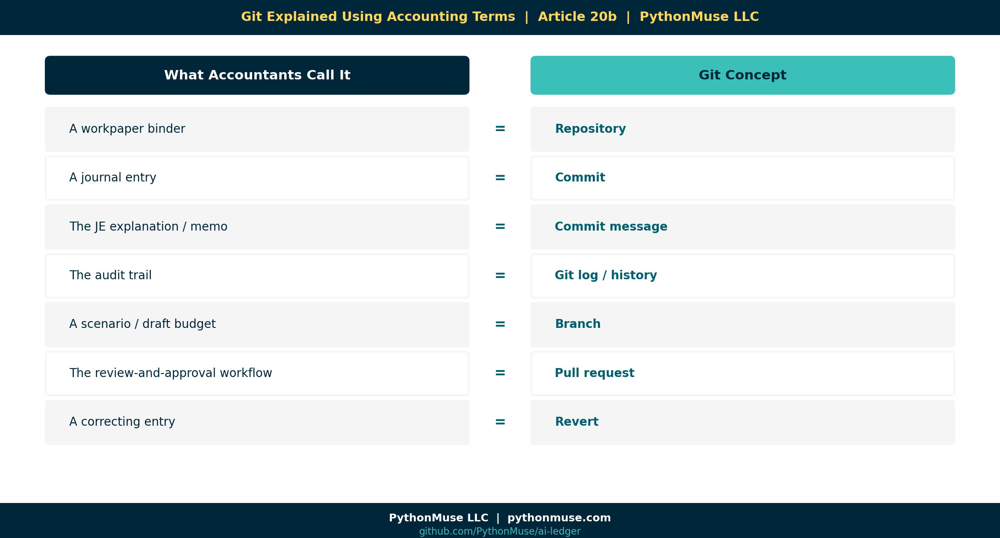

# 20b — Git Explained Using Accounting Terms

*~4 min read · Part 2 of 6 in [Version Control for Accountants in the AI Era](../20-version-control-for-accountants/README.md)*

---

**PythonMuse LLC**
*Series launch · 2026*



---

## You Already Understand Git. You Just Don't Know It Yet.

Accountants hear the word "Git" and the brain immediately serves up:

- Black terminal windows.
- A 22-year-old in a hoodie.
- Some scary command starting with `git push --force`.
- A coworker's screen full of green and red text you're too embarrassed to ask about.

Take a breath.

Git is not software engineering.

Git is **structured change tracking** — and accountants invented structured change tracking. We just call it different things.

---

## The Translation Table

| Git Concept | What Accountants Already Call It |
|---|---|
| **Repository** | A workpaper folder |
| **Commit** | A journal entry |
| **Commit message** | The JE explanation / memo |
| **Git log / history** | The audit trail |
| **Branch** | A scenario / draft version of the budget |
| **Merge** | Posting the approved entry to the final ledger |
| **Pull request** | The review-and-approval workflow |
| **Revert** | A correcting entry (without erasing history) |
| **Tag** | A closed reporting period |
| **`.gitignore`** | Files you intentionally leave out of the folder |
| **Diff** | The "track changes" view between two workpapers |

Read that table twice. **Every Git concept is already part of how you work.**

The only thing Git adds is *consistency* — it stops humans from forgetting to write the memo.

---

## "But Accountants Already Use Primitive Version Control"

Of course we do. Look at how we name files when we're trying to be careful:

- `Recon_2026-04-30_v2.xlsx`
- `Q1_Tieout_FINAL_post_review.xlsx`
- `Lease_Schedule_(after Susan's comments).xlsx`
- `Variance_Analysis - DO NOT EDIT.xlsx`

That's all version control. It's just **manual, fragile, and impossible to audit**.

Git is what happens when you stop doing it by hand:

- The "v2" is automatic.
- The "after Susan's comments" is a real commit message.
- The "DO NOT EDIT" is enforced by a permission.
- The history is permanent — even if someone deletes the file.

---

## A Commit, Translated

Here's what a commit looks like *conceptually* (no terminal needed):

```
👤  Author:  Svetlana Toohey
🕓  Date:    2026-04-30 16:12
📝  Message: "Updated depreciation formula to reflect ASC 842 transition adjustment"
📂  Files changed:  depreciation_formula.py, journal_entries.csv
```

Now translate it into accounting language:

> **JE-2026-0412** — *Posted by S. Toohey on 4/30/2026 at 4:12 PM.*
> *Updated depreciation per ASC 842 transition. Supporting workpapers: depreciation_schedule, JE detail.*

Same shape. Same level of evidence. Same audit-friendly format.

The only difference: **you didn't have to remember to write it down.**

---

## A Note on File Types

> **📎 Why the example above uses `.py`, not `.xlsx`.**
>
> Git can technically track an Excel file or a PDF — it just can't tell you *what changed inside* them. Those are binary formats, so Git only sees "this file is different now," not a line-by-line diff.
>
> That's why this series is really about version-controlling **the scripts and logic that produce the spreadsheet** — not the spreadsheet itself. The `.xlsx` your CFO opens, or the PDF you send to the auditor, is an *output*. The formula, script, or query that built it is the thing you actually want a diff, a history, and a review trail for.

---

## A Framework, Not a Tool

> **🛠️ Reminder — this is a framework.**
>
> Every concept above (commit, branch, PR, tag) exists in **GitHub**, **Azure DevOps Repos**, and **AWS CodeCommit** with nearly identical names. Pick the one your company already pays for. We use GitHub in this series because the UI is the friendliest for non-engineers.

---

## The Fear Drop

Most accountants who get scared off Git get scared by the **terminal**.

But here's the truth: you can do 95% of what's in this series **without ever opening a command line.** VS Code, GitHub Desktop, and the GitHub website have buttons for everything we'll cover:

- "Commit changes" → button.
- "Create branch" → button.
- "Open pull request" → button.
- "Revert this change" → button.

The terminal is optional. The mindset is not.

---

## What's Next

You now have the vocabulary. In **[Article 20c — How Finance Teams Should Structure AI Repositories](../20c-finance-repo-structure/README.md)**, we turn that analogy into an actual folder structure your team can adopt next Monday.

---

## Related Reading

- [What the Heck Is a Script?](../25-what-the-heck-is-a-script/README.md)
- [Reproducible Accounting](../05-reproducible-accounting/README.md)
- [Your First CLAUDE.md](../17b-your-first-claude-md/README.md)

---

## Next in the Series

→ [Article 20c — How Finance Teams Should Structure AI Repositories](../20c-finance-repo-structure/README.md)

---

**A note on how this article was made.** This article started with me. The accounting/Git analogies came out of years of explaining to colleagues why "save-as-with-a-date" was almost-but-not-quite version control. GitHub Copilot (Claude Sonnet 5.5 and Opus 4.7) then built the final article and all visual concepts — working from my direction and feedback at each step. I reviewed every output, pushed back on things I didn't like, and made all final content decisions. That process — bringing your own experience, using AI to build and iterate, and staying in the editorial seat throughout — is exactly what this series is about.

---

*By Svetlana Toohey*
