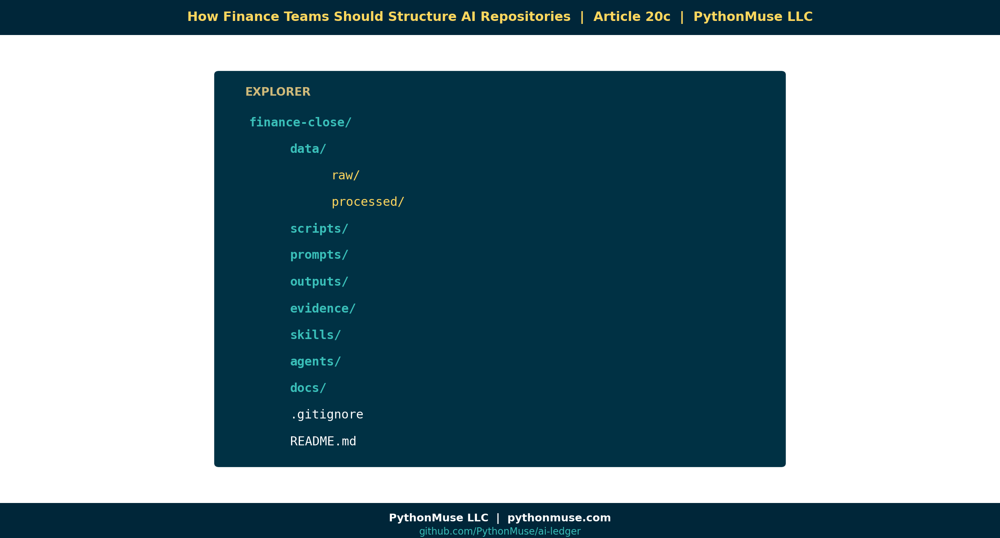

# 20c — How Finance Teams Should Structure AI Repositories

*~7 min read · Part 3 of 6 in [Version Control for Accountants in the AI Era](../20-version-control-for-accountants/README.md)*

---

**PythonMuse LLC**
*Series launch · 2026*



🎬 *Companion video coming soon — a VS Code walkthrough of the finance repo.*

---

## A Repository Is Just a Better Binder

Accountants already know how to organize evidence. Every audit binder, every close package, every reconciliation folder follows the same instinct:

> *Raw stuff over here. Working stuff over here. Final stuff over here. Supporting evidence over there.*

A finance AI repository is the same idea — just **enforced by structure** instead of by hope.

When the structure is good, three magical things happen:

1. AI can find what it needs without asking.
2. Reviewers can audit *what* changed without re-reading *everything*.
3. New team members can onboard in an afternoon, not a quarter.

---

## The Recommended Layout

Here is the layout we use in the demo repo and recommend for finance teams adopting AI workflows:

```
finance-close/
│
├── data/
│   ├── raw/              ← Source files. NEVER edited. Read-only mindset.
│   └── processed/        ← Cleaned, transformed, ready-to-use outputs.
│
├── scripts/              ← Reusable Python (or other) scripts. The "SOPs for the computer."
├── prompts/              ← Saved AI prompts. Version-controlled.
├── outputs/              ← Reports, schedules, deliverables. Regeneratable.
├── evidence/             ← Audit artifacts: screenshots, tie-outs, sign-offs.
├── skills/               ← AI Skills (per article 17).
├── agents/               ← AGENTS.md / CLAUDE.md (per article 17b).
├── docs/                 ← Plain-English documentation, SOPs, decision logs.
│
├── .gitignore            ← What to deliberately exclude (PII, temp, secrets).
└── README.md             ← The "front page" of the binder.
```

That's it. Eight folders and two files. Most finance repos do not need more.

---

## The Four Principles That Make This Work

### 1. Raw data never changes.

`data/raw/` is sacred. If your bank export from April 30 lives in `raw/2026-04-bank.csv`, that file is **immutable**. Every script reads from it. Nothing writes back into it.

This is the same principle as *source documentation* in audit. The bank statement doesn't get edited — it gets referenced.

### 2. Outputs must be regeneratable.

If you delete everything in `outputs/`, your scripts should be able to rebuild it from `data/raw/` plus `scripts/`.

This is the **reproducibility test.** If a number can't be reproduced from inputs + logic, it isn't an output — it's a guess.

### 3. Prompts are assets.

Most teams treat prompts as throwaway chat messages. They're not. A good prompt is **intellectual property** that took hours to refine. Keep it in `prompts/`, give it a filename, version it.

If your CFO asks "what prompt produced this commentary?" you should be able to answer with a file path, not a screenshot.

### 4. Scripts are workpapers.

The Python (or SQL, or VBA) file that builds your reconciliation is a workpaper. Comment it like one. Review it like one. Sign off on changes to it like one.

This is the heart of **Accounting as Code**: financial logic stops living in cells you can't audit and starts living in files you can.

---

## Real Examples From Accounting Work

The same layout serves wildly different use cases:

| Use case | What lives in `data/raw/` | What lives in `scripts/` | What lives in `outputs/` |
|---|---|---|---|
| Bank reconciliation | Bank exports, GL extract | `reconcile_bank.py` | Reconciliation report, exception list |
| Variance analysis | Budget, actuals | `variance_engine.py` | Variance schedule, commentary draft |
| Accrual support | Vendor invoices, contracts | `accrual_calc.py` | Accrual schedule, JE backup |
| Payroll validation | Payroll register, headcount | `payroll_check.py` | Validation report, exception flags |
| Vendor analysis | AP transactions | `vendor_clustering.py` | Top-N vendor report, anomalies |

Same skeleton. Different content.

---

## A Framework, Not a Tool

> **🛠️ Reminder — this layout is the framework.**
>
> Whether the repo lives on **GitHub**, **Azure DevOps Repos**, or **AWS CodeCommit**, the folder structure above is identical. The hosting platform is interchangeable; the discipline is not.
>
> One caveat for AWS CodeCommit users: enforce branch protections and review approvals via IAM + approval rule templates (CodeCommit's equivalent of GitHub's branch protection rules).

---

## Demo Repo Snapshot

By the end of Article 20c, **[github.com/PythonMuse/git-demo](https://github.com/PythonMuse/git-demo)** has the full skeleton above, with one realistic example workflow loaded into each folder. Clone it. Steal it. Adapt it.

---

## "But What About Sensitive Data?"

The `.gitignore` file is your friend. Common things finance teams exclude:

- Anything under `data/raw/PII/`
- Anything matching `*.secret`, `*.env`, `*credentials*`
- Anything large enough that GitHub will refuse it (over 100 MB)
- Local working files (`~$*.xlsx`, `.DS_Store`, etc.)

If you wouldn't put it in the audit binder you hand to PwC, **don't put it in the repo.** The structure forces you to be deliberate about evidence, not careless.

---

## What's Next

Now that the binder has shape, we need to compare it head-to-head with the tool everyone is currently using: the shared drive. In **[Article 20d — GitHub vs. The Shared Drive](../20d-github-vs-shared-drives/README.md)**, we put them side-by-side and let the differences speak for themselves.

---

<!--
VISUAL IDEAS (do not generate yet — pending review)
1. Hero: VS Code file explorer showing the finance-close repo skeleton
2. "Audit binder ↔ repo folder" overlay visual
3. Four-principle diagram (raw=sacred, outputs=regenerated, prompts=assets, scripts=workpapers)
4. Bank reconciliation walk-through: data/raw → scripts → outputs → evidence
5. Reproducibility loop animation: delete outputs → rerun → identical result
-->

## Related Reading

- [Reproducible Accounting](../05-reproducible-accounting/README.md)
- [The Workings Layer Method](../22-workings-layer-method/README.md)
- [Skills and Agents for Accountants](../17-skills-and-agents-for-accountants/README.md)
- [Your First CLAUDE.md](../17b-your-first-claude-md/README.md)
- [What the Heck Is a Script?](../25-what-the-heck-is-a-script/README.md)
- [One-Time to Repeatable Workflows](../11-one-time-to-repeatable-workflows/README.md)

---

**A note on how this article was made.** This article started with me. The folder layout came out of real engagements where I kept seeing teams build AI workflows on top of shared-drive chaos and wondering why nothing was reproducible. GitHub Copilot (Claude Opus 4.7) then built the final article and all visual concepts — working from my direction and feedback at each step. I reviewed every output, pushed back on things I didn't like, and made all final content decisions. That process — bringing your own experience, using AI to build and iterate, and staying in the editorial seat throughout — is exactly what this series is about.

---

*By Svetlana Toohey*
