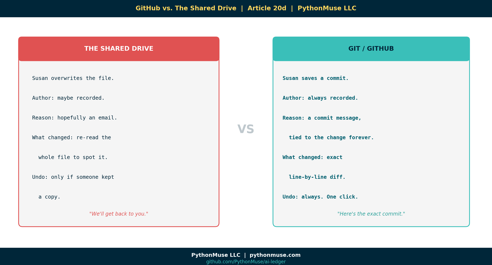

# 20d — GitHub vs. The Shared Drive

*~6 min read · Part 4 of 6 in [Version Control for Accountants in the AI Era](../20-version-control-for-accountants/README.md)*

---

**PythonMuse LLC**
*Series launch · 2026*



🎬 *Companion video coming soon — split-screen "Shared Drive vs. GitHub" demo.*

---

## A Tale of Two Tools

The shared drive was invented to **store files**.

GitHub was invented to **track change**.

We've spent the last fifteen years trying to make the first one do the second one's job. It's not going great.

Here is what happens, side-by-side, when one person on the team adjusts a depreciation formula:

| What just happened | Shared Drive | Git / GitHub |
|---|---|---|
| The change | Susan overwrites the file. | Susan saves a commit. |
| Who did it? | Maybe in metadata. Maybe not. | Always recorded. |
| Why? | Hopefully an email. Hopefully replied-all. | A commit message tied to the change forever. |
| When? | "Last modified" timestamp. | Timestamp + author + message. |
| What changed? | You re-read the whole file to spot it. | Exact line-by-line diff. |
| Can we undo it? | Only if you remember to keep a copy. | Always. One click. |
| Can we compare to last month? | Open both files, eyeball it. | Diff in seconds. |
| Audit defense | "I think we changed it in April." | "Here is the exact commit, reviewer, and timestamp." |

Read that table. Then ask: which of those two tools belongs in an AI-driven close?

---

## The Shared Drive Was Never Designed For AI

The shared drive was built for **static documents** that change occasionally — a policy, a procedure, a finalized report.

AI workflows are the opposite:

- Scripts that get regenerated every few prompts.
- Prompts that evolve daily as the team tunes them.
- Outputs that change every time the model behind the scenes is updated.

Putting an AI workflow on a shared drive is like running a high-frequency trading desk on fax machines. The tool can technically receive the input — it just wasn't designed for this speed.

---

## "But We Have OneDrive / SharePoint Versioning!"

Yes — and that's better than nothing.

But "versioning" in OneDrive/SharePoint gives you:

- A list of timestamps.
- A list of usernames.
- A button to roll back the entire file.

What it does **not** give you:

- A line-by-line diff of *what* changed.
- A commit message explaining *why*.
- A review-and-approval workflow before the change becomes "live."
- A way to bundle related changes across multiple files into one unit (one commit can cover the script, the prompt, and the docs together).
- A way to branch off and try something experimental without scaring everyone else.

OneDrive versioning is a safety net. Git is **memory.**

There's a difference.

---

## What Git Looks Like For The Non-Coder

You can do everything in this series through buttons — no terminal required:

- **GitHub.com** — the website. Browse files, see history, leave review comments. Like a SharePoint that actually remembers.
- **GitHub Desktop** — a free app. Drag, drop, commit, push. Zero command line.
- **VS Code** — the editor most accountants end up using anyway. Built-in Git buttons for everything.

If you can use the "Save" button in Excel, you can use the "Commit" button in any of these tools.

---

## The "Why Did It Change?" Story

The single best argument for moving off the shared drive is this scenario, which every controller has lived through:

> **The week of close:** Q1 commentary references a $2.3M variance. **Three weeks later:** the auditor asks where that number came from. The file now says $2.1M. Nobody remembers changing it. The email chain is fifteen people long. Two of them no longer work here.

**Shared drive answer:** *"We'll get back to you."* (You won't.)

**Git answer:** Click the file. Click "History." See:

```
2026-04-02   J. Patel    "Updated variance threshold from 1% to 1.5% per
                          controller approval — see email 2026-03-31"
2026-04-09   S. Toohey   "Reran Q1 commentary with new threshold"
```

Total elapsed time: **eight seconds.**

That is the entire argument.

---

## A Framework, Not a Tool

> **🛠️ Reminder — this is a framework.**
>
> The "GitHub" column above is identical in **Azure DevOps Repos** and **AWS CodeCommit**. The shared-drive column is identical no matter whose shared drive it is. The decision isn't about brand — it's about whether your workflow tooling has a *memory layer* or not.

---

## Demo Repo Snapshot

By Article 20d, **[github.com/PythonMuse/git-demo](https://github.com/PythonMuse/git-demo)** is hosted publicly. You can browse the history, see the diffs from earlier articles, and follow exactly how the binder evolved.

Compare that against the chaos we started with in Article 20a. *Same files. Different fate.*

---

## What's Next

History is good. But for finance, history alone isn't enough — we also need **approval before things change**. That's the next article: **[Article 20e — Pull Requests Are Internal Controls](../20e-pull-requests-are-controls/README.md)**.

---

<!--
VISUAL IDEAS (do not generate yet — pending review)
1. Hero: split-screen — left=cluttered shared drive, right=clean Git history panel
2. The "8-second" diff visual: question → commit history → answer highlighted
3. Versioning vs. memory diagram: snapshot list (OneDrive) vs. linked history graph (Git)
4. "Buttons, not terminal" visual showing VS Code/GitHub Desktop UI with arrows to Commit / History / Revert
5. Timeline visual: AI workflow velocity overlaid on shared drive vs. Git capacity
-->

## Related Reading

- [Reproducible Accounting](../05-reproducible-accounting/README.md)
- [Audit-Ready AI Workflows](../12-audit-ready-ai-workflows/README.md)
- [Zero Trust AI Accounting](../13-zero-trust-ai-accounting/README.md)
- [Getting the Right Tools Installed](../03-getting-the-right-tools-installed/README.md)

---

**A note on how this article was made.** This article started with me. The "$2.3M to $2.1M" story is a composite of real audits I've watched go sideways for want of a commit history. GitHub Copilot (Claude Opus 4.7) then built the final article and all visual concepts — working from my direction and feedback at each step. I reviewed every output, pushed back on things I didn't like, and made all final content decisions. That process — bringing your own experience, using AI to build and iterate, and staying in the editorial seat throughout — is exactly what this series is about.

---

*By Svetlana Toohey*
