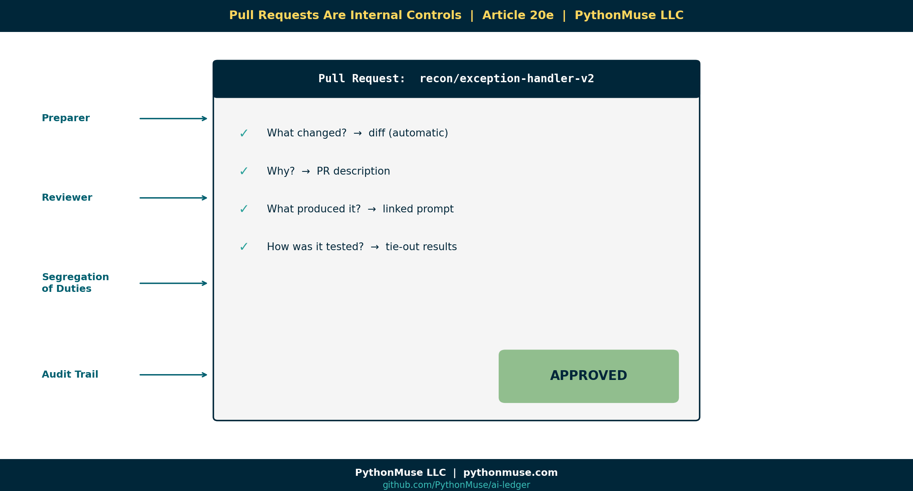
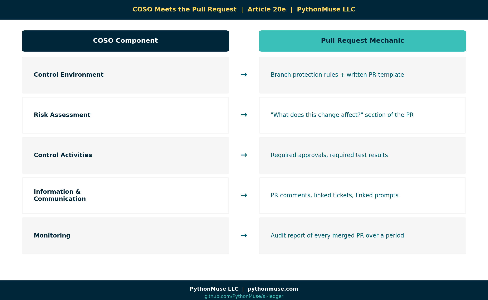

# 20e — Pull Requests Are Internal Controls

*~5 min read · Part 5 of 6 in [Version Control for Accountants in the AI Era](../20-version-control-for-accountants/README.md)*

---

**PythonMuse LLC**
*Series launch · 2026*

---

## The Most Misunderstood Word in This Series

"Pull request" sounds backwards the first time you hear it — but the name actually does make sense once you see whose point of view it's named from. (If `push`, `pull`, and `main` are new words, [Article 20b](../20b-git-in-accounting-terms/README.md#push-pull-and-main) covers them.)

Here's the mechanic: you make your change on a branch and **push** it — send your committed changes up to the shared repository. That can happen one commit at a time, or as a batch of several commits pushed together once you're ready. Then you open a pull request — which is your explicit ask for the reviewer to **pull** those changes from your branch into `main`. The request is named from the *reviewer's* side of the action, not yours: you're asking them to pull your work in.

And critically: a pull request has to be **accepted**. Opening one doesn't change anything by itself — nothing moves into `main` until a reviewer approves and merges it.

Here is the entire concept in one sentence:

> A pull request says: *"I'd like to make this change. Please pull it into the official record — after you've reviewed it."*

Now translate that into accounting:

> *"I'd like to post this JE. Please review the supporting documentation before it hits the GL."*

You already know how this works. You've been doing it for decades. Software designers just gave it a name that describes the reviewer's action, not the author's.

---

## The Accounting Control That Was Always There

| Accounting Control | Git / GitHub Equivalent |
|---|---|
| Preparer / reviewer split | Author writes commits, reviewer approves PR |
| JE support review | Code & data diff review on the PR |
| Segregation of duties | Branch protection ("nobody can self-approve") |
| Approval evidence | PR comment thread, recorded forever |
| Sign-off | "Approve" click on the PR |
| Audit trail | The merge commit, linked to author + reviewer |
| Reversal / correction | A new commit on a new PR (history preserved) |

If you've ever signed off on a recon, you've already done the human work of a pull request ("PR"). The PR is the same workflow with the **paperwork built in**.

---

## Why This Matters For AI

Here is the new risk:

> An AI agent can generate a "finished" reconciliation script in 90 seconds. It will look correct. It will run. It will produce numbers.

Without a review step, that 90-second output becomes Monday's deliverable.

That is **AI without a control**.

The pull request is how you re-insert the human:

1. The agent (or analyst) makes the change on a branch.
2. A pull request is opened automatically.
3. A reviewer **must** approve before the change is merged.
4. The PR records who reviewed, what they reviewed, and what they said.

Now your AI workflow has:

- A preparer (the AI or analyst).
- A reviewer (the human).
- Evidence of the review.
- A timestamped approval.

You just rebuilt **segregation of duties** in a digital workflow.

---

## Branch Protection = "Nobody Can Self-Approve"

GitHub has a setting called **branch protection** that enforces the rule every accountant already lives by:

> *"You cannot approve your own work."*

You turn it on once. After that, the system itself blocks anyone — including a senior person, including the CFO, including the AI agent — from merging their own change without a second pair of eyes.

This is not red tape. This is **a digital internal control**, enforced by the platform instead of by hope.

---

## What a Good PR Looks Like (For Finance)

When AI generates a new reconciliation script, the PR should answer four questions before anyone clicks "Approve":

1. **What changed?** (The diff — automatic.)
2. **Why?** (The PR description — written by the author.)
3. **What did the AI produce, and what prompt produced it?** (Linked from `prompts/`.)
4. **How was it tested?** (Test outputs, sample numbers, tie-out to a known answer.)

If those four questions can't be answered, the PR doesn't get merged.

That is your control.

---

## Tie This Directly To COSO / ICFR / AI Governance

This is the part that should make controllers sit up straight.

The five COSO components map cleanly to PR mechanics:

| COSO Component | Pull Request Mechanic |
|---|---|
| Control Environment | Branch protection rules and a written PR template set the tone: no one — not even the CFO or the AI agent — merges without a second reviewer. |
| Risk Assessment | The "what does this change affect?" section of the PR is where the preparer documents what could go wrong if this change is bad, not just what changed. |
| Control Activities | Required approvals and required test results are enforced by the platform before merge is even possible — the control can't be skipped under deadline pressure. |
| Information & Communication | PR comments, linked tickets, and linked prompts create a searchable record of *why* a decision was made, available to anyone who needs it later — including an auditor. |
| Monitoring | An audit report of every merged PR over a period gives management an ongoing view of whether the control is actually operating, not just designed. |

If your auditor has never asked about Git, they will. AI governance frameworks (the AICPA AI assurance guidance, the EU AI Act, NIST AI RMF) all eventually point to the same thing: **show me the change log, the reviewer, and the approval evidence.**

The PR is the cleanest way to produce that evidence on demand. For the fuller AI-governance picture this control sits inside, see [Article 07 — AI Governance for Controllers](../07-ai-governance-for-controllers/README.md), which covers the COSO generative-AI guidance this table draws from.

---

## A Framework, Not a Tool

Same reminder as always → see the hub's [A Framework, Not a Tool](../20-version-control-for-accountants/README.md#a-framework-not-a-tool). Pull requests work identically in **GitHub**, **Azure DevOps Repos**, and **AWS CodeCommit** (which calls its review workflow "approval rule templates" but the user experience is the same). Pick the one your enterprise already governs. The control is the control.

---

## Real Example, End To End

> **Monday, 9:14 AM.** An AI agent regenerates the bank reconciliation script after a new exception type emerged.
>
> **9:15 AM.** The change lands on a branch called `recon/exception-handler-v2`.
> A pull request opens automatically with the diff, the prompt that produced it, and the test output.
>
> **9:42 AM.** The senior accountant reviews. Comments: *"Tie-out matches April; approve."*
>
> **9:43 AM.** The controller approves.
>
> **9:43 AM + 2 seconds.** The PR merges. The change is live. The audit trail is permanent.

Every step has a timestamp, an actor, and a written rationale.

That is what AI-era internal controls look like.

---

## What's Next

History plus approvals gives you defensible change. The final article puts it all together into the vision: **[Article 20f — Reproducible Financial Reporting](../20f-reproducible-financial-reporting/README.md).**

---

## Related Reading

- [AI in Accounting Is Not the Wild West](../04-ai-governance-in-accounting/README.md)
- [AI Governance for Controllers](../07-ai-governance-for-controllers/README.md)
- [When to Trust AI to Run Your Accounting Workflows (Audit-Ready)](../12-audit-ready-ai-workflows/README.md)
- [Zero Trust AI Accounting](../13-zero-trust-ai-accounting/README.md)

---

## Next in the Series

→ [Article 20f — Reproducible Financial Reporting](../20f-reproducible-financial-reporting/README.md)

---

**A note on how this article was made.** This article started with me. The PR-as-control framing came out of conversations with controllers who wanted AI but couldn't see how it would survive an audit. GitHub Copilot (Claude Sonnet 5 and Opus 4.7) then built the final article and all visual concepts — working from my direction and feedback at each step. I reviewed every output, pushed back on things I didn't like, and made all final content decisions. That process — bringing your own experience, using AI to build and iterate, and staying in the editorial seat throughout — is exactly what this series is about.

---

*By Svetlana Toohey*
