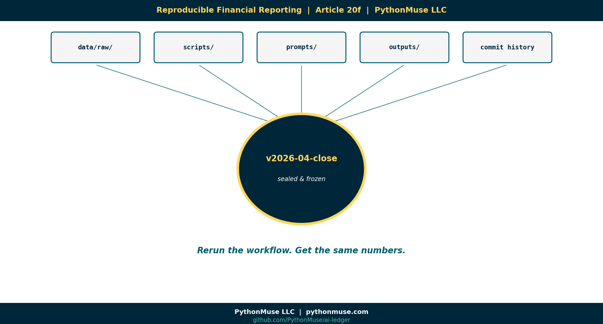

# 20f — Reproducible Financial Reporting: Where Finance Is Heading

*~6 min read · Part 6 of 6 in [Version Control for Accountants in the AI Era](../20-version-control-for-accountants/README.md)*

---

**PythonMuse LLC**
*Series launch · 2026*



---

## The One Idea That Ties This Whole Series Together

Old accounting:

> *"Trust me. Here are the numbers."*

New accounting:

> *"Rerun the workflow."*

That's the difference. That's the future.

The first answer relies on a person's word. The second answer relies on a **reproducible system** that produces the same output every time from the same inputs. One can be debated. The other can be re-executed.

Once finance teams cross that line, the conversation with auditors, regulators, and the board changes permanently.

---

## What "Reproducible Reporting" Actually Means

A reproducible financial workflow is one where you can:

1. **Delete every output file.**
2. **Walk away.**
3. **Come back, run one command, and regenerate every number identically.**

That's the test.

Most finance teams today would fail it. Not because they're sloppy — because their reports depend on Excel files that depend on emailed inputs that depend on someone's memory of how a tab was filtered.

A reproducible workflow doesn't depend on memory. It depends on:

- `data/raw/` (the source files, untouched)
- `scripts/` (the logic, versioned)
- `prompts/` (the AI direction, versioned)
- `outputs/` (the deliverables, regeneratable)
- A commit history (the explanation of *why*)
- A tag (the snapshot of *which version produced what*)

Run the script. Identical numbers come out. Every time. Forever.

That is what reproducibility means.

---

## The Tag = The Closed Reporting Period

Here is where Git earns its keep at month-end:

When you close April 2026, you don't just save the file. You **tag the repo**:

```
git tag v2026-04-close
```

That tag is a frozen snapshot of:

- The exact data that was in `raw/`.
- The exact scripts that ran.
- The exact prompts that were used.
- The exact outputs that were delivered.
- The exact commit history that led to them.

Six months later, when an auditor asks *"can you show me exactly what produced the April close?"* — you check out the tag. The entire workflow comes back, exactly as it was. **You can re-run April from scratch and get April back.**

That is not theory. That is just git.

---

## Accounting As Code: The Quiet Revolution

Across the series we've used the phrase *"Accounting as Code."* Here is what it actually means:

> Financial logic — historically trapped in spreadsheet cells nobody can audit — becomes **explicit, versioned, reviewed, and reproducible.**

Accounting as Code is not about turning accountants into developers. It is about giving accountants the same level of **engineering discipline** that has made every other data-heavy industry — banking quant desks, biotech, ad tech — defensible at scale.

The benefits compound:

- **Reproducibility.** Same inputs always produce same outputs.
- **Auditability.** Every transformation has a recorded actor and rationale.
- **AI governance.** Prompts and agent behavior are versioned alongside the logic.
- **Knowledge retention.** When someone leaves, the folder doesn't leave with them.
- **Speed.** New analyses start from a known-good baseline, not from a blank workbook.

Each is valuable alone. Together they redefine what a finance function can promise.

---

## The Future-State Picture

Imagine a finance team a few years from now:

- A `month-end-close/` repo, tagged once per close period.
- Reconciliations run automatically from versioned scripts.
- AI agents draft commentary, but every draft lives behind a PR with a human approval.
- The evidence folder builds itself as the workflow runs.
- An auditor asks for April. You hand them a commit hash.

That team will not be five times faster than yours. They will be ten times more **defensible** — and that is the bigger competitive moat in an AI world.

---

## What This Series Was Really About

This was never a Git tutorial.

It was a series about **what accounting controls look like in a world where workflows change daily and AI is doing some of the work.**

The mechanics — branches, commits, PRs, tags — are means to an end. The end is:

> Financial work that explains itself.

If you take one thing away, take this: **AI will not eliminate the need for accounting controls. It will increase the importance of them.** Version control is one of the first places that increased importance shows up.

---

## A Framework, Not a Tool

> **🛠️ Reminder — this is a framework.**
>
> Reproducible reporting is not a GitHub feature. It is a discipline that any platform — **GitHub**, **Azure DevOps Repos**, **AWS CodeCommit**, GitLab, Bitbucket — can support. The platform is the easy choice. The discipline is the real work.

---

## The Reproducibility Test

Here is the test to run against your own repo, once it's set up the way this series describes:

1. Check out a prior tagged close (e.g., `v2026-04-close`).
2. Delete everything in `outputs/`.
3. Run one script.
4. Watch the outputs regenerate identically.

That five-step test is the visual heart of this entire series. It is what version control unlocks once accountants take it seriously.

---

## Closing Thought

> *Git may become one of the most important accounting tools most accountants have never heard of.*

A decade from now, "Accounting as Code" won't be a niche idea. It will be how serious finance functions operate — because AI made the old way too fast, too opaque, and too undefendable to keep.

Better to start now.

Better to start small.

But start.

---

## Related Reading

- [Reproducible Accounting](../05-reproducible-accounting/README.md)
- [Audit-Ready AI Workflows](../12-audit-ready-ai-workflows/README.md)
- [One-Time to Repeatable Workflows](../11-one-time-to-repeatable-workflows/README.md)
- [The Workings Layer Method](../22-workings-layer-method/README.md)
- [When Your AI Enters Month-End Close Mode](../26-when-your-ai-enters-month-end-close-mode/README.md)
- [AI Governance for Controllers](../07-ai-governance-for-controllers/README.md)

---

## Next in the Series

You've completed the series. ← Back to [Version Control for Accountants in the AI Era](../20-version-control-for-accountants/README.md)

---

**A note on how this article was made.** This article started with me. The "rerun the workflow" framing came out of years of watching auditors ask questions that accountants couldn't answer because the workflow only existed in someone's head. GitHub Copilot (Claude Opus 4.7) then built the final article and all visual concepts — working from my direction and feedback at each step. I reviewed every output, pushed back on things I didn't like, and made all final content decisions. That process — bringing your own experience, using AI to build and iterate, and staying in the editorial seat throughout — is exactly what this series is about.

---

*By Svetlana Toohey*
