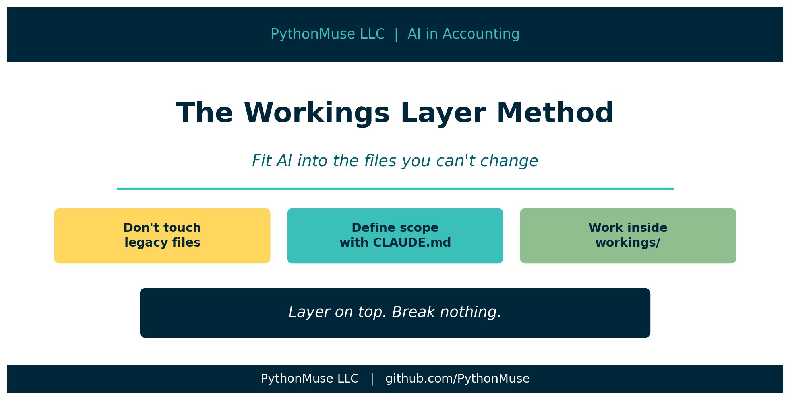
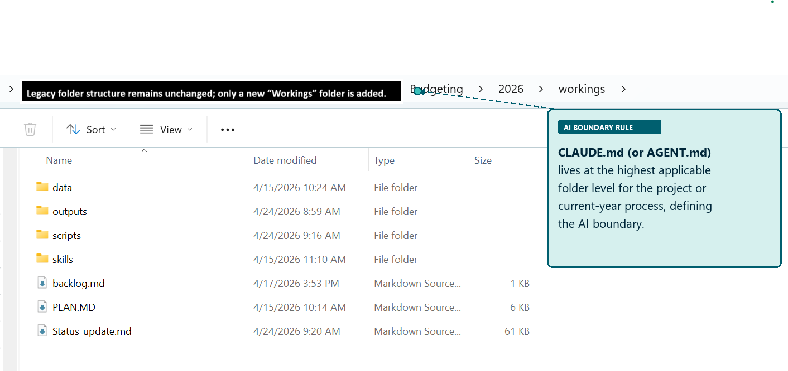
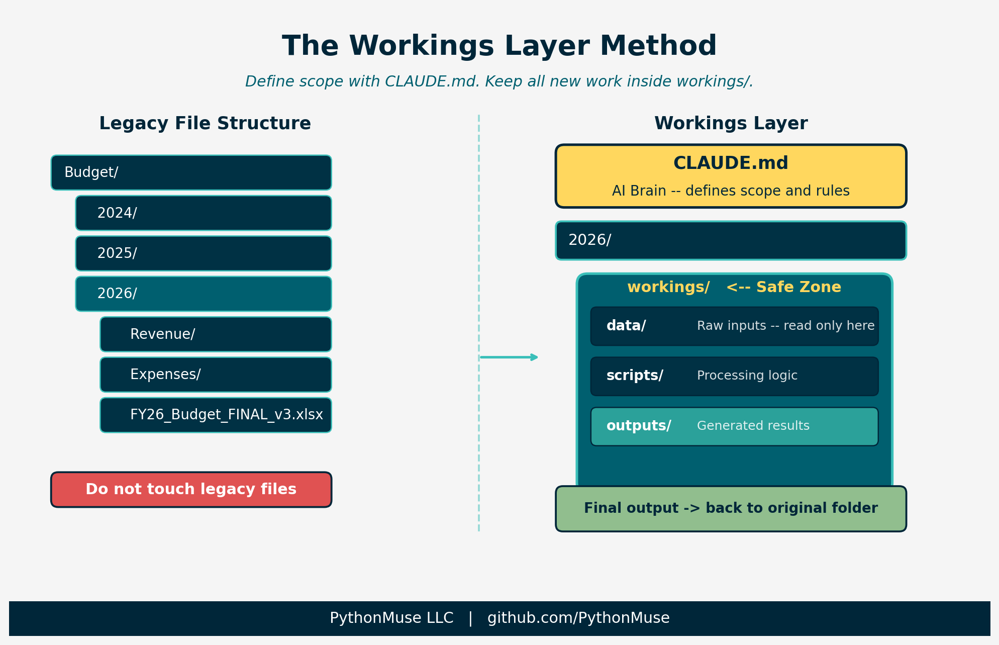

# The Workings Layer: Fitting AI Into the Files You Can't Change

*How to add a controlled AI process to your accounting workflow without touching a single legacy file*

---

**PythonMuse LLC**
*Published April 2026*



---

## The Reality of Accounting Files

There's the ideal AI setup.

Clean folder structure. Logical naming conventions. Everything version-controlled. No mystery files called `FINAL_v3_USE_THIS_ONE.xlsx`.

And then there's reality.

A shared drive that's been around since 2009. Files linked to files linked to other files. One wrong move -- one innocent rename -- and suddenly:

*"Who broke the budget file?"*

That is not an error. That is a full investigation. Worse than eating someone else's lunch from the fridge.

## The Unwritten Rules

Let's acknowledge how accounting files actually work:

- If a file has been used for three or more closes, it is now mission-critical.
- If multiple people touch it, no one actually owns it.
- If it has linked cells, it is fragile.
- If it works, no one wants it changed.



*Figure: A real accounting folder structure -- legacy files and links on one side, the new workings layer on the other. The legacy side stays untouched.*

So when someone suggests reorganizing the whole drive, that is not a suggestion. That is a career-limiting move.

## So What Do You Do?

You don't fight the system.

You layer on top of it -- without breaking anything.

## The Workings Layer Method

The Workings Layer Method means you don't start by restructuring folders. You start by creating a controlled AI layer inside the existing structure.

Two steps.

### Step 1: Place Your AI Brain at the Right Level

Before Claude Code (or any AI tool with project-level configuration) runs in your project, it reads an instruction file. In Claude Code, that file is called `CLAUDE.md`. It tells the AI what it can do, what it cannot touch, and where things live.

The placement of that file defines scope. But there is a subtlety worth getting right: **CLAUDE.md belongs inside `workings/`, not above it.**

Placing it above `workings/` -- at the `2026/` or `Budget/` level -- puts it outside version control. That means the instructions governing your AI process aren't tracked, aren't auditable, and can drift silently from year to year.

**If AI only needs the current year:**

```
Budget/
└── 2026/
    ├── [legacy files -- untouched]
    └── workings/
        ├── CLAUDE.md         <- AI scope defined here, inside version control
        ├── .git/
        ├── data/
        ├── scripts/
        └── outputs/
```

AI scope is controlled by where you *start* the session. Launch Claude Code from inside `workings/` and that is its operating boundary. References to legacy files above use relative paths (e.g., `../Revenue/`) — readable, but not writable.

**If AI needs prior year context:**

```
Budget/
└── workings/
    ├── CLAUDE.md             <- cross-year instructions, tracked
    ├── .git/
    ├── scripts/
    └── outputs/
```

A separate `workings/` folder at the `Budget/` level handles cross-year analysis. It has its own `CLAUDE.md` that names both year paths explicitly. It is version-controlled independently of the year-level folders.

This is not random placement. You are defining boundaries -- the same way you would brief a new hire:

> "Here's what you have access to. Don't go beyond this."

And unlike a verbal briefing, this one is committed to git.

#### What Goes in That File

Here is a production-ready `CLAUDE.md` for an accounting workflow:

```markdown
# CLAUDE.md -- Project Instructions

You are assisting with an accounting workflow. Follow these rules at all times.

---

## Role

You are a co-pilot for an accounting professional. Your job is to assist with data analysis, reconciliation, and reporting workflows -- not to make decisions.

---

## Rules

1. Never process raw sensitive data. If the user provides unmasked names, SSNs,
   bank account numbers, or tax IDs, stop and ask for a masked version.
2. Always read plan.md first. Before starting any work, read plan.md to understand
   the objective, rules, and steps.
3. Propose before executing. Before processing data, describe your plan and wait
   for approval.
4. Save all outputs. Write results to the /outputs folder with dated filenames
   (YYYY-MM-DD_DescriptiveName_v1).
5. Update status. After completing a milestone, update status_update.md using the
   structured template.
6. Do not guess. If something is unclear, ask. Do not assume materiality thresholds,
   account mappings, or business rules.
7. Keep it reproducible. Every step must be documented well enough that someone
   else could repeat the process and get the same result.

---

## Accounting-Specific Rules

- Never assume a materiality threshold -- ask for the engagement's defined threshold
  before flagging or suppressing items.
- Always tie-out totals to source before reporting. Document any difference.
- Flag rounding differences >= $1 for review. Do not silently adjust.
- Distinguish clearly between accrual-basis and cash-basis figures in all outputs.
- Every number in a workpaper must be traceable to a source file -- note the file
  name, tab, and cell range.
- Workpapers must identify: preparer, date prepared, and source file for every
  schedule.

---

## Data Masking Rules

Before sending any data to the AI model, all sensitive values MUST be replaced
with coded placeholders:

| Data Type            | Placeholder Pattern          |
|----------------------|------------------------------|
| Dollar amounts       | [AMT_1], [AMT_2], ...        |
| Headcount numbers    | [HC_1], [HC_2], ...          |
| Percentages          | [PCT_1], [PCT_2], ...        |
| Employee names       | [EMP_1], [EMP_2], ...        |
| Client / vendor names| [CLIENT_1], [CLIENT_2], ...  |
| Tax IDs / SSNs       | [ID_1], [ID_2], ...          |
| Bank / account numbers| [ACCT_1], [ACCT_2], ...     |

Safe to include without masking: column headers, field names, dates and periods,
GL account codes (no names attached), structural logic descriptions.

---

## Folder Permissions

### WRITE / CREATE / MODIFY -- ALLOWED
- /outputs/           -- all generated reports and deliverables
- /data/processed/    -- cleaned and intermediate data files
- /src/               -- Python scripts
- /evidence/run-logs/ -- audit trail logs
- status_update.md    -- session tracking (required)

### READ-ONLY -- NEVER WRITE
- /data/raw/          -- source files must never be modified or deleted

### FORBIDDEN
- Overwriting any existing file without a new dated filename
- Writing outside this project folder tree

---

## Data Locations

| Location            | Purpose                        |
|---------------------|-------------------------------|
| /data/raw/          | Raw inputs -- read only        |
| /data/processed/    | Cleaned / intermediate data    |
| /src/               | Scripts                        |
| /outputs/           | Results and reports            |
| /evidence/run-logs/ | Audit evidence                 |

---

## Skills

If the user asks you to use a skill, read the SKILL.md file in the relevant
/skills/ folder and follow it exactly.

---

## Tone

- Clear, concise, and professional
- Suitable for workpaper documentation
- No speculation or dramatic language
```

Let's walk through the sections that matter most for accounting workflows.

**Role** -- The line *"not to make decisions"* is not a disclaimer. It is a governance rule. Every judgment call -- materiality, account mapping, exception treatment -- belongs to the accountant. AI provides analysis. You decide what to do with it.

**Rules** -- Rule 1 (data masking) is your first line of defense before any data reaches a model. Rule 3 (propose before executing) is your approval gate: the same principle as a preparer/reviewer workflow in your close process. Rule 6 (do not guess) is where most AI workflows fail silently -- without it, the AI makes reasonable-sounding assumptions and documents none of them.

**Data Masking Rules** -- Every sensitive value gets a coded placeholder before it goes anywhere outside your local machine. Dollar amounts, names, tax IDs, account numbers. The mapping stays local. The masked data is what AI sees.

**Folder Permissions** -- This is where you make the workings layer explicit. `/data/raw/` is read-only. The AI cannot modify source files. Period.

**Tone** -- "Suitable for workpaper documentation" is precise. It tells Claude that output may end up in a file that someone reviews, signs off on, or audits. That changes word choice, structure, and what gets left out.

The full template is available in the [PythonMuse Workflow Kit](https://github.com/PythonMuse/pythonmuse-workflow-kit).

---

### Step 2: Create a Safe Zone

Inside your working folder, create a `workings/` subfolder:

```
2026/
└── workings/
    ├── data/       <- raw inputs go here
    ├── scripts/    <- processing logic
    ├── outputs/    <- generated results
```

This is where raw data lands, scripts run, and outputs are generated.

The rule: do not touch legacy files. Everything new goes inside the safe zone.



*Figure: The Workings Layer Method -- CLAUDE.md defines AI scope, workings/ contains all new activity, legacy files remain untouched.*

---

## Where Version Control Fits

Once you have a `workings/` folder, there is a natural question: where does git go?

**Not at the top of the shared drive.** Version-controlling a legacy folder full of linked Excel files is asking for problems -- merge conflicts on binary files, committing sensitive data by accident, and colleagues who don't use git suddenly having `.git` folders appear in their shared drive.

**Git lives inside `workings/` only.**

```
Budget/
├── 2026/
│   ├── [legacy files -- untouched, not tracked]
│   └── workings/
│       ├── .git/          <- version control lives here only
│       ├── .gitignore
│       ├── CLAUDE.md
│       ├── data/
│       ├── scripts/
│       └── outputs/
```

This keeps version control scoped to your new controlled layer. It tracks your scripts, CLAUDE.md, skills, and outputs -- the logic and the results -- not the legacy files you aren't allowed to touch.

### What to Exclude From Git

Create a `.gitignore` inside `workings/`:

```
# Raw source data -- never commit
data/raw/

# Python
__pycache__/
*.pyc
.env
```

`data/raw/` stays out of git for two reasons. First, raw accounting files often contain sensitive data. Second, source files should be read from their original location, not stored in a second place where they can drift out of sync.

### Getting Data From Legacy Folders

Each period you need to pull source files from the legacy structure into `workings/data/raw/`. Doing this manually is fine once -- but once you have a repeatable process, the copy step should be as controlled as everything else.

Ask AI to generate a copy script. Give it your file list and your destination path. The script it produces will have placeholder values for the legacy paths. A human fills those in, runs the script once, and the data lands in `data/raw/` without touching the source.

The pattern looks like this:

```python
LEGACY_FILES = [
    ("GL export",       r"LEGACY_PATH_PLACEHOLDER\gl_export.xlsx"),
    ("Bank statement",  r"LEGACY_PATH_PLACEHOLDER\bank_april.csv"),
]

DESTINATION_FOLDER = r"DESTINATION_PATH_PLACEHOLDER\workings\data\raw"
```

Replace the placeholders with your actual paths, run the script, and a dated log file is written to `data/raw/` documenting exactly what was copied and when.

A full working example is available here: [examples/legacy-data-import](../../examples/legacy-data-import/)

### Sending Outputs Back to Legacy Locations

Not everyone will switch over immediately. That's expected.

Until your team is ready to pull results directly from the workings layer, you can write final outputs back to the legacy location at the end of the workflow. The workings layer still tracks the process that produced them. The team still sees the file where they expect it.

Version control records your scripts and the logic. It doesn't need to track where the output was saved -- that's a delivery question, not a reproducibility question.

### Year-Over-Year Consistency: The Template Repo

Here is a problem that only appears the second year: you have a `workings/` folder from last year with its own git history, CLAUDE.md, scripts, and skills. This year's folder is a new git repo. They share no lineage.

That creates an audit burden. If someone asks *"did you run the same process this year as last year?"*, the answer is buried in a manual comparison across two separate folders.

The fix is a template repository.

Maintain one shared starter repo -- internally or on GitHub -- that contains your standard workings setup: CLAUDE.md, folder structure, .gitignore, base skills, and a README explaining how to use it. At the start of each year:

```bash
git clone accounting-workings-template workings
```

Now every year starts from an identical baseline. Year-specific changes -- updated account mappings, revised materiality thresholds, new rules for the period -- get committed on top of that baseline.

```
workings/                        <- cloned from template
├── .git/
├── CLAUDE.md                    <- standard base + year-specific additions
├── .gitignore
├── skills/
│   └── skill-bank-reconciliation/
│       └── SKILL.md             <- standard, tracked in template
├── scripts/
│   └── copy_legacy_data.py      <- standard, customized each period
├── data/
│   ├── raw/                     <- not committed
│   └── processed/
└── outputs/
```

Audit comparison becomes: *what changed from last year's clone?* A `git diff` between the two `workings/` histories, or a comparison of each back to the template at clone time, gives you a precise answer.

The template is also how you prevent configuration drift. If the base CLAUDE.md rules change -- because a standard was updated, or a process was improved -- you update the template, and next year's clone picks it up. You have a record of why it changed.

A ready-to-use starter template is available here: [examples/workings-template](../../examples/workings-template/)

### Cross-Year Analysis: Budget-Level Workings

When you need multi-year visibility -- trend analysis, year-over-year variance, rollforward schedules -- you need a CLAUDE.md that can see across both year folders.

The solution is a separate `workings/` folder at the `Budget/` level:

```
Budget/
├── workings/                    <- cross-year analysis, its own git repo
│   ├── .git/
│   ├── CLAUDE.md                <- explicitly names ../2025/ and ../2026/
│   ├── scripts/
│   └── outputs/
├── 2025/
│   └── workings/                <- year-specific, cloned from template
└── 2026/
    └── workings/                <- year-specific, cloned from template
```

The Budget-level `workings/` is a separate git repo from the year-level folders. It is reserved for cross-year work only. Its CLAUDE.md names the year folders it reads from as explicit relative paths, so there is no ambiguity about scope.

This keeps three things cleanly separated: the standard year process (template clone), the year-specific work (year-level `workings/`), and multi-year analysis (Budget-level `workings/`). Each is version-controlled independently. None of them require touching the legacy files.

---

## Why This Works

Because it respects how accounting actually works.

Excel links don't break. Existing processes aren't disrupted. You still get structure and repeatability.

It is also audit-friendly:

- Source files remain untouched
- Transformations happen in a controlled space
- Outputs can be reproduced anytime

When someone asks *"where did this number come from?"*, you are not guessing. You are saying:

> "Right here. Data -- script -- output."

That is a different conversation than opening five versions of a file and checking timestamps.

---

## The Real Risk Isn't AI

Someone will overwrite a formula. Someone will adjust a number. Someone will save over your file.

AI didn't break your process. People do.

The workings layer reduces that risk by:

- Separating logic from output
- Minimizing manual intervention in the source
- Preserving exactly how things were calculated

---

## Not Everything Needs AI

Apply it where it earns its place:

- High volume: transactions, payroll, reconciliations
- High judgment: variance analysis, forecasting
- Repetitive: rollforwards, aging reports

Skip it for one-off schedules and immaterial workpapers.

Materiality still applies to this decision.

---

## Real Example: Bank Reconciliation

Instead of touching the existing Excel rec:

1. Export bank and GL data to `workings/data/`
2. Run reconciliation logic in `workings/scripts/`
3. Generate result to `workings/outputs/`

Then the step most people stop short of:

Once reviewed and validated, save the final output back into the original folder structure. Include a note pointing to the workings folder where the process lives.

Now the team still sees what they expect -- same folder, same file location. No dependencies are disrupted. And there is a clear path back to source data, logic, and reproducible output.

When someone asks *"where did this number come from?"*, you are pointing to a trail, not digging through versions.

---

## What Happens Over Time

That `workings/` folder starts small. Then it grows.

It becomes cleaner. More reliable. Easier to explain.

Then someone asks: *"Can we use your version instead?"*

You didn't break the system. You replaced it -- quietly.

---

## Final Thought

AI adoption in accounting isn't about starting over.

It's about building one controlled, repeatable process that works every time -- inside the file structures that already exist.

The workings layer is how you do that without becoming the person who broke the budget file.

---

*Related: [Your First CLAUDE.md](../17b-your-first-claude-md/) | [When to Trust AI to Run Your Accounting Workflows](../12-audit-ready-ai-workflows/) | [How to Use AI Without Sending the Wrong Data](../06-safe-ai-data-workflows/) | [From One-Time Analysis to Repeatable Workflows](../11-one-time-to-repeatable-workflows/)*
