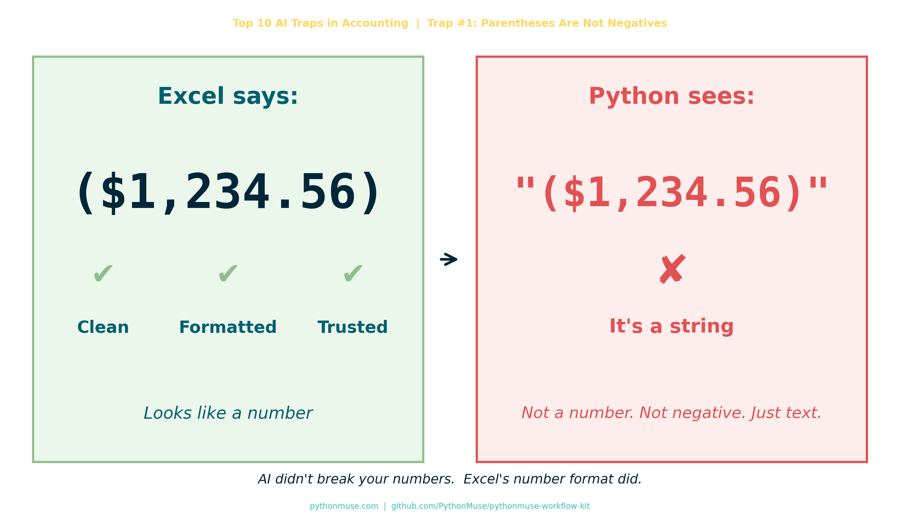

# AI Didn't Break Your Numbers. Excel Did.

*~6 min read*

---

**By Svetlana Toohey**
*Published May 2026*



*Series: Top 10 AI Traps in Accounting — Trap #1*

---

## I Got Into Trouble Today

Not the dramatic kind.

No one called. No fire drill. No audit panic.

Just… numbers not tying.

You know — the quiet kind of wrong.

---

## The Setup

Everything looked fine in Excel.

```
($1,234.56)
```

Clean. Professional. Very accounting.

I ran it through Python.

And suddenly…

- totals off
- variance weird
- logic breaking

Naturally, the first thought:

> "AI messed this up."

---

## The Reality Check

Here's what Python actually saw:

```
"($1,234.56)"
```

Not a number.

A string.

A very confident-looking string.

---

## Excel vs Reality

Excel showed me this:

| What I Saw | What It Meant |
|---|---|
| `($1,234.56)` | Negative number ✔ |
| Formatted beautifully | Easy to trust ✔ |

But under the hood?

- `$` → text
- `,` → text
- `( )` → just parentheses

**There was no negative number. Just vibes.**

---

## And AI?

AI did exactly what it was supposed to do.

It assumed: *"If you gave me a column of numbers, they are probably numbers."*

Reasonable. Incorrect. Very Excel of me.

---

## The Moment It Clicked

This isn't an AI problem.

This is an accounting habit problem.

We've been trained for years to trust what we see:

- parentheses = negative
- formatting = meaning
- Excel = truth

But in Python?

> If it's not explicitly a number, it's not a number.

No interpretation. No assumptions. No "I know what you meant."

---

## The Fix

```python
def clean_accounting_number(series):
    return (
        series.astype(str)
        .replace(r'[\$,]', '', regex=True)           # Remove $ and commas
        .replace(r'\((.*?)\)', r'-\1', regex=True)   # (123) → -123
        .astype(float)
    )
```

Translation:

1. Remove the drama (`$`, `,`)
2. Translate accounting language: `(123)` → `-123`
3. Finally — treat it like a number

This logic is packaged as a reusable PythonMuse Skill:
[`skill-accounting-number-normalization`](../../examples/skill-accounting-number-normalization/SKILL.md)

You can also find it in the [PythonMuse Workflow Kit](https://github.com/PythonMuse/pythonmuse-workflow-kit).

---

## The Rule of Thumb (This Will Save You Time)

If your data comes from Excel:

**Export to CSV or re-save as CSV before using it in Python.**

Why? Because CSV strips out a lot of Excel's "presentation magic."

It won't fix everything — you'll still need to clean data — but:

- fewer hidden surprises
- more consistent structure
- easier to debug
- easier for AI to work with

---

## The Bigger Lesson

We keep saying: *"AI isn't reliable yet."*

But sometimes:

- AI is fine
- Python is fine
- The logic is fine

And the issue is: **we handed them Excel's presentation layer and called it data.**

---

## The Truth About Excel

Excel is amazing.

But Excel is also:

- a storyteller
- a formatter
- a very convincing illusionist

It makes data look clean… even when it's not.

If you've read ["AI Can't Work With Our Excel Files"... or Can It?](../15-ai-and-excel-files/README.md), you already know the instruction layer matters. This is the data discipline side of the same problem.

And if you're building an audit-ready workflow, the raw-layer principle from [The Workings Layer Method](../22-workings-layer-method/README.md) applies here too: always preserve the original. Never overwrite source data. Transform in a separate step.

---

## The Shift We Need to Make

If you're moving into Python + AI workflows:

Stop asking:

> "Why did AI get it wrong?"

Start asking:

> "What assumptions did Excel teach me that aren't real?"

---

## My Favorite Line From Today

> AI didn't fail. It just didn't know you were speaking accounting.

---

## Final Thought

We don't have an AI problem.

We have a data discipline gap.

And honestly? That's good news.

Because that's something we can fix.

---

## PythonMuse Skill

This article has a companion Skill you can drop into any project:

**[Accounting Number Normalization →](../../examples/skill-accounting-number-normalization/SKILL.md)**

Also available in the [PythonMuse Workflow Kit](https://github.com/PythonMuse/pythonmuse-workflow-kit) on GitHub.

---

*Series: Top 10 AI Traps in Accounting — Trap #1: Parentheses Are Not Negatives*

---

> **A note on how this article was made.** This article started with me. The experience, the problem, and the fix are mine — I shared what actually happened and how I solved it. ChatGPT helped me shape that into a structured draft. GitHub Copilot (Claude Sonnet 4.6) then built the final article, the companion Skill, and all visual assets — working from my direction and feedback at each step. I reviewed every output, pushed back on things I didn't like (the title, font sizes, branding), and made all final content decisions. That process — bringing your own experience, using AI to build and iterate, and staying in the editorial seat throughout — is exactly what this series is about.

---

*By Svetlana Toohey | [PythonMuse](https://pythonmuse.com) | [GitHub](https://github.com/PythonMuse/pythonmuse-workflow-kit)*
