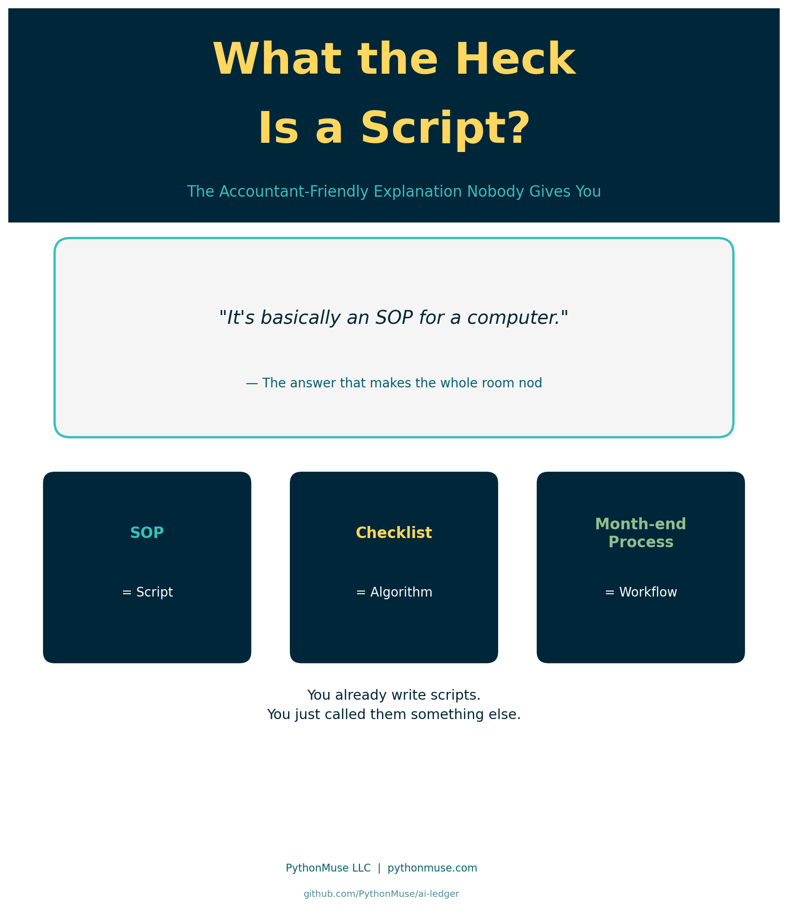
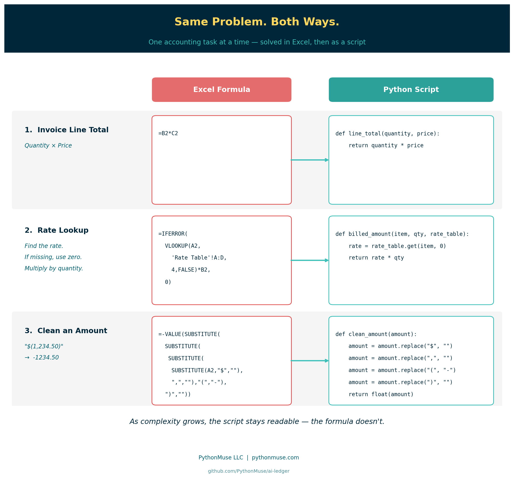
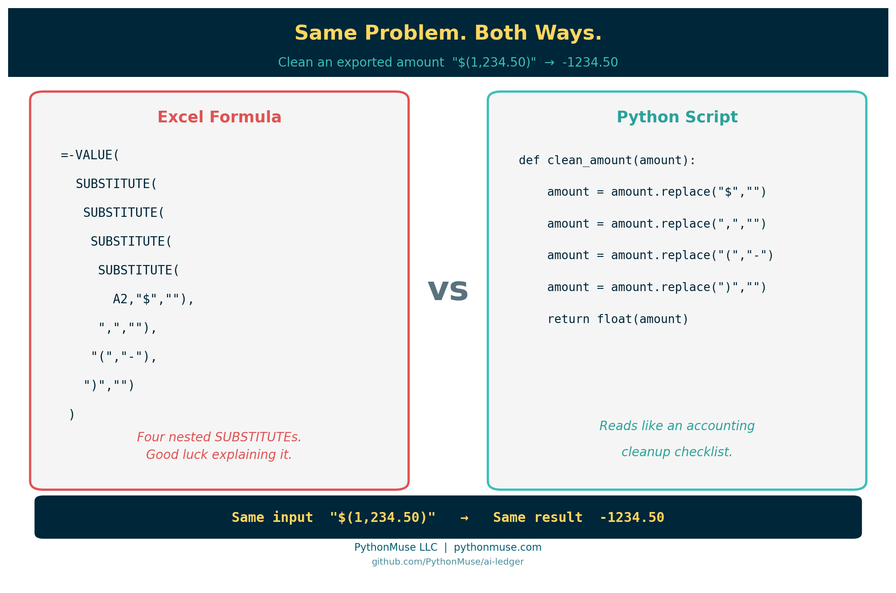

# What the Heck Is a Script?

*~6 min read*

---

**PythonMuse LLC**
*Published May 2026*



---

## A Fair Question

I was doing a presentation recently and kept saying:

> "Then you prompt AI to write a repeatable script."

I said it multiple times like it was the most normal sentence in the world.

Everyone nodded politely.

A few people even took notes.

Then finally someone stopped me and asked:

> "Okay… but what the heck is a script?"

Fair question.

Because the minute accountants hear the word "script," half the room thinks:

- Hollywood actors need scripts - why do I need them?

and the other half of the room imagines:

- hackers in green hoodies
- green text on black screens
- a 22-year-old software engineer drinking energy drinks at 2 a.m.

Meanwhile, most scripts are just:

> "The same accounting steps you already do every month — written down so the computer can repeat them."

That is it.

You already know what a script is.

You just never called it that before.

---

## Accountants Already Use Scripts

We simply use different words.

| Accounting World | Programming World |
|---|---|
| SOP | Script |
| Checklist | Algorithm |
| Macro | Automation |
| Excel formula | Instruction |
| Month-end close process | Workflow |

If every month you:

1. Export a file
2. Remove blank rows
3. Fix dates
4. Convert negatives
5. Copy formulas
6. Build pivots
7. Save final version as `FINAL_v2_USE_THIS_ONE_REALLY.xlsx`

Congratulations.

You already created a script.

You just performed it manually.

---

## A Note on Excel First

Before we get into the comparisons — this is not an anti-Excel argument.

Excel is exceptional at what it is designed for: **presenting, reviewing, and distributing final output**. Pivot tables, dashboards, management reports, ad-hoc analysis — Excel is the right tool for most.

The comparisons below are specifically about the *work that happens before the final output*:

- cleaning a messy export so it can be used
- applying transformation logic row by row across thousands of lines
- repeating the exact same steps every month without variation

That middle layer — data preparation, transformation, cleanup — is where formulas get nested 4 levels deep and logic starts hiding in cells. That is the layer where scripts tend to be more readable and auditable.

Once the work is done? Put it in Excel if this is your comfort level at this point. Show it to your CFO. Build the pivot.

Scripts feed Excel; they do not replace it. You get to the same result quicker and cleaner as well as removing potentially errors that can occur during performing manual work. 

---

## Same Problem, Both Ways

The fastest way to see what a script actually *is* — is to take an accounting task you already solve in Excel and solve it again as a script.

Same input. Same output. Two very different reading experiences.

Let's walk up the ladder from simple to messy.



---

### Example 1 — Invoice Line Total

**The accounting task:** Multiply quantity by price to get a line total.

**Excel:**

```excel
=B2*C2
```

**Python:**

```python
def line_total(quantity, price):
    return quantity * price
```

**How you audit it:**

- In Excel: *"What's in B2 again? And C2? Let me click around."*
- In Python: the variables are literally named `quantity` and `price`.

Same math. One explains itself.

---

### Example 2 — Rate Lookup With a Fallback

**The accounting task:** Look up a billing rate by item code. If the item is missing, treat the rate as zero. Then multiply by quantity.

**Excel:**

```excel
=IFERROR(VLOOKUP(A2,'Rate Table'!A:D,4,FALSE)*B2,0)
```

Now your audit begins. You click the formula. Jump to another tab. Then another.

You are tracing cell references across 14 worksheets trying to figure out:

- what A2 means
- where the rate table lives
- why column 4 matters
- why it multiplies by B2
- who created this masterpiece in 2019 and why they are no longer answering emails

At some point you stop auditing and start archaeological research.

**Python:**

Read the following slowly:

```python
def billed_amount(item_code, quantity, rate_table):
    # if cannot find item code, return zero
    rate = rate_table.get(item_code, 0)
    return rate * quantity
```

With the comment in green font that is identified with pound sing "#", you should be able to read it like a sentence:
> Look up the rate for this item. If it isn't in the table, use zero. Multiply by quantity.

No tab jumping. No column 4. The fallback isn't hidden in an `IFERROR` — it's the word `0` sitting right next to the lookup. Now compare to how long did it take you to decipher excel formula.

---

### Example 3 — Clean an Exported Amount

This is where the gap gets really obvious.

**The accounting task:** Your ERP exports amounts like `"$(1,234.50)"` and you need real numbers like `-1234.50` so you can sum them.

**Excel:**

```excel
=-VALUE(SUBSTITUTE(SUBSTITUTE(SUBSTITUTE(SUBSTITUTE(A2,"$",""),",",""),"(","-"),")",""))
```

Stare at that for a second.

Four nested `SUBSTITUTE` calls, a `VALUE`, a leading minus sign, and you still aren't 100% sure it handles every edge case. Try explaining it to your reviewer without drawing on a whiteboard.

**Python:**

```python
def clean_amount(amount):
    amount = amount.replace("$", "")
    amount = amount.replace(",", "")
    amount = amount.replace("(", "-")
    amount = amount.replace(")", "")
    return float(amount)
```

Read it like an accounting checklist:

1. Remove the dollar sign
2. Remove the comma
3. Convert opening parenthesis to a negative sign
4. Remove the closing parenthesis
5. Return the result as a number

That is not scary. That is a cleanup checklist written for the computer.

And unlike Excel, the logic is not buried in cell G23941. It is visible, named, and repeatable.



---

## Scripts and Excel Work Together

The comparisons above are not meant to say Excel is bad.

Excel is excellent at the end of the process — presenting results, building reports, letting stakeholders interact with final numbers.

Scripts are better suited for the *middle* of the process — the cleanup, the transformation, the repetitive row-by-row logic that runs every month before anyone opens a dashboard; the deterministic steps.

When logic gets nested four levels deep inside a formula, it starts hiding. It becomes harder to review, harder to explain, harder to hand off.

> A script does not hide logic in a cell.
> It puts the logic on the page, named and readable, from top to bottom.

That is what makes the difference for auditability. Not the language. The visibility.

Scripts feed Excel. Excel communicates the results. Both have a job.

---

## The Biggest Misunderstanding About AI

When you hear: *"AI writes scripts"* — what do you imagine? It is not a giant software system.

But most accounting scripts are tiny.

Sometimes:

- 20 lines
- 50 lines
- maybe 100

Many simply automate the annoying parts of accounting work:

- cleaning exports
- standardizing dates
- converting negatives
- matching transactions
- formatting reports

The script handles the repetitive steps.

You still handle the accounting judgment.

---

## The Important Part

A script does not replace accountants.

It replaces repetitive clicking.

You still need to:

- validate outputs
- understand the logic
- review exceptions
- explain the numbers
- ensure controls exist

AI can help write the first draft of the script.

But accountants still own the process.

And honestly? That is exactly how it should be.

---

## The Simplest Explanation

So if someone asks:

> "What the heck is a script?"

You can answer:

> "It is basically an SOP for a computer."

And suddenly the entire room understands.

---

## Related Articles

If scripts are new territory, these articles build the foundation:

- [From One-Time Analysis to Repeatable Workflows](../11-one-time-to-repeatable-workflows/README.md) — the nine-step pattern for turning a one-off task into a script
- [Python Libraries for Accountants](../28-python-libraries-for-accountants/) — the libraries (pandas, openpyxl, matplotlib) that give your scripts their capabilities
- [Reproducible Accounting](../05-reproducible-accounting/README.md) — why readable, repeatable logic matters for audit evidence
- [AI Can't Work With Our Excel Files... or Can It?](../15-ai-and-excel-files/README.md) — how to add an instruction layer when your data lives in Excel
- [When to Trust AI to Run Your Accounting Workflows](../12-audit-ready-ai-workflows/README.md) — controls and governance once your scripts are in production
- [AI That Runs Before You Log In](../18-ai-runs-before-you-log-in/README.md) — the next step: schedule your script to run automatically before you arrive
- [The Magic Loop: Why Easy to Generate Doesn't Mean Safe to Run](../29-loops-the-automation-that-feels-magical/README.md) — now that you know what a script is, see how AI strings them into full automated workflows — and why reviewing what it built matters
- [Metadata Is the Label Maker Your AI Workflow Needs](../31-metadata-is-the-label-maker/README.md) — the script that reads a manifest and blocks draft files is the script from this article doing real governance work

---

## PythonMuse Skill

This article has a companion Skill you can use to review and document any Python script written for your accounting workflow:

**[Script Review Skill →](../../examples/skill-script-review/SKILL.md)**

Also available in the [PythonMuse Workflow Kit](https://github.com/PythonMuse/pythonmuse-workflow-kit) on GitHub.

---

*Published by [PythonMuse LLC](https://pythonmuse.com) | [GitHub](https://github.com/PythonMuse/ai-ledger)*
