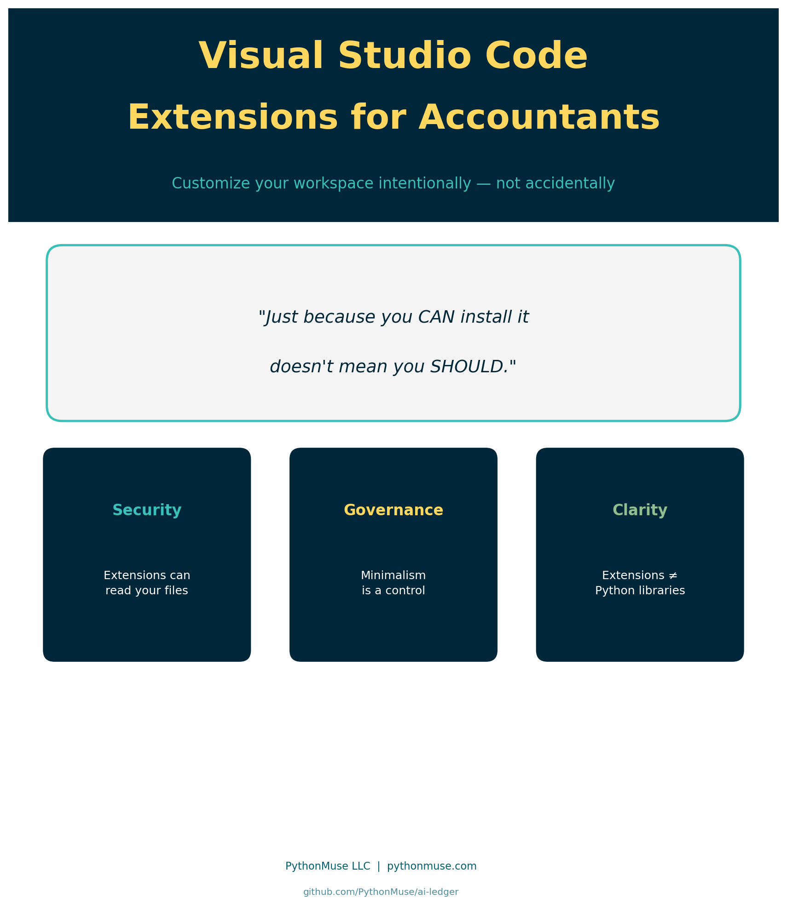
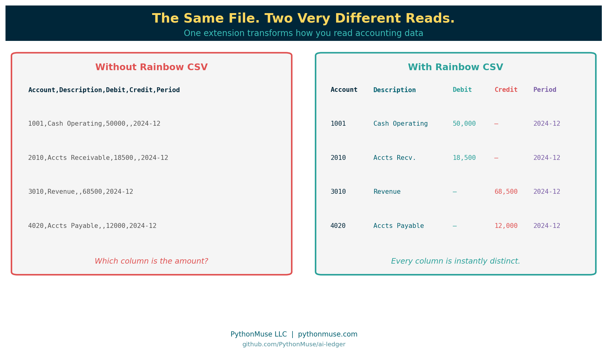
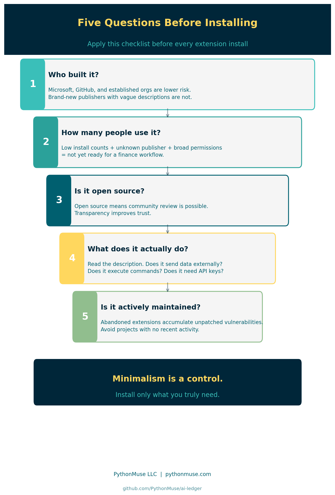
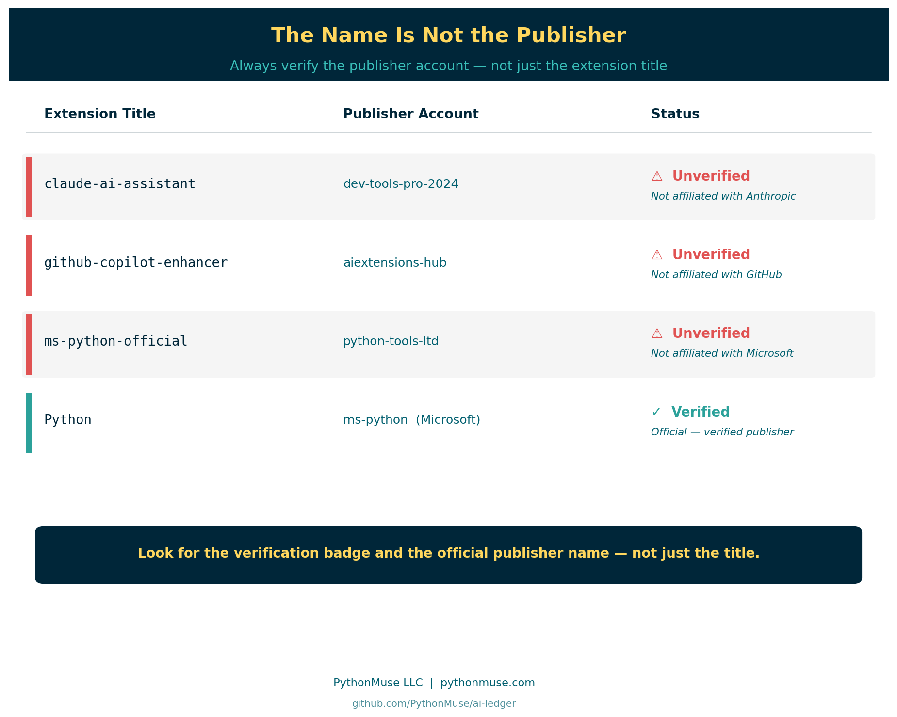
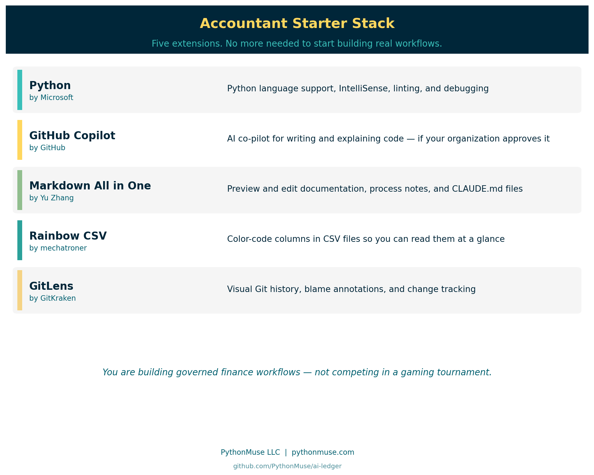

# Visual Studio Code Extensions for Accountants

*How to customize your workspace intentionally — and what extensions have to do with security, governance, and the tools you already trust*

---

**PythonMuse LLC**
*Published May 2026*



---

## Why This Matters to Accountants: A 30-Second Demo

You have just received a CSV export from your ERP system.

You open it in VS Code — without any extensions installed.

Here is what you see:

```
Account,Description,Debit,Credit,Period,Entity,Department
1001,Cash Operating,50000,,2024-12,HoldCo,Finance
2010,Accounts Receivable,18500,,2024-12,HoldCo,Revenue
3010,Revenue,,68500,2024-12,HoldCo,Revenue
4020,Accounts Payable,,12000,2024-12,HoldCo,AP
```

Every column runs together. The commas are barely visible. By column 5 you have already lost track of which value belongs to which field. Scale this to 10,000 rows and you are squinting at a wall of undifferentiated text.

> **A note on tools:** This article uses VS Code and its Marketplace as the example, since that's the editor most of this series is built in. The governance lesson — vet the publisher, check install counts, don't assume open-source means safe, install only what you need — applies to any harness's extension or plugin system, including Codex and Gemini's Antigravity.

Now install one extension — **Rainbow CSV** — and reopen the same file.

Every column gets its own distinct color. Headers are immediately recognizable. You can scan the full file at a glance without losing your place.



That is what a VS Code extension does: it expands how your editor displays, highlights, and interacts with files — without changing the underlying data.

That is also why this article exists. Those same extensions come with **permissions**. Some can read files on your machine, connect to external services, or run code automatically in the background. Choosing them carefully is part of your governance responsibilities now.

---

## The Grocery Run Problem

You know the feeling.

You went in for one carton of eggs.

But there was a buy-one-get-one deal on pasta. And a limited-time discount on three kinds of sauce. And a sampler pack of something you have never tried but seemed useful at the time.

You leave with a full cart, a receipt longer than your arm, and no memory of deciding to buy most of it.

VS Code extensions work the same way.

You install one helpful AI tool. Then a CSV helper. Then an Excel formatter. Then a "super productivity booster mega pack" because the reviews looked good. Before long, your clean accounting workspace is cluttered with tools you barely remember adding — some from developers you have never heard of.

Welcome to the world of VS Code extensions.

Extensions are incredibly powerful. They are also one of the first places where accountants entering AI-powered workflows need to start thinking differently — about security, governance, and intentional tooling.

This article is not about becoming a developer.

It is about learning how to think like a responsible builder.

---

## What Is a VS Code Extension?

Think of Visual Studio Code like Excel.

Out of the box, Excel is useful.

But over the years, accountants added:

- Solver
- Power Query
- Bloomberg add-ins
- tax tools
- reporting plugins
- ERP connectors

Extensions are the VS Code version of that idea.

They add capabilities to your workspace:

- AI assistants (i.e. Claude)
- Python support
- Git integration
- database tools
- Markdown previews
- CSV formatting
- Excel export helpers
- automation utilities

The official [Visual Studio Code Marketplace](https://marketplace.visualstudio.com/vscode) currently contains tens of thousands of extensions.

**A note on design intent:** VS Code was built lean on purpose. Microsoft designed the core editor to be a minimal, lightweight foundation that works for almost any developer workflow. The extension marketplace is how users add only what they need — nothing more is bundled in by default. That design philosophy is exactly why extension discipline matters: the power to customize is built in, and so is the responsibility that comes with it.

---

## Why Accountants Should Pay Attention

Extensions are not "just themes."

Many extensions can:

- read files on your machine
- access your workspace and open documents
- connect to external APIs
- execute scripts automatically
- monitor opened files
- send data to external services

In other words, an extension may potentially have access to the same sensitive financial data you do.

That means extension management is not an IT-only conversation anymore.

It is part of modern accounting governance.

**The analogy that lands:**

Imagine someone walked into your office and said:

> "Hey, I built this amazing Excel add-in. It can read every workbook on your machine, connect to the internet, run scripts, and automate tasks. I made it last weekend. Want to install it?"

Most accountants would ask questions, verify legitimacy, check references, involve IT, and understand permissions before saying yes.

But online? People install extensions in 14 seconds because the logo looked cool.

---

## Extensions vs Libraries: Know the Difference

Before going further, there is one concept that causes enormous confusion — especially for accountants just entering this world.

**VS Code extensions and Python libraries are not the same thing.**

Here is a quick way to tell them apart:

| | VS Code Extension | Python Library |
|---|---|---|
| **What it extends** | Your editor | Python itself |
| **Installed into** | VS Code | Your Python environment |
| **Helps** | You work | Your script work |
| **Analogy** | Tool on your desk | Skill you teach your assistant |

> Extensions help **you** work. Libraries help **Python** work.

This distinction is foundational — and it gets a full treatment in the next article:

**[Python Libraries for Accountants: Skills You Teach Your Code →](../28-python-libraries-for-accountants/)**

For now: if someone says "install pandas," that is a Python library, not a VS Code extension. Different install. Different purpose. Different risk profile.

---

## What to Check Before Installing



### 1. Who Built It?

Look for:

- Microsoft
- GitHub
- well-known open-source organizations
- established companies with community reputation

Be cautious with brand-new publishers, extensions with almost no installs, vague descriptions, and tools that claim to be official AI assistants but are not.

Malicious extensions have appeared even in legitimate marketplaces. That does not mean "never use extensions." It means: **treat extensions like software vendors.**

This is a documented, ongoing risk — not a hypothetical. In 2024, security researchers identified malicious VS Code extensions on the official Marketplace with thousands of downloads, mimicking the names and interfaces of popular tools while silently harvesting credentials or injecting malicious code. Getting onto a legitimate platform under a convincing name is not technically difficult. Getting caught takes longer than it should.

A related and more insidious threat is the **supply chain attack** — where the extension itself is not the problem, but a library it depends on has been quietly compromised. The XZ Utils backdoor discovered in 2024 is one of the most studied examples: a trusted open-source compression library, deployed across thousands of Linux systems, was found to contain a sophisticated backdoor inserted by a contributor who had spent nearly two years building community trust. The software looked legitimate at every level of public review. The damage was embedded in a compiled component and discovered almost by accident — after widespread deployment.

Extensions that depend on compromised libraries carry that risk downstream, without the extension developer ever knowing.

**Watch for name impersonation:**

The name of an extension is not a guarantee of its origin.

An extension called "Claude AI Assistant" is not necessarily built by Anthropic. "GitHub Copilot Pro" may have no affiliation with GitHub. "Python Official Support" could be published by anyone. The VS Code Marketplace allows any developer to publish under any extension title that has not been specifically blocked — and the review process is not exhaustive.

Legitimate companies publish under **verified publisher accounts** — look for the verification badge and the official publisher name, not just the extension title.



### 2. How Many People Use It?

High install count does not guarantee safety. But:

- 15 installs
- last updated 11 months ago
- unknown publisher
- requesting broad permissions

…should probably not become part of your finance workflow.

Community adoption matters — but signals can be manipulated.

**A word of caution about popularity metrics:** High install counts and enthusiastic YouTube reviews are no longer reliable proof of legitimacy on their own. Fabricating download statistics, generating fake reviews, and producing convincing video walkthroughs of tools that do not hold up to scrutiny are all technically straightforward today. An extension with 50,000 installs and a YouTube channel with 10,000 subscribers is not the same thing as an extension that has been independently reviewed for security. Just because something is all over social media does not mean it is real, safe, or what it claims to be.

Wear your skeptic hat. Cross-reference the Marketplace publisher verification badge, the GitHub repository for real commit activity and contributor history, and the issues tab — not just the description and screenshots.

### 3. Is It Open Source?

Many trusted extensions are open source — and transparency is genuinely valuable. Community review is possible, issues are publicly visible, and security concerns tend to surface faster when more people are watching.

**But open source alone does not mean safe.**

An extension can be well-maintained, widely used, thoroughly documented, and open source — and still introduce risk through **supply chain compromise**. This is when a trusted library that the extension depends on is quietly replaced with, or updated to contain, malicious code. The extension developer may not even be aware.

This is not theoretical. Recall the XZ Utils example from earlier in this article: an open-source library trusted across thousands of Linux systems, compromised through a patient, multi-year infiltration of a contributor account. The code reviewers saw clean commits. The damage was elsewhere. Countless systems were affected before anyone noticed.

An extension built on a similarly compromised dependency carries that risk without any visible warning. The extension itself passes every check. The problem arrives through what it imports.

The lesson is not "avoid open source." Open source is still far preferable to unreviewed closed-source tools. The lesson is: **open source is one positive signal among several — not a standalone guarantee of safety.**

Use it as part of your checklist. Treat all five questions as a combination — no single factor is sufficient on its own.

When in doubt, ask your IT team to vet the extension and add it to your organization's approved list. Document your review in your [AI governance repository](https://github.com/PythonMuse/accounting_and_finance-ai-governance). A few minutes of due diligence now is worth considerably more than an audit finding or a breach investigation later.

### 4. What Does It Actually Do?

Ask:

- What problem does this solve?
- Do I actually need it?
- Could this expose company data?
- Does it connect externally?
- Does it require API keys?
- Does it execute commands automatically?

Every extension increases your operational surface area.

### 5. Is It Actively Maintained?

An extension that has not been updated in 18 months and has unresolved security reports is not a stable foundation for a finance workflow. Avoid abandoned projects.

---

## Minimalism Is a Control

One of the best habits you can build early: **install the minimum needed.**

Not because extensions are bad.

But because simplicity is a control.

The fewer moving parts:

- the easier troubleshooting becomes
- the easier governance becomes
- the easier onboarding a new team member becomes
- the lower the risk profile

This is very similar to accounting processes. The cleanest workflow is rarely the one with 19 manual workarounds stacked together since 2017.

---

## A Starter Stack for Accountants



Most accountants need very few extensions to start building real workflows.

| Extension | Publisher | Purpose |
|---|---|---|
| Python | Microsoft | Python language support, IntelliSense, debugging |
| GitHub Copilot | GitHub | AI co-pilot — if your organization approves it |
| Markdown All in One | Yu Zhang | Preview and edit documentation cleanly |
| Rainbow CSV | mechatroner | Color-code and format CSV files |
| GitLens | GitKraken | Visual Git history, blame, and change tracking |

That is enough.

You do not need:

- 12 AI agents
- 7 themes
- crypto price widgets
- animated dashboard extensions
- "ultimate hacker mode"

You are building governed finance workflows — not competing in a gaming tournament.

---

## AI Extensions Deserve Extra Thought

Some AI extensions:

- send your prompts to external cloud services
- upload file context to remote servers
- analyze open tabs and documents
- retain conversation history across sessions
- connect to third-party APIs you may not control

This is why understanding local vs. cloud processing, your organization's AI policy, data classification levels, and the list of approved tools becomes critically important.

Especially when working with:

- payroll data
- customer information
- legal documents
- financial statements
- M&A materials
- tax filings

The AI tool itself may be approved. The specific extension configuration may matter just as much.

For guidance on safe AI data practices, see [Safe AI Data Workflows](../06-safe-ai-data-workflows/).

---

## Build a Simple Approved Extensions List

This is something finance teams will increasingly adopt.

A lightweight governance document listing:

- approved extensions
- purpose
- publisher
- approved version
- business justification
- data handling considerations

Not bureaucracy. Repeatability and governance.

Controls are not "set once forever." Neither are extensions. Update trusted extensions regularly. Remove ones you no longer use. Periodically review your full installed list.

---

## One More Thing Before You Install

VS Code extensions are one of the first moments accountants begin stepping into the larger world of software ecosystems.

At first it feels overwhelming.

But eventually you realize something powerful: you are no longer limited to only the tools software vendors decided accountants should have. You can now shape your own workflow.

Carefully. Responsibly. Incrementally.

That is a massive shift for our profession.

And before you hear someone say "just pip install pandas" — make sure you read the next article first.

Because that is a completely different kind of install.

**[Python Libraries for Accountants: Skills You Teach Your Code →](../28-python-libraries-for-accountants/)**

---

*Related: [Python Libraries for Accountants](../28-python-libraries-for-accountants/) | [Getting the Right Tools Installed](../03-getting-the-right-tools-installed/) | [AI Governance in Accounting](../04-ai-governance-in-accounting/) | [What the Heck Is a Script?](../25-what-the-heck-is-a-script/)*
