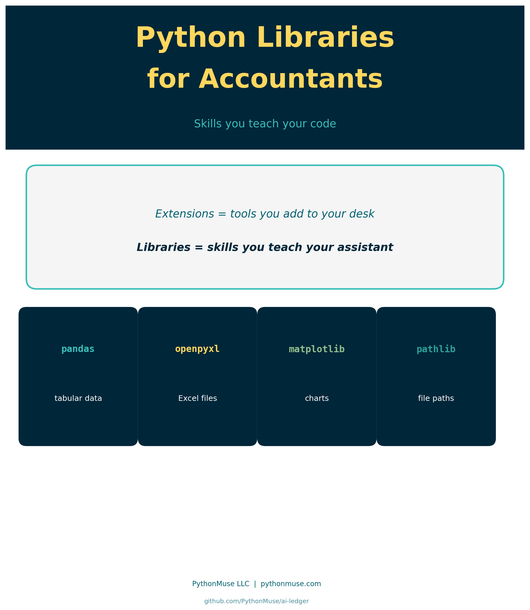
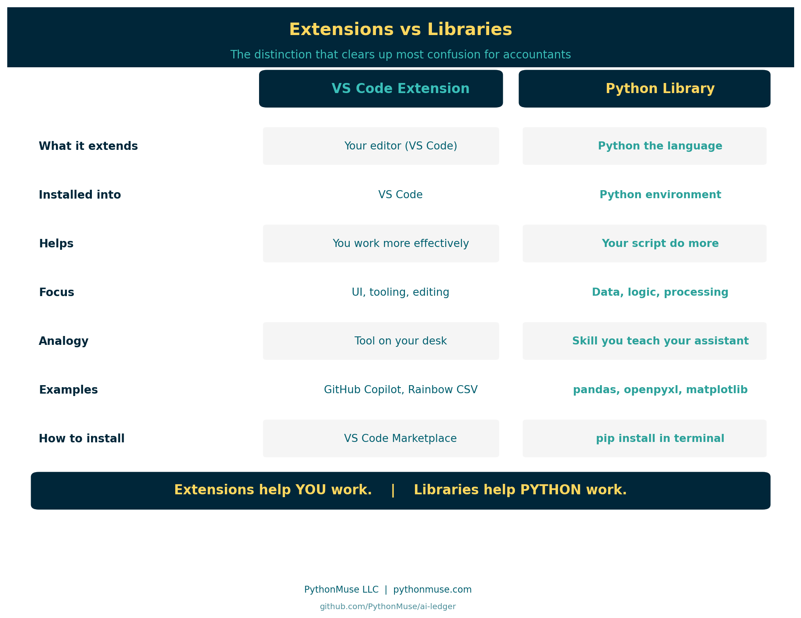
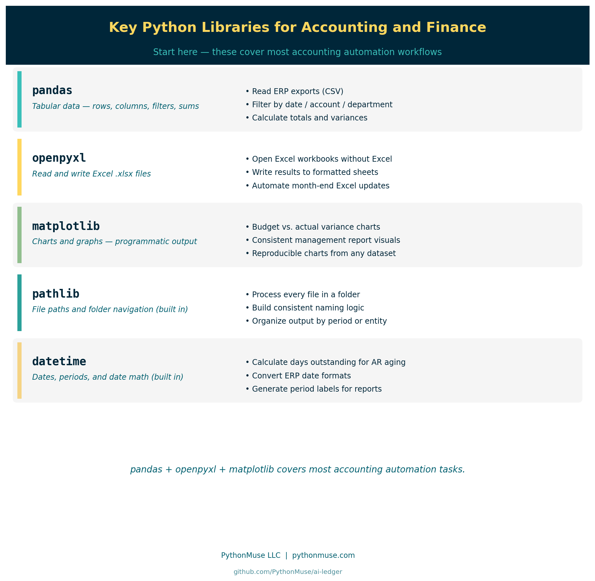

# Python Libraries for Accountants: Skills You Teach Your Code

*What Python libraries are, why they matter, and how to add them safely to your accounting workflows*

---

**PythonMuse LLC**
*Published May 2026*



---

## So You Have VS Code. Now What?

You followed the setup guide. VS Code is installed. Python is installed. Maybe you added a few extensions.

Then someone in a tutorial says:

> "Just import pandas and you're good to go."

And you think: wait — pandas? As in, the bear? What does a zoo have to do with my balance sheet? Is that different from extensions?

Yes. Completely different.

This is one of the most common points of confusion for accounting and finance professionals entering the world of AI-assisted workflows.

Extensions customize your workspace. Libraries expand what Python — the programming language — can actually do.

---

## The Distinction That Changes Everything

If you read [Visual Studio Code Extensions for Accountants](../27-vscode-extensions-for-accountants/), you saw this distinction introduced. Here it gets its full treatment.



| | VS Code Extension | Python Library |
|---|---|---|
| **What it extends** | Your editor (VS Code) | Python the language |
| **Installed into** | VS Code | Your Python environment |
| **Helps** | You work more effectively | Your script do more |
| **Focus** | UI, tooling, editing experience | Data, logic, processing |
| **Analogy** | Tool on your desk | Skill you teach your assistant |
| **Examples** | GitHub Copilot, Rainbow CSV | pandas, openpyxl, matplotlib |
| **How to install** | VS Code Marketplace | `pip install` in terminal |

> **Extensions help YOU work.**
> **Libraries help PYTHON work.**

Once that distinction lands, a lot of confusion disappears.

---

## What Is a Python Library?

A Python library is a collection of pre-written code that other developers have packaged and made available for anyone to use.

Python out of the box can:

- do math
- read and manipulate text
- make decisions with logic
- repeat steps in a loop

But Python out of the box cannot:

- open an Excel file
- build a pivot table
- draw a chart
- connect to a database
- parse a PDF

For those tasks, someone has already written the code — tested it, refined it over years, and released it for the community to use.

When you install a Python library, you are adding a capability to Python that it did not have before.

---

## The Analogy That Lands

Here is the version that resonates with accounting and finance professionals:

> VS Code extensions are tools you add to your office desk.
> Python libraries are skills you teach your assistant.

**Extension example:** You add a spellchecker to your editor — now the workspace catches typos as you type.

**Library example:** You teach your assistant how to calculate commission splits — now the script can do it automatically, every time, without your involvement.

One customizes your environment. The other expands what your code can actually execute.

---

## Key Python Libraries for Accounting and Finance



These are the libraries that come up most often in accounting and finance workflows.

### pandas

The most widely used library for working with tabular data.

If you have ever worked with spreadsheet-style data — rows and columns, filters, summaries, lookups — pandas does that in Python.

**Common accounting uses:**

- reading exported CSV files from ERP systems
- filtering transactions by date, account, or department
- calculating totals, subtotals, and variances
- merging two data sources for reconciliation

```python
import pandas as pd

df = pd.read_csv("transactions.csv")
totals = df.groupby("account")["amount"].sum()
```

### openpyxl

Reads and writes Excel files directly — `.xlsx` format.

**Common accounting uses:**

- reading data from Excel workbooks without opening Excel
- writing processed results back into formatted spreadsheets
- automating repetitive Excel updates at month-end

```python
import openpyxl

wb = openpyxl.load_workbook("budget.xlsx")
ws = wb.active
```

### matplotlib

Creates charts and graphs programmatically.

**Common accounting uses:**

- building variance charts for management reports
- visualizing budget vs. actual results
- generating consistent, reproducible output for presentations

### pathlib

Built into Python — no install needed. Used for navigating file structures, reading folders, and building automation around local file paths.

**Common accounting uses:**

- processing all files in a folder automatically
- building consistent file naming logic
- organizing output by period or entity

### datetime

Also built in. Handles date math, formatting, and conversions.

**Common accounting uses:**

- calculating days outstanding for AR aging
- converting date formats from ERP exports
- generating period labels for reports

---

## Pandas in Action: Building an AR Aging Report

You have seen what pandas can do in theory. Here is what it looks like on a real accounting task.

**The scenario:** You have a file of open invoices. You need to know how many days each one has been outstanding, bucket them into aging categories, and get a total for each bucket.

Note: most ERP systems generate an aging report automatically. This example is intentionally simplified — the goal is not to replace your ERP, but to show what pandas is actually doing and why it matters when your data does not fit neatly into what your ERP already produces.

Here is the same result in Python, built from a raw export.

**The data:** `data/invoices.csv`

```
invoice_number,customer,invoice_date,amount
INV-1001,Lakeside Manufacturing,2026-01-15,4250.00
INV-1002,River City Supplies,2026-02-10,1875.50
INV-1003,Summit Consulting,2026-03-05,6100.00
INV-1004,Lakeside Manufacturing,2026-03-20,3300.00
INV-1005,Northgate Partners,2026-04-02,950.00
INV-1006,River City Supplies,2026-04-15,2400.00
INV-1007,Summit Consulting,2026-04-28,5750.00
INV-1008,Northgate Partners,2026-05-05,1200.00
INV-1009,Lakeside Manufacturing,2026-05-12,7800.00
INV-1010,River City Supplies,2026-05-22,3100.00
```

**The script:**

```python
import pandas as pd
from datetime import date

# Load the invoice file
df = pd.read_csv("data/invoices.csv", parse_dates=["invoice_date"])

# Calculate how many days each invoice has been outstanding
today = pd.Timestamp(date.today())
df["days_outstanding"] = (today - df["invoice_date"]).dt.days

# Assign each invoice to an aging bucket
def aging_bucket(days):
    if days <= 30:
        return "0-30 days"
    elif days <= 60:
        return "31-60 days"
    elif days <= 90:
        return "61-90 days"
    else:
        return "90+ days"

df["bucket"] = df["days_outstanding"].apply(aging_bucket)

# Summarize total outstanding by bucket
summary = df.groupby("bucket")["amount"].sum().reindex(["0-30 days", "31-60 days", "61-90 days", "90+ days"])
print(summary)
```

**What each part does:**

`pd.read_csv` opens the file and loads it into a DataFrame — pandas' version of a spreadsheet tab. The `parse_dates` argument tells pandas to treat the `invoice_date` column as actual dates, not plain text.

`(today - df["invoice_date"]).dt.days` subtracts each invoice date from today and converts the result into a number of days. One line replaces a column of formulas.

`aging_bucket` is a function that takes a number of days and returns a category label. `df["days_outstanding"].apply(aging_bucket)` runs that function on every row automatically.

`groupby("bucket")["amount"].sum()` groups all rows by bucket and totals the amounts — the pandas equivalent of SUMIF.

**The output:**

```
bucket
0-30 days     17850.00
31-60 days     3350.00
61-90 days     9400.00
90+ days       6125.50
Name: amount, dtype: float64
```

Ten invoices. Aging buckets calculated. Totals summarized.

**So why does this matter if your ERP already does aging?**

Because real accounting work lives in the gaps between systems.

Your ERP produces a standard aging report — but what happens when you need custom aging thresholds for a specific client agreement? Or when you need to filter by a subset of customers that spans two systems? Or when a collections log lives in a spreadsheet that your ERP has never seen?

pandas works on any data you can export to CSV, regardless of where it came from or whether your ERP has a built-in report for it. The logic is yours to define. It applies consistently across every row. And it reruns on a fresh export without any manual reformatting.

That is the point. Not replacing your ERP — extending your reach beyond it.

---

## How pip install Works

When you install a Python library, you use a tool called `pip`.

`pip` stands for "Pip Installs Packages." It is the standard package manager for Python — the tool that reaches out to the Python Package Index ([PyPI](https://pypi.org)), downloads the library, and places it in your Python environment.

The command is simple:

```
pip install pandas
```

That is it. Python then has access to pandas.

You run this in the terminal — the command line inside VS Code. Not in a script. Not in a cell. In the terminal.

---

## What Is a Python Environment?

This concept trips up many people, but the accounting analogy makes it clear.

Think of a Python environment like a separate file drawer for each project.

Each drawer contains:

- the version of Python for that project
- the specific libraries installed for that project
- nothing from other projects

Why does this matter?

Because one project might need pandas version 1.5, and another might need version 2.1. If you install everything into one shared space, they can conflict.

Environments keep each project's dependencies clean, isolated, and reproducible.

For accounting teams, this also matters for governance: if you share a script with a colleague, they can recreate your exact environment — same Python version, same library versions, same behavior.

---

## Evaluating an Unfamiliar Library

Before adding any library to an accounting workflow, apply the same mindset you would use before installing a VS Code extension.

Ask:

- Who maintains it?
- How many people use it?
- When was it last updated?
- Is there clear documentation?
- Does it have a strong community or backing organization?

**pandas** is maintained by the open-source community and backed by NumFOCUS, with millions of weekly downloads. That is a very different risk profile than a library with 40 downloads and no updates since 2021.

The [Python Package Index](https://pypi.org) shows download statistics, maintainers, and version history for every published library.

---

## How AI Helps You Learn Libraries

One underappreciated benefit of working with AI tools in your workflow: they are remarkably good at explaining what an unfamiliar library does.

If you encounter an import you do not recognize:

```python
import xlwings as xw
```

You can simply ask your AI co-pilot:

> "What is xlwings? What does it do? How is it different from openpyxl? Should I use it for reading Excel files in an accounting context?"

Your co-pilot will explain the tradeoffs clearly — without you needing to dig through documentation pages to find the practical answer.

This lowers the cost of curiosity. You can explore unfamiliar libraries faster, understand what they do, and decide whether they belong in your workflow.

---

## Install Only What You Truly Need

The same principle that governs extensions governs libraries.

Minimalism is a control.

Every library you add:

- becomes a dependency your script relies on
- needs to be maintained and updated over time
- needs to be vetted against your organization's security requirements
- needs to be reproducible in your colleague's environment

Starting with pandas, openpyxl, and matplotlib gets you through most accounting automation tasks.

Add libraries intentionally — the same way you would add a new software vendor to your technology stack. The question is not "can I install this?" The question is "do I truly need this?"

---

## What Comes Next

Libraries give Python capabilities. Scripts put those capabilities to work.

If you want to understand what a Python script actually is and how accounting professionals use them:

**[What the Heck Is a Script?](../25-what-the-heck-is-a-script/)**

And if you want to see repeatable workflows built around these libraries:

**[From One-Time Analysis to Repeatable Workflows](../11-one-time-to-repeatable-workflows/)**

---

*Related: [Visual Studio Code Extensions for Accountants](../27-vscode-extensions-for-accountants/) | [What the Heck Is a Script?](../25-what-the-heck-is-a-script/) | [Getting the Right Tools Installed](../03-getting-the-right-tools-installed/) | [From One-Time Analysis to Repeatable Workflows](../11-one-time-to-repeatable-workflows/)*
