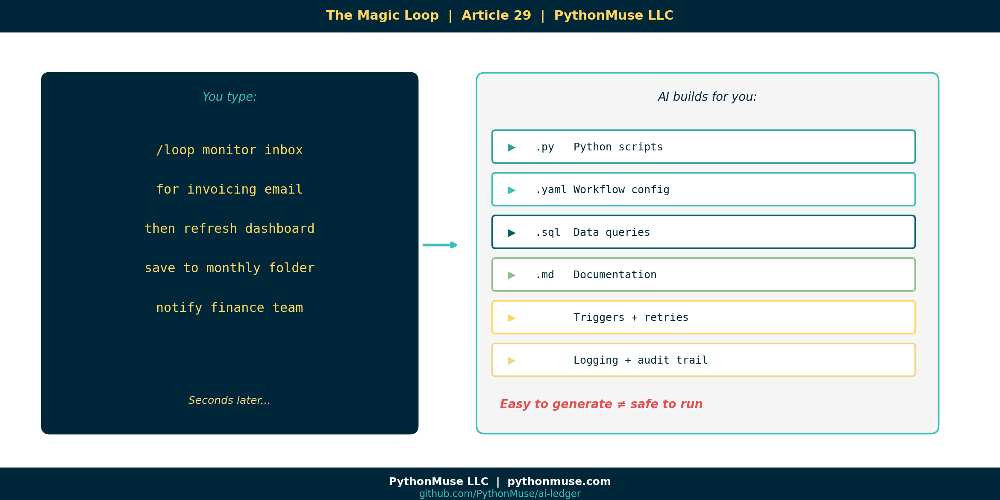
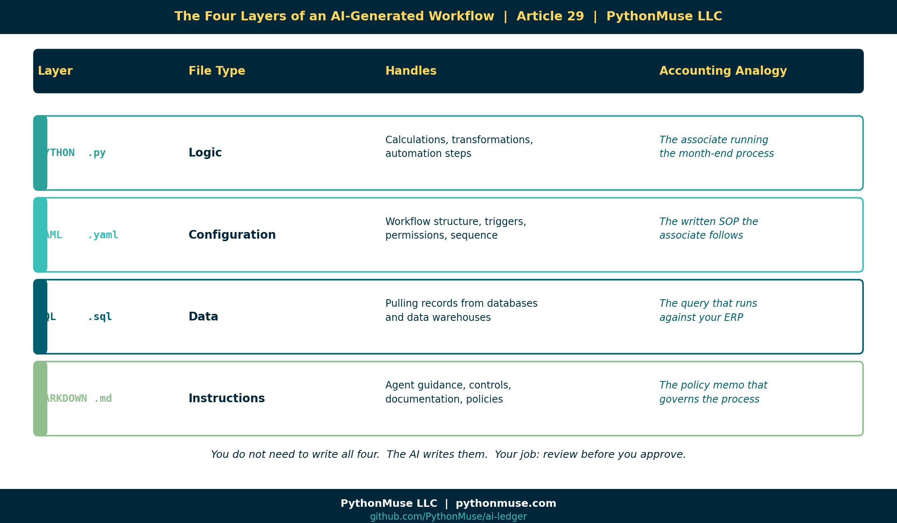
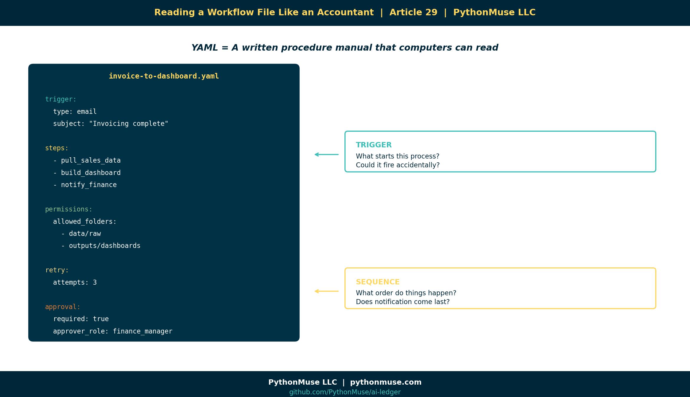
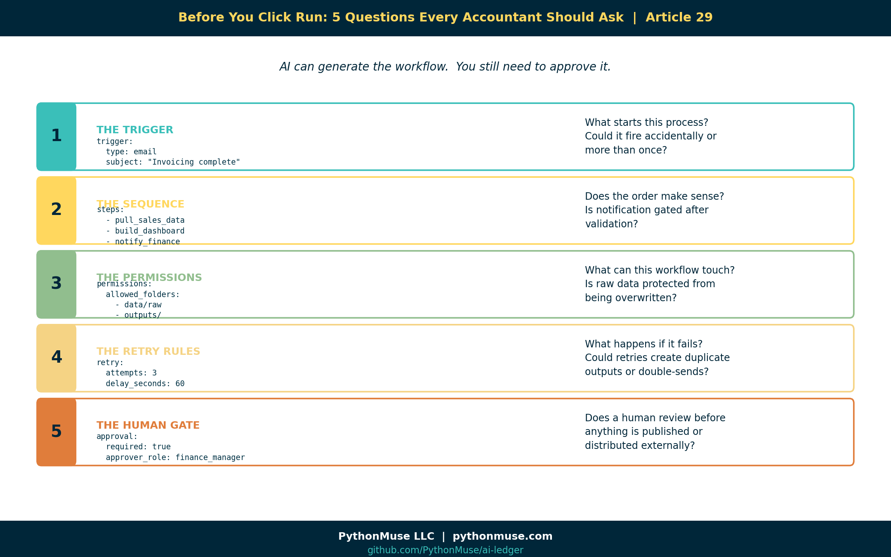
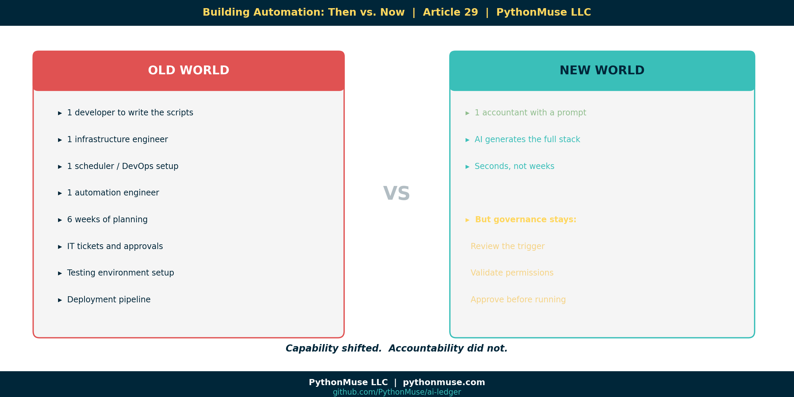

# The Magic Loop: Why Easy to Generate Doesn't Mean Safe to Run

*~8 min read*

---

**PythonMuse LLC**
*Published May 2026*



---

## The Moment Everything Changes

You type something like this into your AI co-pilot:

```
/loop monitor inbox for invoicing completion email
then refresh the sales dashboard
save outputs to monthly reporting folder
notify finance team when complete
```

And seconds later, the AI has generated:

- Python scripts
- A YAML workflow file
- Folder structure
- Triggers
- Retry logic
- Logging
- Documentation

You lean back and think: *that was shockingly easy.*

You are correct. It was.

That is the problem.

Because here is what most people do next:

```
Prompt AI
↓
Copy output
↓
Run it
↓
Hope for the best
```

And here is what this article is trying to teach you to do instead:

```
Prompt AI
↓
Understand the structure
↓
Review the workflow
↓
Validate the controls
↓
Approve execution
↓
Monitor outputs
```

Those two paths look almost identical from the outside.

They are not the same thing.

---

## The Pivot Table Problem

Let me borrow a metaphor from the tool you already know.

When you click **Insert Pivot Table** in Excel, it feels like one step.

But underneath, Excel is generating formulas, data references, aggregation rules, memory structures, cell dependencies, and display logic you never directly see.

You do not need to understand all of that to use a pivot table.

But you absolutely need to understand *what the pivot table is summarizing* before you put it in a board presentation.

The same is true with AI-generated loops.

The `/loop` command is not the automation.

The `/loop` command *generates* the automation.

And the automation is doing real things to real data in real systems.

---

## What Actually Gets Built

When a modern AI harness generates a loop workflow, it does not produce a single script.

It produces a *stack*.



Here is what each layer does — in accounting terms:

| Layer | File type | What it handles | Accounting analogy |
|---|---|---|---|
| **Logic** | Python `.py` | Calculations, transformations, automation steps | The associate running the month-end process |
| **Configuration** | YAML `.yaml` | Workflow structure, triggers, permissions, sequence | The written SOP the associate follows |
| **Data** | SQL `.sql` | Pulling records from databases | The query that runs against your ERP |
| **Instructions** | Markdown `.md` | Agent guidance, controls, documentation | The policy memo that governs the whole process |

You do not need to write all four.

The AI writes them.

Your job is to understand what was written before you approve it.

---

## YAML Is Not Scary. It Is Just a Procedure Manual.

If you have never seen a YAML file, here is the simplest explanation:

> YAML is a structured configuration file. Think of it like a written procedure manual that computers can read.

That is it.

Python is the worker doing the activity.
YAML is the instruction sheet explaining what should happen and in what order.

Here is what a YAML workflow file might look like for the invoice-to-dashboard example:

```yaml
name: invoice-to-dashboard
description: Waits for invoicing completion, then refreshes sales dashboard

trigger:
  type: email
  subject_contains: "Invoicing complete"

steps:
  - pull_sales_data
  - build_dashboard
  - notify_finance

permissions:
  allowed_folders:
    - data/raw
    - outputs/dashboards

retry:
  attempts: 3
  delay_seconds: 60

approval:
  required: true
  approver_role: finance_manager
```

Now here is the same file — but as an accountant reads it:



Every line maps to a question you already know how to ask.

You are not learning to code.

You are learning to review a procedure.

---

## The Five Things You Review Before You Click Run

You would not sign off on a month-end close checklist you had never read.

You would not approve a wire transfer without verifying the destination.

Apply that same instinct here.

Before running any AI-generated loop, review these five things:



### 1. The Trigger

```yaml
trigger:
  type: email
  subject_contains: "Invoicing complete"
```

**The question**: What starts this process? Is that the right trigger? Could it fire accidentally?

### 2. The Sequence

```yaml
steps:
  - pull_sales_data
  - build_dashboard
  - notify_finance
```

**The question**: What order do things happen in? Does that order make sense? Does notification come before or after validation?

### 3. The Permissions

```yaml
permissions:
  allowed_folders:
    - data/raw
    - outputs/dashboards
```

**The question**: What can this workflow touch? Is it limited to the right areas? Are raw files protected from overwriting?

### 4. The Retry Rules

```yaml
retry:
  attempts: 3
  delay_seconds: 60
```

**The question**: What happens if something fails? Does it retry indefinitely? Could it create duplicate outputs?

### 5. The Human Gate

```yaml
approval:
  required: true
  approver_role: finance_manager
```

**The question**: Does a human review the outputs before anything is published or distributed?

---

## What Can Go Wrong

You might be thinking: *the AI generated this — surely it got it right.*

Sometimes it does. Sometimes it does not.

Here are a few things AI has been known to generate that look fine until they are not:

**The permission that grants too much:**
```yaml
allowed_folders:
  - /
```
That forward slash means: *access the entire machine.* Not just your data folder. Everything.

**The delete that runs against the wrong folder:**
```python
delete_old_files(folder="data/")
```
Was that supposed to be `data/processed/` only? Or all of `data/`? Including `data/raw/`?

**The trigger that fires twice:**
Two emails arrive with matching subject lines. The workflow runs twice. The outputs get doubled. The dashboard shows numbers no one can explain.

**The notification that goes to the wrong list:**
```yaml
notify: team_finance_all
```
Does `team_finance_all` include external stakeholders? Does it include people who should not see preliminary numbers?

None of these are catastrophic failures.

They are the kind of thing a competent professional would catch in a five-minute review — but only if they actually reviewed it.

---

## Old World vs. New World

There is a genuine shift happening in how financial workflows get built.



**Old world**: Building a loop that monitors an inbox, refreshes a dashboard, and notifies a team required a developer, a scheduler, an automation engineer, and probably six weeks.

**New world**: You type one prompt and get a working draft in seconds.

That is not an exaggeration.

The tools exist. This is happening now.

But the shift in capability does not come with a shift in accountability.

If a workflow runs on your team's data and distributes outputs under your team's name, *someone on your team is responsible for what it does.*

The future accountant may never manually write a `while True:` loop.

But they absolutely need to understand what the `/loop` command just created before clicking Run.

---

## A Note on Tools and Frameworks

The examples in this article use Claude inside VS Code through GitHub Copilot — specifically the `/loop` command in the Claude Code extension.

> **A note on tools:** `/loop` is Claude Code's own slash-command syntax for running something on a schedule. Other harnesses do this differently — Codex and Antigravity each have their own way of scheduling or resuming work — but the underlying idea, telling your AI tool to check back on its own schedule, is the same.

But the framework applies everywhere.

If you are using ChatGPT with Codex, the generated output will have a different format — but the same five review questions still apply.

If you are using Gemini with Antigravity, the trigger configuration looks different — but you still need to know what starts the process and what it can touch.

If you are using Microsoft Copilot with Power Automate connectors, the visual is friendlier — but the underlying logic is the same and deserves the same scrutiny.

**The tooling is a harness. The governance is yours.**

This series teaches the framework, not the software. When the software changes — and it will change — the thinking stays.

---

## The Strongest Line in This Article

Here it is:

> In the AI era, "I didn't write the code" will not be enough of a control explanation.

The future of accounting does not require everyone to become a software engineer.

It does require everyone to understand what the software engineer — or the AI — just built.

AI can generate automation in seconds.

Governance is understanding what you are about to run.

That is the new skill.

Not writing loops.

Reviewing them.

---

## Try It Yourself

The [PythonMuse Workflow Kit](https://github.com/PythonMuse/pythonmuse-workflow-kit) includes a live example of the invoice-to-dashboard workflow from this article.

Open the `workflows/` folder. You will find the YAML file and a `README.md` that walks through exactly the five review questions above — applied to a real example.

Clone the repo. Open it in VS Code. Read the workflow before running it.

That is the exercise.

---

## Related Articles

- [What the Heck Is a Script?](../25-what-the-heck-is-a-script/README.md) — Now that you know what a script is, see how loops string them together into full workflows
- [The Power of Skills and Agents](../17-skills-and-agents-for-accountants/README.md) — Where skills and agents fit in the automation stack
- [From One-Time Analysis to Repeatable Workflows](../11-one-time-to-repeatable-workflows/README.md) — The foundation for building anything that runs on its own
- [AI Runs Before You Log In](../18-ai-runs-before-you-log-in/README.md) — What happens when scheduled workflows run unattended
- [AI Routines for Accountants](../30-ai-routines-for-accountants/README.md) — When your guidance starts checking itself: structured routines with human approval gates
- [Metadata Is the Label Maker Your AI Workflow Needs](../31-metadata-is-the-label-maker/README.md) — The manifest and hook governance model that makes loops accountable

---

*#LoopLearning #BeyondThePrompt #WorkflowGovernance*

---

**PythonMuse LLC**
*Practical AI for accounting and finance professionals.*
