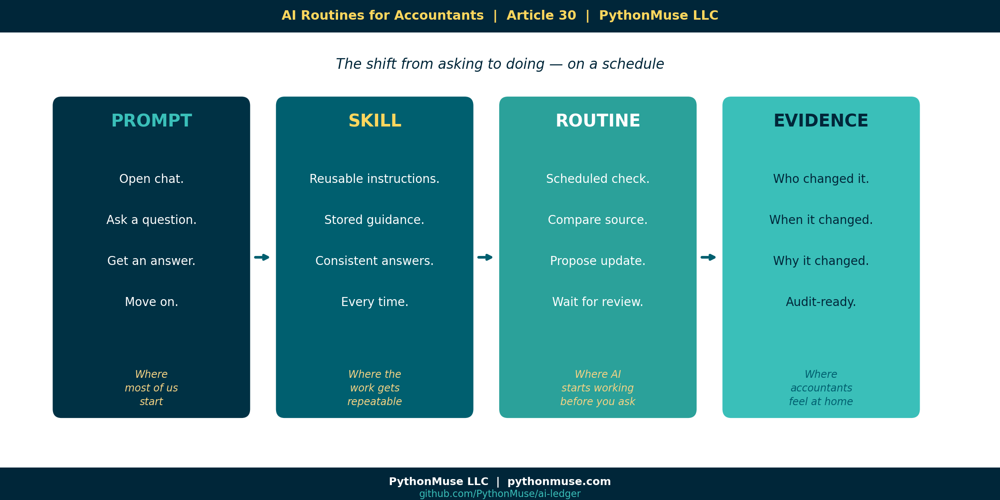
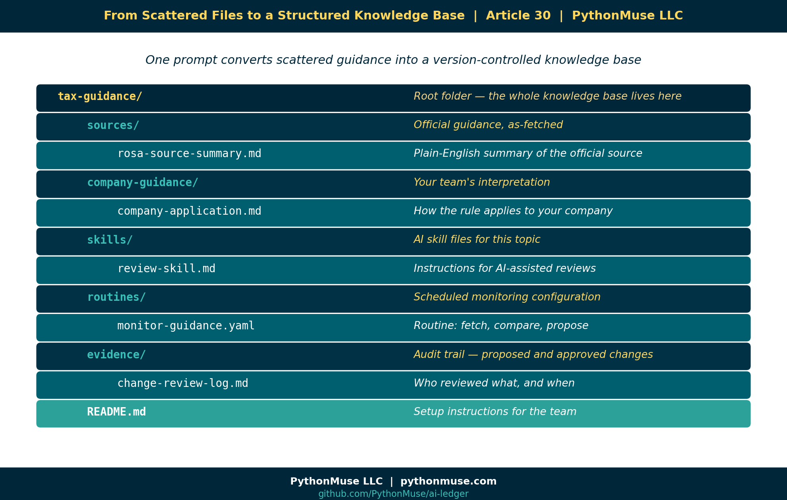
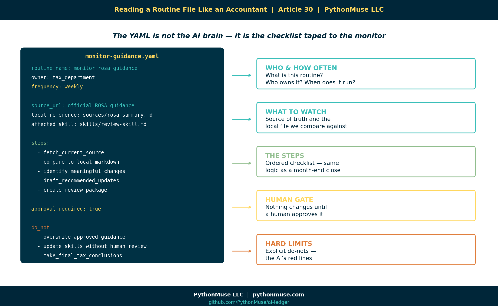
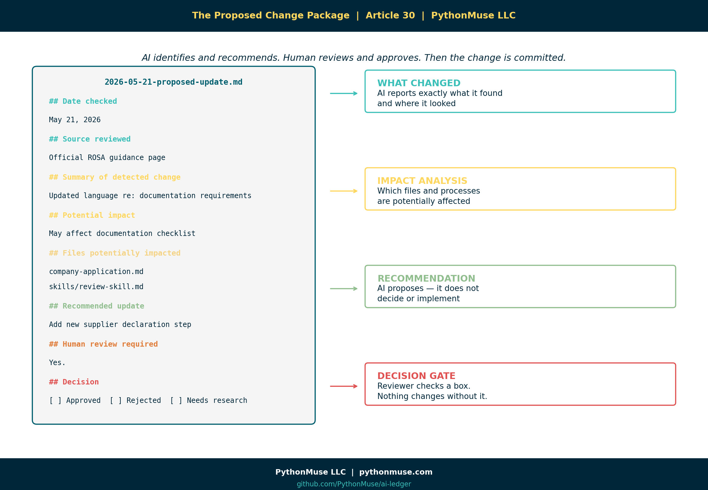
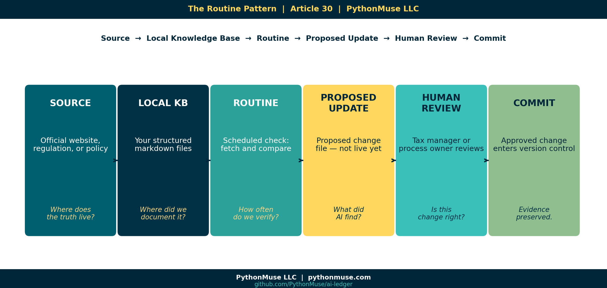
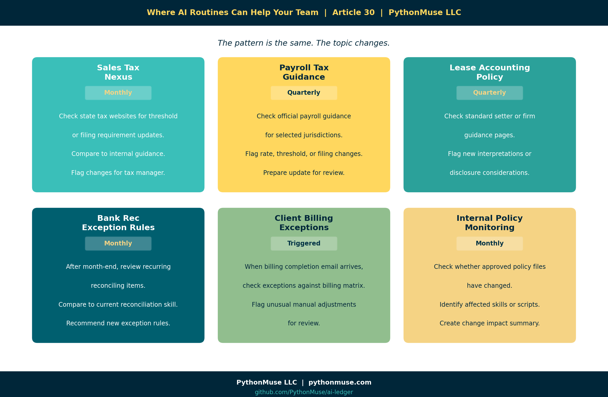
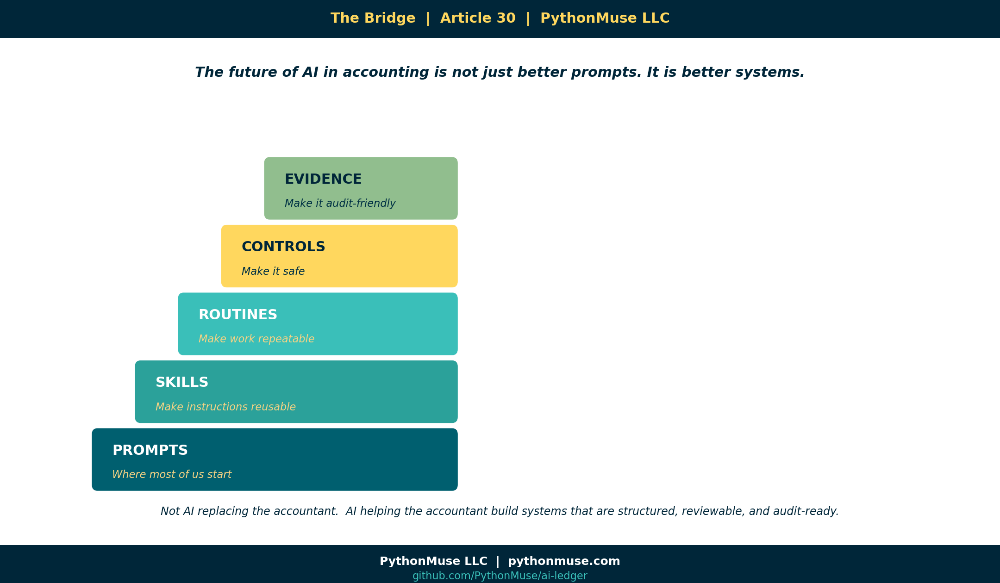

# AI Routines for Accountants: When Your Guidance Starts Checking Itself

*~10 min read*

---

**PythonMuse LLC**
*Published July 2026*



---

## Most Accountants Are Still Thinking About AI as a Prompt

When you first start using AI, it often begins as a chat window. Naturally, the first use case is simple: open chat, ask a question, get a response, review it, adjust it, and once satisfied, copy the answer into a workpaper, email, or memo.

That is useful, but somewhere around the third time you ask the same question about the same guidance document, you start to wonder: should this be running as a repeatable process instead? If you are not wondering this, you should be. In all circumstances, be sure to comply with any copyright or data-protection requirements related to the standards you use; sharing certain documents with AI may be restricted by the author or local policies.


The real shift in efficiency and futuristic work starts when AI becomes part of a scheduled routine. You should review that guidance periodically, AI can do that for you. But not a "set it once and forget it" routine. AI can review the online guidance, and provide intelligent feedback regarding any revisions. Please do not let your tax guidance wander the internet unsupervised.

A controlled, scheduled workflow where AI helps your team:

- Check an official source,
- Compare it to your internal guidance,
- Identify possible changes,
- Recommend updates,
- Wait for human review,
- And then preserve the evidence trail.

That is where AI starts to become genuinely useful for accounting and tax teams.

---

## A Tax Department Builds Local Guidance from External Regulations

Imagine a tax department that works with rules of origin guidance.

The team uses ROSA, the EU Rules of Origin Self-Assessment tool, to understand whether certain goods qualify for preferential tariff treatment under a trade agreement. ROSA provides guidance, legal text links, documentation requirements, explanations, and self-assessment support.

*Note: this is a framework example. It is not rules of origin advice, a compliance recommendation, or an endorsement of any specific treatment. If your goods are crossing borders, please involve a qualified tax professional. AI is not that.*

At first, the team does what most teams would do. They go to the official website and read the guidance. They interpret how it applies to their company, and then they create internal instructions for the business.

But instead of leaving that interpretation scattered across emails, saved PDFs, Teams messages, and someone's famous "FINAL guidance version 7" document, they ask AI to help convert the external guidance into structured markdown files. 

> **New to markdown?** [Read a quick primer here](https://github.com/PythonMuse/pythonmuse-ai-accounting-framework/tree/main/02-markdown-for-accountants) before diving into the structured files below.

The first prompt may look something like this:

```
Go to the official ROSA guidance page and summarize the applicable
guidance into markdown files.

Create:
1. source_summary.md — plain-English summary of the official guidance
2. company_application.md — how this applies to our company's import process
3. documentation_checklist.md — required documents and evidence
4. review_questions.md — questions a tax reviewer should answer

Do not invent requirements.
Separate official guidance from company interpretation.
Include source links and retrieval date.
Flag anything that requires tax professional judgment.
```

Now the team has a local knowledge base. Not just a random AI answer or a chat transcript. But a controlled folder of files that can be reviewed, versioned, improved, and reused.

---

# The Folder Structure That Makes the Routine Possible



The next step is to ask AI to create the folder structure that may look like this:

```
tax-guidance/
│
├── sources/
│   └── rosa-source-summary.md
│
├── company-guidance/
│   └── rules-of-origin-company-application.md
│
├── skills/
│   └── rules-of-origin-review-skill.md
│
├── routines/
│   └── monitor-rosa-guidance.yaml
│
├── evidence/
│   └── change-review-log.md
│
└── README.md
```

This is where the concept of scheduled routines gets powerful. Because once your guidance is structured in a manner AI can read and maintain, your job becomes design, review and monitor deliverables. 

> **Not sure how to get AI can interact with folders on your computer?** A web chat window can only listen and respond — it cannot create files or folders on your machine. For that, AI needs a local harness: a tool that gives it access to a project folder under rules you control. [Ways to Use Claude](../02-ways-to-use-claude/) walks through that shift in detail, using VS Code with GitHub Copilot as the example. The same idea works with other harnesses too — Codex, Cursor, Windsurf, Antigravity, and Claude Code are common alternatives — so use whichever your organization has approved or you prefer.

---

## From One-Time Prompt to Routine

A prompts are often something you only ask once. A routine is something that runs on a schedule or trigger indefinitely. For example:

```
Every Friday morning:
1. Visit the official ROSA guidance page.
2. Compare the current website content to our saved markdown version.
3. Identify any meaningful changes.
4. Prepare a recommended update.
5. Do not edit the official skill directly.
6. Create a proposed change file for human review.
```

That is a routine. It is not magic, although feels like one. It is a repeatable workflow. And for tax and accounting teams, that repeatability matters. Because our world is full of recurring processes:

- Month-end close
- Tax updates
- Bank reconciliations
- Invoice reviews
- Policy updates
- Management reporting
- Audit requests
- Lease schedules
- Sales tax rules
- Client billing exceptions

A routine is how AI starts paying off on the investment as it will be showing up for you before you even remember to ask it. It is like an eager intern who shows up early with coffee, an open laptop, and a checklist — ready to help, but still needing supervision.

---

## Start with Skills (i.e., What the Routine Actually Does)

Once folder structure is created, the tax department moves it's original prompt to an internal skill by prompting AI to create it and then review and accept changes. 

```
skills/rules-of-origin-review-skill.md
```

That skill explains how AI should assist the team when reviewing rules of origin questions. An example would include instructions like:

```markdown
# Rules of Origin Review Skill

Use this skill to assist with preliminary rules of origin review.

## Rules

- Always separate official guidance from company interpretation.
- Never make a final tax determination.
- Flag items requiring tax manager review.
- Use the company documentation checklist before recommending eligibility.
- If source guidance has changed, stop and request review before applying it.
```

> **New to skills?** A skill is a reusable instruction file that keeps AI's behavior consistent every time it works on a topic. [The Power of Skills and Agents](../17-skills-and-agents-for-accountants/) covers what a skill is, how to write one, and why it matters before you build the routine below.

Now that AI has instructions, the team can create a routine to monitor if any changes in the source guidance.



Here is what that routine configuration might look like — and how to read it as a tax or an accountant professional. 

Note: This is a conceptual structure, not literal syntax.

```yaml
routine_name: monitor_rosa_guidance
owner: tax_department
frequency: weekly
source_url: "official ROSA guidance page"
local_reference: "sources/rosa-source-summary.md"
affected_skill: "skills/rules-of-origin-review-skill.md"
output_folder: "evidence/rosa-change-reviews"

steps:
  - fetch_current_source
  - compare_to_local_markdown
  - identify_meaningful_changes
  - assess_impact_on_company_guidance
  - draft_recommended_updates
  - create_review_package

approval_required: true

do_not:
  - overwrite_approved_guidance
  - update_skills_without_human_review
  - make_final_tax_conclusions
```

*A real GitHub Actions scheduled workflow, for example, uses a different schema (`on.schedule.cron`, `jobs`, `steps`). Claude Code's own "Routines" feature is configured through a UI or `/schedule`, not a hand-written YAML file. See "A Note on Tools and Frameworks" below.*

The YAML file is not the "AI brain." It is more like the checklist taped to the monitor. It tells the workflow what to do, when to do it, what files matter, and where the human approval point belongs.

---

## The Output: A Proposed Change, Not an Automatic Change

This is the part accountants should care about. The routine should not quietly update your tax guidance in the background. That would be terrifying. Instead, the routine creates a review package.



It could look something like this:

```
evidence/rosa-change-reviews/
└── 2026-05-21-proposed-update.md
```

Inside that file:

```markdown
# Proposed ROSA Guidance Update

## Date checked
May 21, 2026

## Source reviewed
Official ROSA guidance page

## Summary of detected change
The source guidance appears to include updated language regarding
documentation requirements.

## Potential impact
This may affect the company's documentation checklist for
preferential tariff treatment.

## Files potentially impacted
- company-guidance/rules-of-origin-company-application.md
- skills/rules-of-origin-review-skill.md
- documentation_checklist.md

## Recommended update
Add a new review step requiring confirmation of updated supplier
declaration documentation.

## Human review required
Yes.

## Reviewer notes
[Tax manager to complete.]

## Decision
[ ] Approved
[ ] Rejected
[ ] Needs more research
```

Now we have a controlled process where AI identifies, AI recommends, human reviews and approves. And only then the change can be committed.

In a Git-based workflow, the tax manager or reviewer could approve the proposed update in the checklist, commit that change to source control, and push it to the repository. That gives the team a history: who changed it, when it changed, why it changed, what source triggered the change, and what internal guidance was updated.

> **New to Git?** Git is the version-control system that keeps this history — every change, who made it, and when — without a "FINAL_v7" file in sight. [Git for Accountants](https://github.com/PythonMuse/pythonmuse-ai-accounting-framework/tree/main/11-git-for-accountants) explains the concept in accounting terms before you rely on it here.

That is the accounting-friendly version of AI automation as opposed to just "trust me." Show me the evidence is a better way. 

---

## Why This Matters for Accounting and Tax Teams

Accounting and tax teams already live in routines. We just usually call them something else:

  - Checklists
  - Month-end procedures
  - Recurring tasks
  - Review controls
  - SOPs
  - Reconciliation steps
  - Audit evidence.

AI routines are not foreign to accounting. They are just a new way to structure recurring work.

The difference is that instead of relying on someone to remember, "Hey, did anyone check if that guidance changed?" — the routine performs the first pass.

It says:

> I checked the source. I found a potential change. Here is the impact. Here is the recommended update. Please review before anything changes.

That is useful, controlled, and is much better than discovering six months later that your internal policy was based on outdated guidance and the person who knew about it has since moved to a different department, a different company, or a cruise with no Wi-Fi.

---

## Where the Human Still Belongs

What is important to remember that the routine does not replace the tax department. The routine does not issue tax advice. The routine does not decide how regulations apply to your company.

The routine supports the humans who are responsible for that judgment. The human still decides:

- Is this change meaningful?
- Does this apply to our company?
- Do we need outside advisor input?
- Should the internal skill be updated?
- Should the business process change?
- Do we need to document a control?
- Do we need to notify operations, procurement, or finance?

AI can help monitor the moving pieces. But judgment stays with the professionals. That is not a weakness. It is the design. As noted earlier, your role becomes designer, reviewer, and approver.

---

## A Simple Routine Pattern for Accountants

Here is the pattern:



```
Source → Local Knowledge Base → Routine → Proposed Update → Human Review → Commit
```

Or in plain English:

- Where does the truth live externally?
- Where did we document our current interpretation?
- How often should we check for change?
- What should AI do if it finds something?
- Who reviews it?
- How do we preserve the evidence?

That pattern can be used far beyond tax.

---

## Six Places AI Routines Could Help Your Team



**1. Sales Tax Nexus Monitoring**

Monthly, check selected state tax websites for threshold or filing requirement updates. Compare to internal sales tax guidance. Flag changes for the tax manager.

**2. Payroll Tax Guidance**

Quarterly, check official payroll guidance for selected jurisdictions. Compare to internal payroll setup documentation. Flag possible rate, threshold, or filing changes.

**3. Lease Accounting Policy Updates**

Quarterly, check selected accounting standard setter or firm guidance pages. Compare to internal lease accounting policy. Flag new interpretations or disclosure considerations.

**4. Bank Reconciliation Exception Rules**

After each month-end, review recurring reconciling items. Compare against current reconciliation skill. Recommend whether new exception rules should be added.

**5. Client Billing Exceptions**

When operations sends the monthly billing completion email, trigger a billing review workflow. Compare current billing exceptions to the approved client billing matrix. Flag unusual manual adjustments.

**6. Internal Policy Monitoring**

Monthly, check whether any approved policy files changed. Identify related skills, scripts, or workflows that may need updates. Create a change impact summary for the process owner.

---

## The Big Idea

The future of AI in tax and accounting is not just better prompts. It is better systems.



```
Prompts are where many of us start.
Skills make the instructions reusable.
Routines make the work repeatable.
Controls make it safe.
Evidence makes it audit-friendly.
```

That is the bridge. My hope is that we move beyond the fear of AI replacing professionals and move toward a mindset of AI helping us build workflows that are structured, monitored, reviewable, and ready for the real world.

Because in accounting, the goal is not just to get an answer. The goal is to know where the answer came from, whether it is still current, who reviewed it, and what changed.

---

## A Note on Tools and Frameworks

The examples in this article use AI inside a project folder, but the framework is not tied to one specific tool.

You could build this type of routine with different approved tools, depending on what your organization allows. Some teams may use GitHub Copilot in VS Code. Others may use Claude Code, ChatGPT with actions, Microsoft Copilot with Power Automate, Gemini with workflow integrations, or another internal platform.

The tool will change the setup. The governance pattern should not. No matter which platform you use, the important questions stay the same:

* What source is being monitored?
* What internal guidance or skill could be affected?
* What is AI allowed to do?
* What is AI not allowed to do?
* Where does the proposed change go?
* Who reviews it before anything is accepted?
* How is the evidence preserved?

That distinction matters because a scheduled workflow can check for changes, a skill can guide how AI reviews the change, and a repository can preserve the history. But the approval gate still has to be designed by the team. In other words, 
**The tooling is a harness. The governance is yours.**

 This series teaches the framework, not the software. When the software changes — and it will — the thinking should still hold.

---

## Try It: The Tax Guidance Template

The [ai-ledger repo](https://github.com/PythonMuse/ai-ledger) includes a ready-to-use `tax-guidance-template/` in the `templates/` folder.

It contains blank versions of every file referenced in this article:

- `sources/source-summary.md`
- `company-guidance/company-application.md`
- `skills/review-skill.md`
- `routines/monitor-guidance.yaml`
- `evidence/change-review-log.md`
- `README.md` with setup instructions

Clone the repo. Copy the template to your own project folder. Fill in the blanks with your actual guidance topic.

That is the exercise.

---

## Related Articles

- [The Power of Skills and Agents](../17-skills-and-agents-for-accountants/README.md) — Skills are the building block; routines monitor and maintain them
- [From One-Time Analysis to Repeatable Workflows](../11-one-time-to-repeatable-workflows/README.md) — The foundation for everything a routine is built on
- [AI That Runs Before You Log In](../18-ai-runs-before-you-log-in/README.md) — The simpler starting point: a single scheduled script, before you add skills, YAML routines, and an approval gate
- [The Magic Loop: Why Easy to Generate Doesn't Mean Safe to Run](../29-loops-the-automation-that-feels-magical/README.md) — YAML structure, loop governance, and the review-before-run mindset
- [Reproducible Accounting](../05-reproducible-accounting/README.md) — Git commit history as the evidence trail behind every approved change
- [When to Trust AI to Run Your Accounting Workflows](../12-audit-ready-ai-workflows/README.md) — Controls, approval gates, and what audit-ready automation actually looks like
- [Metadata Is the Label Maker Your AI Workflow Needs](../31-metadata-is-the-label-maker/README.md) — Label your files before your routines run on them; this article shows you how
- [From AI Answers to Audit Trails](../32-from-ai-answers-to-audit-trails/README.md) — When the routine produces output, this article covers how to validate it is actually supported

---

*#AIRoutines #WorkflowGovernance #AccountingAutomation*

---

**A note on how this article was made.** This article started with me. The experience, the problem, and the pattern are mine — I shared what a real AI-assisted workflow looks like when it is designed for accounting and finance professionals. GitHub Copilot (Claude Sonnet 4.6) then built the final article, the companion template, and all visual assets — working from my direction and feedback at each step. I reviewed every output, pushed back on things I did not like, and made all final content decisions. That process — bringing your own experience, using AI to build and iterate, and staying in the editorial seat throughout — is exactly what this series is about.

---

**PythonMuse LLC**
*Practical AI for accounting and finance professionals.*
