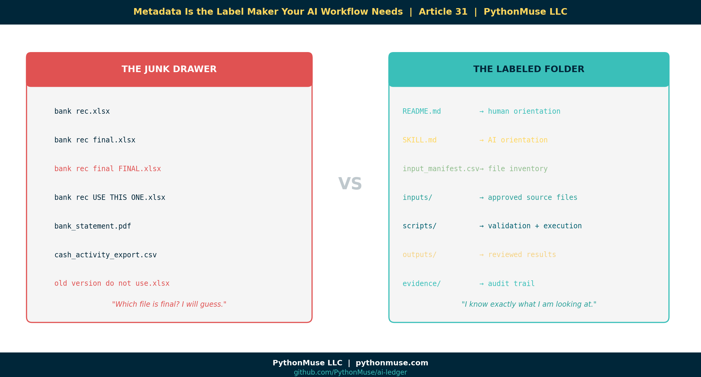

# Metadata Is the Label Maker Your AI Workflow Needs

*~12 min read*

---

**PythonMuse LLC**
*Published May 2026*



---

There is a moment in every accounting workflow where the folder starts to look less like a controlled process and more like a digital junk drawer.

You know the one.

```text
month-end-close/
└── 2026-04/
    └── cash/
        ├── bank rec.xlsx
        ├── bank rec final.xlsx
        ├── bank rec final FINAL.xlsx
        ├── bank rec USE THIS ONE.xlsx
        ├── bank_statement.pdf
        ├── cash_activity_export.csv
        └── old version do not use.xlsx
```

Then someone asks AI:

> "Can you help me explain the reconciling items?"

And the AI co-pilot says:

> "Absolutely. I found seven files that all appear relevant. I will now confidently guess."

That is how accountants develop trust issues.

The problem is not that AI cannot help. The problem is that we are often handing AI the same messy folder reality we hand new team members — except the new team member at least knows to ask Jessica which version is actually final.

AI does not know that.

Unless we tell it.

That is where metadata comes in.

---

## Metadata sounds technical. It is not.

When accountants hear the word "metadata," it can sound like something owned by IT, living inside an enterprise data catalog, guarded by a steering committee, and last updated in 2014.

But metadata is much simpler than that.

Metadata is information **about** a file, report, workpaper, or workflow.

Accountants already use metadata all the time. We just may not call it that.

Examples:

```text
Prepared by
Reviewed by
Period
Entity
Account
Source system
Status
Version
Department
Data classification
```

That is metadata.

It is the cover page on a workpaper.
It is the control log.
It is the review status.
It is the note that says, "Use this file, not that one."

In an AI-assisted workflow, metadata becomes even more important because AI needs context before it can help safely.

A folder tells AI where something lives.

Metadata tells AI what it is looking at.

---

## The PythonMuse version

In the PythonMuse framework, we are not trying to turn accountants into enterprise data architects overnight.

We are trying to make the workflow readable to three audiences:

1. The human accountant
2. The AI co-pilot
3. The Python script or hook that enforces the rules

That distinction matters.

A good AI-enabled workflow folder might look like this:

```text
cash_reconciliation_skill_metadata_demo/
├── README.md
├── SKILL.md
├── input_manifest.csv
├── inputs/
│   ├── gl_cash_activity_april.csv
│   └── bank_activity_april.csv
├── working/
│   └── draft_bank_recon.xlsx
├── scripts/
│   ├── 01_scan_folder.py
│   ├── 02_validate_manifest.py
│   └── 03_run_cash_recon.py
├── outputs/
└── evidence/
```

Each piece has a job:

```text
README.md        = Explain the workflow to humans
SKILL.md         = Explain the workflow to AI
input_manifest   = List the files and their status
scripts          = Do the work and validate the rules
hooks            = Stop unsafe work before it happens
evidence         = Prove what happened
```

Or even shorter:

```text
Metadata = label
Skill    = instruction
Script   = action
Hook     = control
Evidence = audit trail
```

That is the practical governance model.

---

## Metadata can live inside `SKILL.md`

One important clarification: metadata does not always need to live in a separate `.yaml` file.

It can. That is perfectly fine.

But if the metadata is mainly there to help the AI co-pilot understand the workflow, it may make more sense to put it directly inside `SKILL.md`.

For example:

````markdown
---
name: cash_reconciliation_skill
description: Analyze cash reconciliation files using approved inputs only.
process_area: Cash
owner: Accounting
data_classification: Confidential
ai_allowed: true
cloud_ai_allowed: false
review_required: true
---

# Cash Reconciliation Skill

Use this skill when helping with monthly cash reconciliation.

## Workflow Rules

```yaml
approved_folders:
  - inputs
  - outputs
  - evidence

blocked_folders:
  - working
  - archive
  - raw_sensitive

allowed_statuses:
  - final
  - approved

blocked_statuses:
  - draft
  - superseded
  - do_not_use
```

## Instructions for the AI Co-Pilot

* Do not use files marked draft, superseded, or do_not_use.
* Do not use files from blocked folders.
* Ask for clarification if file status is unclear.
* Cite the source file name in any summary.
* Do not modify original input files.
````

That little block at the top is metadata.

The YAML block under "Workflow Rules" is also metadata.

The difference is that this metadata lives where the AI co-pilot is already being instructed.

That is easier for the human accountant too. Instead of saying, "Please open this separate mysterious YAML file," we are saying:

> "Here is the skill. The labels and rules are right inside it."

That is much more practical.

> **A note on tools:**
> This article uses Claude inside VS Code via GitHub Copilot. The SKILL.md and manifest approach shown here is a framework — it works the same way whether you are using Claude, ChatGPT, GitHub Copilot standalone, Gemini, or any other AI co-pilot. The metadata and rules travel with the workflow, not with the tool. Pick the one your IT team has approved and apply the same structure.

---

## README.md can hold metadata too

If `SKILL.md` is for the AI co-pilot, `README.md` is for the human.

A simple `README.md` could include:

```markdown
# April 2026 Cash Reconciliation Workflow

## Purpose

This folder supports the April 2026 cash reconciliation.

## Owner

Accounting

## Period

2026-04

## Data classification

Confidential

## Approved files

See `input_manifest.csv`.

## Review requirement

Controller review is required before final output is distributed.
```

Again, this is metadata.

It is not fancy. It is not scary. It is a structured cover page.

And accountants already understand cover pages.

---

## The file manifest: metadata accountants already know how to review

For file-level metadata, a simple CSV is often the easiest starting point.

Example `input_manifest.csv`:

```csv
file_name,folder,period,status,approved_for_ai,data_classification,purpose
gl_cash_activity_april.csv,inputs,2026-04,final,yes,Confidential,GL cash activity
bank_activity_april.csv,inputs,2026-04,final,yes,Confidential,Bank activity
draft_bank_recon.xlsx,working,2026-04,draft,no,Confidential,Draft reconciliation workpaper
approved_recon_summary.xlsx,outputs,2026-04,approved,yes,Confidential,Approved reconciliation summary
controller_review.md,evidence,2026-04,approved,yes,Internal,Review evidence
```

This is very accountant-friendly.

It looks like a control log because it basically is a control log.

The accountant reviews the files, marks what is final, marks what is approved for AI, and identifies anything that should not be used.

Python can read this.

AI can reference this.

A reviewer can audit this.

That is the whole point.

---

## Important: metadata does not enforce itself

This is the most important part.

Writing rules in a Markdown file does not guarantee AI will follow them.

AI reading a rule is not the same as a control operating effectively.

So we need to be very clear:

```text
Metadata informs.
Scripts validate.
Hooks enforce.
Evidence proves.
```

If the rule really matters, it should not live only as an instruction to the AI co-pilot.

It should be baked into the script, the hook, the validation step, or the approval workflow.

For example, this is guidance:

```markdown
Do not use draft files.
```

This is enforcement:

```python
import pandas as pd

manifest = pd.read_csv("input_manifest.csv")

blocked_statuses = ["draft", "superseded", "do_not_use"]

blocked_files = manifest[manifest["status"].isin(blocked_statuses)]

if not blocked_files.empty:
    raise ValueError(
        "Workflow stopped. One or more files are marked draft, superseded, or do_not_use."
    )
```

That is a very different level of control.

The Markdown tells the AI what should happen.

The Python script stops the workflow when something unsafe is detected.

That is the difference between a note and a control.

Accountants know this distinction intuitively. A policy memo that says "do not approve invoices over $10,000 without dual sign-off" is guidance. The accounting system that blocks the payment until a second approval is posted is a control. Both matter. Only one actually stops the error.

---

## Simple demo: creating metadata is easy

Metadata does not need to start with a complicated system.

It can start with Python scanning a folder and creating a starter file inventory.

Example:

```python
from pathlib import Path
import pandas as pd

folder = Path("cash_reconciliation_skill_metadata_demo")

records = []

for file in folder.rglob("*"):
    if file.is_file():
        records.append({
            "file_name": file.name,
            "folder": file.parent.name,
            "file_type": file.suffix,
            "file_path": str(file),
            "status": "needs_review",
            "approved_for_ai": "needs_review",
            "data_classification": "needs_review"
        })

metadata = pd.DataFrame(records)
metadata.to_csv("input_manifest.csv", index=False)

print("Metadata starter file created: input_manifest.csv")
```

This script does the boring inventory work.

It scans the folder and creates a starter manifest.

Then the accountant applies judgment.

That is the right division of labor:

```text
Python does the boring inventory.
The accountant applies judgment.
AI follows the instructions.
Hooks enforce the controls.
Evidence proves what happened.
```

That is not replacing accounting judgment.

That is making accounting judgment visible to the workflow.

---

## The accountant review step

After Python creates the starter manifest, it might look like this:

```csv
file_name,folder,file_type,status,approved_for_ai,data_classification
gl_cash_activity_april.csv,inputs,.csv,needs_review,needs_review,needs_review
bank_activity_april.csv,inputs,.csv,needs_review,needs_review,needs_review
draft_bank_recon.xlsx,working,.xlsx,needs_review,needs_review,needs_review
approved_recon_summary.xlsx,outputs,.xlsx,needs_review,needs_review,needs_review
controller_review.md,evidence,.md,needs_review,needs_review,needs_review
```

Then the accountant reviews it:

```csv
file_name,folder,file_type,status,approved_for_ai,data_classification
gl_cash_activity_april.csv,inputs,.csv,final,yes,Confidential
bank_activity_april.csv,inputs,.csv,final,yes,Confidential
draft_bank_recon.xlsx,working,.xlsx,draft,no,Confidential
approved_recon_summary.xlsx,outputs,.xlsx,approved,yes,Confidential
controller_review.md,evidence,.md,approved,yes,Internal
```

Now the workflow has labels.

The AI co-pilot is not guessing from filenames.

The script can validate the rules.

The reviewer can see the logic.

---

## The validation step

Before running the reconciliation analysis, Python can check the manifest.

Example:

```python
import pandas as pd

manifest = pd.read_csv("input_manifest.csv")

allowed_statuses = ["final", "approved"]

approved_files = manifest[
    (manifest["approved_for_ai"] == "yes") &
    (manifest["status"].isin(allowed_statuses))
]

blocked_files = manifest[
    (manifest["approved_for_ai"] != "yes") |
    (~manifest["status"].isin(allowed_statuses))
]

print("Approved files:")
print(approved_files[["file_name", "status", "approved_for_ai"]])

print("\nBlocked files:")
print(blocked_files[["file_name", "status", "approved_for_ai"]])
```

Expected result:

```text
Approved files:
file_name                         status      approved_for_ai
gl_cash_activity_april.csv         final       yes
bank_activity_april.csv            final       yes
approved_recon_summary.xlsx        approved    yes
controller_review.md               approved    yes

Blocked files:
file_name                         status      approved_for_ai
draft_bank_recon.xlsx              draft       no
```

This is the moment the concept becomes real.

The workflow did not rely on AI being obedient.

The workflow had a rule, and the script applied it.

---

## Where hooks come in

A hook is a control point.

In an AI-assisted workflow, a hook can stop an action before it happens.

For example:

```text
Before running the reconciliation script:
- Read input_manifest.csv
- Check file statuses
- Block draft or superseded files
- Block files not approved for AI
- Save validation result to evidence folder
```

This is where governance becomes practical.

Not a 40-page policy nobody reads.

A check that runs before the workflow proceeds.

That is why the location of metadata matters less than whether the control can read it.

If the rule is only for human or AI context, it can live in `README.md` or `SKILL.md`.

If the rule needs to be enforced, it must be available to the script or hook.

That might mean the metadata lives in:

```text
SKILL.md
README.md
input_manifest.csv
workflow_metadata.yaml
Python configuration
hook logic
```

There is no single perfect answer.

The better question is:

> Who needs to read this metadata, and what decision depends on it?

---

## Should metadata live in a separate YAML file?

Sometimes yes.

Sometimes no.

A separate `.yaml` file can be useful when:

```text
Python needs to parse it regularly
Multiple scripts need to reference it
The rules are reused across workflows
The metadata is too long for SKILL.md
You want configuration separated from instructions
```

But if the metadata is mainly there to explain the skill to the AI co-pilot, putting it in `SKILL.md` may be cleaner.

If the metadata is mainly there to explain the folder to a human, put it in `README.md`.

If the metadata is file-level status information, put it in a manifest.

If the metadata is a hard control, make sure the script or hook can read it.

This is the practical rule:

```text
Put metadata where the work happens.
Put controls where the risk happens.
```

---

## What this is not

This article is not about building a full RAG system.

We are not talking about vector databases, embeddings, or enterprise search architecture here.

Those tools may matter later.

But this workflow is much simpler:

```text
Folder structure
+ SKILL.md
+ README.md
+ manifest
+ Python validation
+ hooks
+ evidence
```

That is enough to demonstrate governed AI-assisted workflow design in a way accounting and finance professionals can understand.

Start there.

Do not make the intern operate the entire ERP on day one.

---

## Why this matters

AI can move fast.

Accounting cannot afford uncontrolled fast.

If AI is helping with bank reconciliations, revenue analysis, close checklists, variance explanations, or financial reporting support, it needs boundaries.

But those boundaries do not have to start with a huge system implementation.

They can start with labels.

```text
This file is final.
This file is draft.
This file is confidential.
This file is approved for AI.
This file should never leave the local environment.
This output requires review.
```

That is metadata.

And once metadata exists, it can support instruction, validation, enforcement, and evidence.

---

## The PythonMuse takeaway

The goal is not to create more files for the sake of creating more files.

The goal is to make the rules visible where the work happens and enforceable where the risk happens.

So the model becomes:

```text
README.md = human orientation
SKILL.md  = AI orientation
Manifest  = file inventory
Script    = validation and execution
Hook      = control point
Evidence  = audit trail
```

Or the short version:

```text
Metadata informs.
Scripts validate.
Hooks enforce.
Evidence proves.
```

That is how we move from "AI helped me with a folder" to "AI operated inside a governed workflow."

And that is the difference between experimenting with AI and building accounting workflows that can actually be trusted.

Metadata is boring right up until your AI grabs the wrong file.

So label the work.
Then automate carefully.
Then keep the evidence.

That is the accountant-friendly path forward.

> **Framework reminder:**
> The PythonMuse framework is AI-tool agnostic. The SKILL.md, manifest, and script patterns shown here apply whether you are using Claude via GitHub Copilot in VS Code, ChatGPT, Microsoft 365 Copilot, Gemini, or any other AI co-pilot your organization has approved. The governance layer belongs to your workflow — not to any single tool.

---

## Try It Yourself

The [PythonMuse Workflow Kit](https://github.com/PythonMuse/pythonmuse-workflow-kit) includes a live `cash-reconciliation` skill in the `skills/` folder.

It contains:
- A `SKILL.md` with the metadata frontmatter and workflow rules from this article
- A sample `input_manifest.csv` in the `needs_review` state
- `01_scan_folder.py` — the folder scanner that generates the starter manifest
- `02_validate_manifest.py` — the validation script that enforces approved file rules

Clone the repo, open it in VS Code, and run the scripts in order. The manifest goes from "needs_review" to something an AI co-pilot can actually work with safely.

That is the exercise.

---

## Related Articles

- [The Power of Skills and Agents](../17-skills-and-agents-for-accountants/README.md) — SKILL.md is the instruction layer that this article puts into practice with metadata and rules
- [Your First CLAUDE.md](../17b-your-first-claude-md/README.md) — AI orientation at the project level; Article 31 brings the same thinking down to the workflow folder
- [What the Heck Is a Script?](../25-what-the-heck-is-a-script/README.md) — Understand what a script is before wiring one to your manifest validation
- [When Your AI Enters Month-End Close Mode](../26-when-your-ai-enters-month-end-close-mode/README.md) — SKILL files and context boundaries: Article 31 is the metadata layer that makes context reliable
- [The Magic Loop](../29-loops-the-automation-that-feels-magical/README.md) — Hooks enforcing manifest rules is exactly the governance model loops need
- [AI Routines for Accountants](../30-ai-routines-for-accountants/README.md) — When your guidance starts checking itself: routines built on governed metadata are routines you can trust
- [Reproducible Accounting](../05-reproducible-accounting/README.md) — The audit trail principle behind keeping evidence of every governed workflow run
- [Zero Trust for AI](../13-zero-trust-ai-accounting/README.md) — Why "the AI read the rule" is not the same as a control operating effectively
- [From AI Answers to Audit Trails](../32-from-ai-answers-to-audit-trails/README.md) — The validation layer: once metadata governs what AI can use, this article covers how to prove the output is supported

---

*#MetadataMatters #AIGovernance #AccountingWorkflows*

---

**PythonMuse LLC**
*Practical AI for accounting and finance professionals.*
