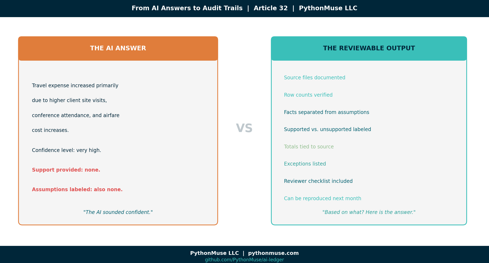
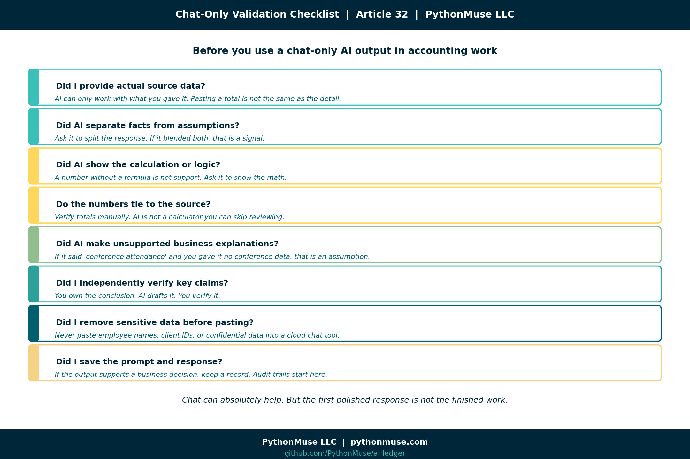
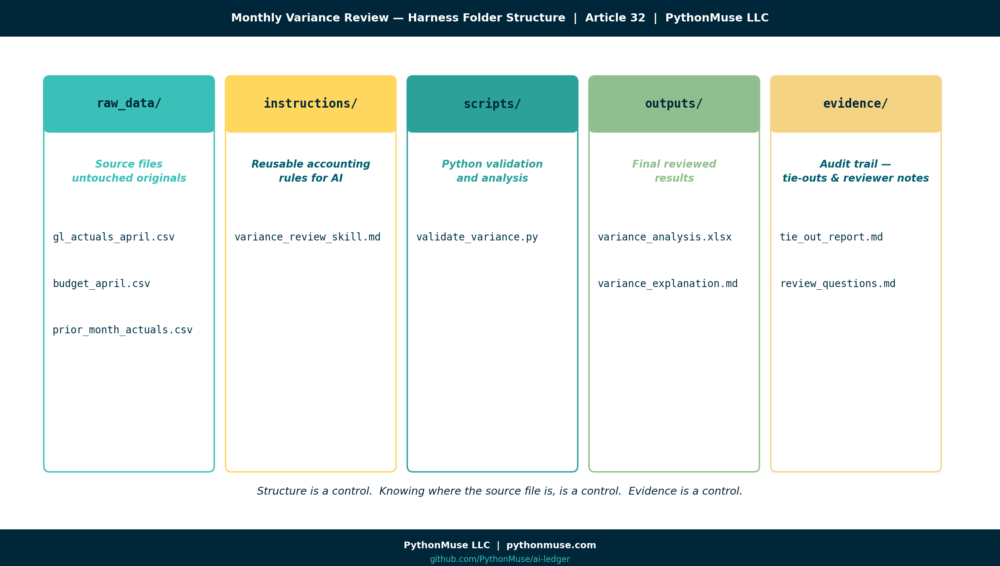
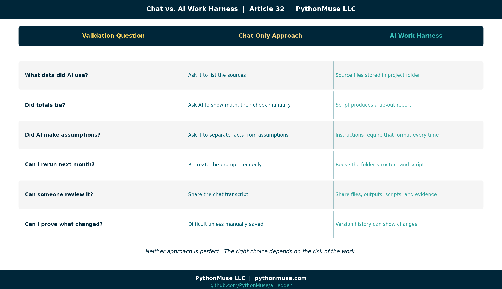
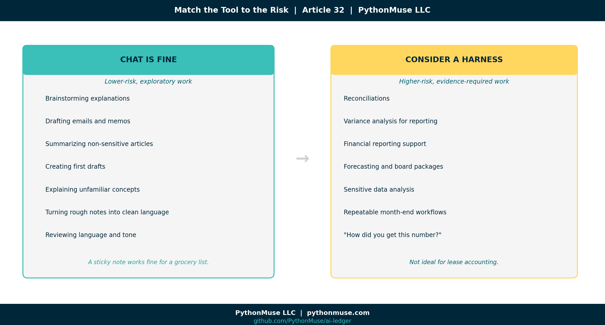

# From AI Answers to Audit Trails: How Accountants Can Validate AI Output

*A practical guide for accounting and finance professionals who want AI-assisted work that can survive a review*

---

**PythonMuse LLC**
*Published May 2026*



---

I recently had one of those deep conversations at a local university that stays with you after you leave the room. The topic was AI and the future of the accounting profession. The speakers and attendees agreed on the big picture: AI is powerful, useful, and absolutely profession-changing. That part was not really the debate. The bigger question was quieter — but much more important:

**How do we validate what AI produces?**

That question matters because accountants are not just playing with a new productivity tool. We are using AI around financial data, variance explanations, reconciliations, reporting support, policies, forecasts, and decisions. AI can generate a beautiful answer in seconds.

And if you give it the right context, it will go further than you asked. You request a month-over-month variance and it offers a year-over-year comparison. You ask for an explanation and it surfaces a seasonality pattern you had not considered. It will propose angles, comparisons, and possibilities that were not in your original prompt.

That is usually the first **"aha" moment** — the realization that AI is not just answering your question, it is expanding the question. For many accountants, that moment is exhilarating and a little unsettling at the same time. It is the moment you start trusting the tool.

It is also the moment validation stops being optional. Because every one of those extra insights still has to be supported.

But accounting has never been built on beautiful answers alone. We need support. We need tie-outs. We need review. We need to know whether the answer is based on evidence — or whether AI simply said something that sounded reasonable in a very confident tone. 

I struggled with this myself when I first started using AI seriously in accounting workflows. At first, validation felt mysterious. The AI answer looked polished. The logic sounded convincing. The output often felt impressive. But the auditor (because once an auditor, always an auditor!) and controller side of my brain kept asking the same annoying — but necessary — question:

**Based on what?**

Over time, I realized the issue was not just whether AI was "right" or "wrong." The issue was whether the AI-assisted work was **reviewable**.

So this article is my attempt to share the practical validation framework that started working for me as an accountant: how to think about validating AI output in a simple chat workflow versus a more structured AI work harness — whether that is VS Code, Cursor, Windsurf, Claude Code, or whatever tool comes next.

Did it use the right source file?
Did the numbers tie?
Did it apply the right logic?
Did it make assumptions that sound reasonable but are completely unsupported?
Can someone else reproduce the work next month?

Because in accounting, a polished answer is not the finish line. It is the beginning of review.

---

## The validation problem

Let's use a simple example. You are preparing a monthly variance explanation for travel expense. Actual travel expense increased from $52,000 in March to $84,500 in April. Budget for April was $60,000.

You ask AI:

> Why is travel higher than prior month and budget?

That question is exploratory by nature. AI may respond with something like:

> Travel expense increased primarily due to higher client site visits, conference attendance, and airfare cost increases.

It sounds good. It sounds like something that could slide beautifully into a reporting package. It also might be completely unsupported.

That is the AI validation problem.

The issue is not simply whether you asked the question in a chat window or inside a harness. In both places, "why did this increase?" is still an exploratory accounting question. The real difference is this: In chat, you may not have a clean record of exactly what information the AI considered — unless you manually provided, documented, and preserved it. In a harness, you can define the information boundary. You can point AI to specific files, folders, instructions, and outputs. You can preserve what it reviewed, what it calculated, what it excluded, and what evidence it produced. So the harness does not magically prove why travel increased.

It does something more practical:

**It makes the investigation reviewable — and consistently repeatable.**

Did AI see transaction descriptions that mentioned a conference?
Did it see project codes tied to client travel?
Did it compare airfare vendors?
Or did it simply infer a reasonable-sounding explanation because travel went up?

AI is very good at producing language that sounds finished. This is not a quirk of one model. Every AI you will ever encounter — regardless of vendor, version, or how it is packaged — arrives similarly trained. These systems are built to produce well-structured, confident-sounding responses. The training reward is not accuracy; it is response quality. A model that does not actually know why travel increased will still produce a polished paragraph. Future models will be no different. They will all come trained to give beautiful answers.

Accountants are trained to ask the less glamorous question:

**Based on what?**

---

## What validation means in accounting

Validation is not just asking AI, "Are you sure?"

That is not a control.

It's the same as asking the intern who made the mistake whether they are confident about their work. In accounting, validation means we can support the output. At a minimum, we should be able to answer:

- What source data was used?
- Were all relevant files, tabs, rows, and columns included?
- Do totals tie back to the source?
- What assumptions were made?
- What exceptions were identified?
- Can another person review the work?
- Can I repeat it right now and get the same answer?
- Can the workflow be repeated next month?

A correct answer is great. A reviewable answer is better.

---

## Validating AI output in chat

Many accounting and finance professionals first meet AI in a chat window. ChatGPT, Claude, Gemini, Copilot, or a similar tool.

That is a perfectly reasonable starting point. Chat is excellent for:

- Brainstorming explanations
- Drafting variance commentary
- Summarizing policies
- Turning rough notes into SOPs
- Creating checklists
- Reviewing language
- Explaining unfamiliar concepts

The risk is when we confuse a good draft with validated work. If you are working only in chat, validation is still possible — but the burden sits heavily on the human reviewer. You should force the AI to slow down and show its work. Here are practical prompts that help.

### Prompt 1: Separate facts from assumptions

```text
Before finalizing the variance explanation, separate your response into:
1. Facts directly supported by the data I provided
2. Assumptions you are making
3. Items I need to verify before using this in a reporting package
```

This matters because AI will often blend facts and assumptions into one confident paragraph. Accounting does not like mystery seasoning. If the statement is supported, show the support. If it is an assumption, label it as an assumption.

### Prompt 2: Create a support table

```text
Create a validation table with these columns:
- Statement made
- Source data supporting it
- Fully supported, partially supported, or unsupported
- What I should verify manually
```

This is especially useful for variance explanations. If AI says travel increased due to conferences, the support table should show whether the provided data actually mentioned conferences. If it did not, that explanation should not make it into the final report as a supported conclusion.

### Prompt 3: Remove unsupported confidence

```text
Rewrite the explanation without overstating the cause.
Only use causes that are supported by the data provided.
Flag anything that needs additional support.
```

Simple but powerful. It turns AI from "corporate storytelling mode" into something closer to "controller review mode."

### Prompt 4: Ask AI to act as the reviewer

```text
Act as a controller reviewing this variance explanation.
What questions would you ask before approving it?
```

This helps surface gaps. For example, AI might ask:

- Were any April travel costs reimbursable by clients?
- Were expenses coded to the correct department?
- Were there one-time events in April?
- Were prior-month accruals reversed?
- Were any expenses misclassified?

Now we are closer to real accounting review. Not just pretty words.

### Prompt 5: Save your review prompts as a reusable skill

Even in a chat-only workflow, you do not have to retype these prompts every month. Save them in a plain text or markdown file and paste it into the chat at the start of each session. In a harness, the same content lives in a dedicated skill folder (more on that below), but for chat a single saved file is enough.

That file is the simplest possible version of a **skill**: reusable accounting instructions written once and used many times. We covered the full concept in [The Power of Skills and Agents: How Accountants Actually Use AI](../17-skills-and-agents-for-accountants/README.md). The harness version of skills is more powerful, but the chat version is still a meaningful upgrade over starting from a blank prompt every month.

### Prompt 6: Ask what data is missing

```text
What additional data would improve the accuracy of this variance explanation?
```

For the travel example, better support might include GL transaction detail, vendor names, employee expense descriptions, project codes, department coding, accrual entries, and prior-period detail.

The AI answer improves when the evidence improves. Shocking, I know. Just like humans.

### Prompt 7: Ask AI to self-validate before you review

Before you start your own review, ask AI to go first:

```text
Before I review this output, please perform a self-validation check:
1. List every factual claim you made and whether it is directly supported by the data I provided.
2. List every assumption you made that is not supported by the data.
3. List any calculations you performed and confirm the inputs you used.
4. Identify anything in this output you are not confident about.
5. Tell me what a reviewer should double-check before approving this.
```

This prompt forces AI to slow down and audit its own response before you spend time reviewing it. What comes back is a structured self-assessment: supported claims, flagged assumptions, identified gaps, and reviewer guidance. It is not a substitute for your own review — but it is a remarkably effective first pass. Think of it as asking the preparer to complete a self-review checklist before the supervisor opens the file. The self-validation output then becomes the starting point for your own checklist. You are not starting from scratch. You are confirming, extending, and overriding where your judgment differs.

---

## Chat-only validation checklist



If you are using only chat, do not rely on the first polished response. Use a review checklist:

```text
□ Did I provide actual source data?
□ Did AI separate facts from assumptions?
□ Did AI show the calculation or logic?
□ Do the numbers tie to the source?
□ Did AI make unsupported business explanations?
□ Did I independently verify key claims?
□ Did I remove sensitive data before pasting?
□ Did I save the prompt and response if this supports a business decision?
□ Did I save my reusable instructions as a skill file for next month?
□ Can I re-run this same work next month and get a consistent answer?
□ Did AI produce a self-validation summary — and did I review it before approving?
```

Chat can absolutely help. But chat alone is not a controlled workspace. It is closer to having a very fast co-pilot sitting next to you, talking through the work. 

Helpful? Yes.

Sufficient for everything? No. Especially not when the output supports financial reporting, audit support, reconciliations, forecasting, or decisions that will eventually land in front of someone whose favorite phrase is:

*"Can you send me the support?"*

---

## Where chat starts to break down

Chat does not struggle — it will keep responding confidently no matter how long the thread gets. What can drift is the *content*. As conversations grow longer, instructions given early carry less weight, context dilutes, and patterns established at the start may not hold twenty exchanges later. If you have noticed that AI seems to "forget" your setup rules mid-conversation, [Why Claude "Forgets"](../08-why-claude-forgets/README.md) covers exactly what is happening.

The workflow becomes insufficient when the work is:

- The dataset has thousands of rows
- The file has multiple tabs
- The work needs to be repeated monthly
- The answer must tie to source records
- The workflow requires review evidence
- Sensitive data should not be pasted into a cloud tool
- Multiple people need to review the same process
- The AI conversation becomes long and starts losing context
- Token billing is evolving — longer, unstructured conversations consume more tokens, and as AI pricing continues shifting toward usage-based models, a sprawling chat session that covers the same ground twice is not just a reliability risk, it is a growing cost

This is where many people experience the *"AI seemed amazing in the demo, but I do not trust it in production"* problem. The issue is not always the model. Often, it is the lack of structure around the model.

---

## Validating AI output in an AI work harness

An AI work harness is a structured environment where AI can work with files, folders, scripts, instructions, outputs, and evidence. The examples in this article use Claude inside VS Code via GitHub Copilot. But the framework applies everywhere — Cursor, Windsurf, Claude Code, ChatGPT with project files, Google Gemini with integrations, or whatever tool your organization has approved. The governance layer belongs to your workflow, not to any single tool.

The point is moving from an open-ended conversation to a controlled investigation. For the travel variance example, a harness-based project might look like this:



```text
monthly-variance-review/
  raw_data/
    gl_actuals_april.csv
    budget_april.csv
    prior_month_actuals.csv

  instructions/
    variance-review/
      SKILL.md

  scripts/
    validate_variance.py

  outputs/
    variance_analysis.xlsx
    variance_explanation.md

  evidence/
    tie_out_report.md
    review_questions.md
```

This structure is not fancy. That is the point. Accounting controls do not always need to be fancy. Sometimes the most powerful control is simply knowing where the source file is, where the output went, and whether anyone changed the raw data.

---

## Practical harness tip 1: Keep raw data untouched

Create a `raw_data` folder. Put source files there. Then make a simple rule:

*AI can read raw files, but it should not overwrite them.*

That one rule already improves control. Because if something goes wrong later, you still have the original file. Your future self will thank you. Your auditor might even smile. Briefly.

---

## Practical harness tip 2: Write reusable instructions (this is a skill)

Instead of repeating your expectations in a chat thread every time, create a skill. A skill is a folder named for the task, with a `SKILL.md` file inside it:

```text
instructions/variance-review/SKILL.md
```

The folder name is how you refer to the skill; the `SKILL.md` file is where the rules live. This file *is* a **skill** — a named, reusable set of accounting rules that the AI loads automatically when it works inside this project folder. Skills are how your judgment becomes repeatable instead of re-explained. If this concept is new, [The Power of Skills and Agents: How Accountants Actually Use AI](../17-skills-and-agents-for-accountants/README.md) walks through it in depth. For a complete, ready-to-use example, see the [bank reconciliation skill](../../examples/skill-bank-reconciliation/) in the repo — a real `SKILL.md` you can copy and adapt.

Inside that file, write your accounting rules:

```text
When preparing variance explanations:
- Never explain a variance using unsupported assumptions.
- Always compare actual to budget and prior period.
- Always show dollar and percentage variance.
- Flag any variance over 10% or $10,000.
- Separate supported facts from possible explanations.
- Output a reviewer checklist.
```

This is where accountants start turning judgment into reusable workflow guidance. Not replacing judgment. Documenting it.

That matters because a lot of company knowledge currently lives in someone's head, an old email thread, or a spreadsheet tab named `FINAL_final_USE_THIS_ONE`.

AI cannot reliably follow knowledge that was never written down.

There is also a longer-term reason to take skills seriously. A skill file is not just a prompt — it is a piece of your accounting knowledge domain, written in plain language, version-controlled, and reusable. Every rule you add, every exception you teach it, every edge case you document makes the skill smarter. Over time, your skills become the institutional memory of the function: the close, the reconciliation policy, the variance threshold logic, the disclosure checklist. They outlast individual employees and they outlast individual AI models. When the next model arrives — and it will — your skills come with you. That is how a controller leaves something behind for the next generation instead of taking the playbook home in their head.

---

## Practical harness tip 3: Ask AI to create validation logic

In a harness, you can ask AI to help create a [script](../25-what-the-heck-is-a-script/README.md) that validates the numbers. If the concept of a script is unfamiliar, [What the Heck Is a Script?](../25-what-the-heck-is-a-script/README.md) covers it in plain accounting language before you dive in:

```text
Create a Python script that:
1. Loads actual, budget, and prior month data
2. Calculates dollar and percentage variances
3. Flags accounts over $10,000 or 10%
4. Exports the results to Excel
5. Creates a summary tab that ties total actual expense back to the source file
```

Now we are not just asking AI to draft commentary. We are asking it to create a repeatable validation step.

The script can be reviewed.
The output can be opened.
The totals can be tied.
The process can be reused next month.

It can also log exactly which rows were flagged, which accounts were excluded, and which lines triggered an exception — giving you a precise, auditable record of what was affected.

Unlike a chat conversation, a script is not influenced by the AI model that wrote it. Once it exists, it runs independently. When a vendor updates their model, rebrands their product, or swaps the underlying AI entirely, the script does not care. It executes the same logic and produces the same answer every time. That is what "consistently repeatable" looks like in practice — not a conversation you hope goes the same way next month, but a calculation that will.

That is a very different control posture than "the chat sounded right."

And because the script lives next to your skill file, next month's run is not a re-prompt — it is an invocation. You point the agent at the project, the skill tells it the rules, the script does the math, and the evidence files prove the work. That is the skill + agent pattern from [article 17](../17-skills-and-agents-for-accountants/README.md) applied to a real close task.

---

## Practical harness tip 4: Require a tie-out report

Ask AI to create an evidence file:

```text
Create an evidence file called tie_out_report.md that includes:
- Source files used
- Row counts from each file
- Total actual expense
- Total budget
- Total prior month
- Any accounts excluded
- Any errors or missing values found
```

When something goes wrong, the first questions are usually basic:

Which file did we use?
Did all rows load?
Did totals tie?
Were any accounts excluded?
Were there blanks, errors, or strange signs?

A tie-out report answers those questions before someone has to ask them during review.

---

## Practical harness tip 5: Save the explanation separately from the support

Do not bury everything in one chat thread.

Ask AI to create the files for you:

```text
Create two separate markdown files:

1. outputs/variance_explanation.md
   - Write a concise variance explanation suitable for a monthly reporting package.
   - Only include causes that are supported by the data.
   - Clearly label anything that is a possible explanation but not fully supported.

2. evidence/tie_out_report.md
   - List the source files used.
   - Show row counts from each source file.
   - Tie total actual, budget, and prior month amounts back to the source data.
   - List any excluded rows, missing values, unusual signs, or accounts requiring review.
   - Include reviewer questions before this explanation is approved.
```

The control is not that the human typed every paragraph by hand. The control is that the human defined the expected structure, reviewed the output, and kept the support separate from the conclusion. That separation mirrors how accountants already think. There is the final answer. And there is the support behind the final answer.

AI workflows should respect that distinction.

---

## Trust, training, and accountability

The more I worked this way, the more it started to feel familiar. Working with AI in a harness, with skills and evidence files, is a lot like onboarding a well-treated new hire. On day one, you would not hand a new staff accountant the close calendar and walk away. You would explain the rules. You would point them at the source files. You would review their first reconciliation carefully. You would push back when something was not supported. You would ask them to show their work.

And then, slowly, something happens. They get better. You give feedback once and they remember it next month. You add a checklist and they follow it. You point out an exception and they start flagging it on their own. Trust is built one reviewed deliverable at a time.

AI works the same way. Every skill you write is training. Every correction you make in a review is feedback. Every evidence file you require is a control. You are not just prompting a tool — you are building a working relationship with something that needs structure and review to be reliable.

That is also where **accountability** enters the picture. A well-treated new hire knows what they are responsible for because the expectations are written down. A well-treated AI workflow is the same: the skill defines the rules, the script does the math, the tie-out report shows the work, and the reviewer signs off. When something goes wrong, you can point to exactly where it went wrong — the source file, the rule, the calculation, or the human judgment on top.

That is what accountability looks like when AI is in the workflow. Not blame. Traceability.

---

## Practical harness tip 6: Require AI to self-validate before saving outputs

In a harness, you can make self-validation a standing instruction in your skill file:

```text
Before writing any output file:
1. List every claim made and whether it is supported by the source data.
2. Confirm the source files and row counts used.
3. Flag any assumption that is not backed by the data.
4. List any accounts, rows, or values that were excluded.
5. Identify anything a reviewer should verify independently.
6. Save this self-validation summary to evidence/self_validation.md.
```

When this instruction lives in your skill file, AI produces a self-validation report automatically — every time, for every run. The file lands in your `evidence/` folder next to the tie-out report. Your human review then starts with two inputs: what the script calculated, and what the AI itself flagged as uncertain, assumed, or excluded. You are not relying on a single output. You have a structured first-pass audit and a human second-pass review working together. That layered approach is what turns a promising AI workflow into something an auditor can actually follow.

---

## Harness validation checklist

If you are working in VS Code or a similar AI work harness, your checklist can become more concrete:

```text
□ Are raw files preserved?
□ Are source files listed in the output?
□ Are row counts documented?
□ Do totals tie back to the source?
□ Are formulas or scripts saved?
□ Is a skill file capturing the accounting rules?
□ Are exceptions listed?
□ Is the final explanation separate from the support?
□ Can another person rerun the workflow using the same skill?
□ Are outputs saved in a reviewable folder?
□ Is there an evidence trail?
□ Are affected rows and flagged exceptions logged?
□ Can I rerun the prior month's work and get the same answer?
□ Did AI produce a self-validation report saved to the evidence folder?
□ Did I review the self-validation output before approving the final answer?
```

In chat, you often ask AI to tell you whether the answer is supported. In a harness, you can inspect what the AI was allowed to use, what it calculated, which files it touched, which exceptions it found, and what evidence it created. That does not eliminate human review. It gives human review something concrete to review.

For a more complete, audit-friendly version you can drop straight into a project, see the [trust-but-verify checklist](../../examples/trust-but-verify-checklist/) in the repo — six sections covering everything from data masking through final documentation.

---

## Chat vs. AI work harness



| Validation question | Chat-only approach | AI work harness approach |
|---|---|---|
| What data did AI use? | Ask it to list the sources | Source files are stored in the project folder |
| Did totals tie? | Ask AI to show math, then check manually | Script produces a tie-out report |
| Did AI make assumptions? | Ask it to separate facts from assumptions | Instructions require that format every time |
| Can I rerun next month? | Recreate the prompt manually | Reuse the folder, skill file, and script |
| Are the accounting rules reusable? | Copy/paste from saved notes | Skill file is invoked automatically |
| Can someone review it? | Share the chat transcript | Share files, outputs, scripts, and evidence |
| Can I prove what changed? | Difficult unless manually saved | Version history can show changes |

Neither approach is perfect. Chat is fast and accessible. A harness is more structured and reviewable.

The right choice depends on the risk of the work.

---

## Not everything needs a harness

Not every AI task needs a full project folder, scripts, evidence files, and a ceremonial lighting of the audit candle. Some things are fine in chat:

- Brainstorming
- Drafting emails
- Summarizing non-sensitive articles
- Creating first drafts
- Explaining concepts
- Turning rough notes into clean language

But consider a harness for higher-risk work:

- Reconciliations
- Variance analysis
- Financial reporting support
- Forecasting
- Policy application
- Board reporting
- Sensitive data analysis
- Repeatable month-end workflows
- Anything where someone may later ask, "How did you get this number?"



The tool should match the risk of the work. A sticky note is fine for a grocery list. It is not ideal for lease accounting.

---

## What you can do tomorrow

If you are only using chat tomorrow, try this:

```text
1. Ask AI to separate facts, assumptions, and items needing verification.
2. Ask for a validation table.
3. Ask what source data would be needed to support the conclusion.
4. Never accept explanations for numbers AI did not calculate or see.
5. Save the prompt and final output if it supports a business decision.
```

If you are using VS Code or another AI work harness tomorrow, try this:

```text
1. Create raw_data, outputs, and evidence folders.
2. Keep raw files unchanged.
3. Put reusable accounting instructions in a skill file (see article 17).
4. Ask AI to generate a tie-out or validation report.
5. Save the final answer separately from the support.
```

This does not require becoming a software engineer. It requires thinking like an accountant and giving AI a workspace that respects accounting review.

And you do not have to build it alone. An AI agent working inside a harness can draft the folder structure, write the skill file, create the validation script, and generate the first tie-out report in a single session. Your job is to review the output, correct what does not match your accounting rules, and run it. The human work is design and judgment. The AI agent does the expediting — and it does it fast.

---

## A note on tools and frameworks

The examples in this article use Claude inside VS Code through GitHub Copilot. That is the environment these workflows were built in. But the validation framework is not VS Code-specific.

- **ChatGPT with a project or custom GPT**: Same review discipline applies. Ask for the same separation of facts and assumptions. Save the conversation or output to a file.
- **Google Gemini with workspace integrations**: The configuration looks different, but the same questions apply — what did AI see, what did it calculate, what evidence was created?
- **Microsoft 365 Copilot**: Friendlier interface, same underlying need — can you trace the output back to the source?

The tooling is a harness. The governance is yours. This series teaches the framework, not the software. When the software changes — and it will — the thinking stays.

---

## Final thought

AI can draft the variance explanation. AI can summarize the reconciliation. AI can help write the memo. But the accountant still owns the conclusion. That means our workflows need to answer one simple question:

**What evidence supports this output?**

The future of accounting is not blind trust in AI. It is controlled collaboration with AI. Not because accountants are trying to slow everything down.  Because when the numbers matter, "the AI sounded confident" is not enough support. And somewhere, deep in every controller's soul, we all know it.

---

**A note on how this article was made.** This article started with me. The experience, the problem, and the pattern are mine — I shared what actually happens when you start using AI seriously in accounting workflows and realize the real challenge is not the model, it is the lack of structure around it. GitHub Copilot (Claude Sonnet 4.6) then built the final article and all visual assets — working from my direction and feedback at each step. I reviewed every output, pushed back on things I did not like, and made all final content decisions. That process — bringing your own experience, using AI to build and iterate, and staying in the editorial seat throughout — is exactly what this series is about.

---

*Related: [The Power of Skills and Agents: How Accountants Actually Use AI](../17-skills-and-agents-for-accountants/README.md) | [Your First CLAUDE.md](../17b-your-first-claude-md/README.md) | [When to Trust AI to Run Your Accounting Workflows](../12-audit-ready-ai-workflows/README.md) | [Metadata Is the Label Maker](../31-metadata-is-the-label-maker/README.md) | [AI Routines for Accountants](../30-ai-routines-for-accountants/README.md) | [From One-Time Analysis to Repeatable Workflows](../11-one-time-to-repeatable-workflows/README.md)*
