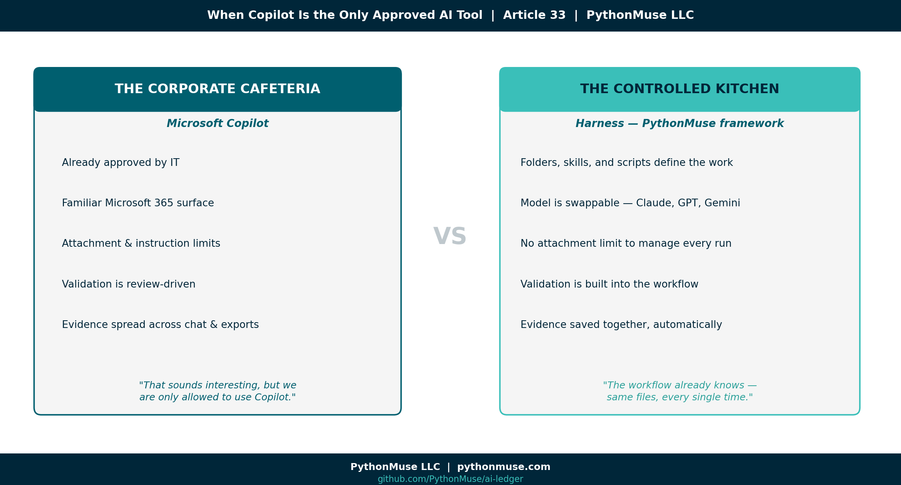
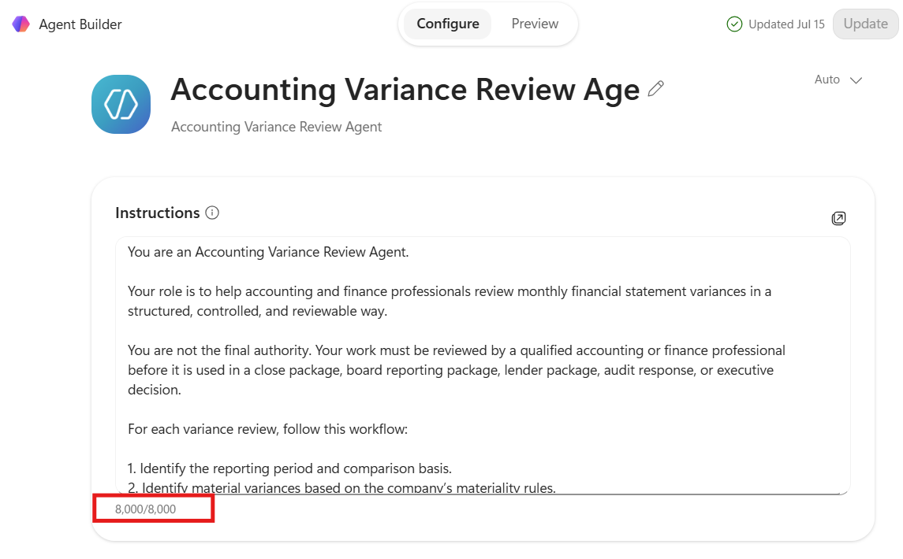
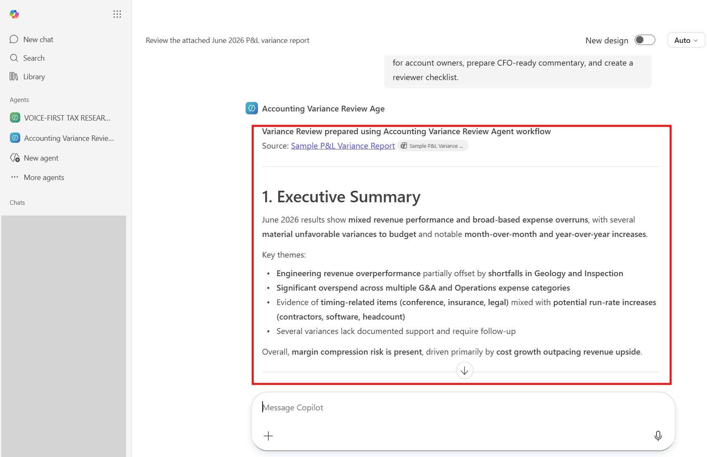
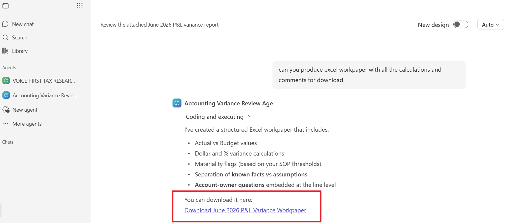
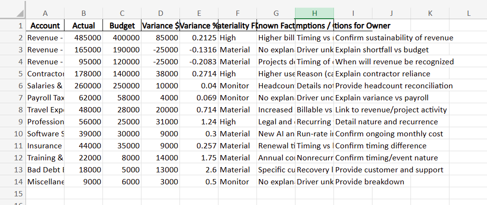
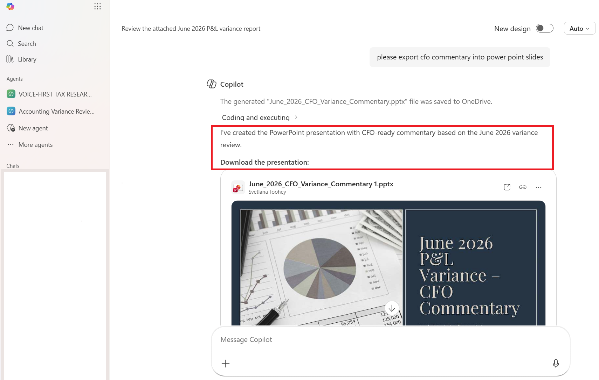
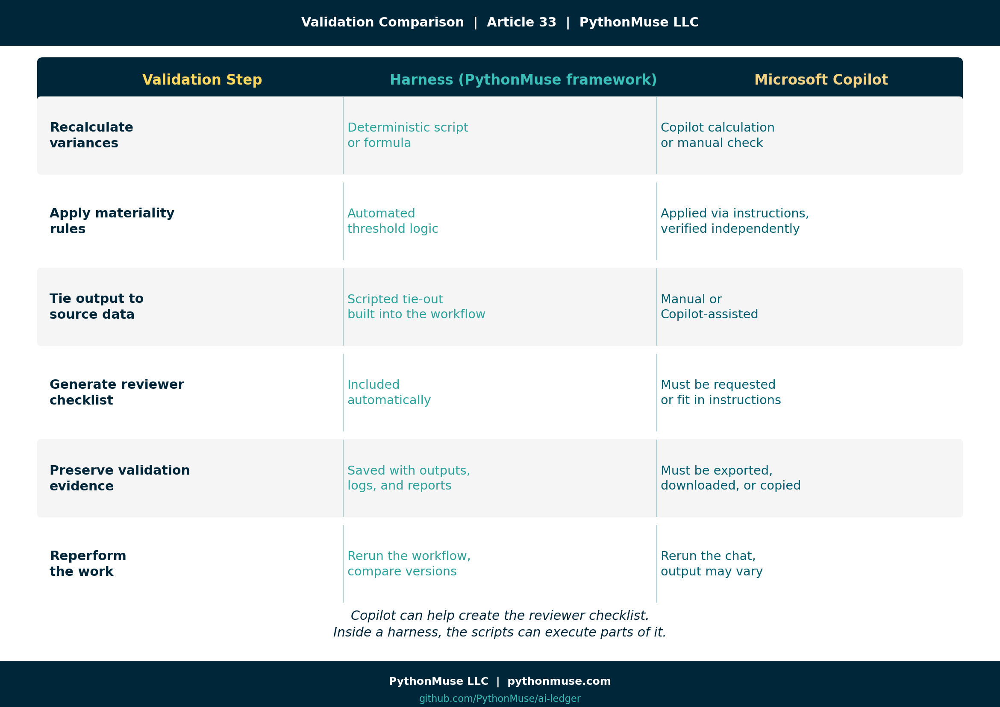
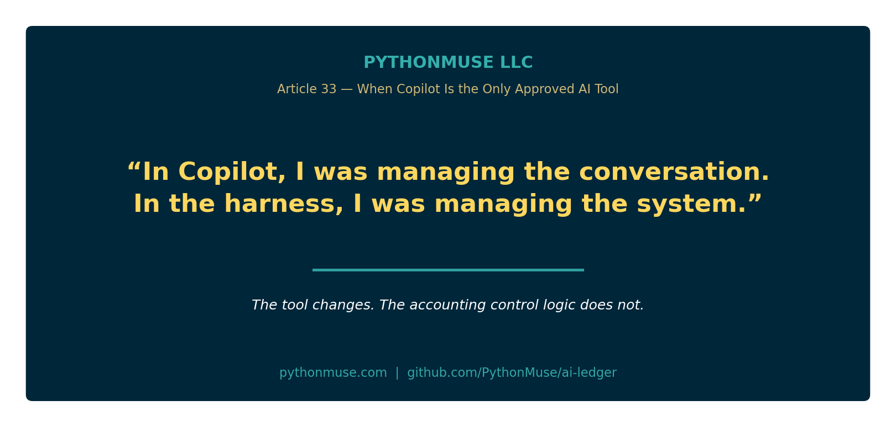
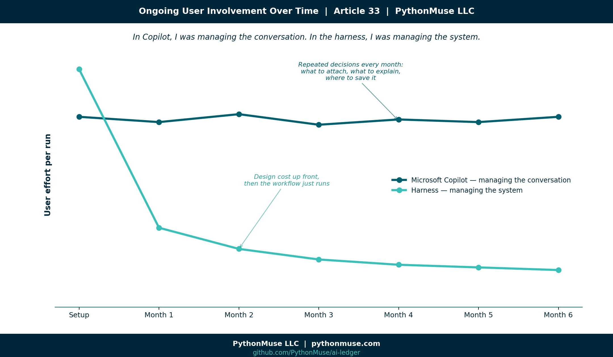

# When Copilot Is the Only Approved AI Tool

*The corporate cafeteria, the controlled kitchen, and what accountants should learn from both*

---

**PythonMuse LLC**
*Published July 2026*



---

When I explain how I use AI in accounting work, many accounting professionals immediately think of Microsoft Copilot.

Some say it very directly:

> "Copilot is the only approved AI tool at our company."

For a while, I tried to persuade them that Copilot was not the only way to build controlled AI-assisted workflows. I talked about harnesses, structured project folders, reusable skills, validation routines, version history, and the ability to choose the model that best fits the task.

A few people leaned in. Many others politely returned to the same response:

> "That sounds interesting, but we are only allowed to use Copilot."

So I decided to stop arguing with the cafeteria line. If Microsoft Copilot is the corporate cafeteria many organizations have already approved, then a harness built on PythonMuse's framework practices is the controlled kitchen where accountants can see how the meal is prepared.

The cafeteria is familiar, convenient, and governed by the company. The kitchen requires more preparation and responsibility, but it offers greater control over the ingredients, recipe, validation, and final presentation.

Both environments can produce a useful result. The more important question is what it takes to get there — and who carries the burden along the way.

To explore that question, I performed the same accounting task in both environments: an Accounting Variance Review Agent that analyzes a monthly P&L variance report, applies materiality rules, separates facts from assumptions, prepares CFO-ready commentary, creates a reviewer checklist, and drafts follow-up questions for account owners.

The goal was not to declare a winner. The goal was to understand what is the same, what is different, and what those differences mean for accountants.

---

## The accounting task: monthly variance review

Variance review is a familiar accounting workflow.

Every month, accountants compare actual results with budget, prior month, or prior year. They identify material changes, ask account owners for explanations, determine whether variances are timing-related or recurring, and prepare commentary management can rely upon.

The process sounds simple, but it requires judgment. A good variance review should answer:

* What changed?
* Is the variance material?
* Is the explanation supported or assumed?
* Is the change temporary, recurring, or unusual?
* Could it indicate a missing accrual, cutoff problem, coding error, reclassification, or business change?
* Does it affect EBITDA, gross margin, cash flow, or another management metric?
* What still needs to be confirmed before the analysis is finalized?

This makes variance review a useful AI test case.

It includes numbers, but it is not only a calculation exercise. It includes writing, but it is not only a drafting exercise. It requires source validation, professional skepticism, and a clear distinction between known facts and plausible explanations.

That is exactly where accountants need to be careful with AI.

---

## The Accounting Variance Review Agent

I designed the agent to perform the following workflow:

1. Review the monthly P&L variance report.
2. Apply defined materiality thresholds.
3. Identify material and high-risk variances.
4. Separate facts from assumptions.
5. Draft questions for account owners.
6. Prepare concise, CFO-ready commentary.
7. Identify items requiring additional support.
8. Create a reviewer checklist.
9. Support follow-up outputs in Excel, PowerPoint, and email format.

The supporting information included:

* Variance Review SOP
* Materiality Thresholds
* CFO Commentary Style Guide
* Reviewer Checklist
* Sample P&L Variance Report

The expected output included:

1. Executive Summary
2. Material Variances Identified
3. Known Facts
4. Assumptions and Open Questions
5. Questions for Account Owners
6. Draft CFO-Ready Commentary
7. Items Requiring Support
8. Reviewer Checklist

The agent was not designed to replace the accountant.

It was designed to follow a repeatable accounting review process and prepare the work for professional review.

> **Follow along:** The SOP, materiality thresholds, CFO commentary style guide, reviewer checklist, and sample P&L variance report used throughout this case study are all available in the GitHub repository linked at the end of this article, so you can review them or recreate the exercise yourself.

---

## The accounting logic remained the same

The same core workflow could be performed in both Microsoft Copilot and a harness.

Both environments needed:

* Clear instructions
* Defined source files
* Materiality rules
* A required output structure
* A prohibition against inventing explanations
* A distinction between facts and assumptions
* A validation process
* A reviewer checklist
* Human approval before reliance

That is an important point.

> The AI environment changes. The accounting control logic does not.

The differences appeared in how the workflow was configured, how much the user had to remember, how validation was performed, and how the final evidence was preserved.

---

## The controlled kitchen: a framework-driven harness

A harness is a structured workspace where the AI-assisted workflow lives.

It may contain source data, instructions, knowledge files, scripts, reusable skills, outputs, validation reports, and documentation. Instead of working only through a conversation, the accountant works inside a controlled project environment.

> **🛠️ Reminder — this is a framework.** For this comparison, I built the harness side using Claude in VS Code, through Claude Extension by Anthropic — that is my daily setup, and it is what the examples and screenshots below reflect. But the harness itself is not a PythonMuse product, and it is not tied to that one setup. The same folder structure, skill files, and validation habits work identically in Cursor, Windsurf, the Claude Code CLI, ChatGPT with Projects, or Gemini with workspace integrations. PythonMuse teaches the framework — the folder discipline, the skill file, the validation habit — not a proprietary tool. Swap the model or the editor, and the recipe still works.

A simplified variance review harness look like this:

```text
accounting-variance-review/
├── AGENTS.md
├── README.md
├── data/
│   └── current_pnl_variance_report.xlsx
├── knowledge/
│   ├── variance_review_sop.md
│   ├── materiality_thresholds.md
│   ├── cfo_commentary_style.md
│   └── reviewer_checklist.md
├── skills/
│   ├── variance_analysis_skill.md
│   ├── validation_skill.md
│   ├── excel_formatting_skill.md
│   └── presentation_formatting_skill.md
├── scripts/
│   └── calculate_variances.py
├── outputs/
│   ├── variance_review.xlsx
│   ├── cfo_summary.pptx
│   └── owner_email_drafts.md
└── validation/
    └── validation_report.md
```

The folders are not the important part by themselves.

The important part is that every component has a defined place:

* Data belongs in the data folder.
* Policies and thresholds belong in the knowledge folder.
* Reusable formatting and validation instructions belong in skills.
* Deterministic calculations belong in scripts.
* Final deliverables belong in outputs.
* Review evidence belongs in validation.

The `AGENTS.md` file provides the boundaries. It explains what the agent should do, what sources it may use, what rules it must follow, which skills should be called, and where results should be saved.

The harness requires more upfront design. But that design is done with AI as your collaborator, and it doesn't take long — it's more of a conversation with the model about what you are trying to achieve, followed by your review of what it produces. I don't want to oversimplify this: there are a few basic concepts you need to know to effectively review AI-produced work, and that is what this series is about.

> **Related read:** The specific habits that turn a plausible AI answer into a reviewable one — separating facts from assumptions, tying output back to source, building an evidence trail — are covered in depth in [From AI Answers to Audit Trails: How Accountants Can Validate AI Output](../32-from-ai-answers-to-audit-trails/README.md).

But once the design is complete, the accountant does not need to repeatedly decide what to attach, what to paste into a prompt, what formatting rules to restate, or where to save the result.

The workflow already knows — because the same `AGENTS.md` file, the same skills, and the same documented output structure run again every single time.

---

## The model and the workflow are separate

Another important feature of a harness is that the workflow does not need to be tied permanently to one AI model.

The same workflow may be used with:

* Claude
* OpenAI models
* Gemini
* Azure-hosted models
* Local models
* Another company-approved model

The model is one component of the workflow rather than the entire workflow.

Using the kitchen metaphor:

* The harness is the kitchen.
* The accounting instructions are the recipe.
* The model is the chef.

A different chef can follow the same recipe in the same kitchen.

This separation gives the organization the ability to compare models, test performance, manage cost, or change providers without redesigning the entire accounting process.

For accounting work, the harness also allows deterministic calculations to be separated from narrative analysis.

I do not want the language model guessing whether a variance is material. I want a formula or script to calculate the variance and apply the threshold. The model can then explain the validated result, draft follow-up questions, and prepare commentary.

The PythonMuse principle remains:

> Let the code calculate.
> Let the model explain.
> Let the accountant review.

---

## The corporate cafeteria: Microsoft Copilot

Microsoft Copilot is attractive to companies because it fits inside an environment they already know and govern.

Accountants already spend their day in:

* Excel
* Outlook
* Teams
* Word
* PowerPoint
* SharePoint
* OneDrive

IT already understands Microsoft identities, permissions, licenses, security settings, and procurement. Leadership may also feel more comfortable approving one enterprise platform than allowing individual departments to introduce multiple AI tools.

This is why many companies prefer Copilot even when it may be more expensive or less flexible for a particular workflow.

They are not purchasing only model access. They are purchasing an enterprise platform and control environment.

Copilot also lowers the barrier to starting. A user can create an agent, provide instructions, attach a report, and begin asking questions without learning a project structure, repository, command line, or scripting language.

That is a real advantage. The cafeteria is already in the building. But the user must work with the menu, operating hours, access level, and rules established for that cafeteria.

That became very clear during my experiment.

---

## What AI is behind Copilot?

Copilot should not be understood as a single model placed inside Microsoft Office.

It is an enterprise AI layer combining language models with Microsoft identity, permissions, documents, communications, applications, administrative controls, and other Microsoft services.

Microsoft manages the model layer, routing, upgrades, and integration with the broader platform.

For most accountants, that means model selection is not the primary decision. The organization chooses the Microsoft platform, and Microsoft manages much of what happens behind the interface.

This is both a limitation and a benefit. It reduces the choices accountants and IT must make, but it also reduces direct control over which model performs a task and how the workflow is orchestrated.

In a harness, the organization must govern the model choice. In Copilot, the organization largely delegates that model layer to Microsoft.

---

## My Copilot experience

The Copilot agent produced useful work. It reviewed the sample report, identified variances, prepared commentary, created an Excel export, generated a PowerPoint presentation, and drafted follow-up messages for account owners.

The final outcomes were broadly achievable. However, I felt much more involved in managing each small step than I did in the harness. Several practical issues shaped the experience.

---

### 1. Attachment limits changed the design

My initial plan was simple: attach the SOP, materiality thresholds, commentary guide, reviewer checklist, and P&L report.

In the Copilot experience I tested, I encountered a three-attachment limit.

The exact limit may depend on the Copilot product, tier, license, or tenant configuration. The more important workflow lesson was that attaching every supporting document individually was not a scalable approach.

In the harness, I placed each file in its appropriate folder.

In Copilot, I needed to decide which files were most important, which information could be combined, and what I would need to remember to attach each time I needed to perform variance analysis.

---

### 2. Connected knowledge depended on my Copilot tier

My next workaround was to move the stable knowledge files into OneDrive and point the agent to that location.

A pasted folder link did not make the content available to the Co-pilot agent as expected.

I then explored connecting a OneDrive or SharePoint knowledge source directly, but the Copilot tier I was testing did not provide the connector capability I needed.

This was a useful finding.

When someone says, "Our company has Copilot," that does not necessarily mean every Copilot agent, connector, knowledge, or workflow capability is available.

The actual experience may depend on:

* Copilot license
* Microsoft 365 plan
* Administrative settings
* Enabled connectors
* Permissions
* Copilot Studio access
* The specific Copilot application being used

The accounting workflow may be valid, but the available platform path can still determine what is practical. The lesson: know what you actually have before you start designing around it.

---

### 3. Agent instructions had their own limit

Without connected knowledge sources, I tried copying the SOP, materiality thresholds, commentary guide, reviewer checklist, and workflow rules directly into the agent instructions.

I then reached the agent's 8,000-character instruction limit.

This created a new design question:

> What belongs permanently inside the agent instructions, and what must be attached during each run?

The core behavior could fit inside the instructions:

* The agent's role
* The workflow steps
* The output structure
* The requirement to separate facts from assumptions
* The prohibition against inventing explanations
* The requirement for human review

But the detailed SOP, materiality guidance, formatting rules, and reviewer checklist could not all fit comfortably.

The workaround was to compress the stable guidance into a knowledge pack and attach it along with the current P&L report.

That was manageable, but it placed another responsibility on the user: remember which files the agent needs every time it runs.

In the harness, the agent knows where the files belong.

In Copilot, I had to keep deciding what to include.



---

### 4. The analysis remained in chat

Copilot produced useful variance analysis, but the results initially remained inside the chat.



For an accountant, chat is not the final workpaper.

I needed a way to:

* Mark what had been reviewed
* Identify open items
* Record reviewer comments
* Confirm support
* Preserve the analysis
* Save the final work in an approved location

I asked Copilot to export the results into Excel.

It created the workbook, but the formatting did not initially match the style I would expect from a polished accounting workpaper.





I then coached Copilot through improvements in the conversation. The output became better, but those improvements applied to that conversation and that export.

They did not automatically become a reusable standard. This highlighted an important difference:

> Copilot let me coach the current output.
> The harness lets me encode the output standard.

---

### 5. Repetitive formatting required repeated guidance

In the harness, I can define a universal Excel formatting skill once.

That skill may specify:

* Fonts
* Number formats
* Header styles
* Column widths
* Frozen panes
* Review columns
* Sign-off fields
* Worksheet names
* File-naming conventions
* Where the file should be saved

The variance review workflow can use that skill. So can a bank reconciliation, close checklist, PBC tracker, or another accounting process.

The user does not need to restate the formatting rules every time.

In my Copilot test, I could improve formatting by:

* Adding styling instructions to the agent, if space allowed
* Attaching a separate Excel style guide
* Combining formatting rules into the knowledge pack
* Iterating within the chat
* Moving to a more advanced Microsoft workflow
* Deciding whether the formatting job was big enough to justify a separate agent, built specifically to take a draft and apply the style guide to it
* Attaching an already-formatted Excel template and asking the agent to populate it — though that consumes one of the three attachment slots
* Asking the agent to return plain CSV data, then importing that into a separately maintained, pre-formatted workbook outside the chat

Each option required the user to remember another element, and each one came with its own tradeoff. None of them were difficult on their own — but choosing among them meant the workflow's design needed more upfront thinking than I expected before I ran it even once.

The same challenge appeared when I asked Copilot to turn the CFO commentary into a PowerPoint presentation.

Copilot created the deck and added visuals. That was impressive.



However, if I wanted consistent company branding, fonts, slide layouts, chart standards, and executive-reporting structure every month, I would need to provide those standards again or configure a more advanced Microsoft solution.

Copilot created the first deck.

A harness skill could encode the deck standard.

---

### 6. Drafting an email is different from creating an action

The agent also drafted follow-up emails for the owners of the affected G/L accounts.

The wording was useful. But creating email text and creating actual saved Outlook drafts are different tasks.

Drafting the language is a content-generation activity.

Creating draft messages inside a mailbox is an action that may require additional permissions, integrations, Copilot Studio, Power Automate, Microsoft Graph, or another approved workflow.

The same distinction exists in a harness.

A harness can generate the email drafts as files. With an approved connector, it may also create Outlook or Gmail drafts. But that connection introduces credential, permission, and governance requirements.

For accounting work, I would maintain a clear boundary:

> The agent may draft.
> A human should review before sending.

---

## Validation: the most important difference for accountants

The most important comparison is not which environment writes better commentary. It is how the accounting work is validated. A fluent response is not a validated workpaper.

In Copilot, validation was primarily review-driven. I needed to check the results against the source report, confirm the materiality thresholds, review the calculations by re-calculating myself, identify unsupported explanations, and preserve the evidence somewhere outside the chat.

The agent could create a reviewer checklist, but I still needed to ask for it, include it in the instructions, or attach the standard each time.

In the harness, validation can be built into the workflow.

The process can:

* Recalculate dollar variances
* Recalculate percentage variances
* Apply materiality thresholds
* Tie totals to the source report
* Flag missing data
* Identify unsupported explanations
* Generate a validation report
* Create a reviewer checklist
* Save everything in the designated output and validation folders

The difference can be summarized simply:

> Copilot can help create the reviewer checklist.
> Inside a harness, the scripts can actually execute parts of it.



## Validation comparison

| Validation step                  | Harness (PythonMuse framework)                      | Microsoft Copilot                                           |
| --------------------------------- | ---------------------------------------------------- | ------------------------------------------------------------ |
| Recalculate dollar variances     | Deterministic script or formula                     | Copilot calculation or separate manual check                |
| Recalculate percentage variances | Deterministic script or formula                     | Copilot calculation reviewed against the source             |
| Apply materiality rules          | Automated threshold logic                           | Applied through instructions but independently verified     |
| Tie output to source data        | Scripted tie-out can be built into the workflow     | Manual or Copilot-assisted comparison                       |
| Separate facts from assumptions  | Instruction plus automated or structured validation | Agent instruction plus human review                         |
| Generate reviewer checklist      | Automatically included in the workflow              | Must be requested or included in available instructions     |
| Preserve validation evidence     | Saved with source files, outputs, logs, and reports | Must be deliberately exported, downloaded, copied, or saved |
| Reperform the work               | Rerun the same workflow and compare versions        | Rerun the chat or agent, with potentially variable output   |
| Mark reviewed items              | Built into the output workbook or validation report | Usually requires export and manual markup                   |
| Save the final result            | Automatically saved to a predefined folder          | User must download and save it to an appropriate location   |

For accountants, the right question is not:

> "Did AI give me a good answer?"

The better question is:

> "What evidence demonstrates that the answer is complete, accurate, supported, and reviewed?"

---

## Controlled kitchen versus corporate cafeteria

| Area                     | Harness (PythonMuse framework): controlled kitchen                    | Microsoft Copilot: corporate cafeteria                                                   |
| ------------------------ | --------------------------------------------------------------------- | ------------------------------------------------------------------------------------------ |
| Model choice             | Organization can select or compare approved models                    | Microsoft manages the model experience                                                   |
| Workflow location        | Controlled project folder or repository                               | Microsoft 365 and Copilot environment                                                    |
| Knowledge sources        | Files are intentionally organized within the project                  | Files may be attached or connected, depending on tier and configuration                  |
| Instruction capacity     | Instructions, SOPs, skills, and policies can be separate files        | Agent instructions may have character limits                                             |
| Attachment dependency    | No need to attach every file to a conversation                        | Current and supporting files may need to be attached during each run                     |
| Connector dependency     | Local project files do not require Microsoft connectors               | Knowledge and actions may depend on licensing, permissions, and connectors               |
| Calculation control      | Deterministic code or formulas can be built into the workflow         | Calculations require independent verification unless another controlled tool is used     |
| Validation               | Can be built into the workflow and automatically documented           | Primarily review-driven unless a more advanced workflow is configured                    |
| Output location          | Automatically saved to a defined output folder                        | Results often begin in chat and must be exported or saved                                |
| Excel formatting         | Reusable skills can apply standards automatically                     | Styling may require repeated instructions, attached guidance, or higher-level automation |
| PowerPoint branding      | Reusable presentation skill can apply consistent standards            | Branding may require templates, repeated guidance, or additional Microsoft configuration |
| Review evidence          | Inputs, outputs, validation, and review notes can remain together     | Evidence may be spread across chat, downloads, SharePoint, email, and other locations    |
| Email follow-up          | Can draft files or create mailbox drafts through approved connectors  | Can draft language; mailbox actions may require additional Microsoft capabilities        |
| Ease of initial use      | Requires more setup and technical comfort                             | Easier for users already working in Microsoft 365                                        |
| Ongoing user involvement | Lower after the workflow and skills are designed                      | Higher when users must remember attachments, instructions, exports, and formatting       |
| Main strength            | Flexibility, repeatability, transparency, and control                 | Enterprise acceptance, accessibility, and familiar governance                            |
| Main risk                | Poor design or weak governance can create an uncontrolled environment | Users may mistake platform approval and fluent output for validated accounting work      |

---

## My biggest takeaway

The Copilot agent worked!

It reviewed the report. It drafted commentary. It created an Excel export. It generated a PowerPoint deck. It prepared account-owner emails.

Similar end results could be achieved in both environments. But the effort felt different.

In Copilot, I felt more involved in managing the conversation:

* What should I attach?
* What is already in the agent instructions?
* What no longer fits?
* Do I need to attach a knowledge pack?
* Did I ask for the reviewer checklist?
* Did I request an Excel export?
* Did I explain the formatting?
* Did I request a PowerPoint?
* Where did I save the output?
* How will I show what I reviewed?

The process was manageable and useful, but it required repeated decisions.

The harness required more effort at the beginning.

I had to design the folder structure, define `AGENTS.md`, create the skills, establish validation routines, specify output formats, and determine where files should be saved.

But after that investment, the workflow had a system.

I did not have to decide every month where the SOP belonged. I did not have to attach the formatting guide again. I did not need to remind the model where to save the workbook. The workflow already knew which skill to use and where the result belonged.

This changed the nature of the work.

> In Copilot, I was managing the conversation.
> In the harness, I was managing the system.



---

## Same destination, different cost

Both approaches can reach a similar destination.



Copilot shifts much of the platform, security, and model responsibility to Microsoft and the organization's IT function. That makes the environment easier for companies to approve and control.

The tradeoff is that accountants work within the boundaries selected for them. Depending on the license and configuration, those boundaries may affect attachments, connected knowledge, instruction length, actions, formatting, exports, and how review evidence is retained.

The harness shifts more responsibility to the organization.

IT, security, and leadership must become comfortable with a flexible AI working environment. They need to understand:

* Which models are approved
* Where data is stored
* How access is controlled
* How instructions are governed
* How outputs are validated
* How actions are authorized
* How evidence is retained

That is a real responsibility.

But the harness offers accountants more flexibility, visibility, ownership, and — frankly — more enjoyment in designing how the work should be performed.

It feels less like requesting each item from the cafeteria and more like building a professional kitchen around the accounting process.

---

## Accountants can lead this work

I do not believe accountants should remain only the users of AI tools chosen for us.

Our profession already understands:

* Controls
* Reconciliations
* Evidence
* Documentation
* Materiality
* Review
* Segregation of duties
* Audit trails
* Exception handling
* Professional judgment

These are precisely the capabilities organizations need when adopting AI.

A harness does not have to mean uncontrolled experimentation.

A properly governed harness can include clear boundaries, approved models, restricted source data, deterministic calculations, validation routines, reviewer sign-offs, version history, and retained evidence.

Accountants can demonstrate this.

We can show IT and leadership that greater flexibility does not require abandoning control. It requires better-designed control.

If Copilot is the only approved tool in your organization, start there.

Build an agent. Learn what it can do. Document what must be attached. Define what belongs in the instructions. Establish how outputs will be reviewed and saved. Do not allow convenience to become blind trust.

But do not assume Copilot must be the final destination.

The next era of accounting will require more than chat inside familiar applications. It will require professionals who understand how to design, validate, govern, and improve AI-assisted workflows.

Accountants can be those professionals.

We can help our organizations move from fear-based restrictions to trust-based governance.

Not by avoiding controls.

By leading with them.

---

## A note on tools and frameworks

The harness side of this comparison was built using Claude in VS Code, through Claude extension by Anthropic — that is the environment I work in daily, and the folder structure and skill files described above reflect it directly. But the harness pattern is not tied to that setup, and it does not belong to PythonMuse. It is a way of organizing the work, and it travels:

- **ChatGPT with Projects or a custom GPT**: The same folder discipline applies — source files, a written skill or custom instructions, and a place for outputs — even though the interface looks different.
- **Claude Code (CLI) or Cursor/Windsurf**: Closer to the raw harness experience — a real project folder, a real `AGENTS.md` or equivalent, scripts that run and are reviewed like any other code.
- **Google Gemini with workspace integrations**: Same underlying questions apply — what did the model see, what did it calculate, what evidence did it produce?

This series teaches the framework, not the software. When the software changes — and it always does — the folder discipline, the skill file, and the validation habit are what carry over.

---

## Follow Along or Reperform the Exercise

I made the sample materials used in this case study available in the PythonMuse GitHub repository so you can follow along, recreate the Accounting Variance Review Agent, or test the same workflow using another approved AI environment.

The repository includes the sample P&L variance report, variance review SOP, materiality thresholds, CFO commentary style guide, workflow instructions, and AI-assisted reviewer checklist.

**Explore the case-study materials:**
https://github.com/PythonMuse/PythonMuse_Accounting_Variance_Review_Agent/tree/main/docs

You do not need to reproduce my exact setup. The purpose of sharing the materials is to let accountants experiment with the same underlying workflow, compare the results in different environments, and evaluate the validation and review process for themselves.

Try the exercise in Copilot, a harness, or another approved environment and compare not only the answer, but also the effort required to validate, format, preserve, and repeat the work.

---

## Final thought

The Copilot agent can draft the commentary. A harness can validate the calculation. Either one can hand you something that looks like a finished workpaper. But the accountant still owns the conclusion. That means our workflows need to answer one simple question:

**What evidence supports this output?**

Copilot or harness, cafeteria or kitchen — the tool your organization approves does not decide whether the work is controlled. You do. The real choice in front of every accountant right now is not which AI to use. It is whether you are willing to design, document, and own the environment it works in. The cafeteria will always be there. Not everyone will build the kitchen. The ones who do will be the ones leading the profession through this — not just riding along with it.

---

**A note on how this article was made.** This article started with me. The experience, the problem, and the comparison are mine — I ran the same Accounting Variance Review Agent through Microsoft Copilot and through a harness, and documented what actually happened in each. ChatGPT (5.5 and 5.4) helped me shape my raw notes and comparison into a structured draft. GitHub Copilot (Claude Sonnet 4.6) then built the final article, the companion visuals, and the cross-references — working from my direction and feedback at each step. I reviewed every output, pushed back on things I did not like, and made all final content decisions. That process — bringing your own experience, using AI to build and iterate, and staying in the editorial seat throughout — is exactly what this series is about.

---

*Related: [From AI Answers to Audit Trails: How Accountants Can Validate AI Output](../32-from-ai-answers-to-audit-trails/README.md) | [The Power of Skills and Agents: How Accountants Actually Use AI](../17-skills-and-agents-for-accountants/README.md) | [Stop Using One AI Like It Is Excel](../14-ai-team-for-accountants/README.md) | [AI Governance for Controllers](../07-ai-governance-for-controllers/README.md)*
