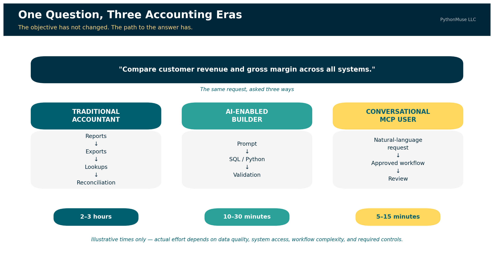
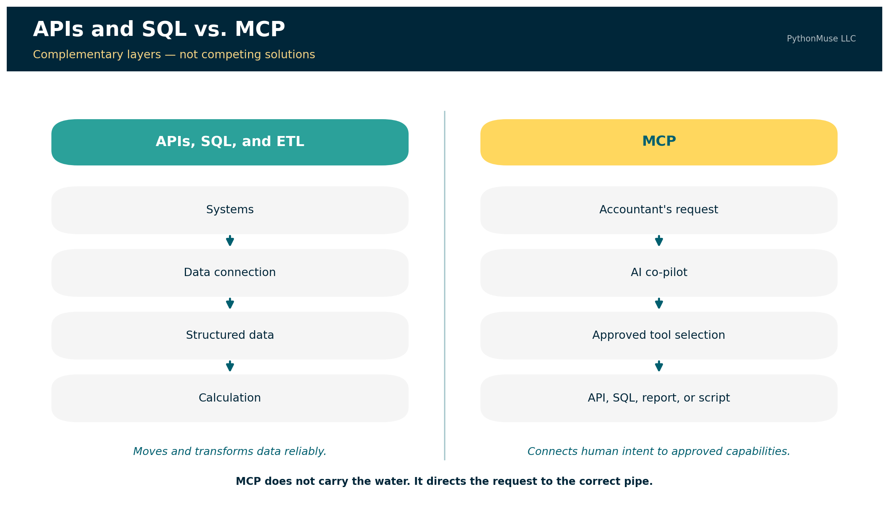
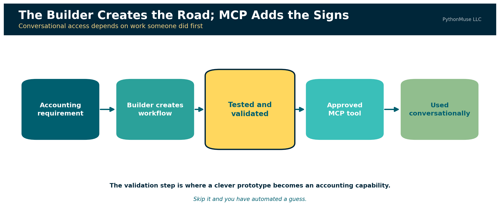
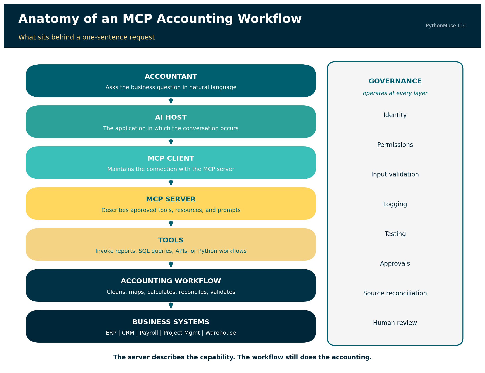
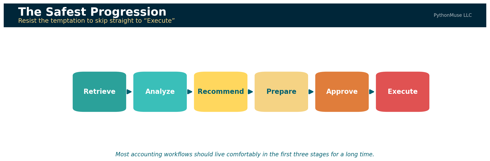
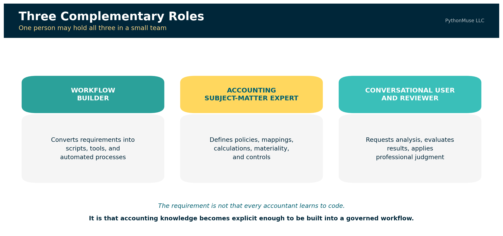
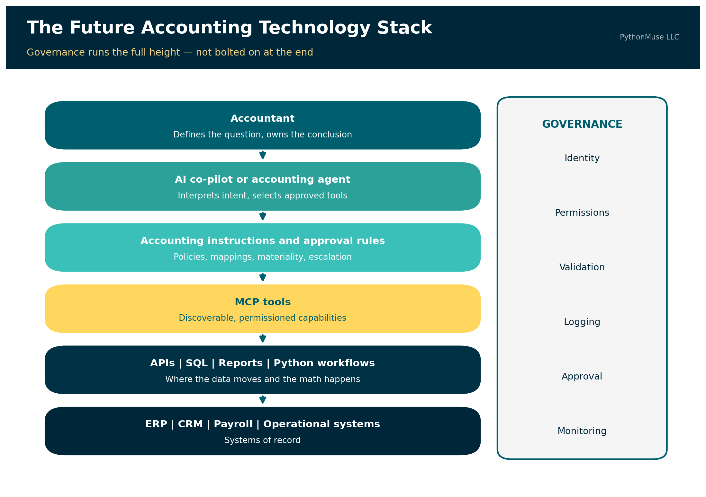

# From Reports to Requests

*How APIs, AI builders, and MCP may change the way accountants work*

---

**PythonMuse LLC**
*Published July 2026*



---

For years, one of the marks of an experienced accountant was knowing where information lived.

Which report should be run? Which filters should be selected? Which subsidiary should be included? Was the useful version saved under "Financial Reports," "Custom Reports," or in a folder created by an employee who left the company six years ago?

Accounting professionals learned not only the accounting system, but also the system's habits, quirks, and occasional refusal to cooperate before coffee.

Artificial intelligence is beginning to change that relationship.

> **📎 Quick definition: API, SQL, and ETL.** An **API** (Application Programming Interface) is a defined way for one system to request data or action from another — like placing an order with a kitchen instead of walking in and cooking it yourself. **SQL** (Structured Query Language) is the language used to ask a database a specific question and get back matching rows, such as "every vendor bill over $25,000 posted after June 15." **ETL** (Extract, Transform, Load) is the pattern for moving data between systems on a repeatable schedule: pull it from the source, clean and standardize it, then load it into its destination, such as a data warehouse. These three show up throughout this article as the underlying technology that actually retrieves and moves data — MCP works alongside them, not instead of them.

Some accountants are already using AI to create SQL queries, Python scripts, data-cleaning routines, and custom analyses. Work that once required several exports, multiple spreadsheet tabs, a collection of lookup formulas, and two or three hours of careful reconciliation can sometimes be completed in a fraction of the time.

The next change may be even more significant.

Instead of building or running the workflow themselves, accountants may be able to describe the business question in natural language. An AI co-pilot could identify the appropriate approved tools, retrieve the relevant information, perform a governed analysis, and return the answer with supporting evidence.

Model Context Protocol, commonly called MCP, is one technology helping make this possible.

MCP is not a replacement for APIs, SQL, data warehouses, or well-designed accounting applications. It is better understood as a layer that can connect an accountant's intent with approved system capabilities.

Let's explore why it matters and why accountants need to know about MCP. The API moves the data. The script performs the calculation. MCP helps the AI determine which approved tool to use. The accountant determines whether the answer can be trusted.

## The Accounting Question Has Not Changed

Consider a management request:

> "Compare customer revenue, direct labor, and gross margin across our business systems. Identify customers appearing in more than one system and explain the largest changes from the prior period."

The accounting objective is familiar. The process used to answer it is changing.

A traditional accountant may begin by running reports from several systems. One report may contain revenue by customer. Another may contain labor by project. A third may include customer identifiers or organizational classifications.

The accountant exports each report, cleans the data, adds several tabs to Excel, standardizes customer names, performs lookups, investigates missing matches, calculates gross margin, and compares the current period with the prior period.

Two or three hours later, the accountant produces the requested analysis and hopes every formula range expanded correctly. The final workbook may be accurate. It may also contain three versions of the same customer name, an unexplained `#N/A`, and at least one formula copied down one row too far.

The problem is not a lack of accounting knowledge. The accountant understands the objective. The friction comes from translating the business question into the language and structure of several systems — compiled together by an overworked accountant who is trying to pick up their kids from child care on time while still delivering the ad hoc analysis the CFO needs by the end of the day.

## Three Paths to the Same Answer

The same accounting question can now be answered through three different approaches.

| Approach | Primary method | Illustrative effort |
|---|---|---:|
| Traditional accounting workflow | Reports, exports, spreadsheet cleaning, lookups, formulas, and manual reconciliation | Two to three hours |
| AI-enabled builder workflow | AI-assisted SQL, Python, APIs, mappings, and validation routines | Approximately 10 to 30 minutes |
| MCP-enabled conversational workflow | Natural-language request invoking an existing approved workflow | Approximately 5 to 15 minutes |

These times are illustrative, not universal benchmarks. The actual effort depends on data quality, system access, workflow complexity, and the controls required.

Natural language does not eliminate complexity. It relocates complexity into the workflow, tools, mappings, permissions, and controls.

## The Traditional Accountant

The traditional workflow begins with system navigation. The accountant must know:

- Which reports contain the required information
- Which filters should be applied
- Whether the data includes posted or unposted activity
- How customers are identified in each system
- Which accounts represent revenue and direct labor
- How departments and entities should be combined
- Which spreadsheet formulas are required
- How the final result should be validated

The process may look like this:

```text
Business question
        ↓
Locate reports in several systems
        ↓
Apply filters and export files
        ↓
Clean and standardize the data
        ↓
Use lookups and formulas
        ↓
Reconcile missing or duplicated records
        ↓
Calculate and investigate variances
        ↓
Prepare the analysis
```

The accountant's knowledge is embedded throughout the process. However, much of that knowledge may remain undocumented. The workbook shows the formulas, but it may not explain why one account was excluded, why two customer records were combined, or why a particular source was considered authoritative.

This creates an institutional-knowledge problem. The process works because a particular accountant knows how to make it work.

## The AI-Enabled Builder

The AI-enabled builder approaches the same question differently. This person may not be a software developer. They may be an accountant who understands databases, reporting structures, Power Query, Python, APIs, or SQL well enough to describe the desired workflow to an AI coding co-pilot.

The builder knows that:

- One system stores revenue in a SQL database.
- Another provides labor data through an API.
- A third source contains the approved customer mapping.
- Customer number is more reliable than customer name.
- Internal customers must be excluded.
- Only posted transactions should be included.
- Direct labor is defined by a controlled account mapping.
- Gross margin must be calculated consistently across entities.

The builder might ask an AI coding co-pilot:

> "Connect to the approved reporting database and retrieve customer number, customer name, revenue, direct labor, entity, department, and accounting period. Exclude unposted transactions and internal customers. Standardize customer numbers, apply the approved customer and department mappings, aggregate the results by customer, compare June with May, and export all material changes and exceptions to Excel."

The AI can help create the SQL and Python required to perform the work. The builder then reviews the generated code, tests the joins, confirms the business logic, reconciles the source totals, and corrects any errors.

The workflow becomes:

```text
Business question
        ↓
Builder identifies the data sources and accounting rules
        ↓
Builder prompts AI to create or revise SQL and Python
        ↓
Script retrieves data through APIs or databases
        ↓
Data is cleaned, mapped, and calculated
        ↓
Validation routines reconcile the results
        ↓
Analysis and exception reports are produced
```

The builder's productivity comes from combining several forms of knowledge:

```text
Accounting knowledge
        +
Business-process knowledge
        +
System and data knowledge
        +
Ability to direct and validate AI
        =
Rapid custom analysis
```

AI reduces the time required to write the technical solution. It does not independently know which tables are reliable, which columns should be joined, which transactions should be excluded, or which accounting definitions management expects.

The builder supplies that context. That could mean you - the accountant who upskilled with knowing how to responsibly work with AI. 

## The Conversational Accounting User

Not every accountant will want to inspect a database schema, debug a SQL join, or review a Python function. Many accountants will prefer to ask the same question they would previously have asked a more junior accountant on the team:

> "Can you compare customer revenue and gross margin across all systems and show me the largest changes?"

Historically, that junior accountant might spend several hours preparing the analysis. An MCP-enabled co-pilot could make an already approved version of that workflow available to a broader group of accountants.

The user might ask:

> "Compare customer revenue and gross margin across all approved systems for June. Use the approved customer mapping, identify changes greater than 10%, and show the supporting transactions."

> **📎 Quick definition: "tool" in MCP.** Here "tool" is a precise term, not a stand-in for "software." It's a specific, named function the MCP server exposes — with its own description, inputs, and outputs — that the AI can choose to call. It's not the same as a "skill," which is the reusable accounting logic and instructions *behind* a tool, not the callable function itself. Both get a full definition later, in [The Components Behind the Conversation](#the-components-behind-the-conversation).

The co-pilot could select from approved tools such as:

```text
get_revenue_by_customer()
get_direct_labor_by_customer()
apply_customer_mapping()
calculate_customer_margin()
compare_reporting_periods()
retrieve_supporting_transactions()
run_variance_validation()
```

Those tools may call APIs, run SQL queries, execute reports, launch Python scripts, or retrieve documents.

The conversational user does not need to know which database contains the revenue table, which API endpoint returns labor activity, or which Python function calculates the variance. The user still needs to understand the accounting question and evaluate the result. The technical translation has been moved into the tools.

## API and MCP Are Not Competing Solutions

My first instinct was to use multi-ERP consolidation as the primary example of MCP in accounting.

Imagine a U.S. entity using QuickBooks Online and a Canadian entity using Sage Intacct. An AI co-pilot retrieves both trial balances, translates the Canadian entity, maps the accounts, eliminates intercompany activity, and produces consolidated financial statements.

It sounds impressive. It also sounds slightly better suited to a conference demonstration than to a well-designed accounting system. 

A recurring consolidation depends on large, structured, repeatable transfers of data. That kind of work is generally better suited to a well-designed, repeatable workflow than to a single conversational request — the kind of workflow built with agents and skills, as covered in [The Power of Skills and Agents](../17-skills-and-agents-for-accountants/).

MCP is not a faster replacement for every API or database connection.

The official MCP documentation explains that MCP servers expose tools through which language models interact with external systems. Those tools may query databases, call APIs, or perform calculations. MCP therefore provides a standard way for the AI to discover and invoke capabilities; the underlying technology still performs the actual work.

The difference can be summarized simply:



```text
APIs and SQL connect applications to data.

MCP connects human intent to approved application capabilities.
```

### What APIs, SQL, and ETL do

APIs, SQL, and ETL technologies are designed to retrieve, move, and transform structured data.

```text
ERP or business system
        ↓
API, SQL query, report, or ETL connection
        ↓
Structured data
        ↓
Controlled calculation or analysis
```

They are generally the better foundation for:

- Loading general-ledger data into a warehouse
- Refreshing a consolidation model
- Updating a Power BI dataset
- Extracting accounts-receivable activity
- Combining operational and financial data
- Running recurring account mappings
- Processing large transaction populations

### What MCP does

MCP gives an AI co-pilot a standardized way to understand which approved tools are available and how they may be used.

```text
Accountant's request
        ↓
AI co-pilot
        ↓
MCP tool discovery and selection
        ↓
Approved report, API, SQL query, or script
        ↓
Supported answer or controlled action
```

MCP does not replace the builder. It allows the builder's validated work to become reusable by people who may never open the underlying code.

## The Builder Creates the Road; MCP Adds the Signs

The builder and conversational user should not be viewed as competing roles. The builder creates the workflow. MCP makes that workflow easier for authorized users to find and invoke.

A builder may first create a script that:

- Retrieves data from several systems
- Selects the required columns
- Cleans customer identifiers
- Applies approved mappings
- Calculates margins
- Compares reporting periods
- Identifies exceptions
- Preserves supporting details
- Reconciles output totals to the source systems

After testing and approval, the organization could expose the workflow as an MCP tool.



```text
STEP 1 — The builder creates the workflow

Accounting requirement
        ↓
SQL, API, or Python development
        ↓
Testing, reconciliation, and validation
        ↓
Approved reusable analysis


STEP 2 — MCP makes the workflow conversational

Accountant asks a business question
        ↓
AI selects the approved analysis tool
        ↓
Workflow runs with defined parameters
        ↓
Accountant reviews the supported result
```

This may be one of MCP's most important practical contributions to accounting. It can turn a successful individual workflow into an organizational capability. Without that additional layer, the company may simply replace one form of institutional knowledge with another:

> "Ask Maria. She knows which Python file runs the customer analysis."

The technology changed. The dependency on Maria did not. An MCP tool can give the workflow a clear name, description, required parameters, permitted users, and defined output. Other authorized accountants can invoke it without editing the code or locating the script.

The knowledge does not disappear. It becomes embedded in a governed capability.

## A Better Practical MCP Example

MCP becomes particularly useful when an accountant understands the business objective but does not know—or should not need to remember—which report, saved search, record, query, or screen contains the answer.

Consider the following request:

> "Find vendor bills greater than $25,000 that were posted after the June close, have no purchase order, and were approved after the invoice date. Show me the invoice, approval history, and general-ledger impact."

Traditionally, the accountant may need to know:

- Which accounts-payable report to run
- Which saved search includes purchase-order information
- Where approval history is stored
- How supporting invoices are accessed
- Which record shows the general-ledger impact
- How the results should be combined

An MCP-enabled co-pilot could instead coordinate approved tools:

```text
search_vendor_bills()
get_purchase_order_match()
get_approval_history()
get_supporting_document()
get_general_ledger_impact()
prepare_exception_report()
```

The value is not merely that data moved from the ERP into a conversation. The value is that the accountant expressed a business objective and the co-pilot coordinated several governed system capabilities to answer it.

Oracle's NetSuite MCP Standard Tools SuiteApp illustrates this direction. Its tools can work with records, reports, saved searches, and SuiteQL queries through an AI client using natural-language input.

## For Builders: What an MCP Workflow Actually Contains

The conversational experience may appear simple:

> "Compare customer revenue and gross margin across all approved systems and show me the largest changes."

Behind that request is a collection of components that someone must design, connect, test, and govern.



```text
ACCOUNTANT
Asks the business question in natural language
        ↓
AI HOST
The application in which the conversation occurs
        ↓
MCP CLIENT
Maintains the connection with the MCP server
        ↓
MCP SERVER
Describes the approved capabilities available to the AI
        ↓
TOOLS
Invoke reports, SQL queries, APIs, or Python workflows
        ↓
ACCOUNTING WORKFLOW
Cleans, maps, calculates, reconciles, and validates
        ↓
BUSINESS SYSTEMS
ERP | CRM | Payroll | Project Management | Data Warehouse
```

Governance should operate alongside every layer:

```text
Identity | Permissions | Input Validation | Logging
Testing | Approvals | Source Reconciliation | Human Review
```

The MCP server does not contain every piece of accounting logic and does not replace the underlying data connections.

Instead, it may expose a tool such as:

```text
run_customer_margin_analysis(
    current_period,
    prior_period,
    variance_threshold
)
```

That tool could launch an existing Python workflow.

The Python workflow might:

1. Run an approved SQL query against the reporting database.
2. Retrieve labor information through an API.
3. Load the approved customer mapping.
4. Standardize customer identifiers.
5. Calculate revenue, direct labor, and gross margin.
6. Compare the selected periods.
7. Identify material changes.
8. Reconcile totals to the source systems.
9. Produce an exception report and audit log.

MCP makes the approved tool visible to the AI co-pilot and describes the parameters required to use it. The underlying query, script, accounting instructions, and validation routines still do the actual work.

### The Components Behind the Conversation

#### The host and client

The host is the AI application through which the accountant interacts with the workflow. The MCP client operates within that application and manages its connection with the MCP server.

The accountant does not ordinarily need to interact directly with the client. The user asks a question, and the host coordinates the conversation and available tools.

#### The MCP server

The server makes approved capabilities available to the AI application.

MCP defines three server-side building blocks:

- **Tools** — executable functions that run reports, queries, scripts, or other actions
- **Resources** — data sources providing contextual information such as database schemas, reporting definitions, or mapping documentation
- **Prompts** — reusable templates that structure common tasks

These three differ in an important way that is easy to miss: tools are *model-controlled* — the AI decides when to call them. Resources are *application-controlled*, and prompts are *user-controlled*. So "the AI discovers and invokes what it needs" is true of tools, and only of tools. That distinction matters when you are deciding what an agent should be able to reach for on its own.

The server should expose focused capabilities rather than unrestricted access to every table, file, and transaction.

"Retrieve approved customer-margin analysis" is a controlled capability.

"Do whatever you think is helpful inside the general ledger" is not.

#### The tools

Tools are the actions the AI can request. For the demonstration repository, the available tools include:

```text
run_customer_margin_analysis()
get_analysis_exceptions()
get_validation_report()
get_supporting_transactions()
```

Each tool should have a clear description, defined inputs, known outputs, and appropriate permission requirements.

The quality of those descriptions matters more than it first appears. An AI client discovers tools by requesting a list, and each tool returns its name, description, and an input schema. The model selects among them by reading exactly that. A vaguely named tool with a thin description is not a neutral choice — it is an invitation to be called at the wrong moment.

#### The resources

Resources provide context that can help the AI understand the environment.

Examples may include:

- Available reporting periods
- Account definitions
- Customer-mapping documentation
- Data dictionaries
- Approved metric definitions
- Validation policies
- Report descriptions

Resources should not be treated as a substitute for tools. A resource provides context; a tool performs an operation.

#### The accounting skills

In this repository, skills contain the reusable accounting instructions behind the workflow.

A customer-margin skill might define:

- Revenue accounts
- Direct-labor accounts
- Customer-matching hierarchy
- Treatment of internal customers
- Gross-margin formula
- Materiality thresholds
- Required reconciliations
- Exception categories
- Reviewer checklist

Skills are not an official MCP building block. They are part of the workflow-design approach used to make the accounting knowledge explicit, reviewable, and reusable.

A skill may inform the design of an MCP tool, provide instructions to the AI agent, or be referenced by the underlying Python workflow.

#### The underlying workflow

The underlying workflow should perform the repeatable accounting work. This is where SQL, APIs, Python, Power Query, or another deterministic technology retrieves and transforms the data. The workflow should not depend on the language model to calculate every amount from scratch. Calculations that must be repeatable should be performed by controlled code.

The AI may choose the recipe. It should not quietly reinvent the laws of arithmetic because it was feeling creative that afternoon.

#### Tests and validation

Before a workflow becomes available conversationally, it should be tested.

The tests might confirm that:

- Source totals reconcile.
- Customer mappings are unique.
- Unmapped customers are reported.
- Gross margin is calculated correctly.
- Materiality thresholds are applied consistently.
- Unsupported periods are rejected.
- Missing data produces an exception rather than a fabricated answer.

The conversational interface may take five minutes to use.

The confidence behind that five-minute answer comes from the accounting definitions, code, mappings, tests, permissions, and controls established before the question was asked.

> **🛠️ Reminder — this is a framework.** The companion repository was built and tested using Claude in VS Code, through the GitHub Copilot extension — that is the daily setup behind the code. But MCP is an open, provider-neutral protocol, not a Claude feature. The same server, tools, and sample data connect just as well to Claude Desktop or the Claude Code CLI, and the same *pattern* — a governed tool layer between an AI client and your systems — applies whether your organization standardizes on ChatGPT, Gemini, or Microsoft Copilot Studio's own connector model. This series teaches the framework, not the vendor.

> **Clone and run it yourself:** The companion repository walks the same customer-margin question through both paths — first as a builder workflow you run directly from the command line, then as the identical logic exposed through MCP tools, resources, and prompts for conversational use. Fictional data, read-only, three deliberately mismatched source systems: **[github.com/PythonMuse/pythonmuse-builder-to-mcp-demo](https://github.com/PythonMuse/pythonmuse-builder-to-mcp-demo)**

## From Retrieval to Controlled Action

The safest development path for accounting agents is not to begin with autonomous posting.

A more reasonable progression is:



```text
Retrieve
    ↓
Analyze
    ↓
Recommend
    ↓
Prepare
    ↓
Approve
    ↓
Execute
```

A read-only MCP tool might retrieve overdue receivables. A second tool might compare those balances with customer activity and dispute records. A third might prepare a collection summary. A more advanced tool could draft a customer communication or proposed journal entry. The accountant would still approve the communication or transaction before execution.

As the tools move closer to changing financial records, the controls must become stronger. An assistant retrieving a report presents one level of risk. An assistant changing a vendor, creating a sales order, or posting a journal entry presents another.

## The Emerging Accounting Technology Ecosystem

The market is developing across several layers. Some companies are creating AI-native accounting systems. Established ERP vendors are exposing reports, data, and business logic to AI co-pilots. Implementation firms are helping organizations extend the systems they already own.

### Rillet: AI Embedded in the General Ledger

Rillet represents an AI-native approach. Its Aura AI offering includes specialized accounting agents connected to live general-ledger data, along with natural-language analysis and workflow capabilities. Rillet also operates an MCP server, which allows compatible external AI tools to connect to live ledger data, customers, invoices, contracts, and reports.

The important distinction is that the AI capability is designed as part of the accounting platform rather than being added only as an external chatbot.

Potential applications include:

- Asking questions of the live general ledger
- Performing flux analysis
- Supporting reconciliations and accruals
- Creating repeatable accounting workflows
- Accessing current financial data from other approved applications

### 10X ERP: Conversational Access With a Built-In MCP Server

10X ERP provides another example of an AI-enabled ERP. Its platform describes an API-first architecture and a built-in MCP server that can connect compatible AI clients with ERP data.

The combination is instructive. The APIs provide programmatic access to the platform.

The MCP server provides a conversational route through which an AI client can use approved capabilities.

### Oracle NetSuite: Making an Established ERP Conversational

NetSuite represents a particularly relevant model for organizations that are not planning to replace their ERP. Its MCP capabilities allow compatible AI clients to work with reports, saved searches, records, and SuiteQL queries while operating through the user's configured NetSuite access.

This may allow an accountant to ask for information without first remembering the exact report name or saved-search location. For professionals who have spent years memorizing where those items are stored, this progress may feel both exciting and slightly disrespectful.

### Microsoft Dynamics 365: Two Servers, Two Jobs

Microsoft has taken a notably explicit approach: two separate MCP servers, documented as complementary.

The **Dynamics 365 ERP MCP server** gives agents access to finance and operations data and application business logic. The **ERP Analytics MCP server** — currently in preview — enables natural-language analysis of Business Performance Analytics data, generating queries from plain-language questions while enforcing row-level security.

These capabilities illustrate two related directions:

- Conversational access to financial and operational analysis
- Agent access to application functionality and workflows

The second direction introduces greater opportunity and greater risk because the agent may move beyond reviewing information toward performing actions.

### The Implementation Layer: Extending the ERP a Company Already Owns

Most organizations will not replace an ERP simply because a newer platform offers impressive AI capabilities. ERP replacements are expensive, disruptive, and rarely approved because someone returned from a conference enthusiastic about a demonstration.

Many companies will instead extend the systems they already use — and a second category of firm has grown up around exactly that.

**Mirage Consulting**, a specialist ERP implementation and staffing firm, is one example of that role — the kind of partner organizations already call on for NetSuite and other ERP work, increasingly asked to help design AI agents that operate inside existing environments rather than around them. **magentIQ**, a hybrid AI-and-human workforce provider for finance and accounting teams, is another — its stated position is that finance does not need more software, it needs AI agents layered onto the systems already in place, working alongside the team rather than replacing the stack.

Neither approach is right or wrong. Together they are a reminder that "AI for your ERP" is not one product category. It is a spectrum — from AI-native platforms rebuilding the ledger, to conversational layers added to an existing system, to partners who help you wire agents into whatever you already run.

Organizations will need help determining:

- Which accounting workflows should be automated
- Which existing reports or APIs should support the workflow
- Where MCP could provide conversational access
- Which actions should remain read-only
- Which activities require human approval
- How permissions should be configured
- How the workflow should be tested and monitored
- How the finance team should be trained

The implementation partner's role may therefore evolve from configuring ERP screens and workflows to designing the governed relationship among ERP systems, AI agents, accounting teams, and internal controls.

## Benefits, Risks, and Controls

The opportunity is substantial, but each benefit creates a corresponding governance question.

| Area | Potential benefit | Risk or challenge | Suggested control |
|---|---|---|---|
| System access | Less time locating reports and screens | Excessive access to confidential information | Role-based and least-privilege access |
| Natural-language requests | Easier access for nontechnical users | Ambiguous questions may produce the wrong scope | Require entity, period, currency, and reporting basis |
| Builder productivity | Faster creation of custom analyses | AI-generated code may contain incorrect logic | Code review, testing, and source reconciliation |
| Reusable workflows | Reduces repeated manual work | An error may be repeated consistently | Version control, test cases, and exception monitoring |
| Multi-system analysis | Combines operational and financial information | Different definitions and identifiers across systems | Controlled mappings and governed metric definitions |
| Live information | More current responses | Data may change after the analysis | Record retrieval time and close status |
| Tool selection | AI can identify the relevant capability | The wrong tool or report may be selected | Approved tool descriptions, routing rules, and testing |
| Supporting evidence | Transactions and documents can be retrieved together | Evidence may be incomplete or incorrectly matched | Source links, completeness checks, and reviewer confirmation |
| Transaction preparation | Reduces manual entry | Incorrect or unauthorized entries | Preview, approval, segregation of duties, and logging |
| Conversational accessibility | More users can benefit from advanced workflows | Users may overtrust polished answers | Required validation and professional review |

A poorly designed automated workflow can produce the wrong answer faster, more consistently, and with much better formatting than a traditional spreadsheet.

That is still progress in presentation, but not necessarily in accounting.

> **Related read:** The habits that turn a fluent AI answer into a reviewable one — tying output back to source, separating facts from assumptions, building an evidence trail — are covered in depth in [From AI Answers to Audit Trails: How Accountants Can Validate AI Output](../32-from-ai-answers-to-audit-trails/README.md). Zero Trust thinking for granting an agent live system access is covered in [AI in Accounting Isn't Just About Efficiency — It's About Control](../13-zero-trust-ai-accounting/README.md).

## A New Accounting Team Structure

The profession may initially appear to divide into two groups:

- Accountants who build AI-enabled workflows
- Accountants who use those workflows conversationally

In practice, the future will probably be a spectrum.

Some accountants will become highly technical builders. Others will use AI to create smaller scripts and analyses without identifying as developers. Some will concentrate on accounting requirements, governance, validation, and interpretation.

The most effective teams may combine three complementary roles:



| Role | Primary contribution |
|---|---|
| Accounting workflow builder | Converts requirements into scripts, tools, and automated processes |
| Accounting subject-matter expert | Defines policies, mappings, calculations, materiality, and controls |
| Conversational user and reviewer | Requests analysis, evaluates results, and applies professional judgment |

One person may perform all three roles in a smaller organization. In a larger company, the responsibilities may be distributed across finance, data, technology, and internal audit.

The central requirement is not that every accountant learns to code. It is that accounting knowledge becomes explicit enough to be built into a repeatable and governed workflow.

## What the Future Stack May Look Like

The future is unlikely to consist of one all-knowing AI system replacing every financial application. A more realistic architecture looks like this:



```text
Accountant
        ↓
AI co-pilot or accounting agent
        ↓
Accounting instructions and approval rules
        ↓
MCP tools
        ↓
APIs | SQL | Reports | Python workflows
        ↓
ERP | CRM | Payroll | Operational systems
```

Governance is not a final step added after the technology is built. Identity, permissions, validation, logging, approval, and monitoring have to run the full height of that stack, or they are decoration.

> **Related read:** For a closer look at coordinating several specialized agents rather than one long chat, see [When One Agent Is Not Enough: Orchestrating AI Workflows in Accounting](../19-multi-agent-orchestration/README.md).

## Conclusion

The future accounting interface may not begin with a report menu. It may begin with a request.

A technically capable accountant may use AI to create a SQL query, Python script, or API-driven analysis in minutes. That builder can combine accounting knowledge, system understanding, and AI assistance to produce work that previously required several hours of manual reporting and spreadsheet manipulation.

MCP may make the next step possible. Once the workflow has been built, tested, and approved, other accountants may be able to invoke it through natural language. They can ask the same question they previously would have asked a senior accountant, while the AI co-pilot coordinates the approved tools required to produce the answer.

MCP does not eliminate APIs, SQL, or builders. It connects users with the capabilities those builders and systems provide. The builder creates the road. MCP adds the signs. The conversational user states the destination.

Accounting governance determines which roads may be used and whether the result can be trusted.

The accountants who thrive in this environment will not necessarily be those who memorize the most report menus.

They will be those who understand the business question, the underlying data, the accounting rules, the controls, and the evidence required to support the answer.

---

**A note on how this article was made.** This article started with me. The question — what actually changes for accountants when AI can reach into live business systems, and where MCP genuinely fits versus where an API was always the better answer — is mine, along with the decision to throw out my own first example when it stopped holding up. ChatGPT (5.5, "Sol") helped me shape my notes and research into a structured draft. Claude Sonnet and Claude Opus reviewed that draft for accuracy — catching several product claims that needed real sourcing, including one I had softened too far on an earlier pass — and helped co-build the companion demo repository so you can run this instead of just reading about it. GitHub Copilot (Claude Sonnet 5) built the final article, the companion visuals, and the repository scaffolding — working from my direction and feedback at each step. I reviewed every output, pushed back on things I didn't like, and made all final content decisions. That process — bringing your own experience, using AI to build and iterate, and staying in the editorial seat throughout — is exactly what this series is about.

---

*Related: [When One Agent Is Not Enough: Orchestrating AI Workflows in Accounting](../19-multi-agent-orchestration/README.md) | [AI in Accounting Isn't Just About Efficiency — It's About Control](../13-zero-trust-ai-accounting/README.md) | [From AI Answers to Audit Trails: How Accountants Can Validate AI Output](../32-from-ai-answers-to-audit-trails/README.md) | [AI Governance for Controllers](../07-ai-governance-for-controllers/README.md) | [When the Invoice Starts Giving Orders](../37-when-the-invoice-gives-orders/README.md)*

*© 2026 PythonMuse LLC. Content licensed under [CC BY-NC-SA 4.0](../../LICENSE); code licensed under [MIT](../../LICENSE-CODE).*
