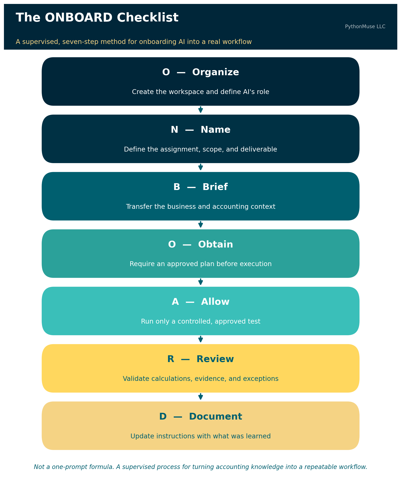
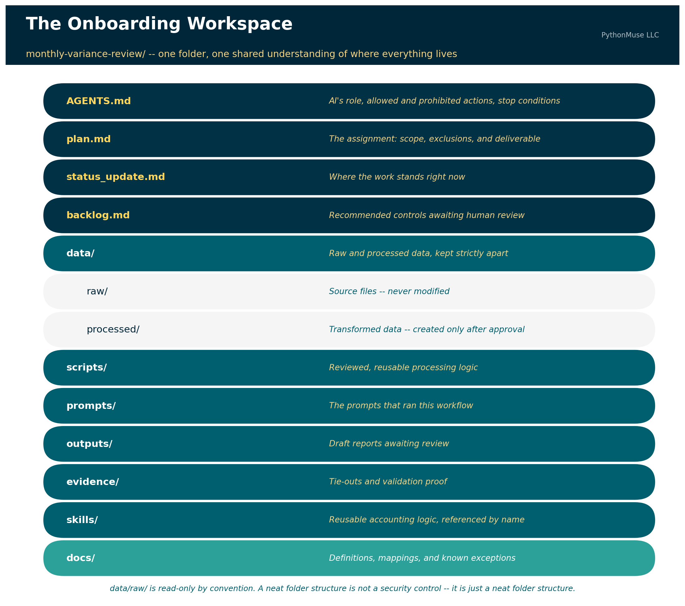

# Don't Just Prompt AI. ONBOARD It.

*A practical starter method for building your first accounting workflow*

---

**PythonMuse LLC**
*Published August 2026*



---

You completed the class.

You followed the micro-learnings.

You learned about prompts, agents, skills, scripts, hooks, and repositories — enough new terminology to make you briefly miss the simplicity of a 14-tab Excel workbook.

You are ready to build something.

Then you open a blank folder and think:

**What exactly am I supposed to tell AI first?**

The first instruction should not be:

> Analyze this file.

It should not even be:

> Build me an accounting agent.

Your first step is to create a controlled place for the work and explain how AI is expected to operate inside it.

Think about how you would assign work to a new accounting intern. You would not forward the intern a general ledger, disappear into meetings for three days, and return expecting a completed management report. You would explain the role, the purpose of the assignment, the steps to perform, what the intern is allowed to do, what the intern must not do, when to stop and ask questions, what evidence must be preserved, and who is responsible for reviewing the work.

AI needs the same kind of onboarding.

The analogy has limits. AI is not an employee, does not accept professional responsibility, and does not reliably follow every instruction simply because you wrote it in a Markdown file. But written instructions are still an important starting point. They help AI understand the intended workflow, and they help you — the accountant — recognize where written instructions alone are insufficient and stronger controls, such as permissions, validation scripts, or hooks, may be needed.

If you've already read [From One-Time Analysis to Repeatable Workflows](../11-one-time-to-repeatable-workflows/), you know the moment you run something twice, it stops being analysis and becomes a system. ONBOARD is how you bring AI into that system deliberately, from the very first run, instead of discovering the rules the hard way in month three.

The **PythonMuse ONBOARD checklist** gives you a practical way to begin:

- **O — Organize the workspace and define AI's role**
- **N — Name the assignment**
- **B — Brief AI on the business**
- **O — Obtain and approve a plan**
- **A — Allow controlled execution**
- **R — Review the work and evidence**
- **D — Document what was learned**

This is not a one-prompt formula. It is a supervised process for turning accounting knowledge — including the knowledge you didn't know you had — into a repeatable workflow.

> **🛠️ Reminder — this is a framework.** The worked example below uses `AGENTS.md` inside Claude Code, running in VS Code through the GitHub Copilot extension — that's the daily setup this article was tested against. But ONBOARD is not a Claude feature, and it isn't tied to any single vendor. The same seven steps apply if your organization standardizes on ChatGPT with file uploads and custom instructions, Gemini, or any other MCP- or tool-use-capable client. You might call the instruction file something else — `CLAUDE.md`, `.cursor/rules`, a system prompt — but the discipline of organizing, naming, briefing, obtaining approval, allowing controlled execution, reviewing, and documenting stays identical. This series teaches the framework, not the vendor.

---

## The Example: Building a Monthly Variance Review Workflow

Suppose you want to build a workflow that compares current-year and prior-year operating expenses, identifies material variances, and prepares questions for management.

You may already know how to perform this review manually. The challenge is making your knowledge explicit enough that AI can assist without guessing what you meant.

Here is how to execute the workflow using ONBOARD.

---

## O — Organize the Workspace and Define AI's Role

Before giving AI financial data, create a structured project folder. The **PythonMuse Accounting Workflow Starter** provides this shape as a ready-to-use template — or you can build it yourself in a couple of minutes:

```text
monthly-variance-review/
├── AGENTS.md
├── plan.md
├── status_update.md
├── backlog.md
│
├── data/
│   ├── raw/
│   └── processed/
│
├── scripts/
├── prompts/
├── outputs/
├── evidence/
├── skills/
└── docs/
```



> **Further reading:** The [PythonMuse Accounting Workflow Starter](https://github.com/PythonMuse/pythonmuse-accounting-workflow-starter) is this article made runnable — a template repository with the folder structure above, a starter `AGENTS.md`, and all seven ONBOARD prompts ready to fire in order. Click "Use this template" on GitHub to get your own copy.

The first prompt should ask AI to create the workspace, explain its structure, and draft the primary agent-instruction file.

### Sample Prompt 1: Create the Workspace

> Create a new project workspace named `monthly-variance-review`.
>
> Create the recommended folders and the following starter files:
>
> - `AGENTS.md`
> - `plan.md`
> - `status_update.md`
> - `backlog.md`
>
> Do not process any accounting data yet.
>
> Do not create business rules that I have not provided.
>
> After creating the workspace, explain the purpose of each folder and file.

At this stage, review whether the structure makes sense for the workflow. Do not add sensitive source data simply because the folders now look impressive.

A neat folder structure is not a security control. It is just a neat folder structure.

### Create the Agent-Instructions File

The next step is to define how AI should operate within this project.

The primary agent file may be named `AGENTS.md`, `CLAUDE.md`, or another filename required by the AI harness you're using. The exact filename matters less than the content — and whether the tool you picked actually reads it. If you want the fuller walkthrough of what belongs inside that file, [Your First CLAUDE.md](../17b-your-first-claude-md/README.md) covers the anatomy in more depth than we have room for here.

At a minimum, the file should contain three sections.

**1. AI's Role**

Explain what AI is within this workflow. For example:

> AI serves as an accounting workflow co-pilot supporting the preparation of a monthly operating-expense variance review.
>
> AI may organize files, inspect approved data structures, propose processing logic, create reviewed scripts, perform approved calculations, prepare draft outputs, run validation checks, and document exceptions.
>
> AI does not replace the preparer, reviewer, controller, or other responsible accounting professional.

**2. What AI Is Allowed and Expected to Do**

Describe the expected process step by step. For example:

1. Read the approved project instructions.
2. Confirm the required inputs are present.
3. Inspect file headers and data structure.
4. Identify missing fields or inconsistencies.
5. Propose a processing plan.
6. Wait for approval before processing data.
7. Preserve raw source files without modification.
8. Create transformed files only in approved folders.
9. Perform the approved calculations.
10. Run required validation checks.
11. Save outputs and supporting evidence.
12. Stop and report exceptions requiring accounting judgment.
13. Propose updates to permanent instructions when new information is learned.

**3. What AI Is Not Allowed to Do**

These boundaries are especially important. For example:

- Do not alter files stored in `data/raw/`.
- Do not overwrite source reports.
- Do not invent missing accounting policies, mappings, thresholds, explanations, or approvals.
- Do not assume that an unexplained variance is an error.
- Do not post journal entries or modify the general ledger or any production accounting system.
- Do not distribute final reports without human review.
- Do not treat a generated explanation as verified fact.
- Do not send unmasked financial or sensitive data to an external cloud service.
- Do not copy sensitive fields into prompts, logs, error messages, or external tools.
- Do not continue processing when a required reconciliation fails.
- Do not change permanent workflow instructions without presenting the proposed changes for human approval.

### Sample Prompt 2: Draft the Agent File

> Draft the primary agent-instruction file for this project.
>
> At a minimum, include:
>
> 1. **AI's role in this folder and workflow**
> 2. **What AI is allowed and expected to do**, including the required step-by-step process
> 3. **What AI is not allowed to do**
>
> Include explicit instructions that AI must not:
>
> - Alter raw source files
> - Invent accounting rules or explanations
> - Post entries or modify production systems
> - Distribute unreviewed outputs
> - Pass unmasked sensitive or financial data to cloud-based tools for processing
> - Continue when required validations fail
>
> Also define when AI must stop and ask for human review.
>
> Draft the file first and show it to me for review. Do not save or apply it until I approve it.

Review this draft carefully. The fact that a restriction appears in `AGENTS.md` does **not** guarantee AI will never violate it. Written instructions guide model behavior — they are not the same as an enforced technical control.

For example, an instruction stating that unmasked data must not leave the local environment is an important starting point. During implementation, AI may recommend stronger protections such as a masking script, a pre-processing validation, a prohibited-field scanner, restricted folder permissions, a hook that blocks an external tool call, an approved-tools list, a confirmation requirement before network access, or logging that records which files were transmitted or processed.

That is a healthy progression. The instruction identifies the rule. The implementation process helps determine how the rule should be enforced.

### Sample Prompt 3: Apply the Approved Agent Instructions

> Apply the approved agent instructions to `AGENTS.md`.
>
> Then review the file for:
>
> - Ambiguous language
> - Conflicting instructions
> - Missing stop conditions
> - Rules that rely only on AI compliance but may require a stronger technical control
>
> Do not build those technical controls yet.
>
> Add any recommended controls to `backlog.md` for my review.

**Completion check.** Before moving to the next letter, confirm that: the project structure exists; raw and processed data have separate folders; the primary agent file identifies AI's role; allowed and prohibited activities are documented; stop conditions are documented; potential technical controls are captured for later review; and no financial data has been processed yet.

Only then proceed to **N**.

---

## N — Name the Assignment

Now define what the workflow is supposed to accomplish. "Perform a variance analysis" is too vague. A stronger assignment might be:

> Compare current-year monthly operating expenses with the same period in the prior year by general ledger account and department. Identify items exceeding approved dollar or percentage thresholds. Prepare a draft management-review report with source amounts, calculated variances, known explanations, unresolved questions, and validation status.

The assignment should also define what is outside the scope. For example: balance-sheet accounts are excluded, payroll accounts are reviewed through a separate process, journal entries will not be prepared or posted, and AI-generated explanations will not be presented as facts without supporting evidence.

### Sample Prompt 4: Draft the Assignment

> Help me draft the assignment definition for the monthly variance review.
>
> Ask me one question at a time until you understand:
>
> - The business objective
> - The reporting period
> - Included entities and departments
> - Included and excluded accounts
> - Materiality thresholds
> - Expected output
> - Intended users
> - Reviewer and approver responsibilities
> - Activities outside the scope
>
> Use my answers to draft the assignment section of `plan.md`.
>
> Do not make assumptions when I have not provided an answer.
>
> Show me the draft before editing the file.

**Completion check.** Confirm that `plan.md` clearly states what question the workflow answers, what is included and excluded, what the final output should contain, who reviews the work, and what AI is not being asked to decide.

---

## B — Brief AI on the Business

The source reports will not contain every fact AI needs. This is where company-specific and accounting-specific knowledge must be documented.

You may know that department 410 was created during the year, that account 6210 is reviewed through the payroll process, that credits appear as positive amounts in one system export, that one entity uses a different fiscal calendar, that a customer changed names after an acquisition, that December balance-sheet amounts are snapshots rather than monthly activity, or that a reclassification makes two accounts comparable only when combined.

These details may feel obvious to you because you have worked with the company for years. They are not obvious to AI. They may not even be obvious to the accountant who joins the company next year.

### Sample Prompt 5: Let AI Interview You

> Act as a new accounting intern preparing to perform this variance review.
>
> Ask me one question at a time to identify the business and accounting context needed to complete the assignment correctly.
>
> Cover:
>
> - The meaning of each source report
> - Period activity versus ending balances
> - Account and department mappings
> - Sign conventions
> - Materiality rules
> - Known exclusions
> - New or discontinued accounts
> - Reclassifications
> - Expected exceptions
> - Required tie-outs
> - Situations requiring professional judgment
>
> Do not execute the workflow.
>
> Use my answers to propose updates to `plan.md`, `docs/`, a mapping file, or another appropriate project file.
>
> Explain why each item belongs in the recommended location and wait for my approval.

This step helps uncover information that may currently exist only in someone's memory. It is also where you will begin to realize that the hardest part of workflow design is not teaching AI subtraction. It is explaining why account 6210 must never be included, because of an exception created during a system conversion in 2019 that everyone remembers but no one documented.

**Completion check.** Confirm that the source reports are understood, important business definitions are documented, mappings and thresholds have a defined home, known exceptions are recorded, and AI has not filled missing context with assumptions.

---

## O — Obtain and Approve a Plan

Before processing data, require AI to describe exactly how it intends to complete the work. The plan should identify required input files, expected fields, processing steps, calculations, mapping logic, validation procedures, outputs, evidence to retain, stop conditions, and remaining questions.

### Sample Prompt 6: Propose the Execution Plan

> Based on the approved agent instructions, assignment definition, and business context, propose a detailed execution plan for the monthly variance review.
>
> Include:
>
> 1. Required inputs
> 2. Expected fields
> 3. Data-preparation steps
> 4. Calculations
> 5. Materiality logic
> 6. Mapping procedures
> 7. Validation checks
> 8. Exception handling
> 9. Output files
> 10. Evidence to preserve
> 11. Stop conditions
> 12. Open questions
>
> Identify every assumption separately.
>
> Do not process data, write production scripts, or generate the final report until I approve the plan.

Review the methodology before approving execution. A polished report generated from the wrong methodology is still wrong. It is simply wrong with a title page.

**Completion check.** Confirm that every material step is described, assumptions are visible, validation is part of the process rather than an afterthought, the plan agrees with `AGENTS.md`, no prohibited action is included, and open questions have been resolved or explicitly deferred.

---

## A — Allow Controlled Execution

Do not begin with the complete confidential dataset. Start with a small and controlled test — headers only, synthetic data, masked data, one department, one month, one calculation, one sample output.

Before sharing a sample with a cloud-based model, confirm that confidential fields have been removed or masked in accordance with company policy and the approved tool environment.

Do not ask AI to mask the data in the cloud after you have already uploaded the unmasked file. At that point, the horse has not merely left the barn. It has accepted a calendar invitation from the barn's competitor.

### Sample Prompt 7: Prepare the Controlled Test

> Review the approved plan and propose the smallest controlled test that can demonstrate whether the variance logic works correctly.
>
> The test must:
>
> - Use synthetic, masked, or otherwise approved data
> - Cover one limited portion of the workflow
> - Produce one sample output
> - Include validation evidence
> - Stop if required fields are missing
> - Stop if control totals do not reconcile
>
> Before executing, confirm that the test does not require unmasked sensitive data to be passed to a cloud-based service.
>
> Show me the test design and wait for approval.

After approval:

> Execute only the approved controlled test.
>
> Save transformed data in `data/processed/`.
>
> Save the sample report in `outputs/`.
>
> Save tie-outs and validation evidence in `evidence/`.
>
> Do not process additional departments, periods, or files.
>
> Summarize all assumptions, exclusions, errors, and unresolved questions.

**Completion check.** Confirm that only the approved sample was processed, raw files were not changed, no prohibited sensitive data was transmitted, calculations agree with expected results, evidence was created, and AI stopped where instructed.

---

## R — Review the Work and Evidence

Do not review only the final spreadsheet. Review how the result was produced.

Ask: were all expected records included? Did beginning and ending control totals agree? Were duplicates identified? Were missing mappings reported? Were materiality rules applied correctly? Were excluded accounts handled properly? Did AI distinguish facts from assumptions? Can every output amount be traced to its source? Did AI perform any action not included in the approved plan?

### Sample Prompt 8: Prepare the Review Package

> Prepare a review package for the controlled test.
>
> Include:
>
> - Source record count
> - Processed record count
> - Excluded record count and reasons
> - Source control totals
> - Processed control totals
> - Reconciliation differences
> - Missing fields
> - Duplicate records
> - Unmapped accounts or departments
> - Assumptions used
> - Exceptions requiring judgment
> - Traceability from each sample output to the source
> - Confirmation of whether every step followed the approved plan and `AGENTS.md`
>
> Do not describe the result as complete or approved.
>
> Identify items requiring human review.

The accountant remains responsible for determining whether the work is correct and appropriate. An AI-generated statement that says "all validations passed" is not sufficient evidence by itself. Review the underlying calculations and supporting files. For a deeper framework on what "reviewed" should actually mean — tying every number back to source, separating fact from assumption, and building an evidence trail that survives a real audit — see [From AI Answers to Audit Trails](../32-from-ai-answers-to-audit-trails/README.md).

**Completion check.** Confirm that the output ties to the source, validation results are supported, exceptions are visible, assumptions have not been presented as facts, reviewer judgment is documented, and the controlled test is approved before the scope is expanded.

---

## D — Document What Was Learned

Even after careful onboarding, the first output will probably reveal missing context. You may discover that one account should always be excluded, a department must be analyzed separately, a percentage variance is meaningless below a minimum comparison amount, a system export reverses signs, a newly created account must be combined with an old account, or a specific validation should occur before processing starts.

This does not necessarily mean the workflow failed. It means the review uncovered information that was previously stored in your head rather than in the workflow. The important step is to update the permanent instructions so the same issue is not repeated next month.

### Sample Prompt 9: Review the Permanent Instructions

> Based on the new information learned during this review, determine whether any of the following should be updated:
>
> - `AGENTS.md`
> - `plan.md`
> - Mapping or configuration files
> - Validation scripts
> - Supporting documentation
> - `backlog.md`
>
> Recommend the single best location for each update.
>
> Avoid duplicating the same rule across multiple files unless there is a specific reason.
>
> For every proposed change, explain:
>
> 1. What was learned
> 2. Why the current instructions were insufficient
> 3. Which file should be updated
> 4. The exact proposed wording or logic
> 5. Whether the change applies only to this project or should become a reusable skill
> 6. Whether a written instruction is sufficient or a stronger technical control may be needed
>
> Do not edit any files until I review and approve the proposed changes.

After review:

> Apply only the approved instruction and control updates.
>
> Summarize which files changed, what changed, why each change was made, how the change will affect the next execution, and which recommended controls remain in `backlog.md`.

This is how correction becomes institutional knowledge. The goal is not to avoid correcting AI. **The goal is to avoid correcting the same mistake every month.**

---

## Then Repeat the Controlled Process

Once the first test is reviewed and the instructions are updated, expand the scope gradually: test one additional department, review the output and evidence, document newly discovered rules, approve instruction updates, test one full entity, review again, then expand to the full approved population.

This is not a promise that every future run will be perfect. Accounting environments change. New accounts are created. Departments reorganize. Systems change. Materiality thresholds are updated. Management requests evolve. Someone adds a column to a report because apparently month-end close was becoming too peaceful.

The workflow should therefore continue to include human review, validation, and controlled updates. Once a few cycles like this are behind you, the natural next step is [AI Routines for Accountants](../30-ai-routines-for-accountants/README.md) — a scheduled version of the same propose-review-approve pattern, run automatically instead of by hand.

---

## Written Rules Are the Beginning, Not the Entire Control Environment

An agent file is valuable because it gives AI operating context. It also creates a reviewable record of the workflow's intended boundaries.

But accountants should not confuse instructions with enforcement. Telling AI not to transmit sensitive data does not create a firewall. Telling AI not to overwrite raw data does not create a read-only permission. Telling AI to stop when a reconciliation fails does not guarantee that every failure condition has been identified.

The written instruction is the starting point. As the workflow matures, the accountant and technical team may determine that certain requirements should be supported by permissions, hooks, scripts, automated validations, approved-tool restrictions, logging, network controls, human approvals, read-only source folders, or data-loss-prevention policies.

That is not evidence that the original agent file was pointless. It means the workflow is moving from a written expectation toward an enforceable control.

Accountants already understand this distinction. A policy stating that journal entries require approval is important. A system workflow that prevents an unapproved entry from posting is stronger. AI-enabled accounting workflows should evolve in the same direction.

---

## Your First Workflow Will Teach You What You Forgot to Explain

The first run will not only test AI. It will test whether the accounting process has been made explicit.

You will likely discover details that everyone on the current team "just knows." Those details are exactly what a new employee, future reviewer, or AI co-pilot will not know.

Each controlled execution should therefore leave the project with a reviewed output, validation evidence, fewer undocumented assumptions, better instructions, stronger controls, and a clearer process for the next run.

Your first AI workflow does not need to be autonomous. It does not need to process every entity. It does not need to impress anyone on LinkedIn.

It needs to be controlled, reviewable, and better documented after each execution.

Start by giving the work a home. Define AI's role. State what it may and may not do. Explain the assignment as though you were onboarding a capable intern who has never worked at your company. Then review the work as though your name is going on it.

Because it probably is.

---

**A note on how this article was made.** This article started with me. The recurring frustration — watching a promising AI workflow start with a vague prompt instead of a plan, and the ONBOARD checklist that grew out of fixing that for my own work — is mine. ChatGPT (5.5) helped me shape my notes into a first structured draft. Claude Opus reviewed that draft for accuracy and tone. Claude Code (Claude Sonnet 5) then built the final article, the visuals, and the site wiring — working from my direction and feedback at each step. I reviewed every output, pushed back on things I didn't like, and made all final content decisions. That process — bringing your own experience, using AI to build and iterate, and staying in the editorial seat throughout — is exactly what this series is about.

---

*Related: [Your First CLAUDE.md](../17b-your-first-claude-md/README.md) | [From One-Time Analysis to Repeatable Workflows](../11-one-time-to-repeatable-workflows/) | [AI Routines for Accountants](../30-ai-routines-for-accountants/README.md) | [From AI Answers to Audit Trails](../32-from-ai-answers-to-audit-trails/README.md) | [Model Selection Is an Accounting Control](../36-model-selection-is-a-control/README.md) | [When the Invoice Starts Giving Orders](../37-when-the-invoice-gives-orders/README.md)*

*© 2026 PythonMuse LLC. Content licensed under [CC BY-NC-SA 4.0](../../LICENSE); code licensed under [MIT](../../LICENSE-CODE).*
