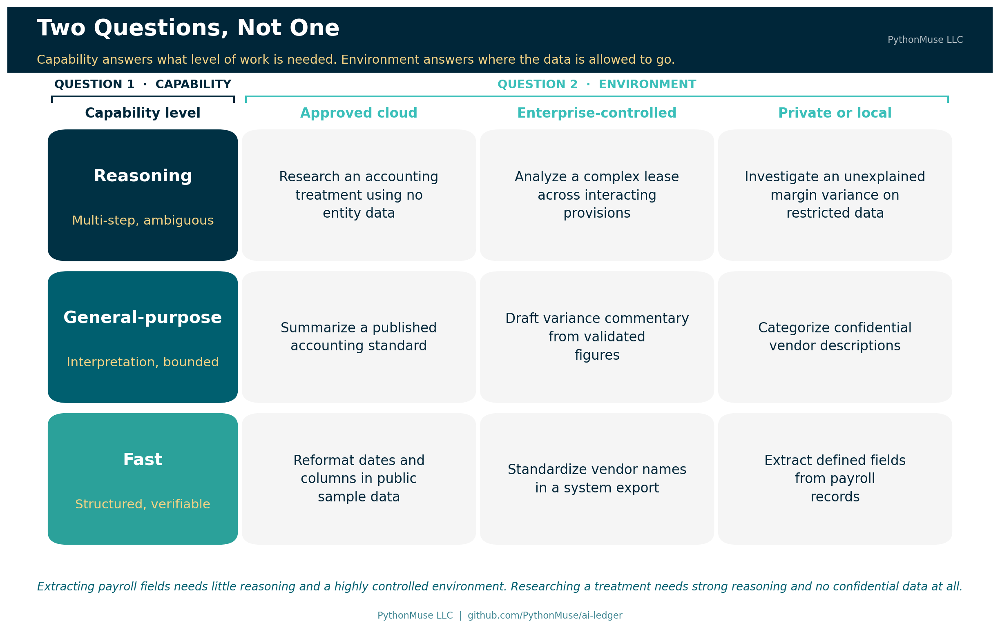
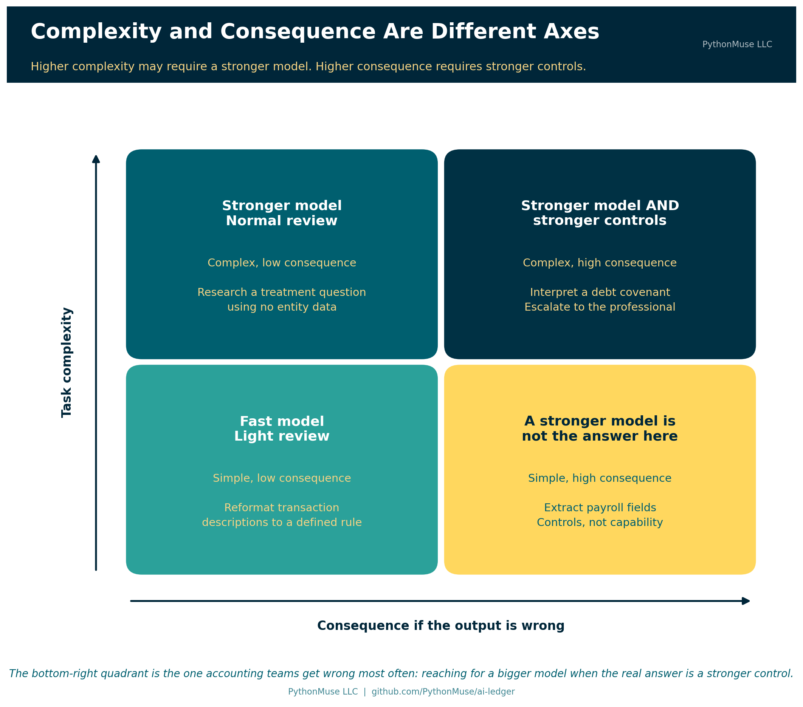
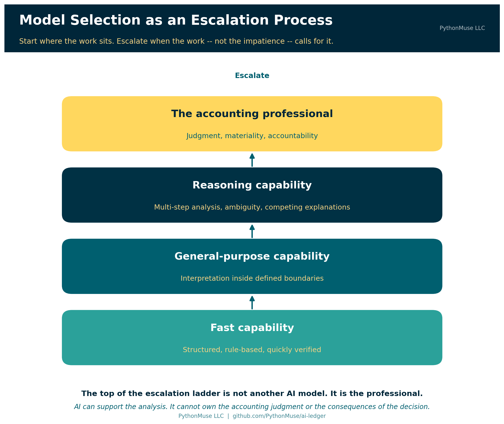
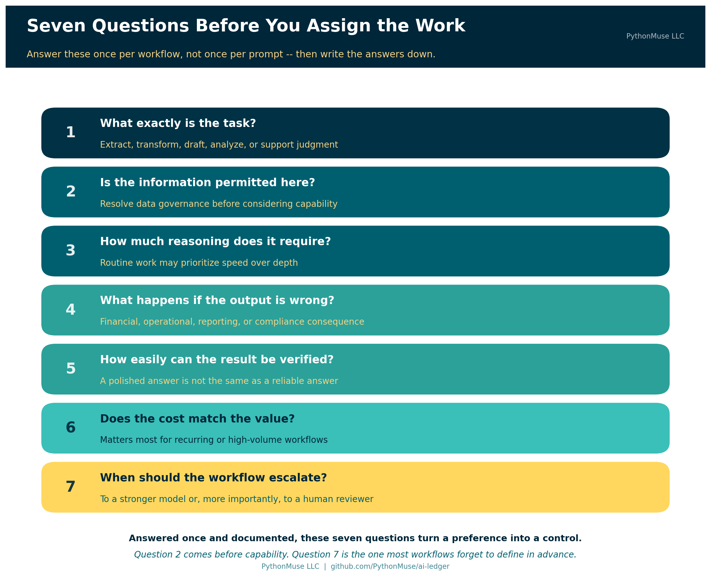

# Model Selection Is an Accounting Control

*Why choosing an AI model belongs in your workflow design, not your personal preferences*

---

**PythonMuse LLC**
*Published August 2026*

---

When accounting and finance professionals talk about AI models, the conversation often starts in the wrong place. We ask which model is the smartest, which one wins on benchmarks, or which one has the largest context window. Those questions can matter. They are not where an accounting workflow should begin.

The better question is: **what level of AI capability does this accounting task actually require?**

Choosing the most powerful model for every task is like sending a senior partner to file invoices. It works. It is also expensive, unnecessary, and slightly insulting to everyone involved.

In accounting, we already match people, review levels, and controls to the risk and complexity of the work. We should approach AI models the same way. Model selection is not simply a technology preference. Once AI becomes part of a repeatable workflow, **model selection becomes an accounting control**.

---

## What We Mean When We Say "Model"

Before going further, it is worth pausing on the word doing most of the work in this article, because it did not start in computing and it is easy to misread if your only reference point is a computer.

Here is the quick chain, top to bottom. Artificial intelligence, or AI, is a broad field of study that predates most of our careers — the term was coined in 1956. Generative AI is the slice of that field this series lives in: tools that create or transform content — text, code, a chart, a slide deck — in response to a prompt. The engine inside most of those tools is a large language model, or LLM: software trained on enormous amounts of text to recognize and continue patterns in language, which is why you can talk to it in plain English instead of a command syntax. What you actually open — the chat window, the Copilot panel in VS Code, the mobile app — is the AI assistant, the car built around that engine. Throughout this article, "model" means the engine. Everything else is dashboard.

Now the word itself, outside of software. A fashion model gives you an approximation of how a garment will look, without your exact proportions. A model train captures a locomotive's shape and motion, not its rivets. A hurricane forecast shows several storm models at once — meteorologists never trust just one — each predicting a path from the patterns in thousands of storms that came before it, and each getting shakier the further out it reaches.

A language model is built the same way, from patterns in existing writing instead of storm tracks or fabric. And it inherits the same limitation as a model of a 1986 taxi: it can describe 1986 in perfect detail and knows nothing about 2026, because 2026 was not in its training data. A model built from everything written up to a certain date can name every accounting standard, president, or ticker symbol that existed before that date. Ask about something from the following week, and a well-built model says it does not know. A poorly built one guesses anyway — confidently, in full sentences, which is a far more expensive way to be wrong than a shrug.

That distinction is worth sitting with, because it is the same discipline behind professional skepticism: a model produces a prediction, not a record. Treat its output the way a meteorologist treats one forecast track among several — genuinely useful, never the whole picture, and never a substitute for watching the actual sky.

---

## Start With the Task, Not the Model

Accountants rarely assign work based only on who is available. We consider the nature of the work itself. Is it routine? Does it require interpretation? Could an error materially affect a decision? Does it need specialized expertise?

AI tasks deserve the same classification.

Consider four different requests: standardize vendor names in a CSV file, draft commentary for validated expense variances, analyze a complex lease agreement, or evaluate alternative accounting treatments for a transaction.

All four can happen in the same AI interface. They do not require the same level of capability. Standardizing vendor names is structured and easy to verify. Drafting variance commentary requires language skill and some interpretation. Analyzing a complex lease means connecting provisions across a document and understanding how they interact. Evaluating accounting treatments involves professional judgment, and cannot simply be delegated to a model.

The accounting task should drive the model decision, not the other way around.

---

## Permission Comes Before Selection

Before selecting a model, there is an earlier question: **is this information permitted in this AI environment?**

Model capability does not override data governance. Payroll records, employee information, customer data, confidential contracts, and financial information may require approved environments. Some information may not be permitted in certain AI tools at all.

That decision belongs to your organization's AI permissions framework — the territory covered in [How to Use AI Without Sending the Wrong Data](../06-safe-ai-data-workflows/). Once the information is permitted, model selection becomes the next control.

The two questions are related but distinct. **AI permissions determine where the work may happen. Model selection determines what level of capability should perform the work.**

---

## Think in Capability Levels

Specific model names will keep changing. A durable accounting framework should not depend on today's model leaderboard, which has the shelf life of a banana — or of that 1986 taxi model from a few paragraphs back. Think instead in broader capability levels.

**Fast models** suit structured, routine, easily verified tasks: renaming columns, reformatting dates, extracting defined fields, standardizing descriptions, building simple summaries. The rules are clear and the output can be checked quickly. Reaching for the most advanced reasoning model here adds cost without adding value.

**General-purpose models** suit work that requires some interpretation: drafting variance commentary, categorizing expense descriptions, summarizing accounting policies, preparing first drafts of procedures, explaining validated financial results. The model needs flexibility, but the task still has boundaries and an accountant can review it.

**Reasoning models** earn their cost when the work involves several connected steps or genuine ambiguity: comparing provisions across contracts, analyzing complicated lease terms, designing reconciliation logic, investigating inconsistent financial results, weighing several competing explanations for a variance.

These tasks require more than summarization. The model has to connect facts, follow conditions, and work through uncertainty. But greater reasoning capability does not remove the need for review. **A stronger model is not a substitute for stronger controls.**

One caution on vocabulary: "reasoning model" is a vendor marketing term, not an accounting standard. Nobody audits the label. The three levels above are a way of thinking about the work, not a certification you can rely on.

### What the levels look like across the major providers

Every major provider organizes its lineup into roughly these tiers, using its own names. Here is how the mapping looked in August 2026:

| Capability level | Claude | OpenAI | Gemini | Microsoft 365 Copilot |
|---|---|---|---|---|
| **Fast** | Haiku | GPT-5.6 Luna — "optimized for cost-sensitive workloads" | Flash-Lite — "fastest, most cost-effective" | Whatever your organization enables, with **Auto** choosing |
| **General-purpose** | Sonnet | GPT-5.6 Terra — "balances intelligence and cost" | Flash | Same — the list is set by your admin |
| **Reasoning** | Opus | GPT-5.6 Sol — "frontier model for complex professional work" | Pro | Same — including which high-end models appear at all |

> **A note on tools:** That table is a snapshot, not a framework. The rows are the part worth learning; the columns will be wrong within a year, possibly within a quarter. If you memorize one thing here, memorize the rows.

There is a second shift worth noticing, because it changes how this decision gets made. Capability is increasingly a **dial rather than a model name**. Claude and OpenAI both now expose an effort setting that runs from low through maximum on the same model, so the same model can be pointed at a quick reformatting job or a hard analytical one. That does not undermine the three levels. It reinforces the argument: if the capability level is a setting your workflow chooses, then it is unmistakably a workflow parameter — something to be designed and documented, not something to shrug at.

> **🛠️ Reminder — this is a framework.** The examples in this article were tested using Claude in Visual Studio Code through the GitHub Copilot extension, which is the daily setup behind most of this series. Nothing here is Claude-specific. The same seven questions apply if your organization standardizes on ChatGPT, Gemini, or Microsoft 365 Copilot — and if your organization has one approved tool and no picker at all, the questions still apply. They just get answered by whoever configures the tool instead of by you. This series teaches the framework, not the vendor.

---

## Security Is a Separate Dimension

There is an important distinction between model capability and model environment. A local or secure model is not "higher" or "lower" than another model. Security answers a different question.

Model selection therefore runs across two dimensions. The first is capability: fast, general-purpose, or reasoning. The second is environment: approved cloud, enterprise-controlled, private, or local.

A payroll task may need no sophisticated reasoning at all, while the sensitivity of the data demands a highly controlled environment. A complex accounting research question may need strong reasoning while involving no confidential information whatsoever. The accountant has to consider both.

And sometimes the two dimensions are wired together in the product itself, which is exactly when this matters most. In Microsoft 365 Copilot's Cowork experience, the highest-capability Anthropic model available in the picker — Claude Fable 5, in preview as of August 2026 — is off by default and *requires data retention*. Microsoft's own documentation is explicit: select it, and your prompts and responses are retained by the model provider rather than following Cowork's default no-retention posture. An administrator has to enable it first, and the interface shows a banner the whole time it is selected.

Read that as an accountant and it is not a footnote. It is a control decision. Reaching for more capability changed the data-retention posture of the work. That is the two-dimensional trade-off this section describes, shipped as a real product setting, with an approval gate and a warning banner attached. Whoever picks that model is making a governance decision, whether or not they realize it.

---

## Ask What Happens If the Model Is Wrong

Complexity is only part of model selection. Consider the consequence of error.

Suppose AI incorrectly capitalizes a word in a vendor name. The consequence is minor. Now suppose AI misinterprets a debt covenant. That error could affect management decisions, disclosures, or compliance.

The two tasks may involve similar amounts of text. Their risk is not remotely similar.

Which leads to the next question: **what happens if the output is wrong?**

As the consequence of error rises, so should the strength of the workflow. That might mean a more capable model — or better source documentation, added validation steps, more structured instructions, increased human review, or formal approval before the output is used.

The distinction matters, and it is the single most useful idea in this article: **higher complexity may require stronger models. Higher consequence requires stronger controls.** Those are not the same thing, and a bigger model is a remarkably popular way to avoid building the control you actually needed.

---

## Consider How Hard the Output Is to Verify

Here is a factor accountants are unusually well positioned to evaluate: **how difficult is this output to verify?**

Suppose AI reformats 5,000 transaction descriptions according to a clearly defined rule. A script can compare before and after, so verification is fast and complete.

Now suppose AI offers five explanations for why gross margin declined. The explanations may sound convincing. Verifying each one means tracing calculations, source data, and business assumptions.

Same tool. Same session. Entirely different risk.

An AI task should not be judged only by how quickly the model produces an answer. It should also be judged by how efficiently a reviewer can validate the result. Call it the **verification-cost test**: delegate the work when the output can be verified more efficiently than producing it manually.

When verification becomes harder than the work itself, the workflow needs to change — more structured outputs, one large task broken into smaller checkable steps, or more of the judgment kept with the accountant. [From AI Answers to Audit Trails](../32-from-ai-answers-to-audit-trails/README.md) covers what that validation looks like in practice.

---

## Model Selection Can Be an Escalation Process

You do not need to begin every task with the most powerful model available. Model selection works better as an escalation process.

A routine extraction or transformation can start with a fast model. If the task needs more interpretation, move it to a general-purpose model. If ambiguity or multi-step analysis remains, escalate to a reasoning model. If the matter involves professional judgment, material uncertainty, or accountability, it escalates to the accountant.

That final step is the one that matters.

The top of the escalation ladder is not another AI model. **It is the professional.**

AI can support the analysis. It cannot own the accounting judgment or the consequences of the decision.

---

## Cost and Speed Are Controls Too

Model selection affects workflow economics. That may sound like a technical concern, but accountants already think exactly this way. We ask whether a control is proportionate to the risk, whether a process can scale, and whether additional cost buys anything real.

Imagine a workflow processing 50,000 transaction descriptions every month. Across the major providers in August 2026, the fast tier costs roughly five to ten times less per unit of work than the top tier. At that volume the difference stops being a rounding error. If a fast model performs the task accurately and the results are easy to validate, a reasoning model adds cost and very little else.

Now consider one complicated acquisition agreement. There, the cost difference between tiers is trivial next to the value of getting the analysis right.

The correct decision depends on the task. This is why there is no universal "best model." There is only a model that is more or less appropriate for a particular job. ([The PDF Token Trap](../16-pdf-token-trap/) covers the related trap of paying for capability you are accidentally spending on document handling.)

---

## When the Model Changes, the Control Changes

Here is the part most teams discover late, and it follows directly from taking the rest of this article seriously.

If model selection is a control, then a model change is a change to your control environment.

Providers update, retire, and rename models continuously. Platforms route requests automatically. Administrators enable and disable model families. Any of these can change what performs your month-end workflow without anyone in accounting filing a change request — or noticing.

Accountants already know how to handle this. It is change control, applied to a new kind of component:

- **Record which model actually ran**, not just which model the procedure specifies. Some products help here — Microsoft 365 Copilot's Cowork shows a model badge on each response so you can see what produced it. Capture that in your evidence.
- **Pin the version where the platform allows it**, so a workflow you validated is the workflow that runs next month.
- **Re-validate after a tier or version change.** A model upgrade is genuinely likely to be an improvement. It is still an unvalidated change to a control.
- **Record the run, not just the model name.** The same model can return different answers to the same prompt. Evidence that says "we used the reasoning tier" is a policy statement. Evidence that preserves the actual inputs, outputs, and validation for the run that happened is an audit trail.

This is where model selection meets the practices in [When to Trust AI to Run Your Accounting Workflows](../12-audit-ready-ai-workflows/) and [Pull Requests Are Internal Controls](../20e-pull-requests-are-controls/). A model change is a change. Changes get reviewed.

---

## From User Preference to Workflow Control

In an individual AI chat, choosing a model feels like a personal preference. In a governed accounting workflow, it becomes something considerably more formal.

Here is what monthly variance commentary looks like once the decision is written down rather than improvised:

| Design element | Documented decision |
|---|---|
| **Task** | Draft commentary on monthly expense variances |
| **Task type** | Draft — not extract, not judgment |
| **Permission** | Validated variance figures only; no employee or customer data |
| **Capability level** | General-purpose, within an approved enterprise AI environment |
| **Inputs** | Validated variance calculations produced by reviewed logic |
| **Escalation trigger** | Contradictory or unexplained drivers escalate to the reasoning tier |
| **Second escalation** | Material or judgmental items escalate to the controller |
| **Reviewer** | Controller review required before the commentary is used |
| **Evidence retained** | Source file, instructions, output, validation evidence, and the model that ran |
| **Re-validation** | Re-tested after any model tier or version change |

At that point model selection is no longer arbitrary. It is part of the workflow design. The organization can explain why a particular level of capability was selected, define when escalation should occur, and periodically review whether the control still operates as intended.

This is where AI starts to look less like casual chatbot use and more like an accounting process. If you have not yet set up a workflow this way, [Don't Just Prompt AI. ONBOARD It.](../35-onboard-ai-workflows/README.md) walks through building the first one; this article is the decision that belongs inside it.

> **Further reading:** A fill-in version of the table above is available as a reusable [Model Selection Decision Record](https://github.com/PythonMuse/ai-ledger/blob/main/templates/model-selection-record.md) in this repository, along with the seven questions as a pre-flight checklist and a model change-control log.

---

## A Practical Model-Selection Checklist

Before assigning an accounting task to AI, work through seven questions.

**First, what exactly is the task?** Determine whether the model is being asked to extract, transform, draft, analyze, or support judgment.

**Second, is the information permitted in this environment?** Resolve data governance before considering model capability.

**Third, how much reasoning does the task require?** Routine work may prioritize speed; complex work may need depth.

**Fourth, what happens if the output is wrong?** Consider the financial, operational, reporting, and compliance consequences of error.

**Fifth, how easily can the result be verified?** A polished answer is not the same as a reliable answer.

**Sixth, does the model cost match the value of the task?** This matters most for recurring or high-volume workflows.

**Finally, when should the workflow escalate?** Define in advance when the task moves to a stronger model or — more importantly — to a human reviewer.

Answer these once per workflow rather than once per prompt, write the answers down, and you have turned a preference into a control.

---

## The Right Model Is the One That Matches the Work

Accountants do not need to memorize every new model release. Genuinely — that is not the skill. We need to understand how to match AI capability to the work being performed.

That is a far more durable thing to know.

The right AI model is not necessarily the newest, the fastest, or the most powerful. **The right model is the one whose capability, environment, cost, and controls match the accounting task.**

Once AI becomes part of a repeatable accounting process, that choice should not happen by accident. It should be designed, documented, and governed.

Because model selection is no longer just an AI decision.

**It is an accounting control.**

---

**A note on how this article was made.** This article started with me. The argument — that accountants keep asking which model is best when the useful question is what the work actually requires, and that the answer belongs in workflow design rather than personal preference — is mine. ChatGPT (GPT-5.6 Sol) helped me shape my notes into a first structured draft. Claude Sonnet and Claude Opus reviewed that draft for accuracy, which is where the cross-provider comparison and the Microsoft Copilot data-retention example came from — both were verified against vendor documentation rather than taken on faith, and one of them changed a claim I had originally written the other way around. Claude Code (Claude Opus 5) then built the final article, the visuals, the decision-record template, and the site wiring — working from my direction and feedback at each step. I reviewed every output, pushed back on things I didn't like, and made all final content decisions. That process — bringing your own experience, using AI to build and iterate, and staying in the editorial seat throughout — is exactly what this series is about.

---

*Related: [Stop Using AI Like It Is Excel](../14-ai-team-for-accountants/) | [When Copilot Is the Only Approved AI Tool](../33-copilot-only-approved-ai-tool/README.md) | [How to Use AI Without Sending the Wrong Data](../06-safe-ai-data-workflows/) | [When to Trust AI to Run Your Accounting Workflows](../12-audit-ready-ai-workflows/) | [From AI Answers to Audit Trails](../32-from-ai-answers-to-audit-trails/README.md) | [Don't Just Prompt AI. ONBOARD It.](../35-onboard-ai-workflows/README.md)*
