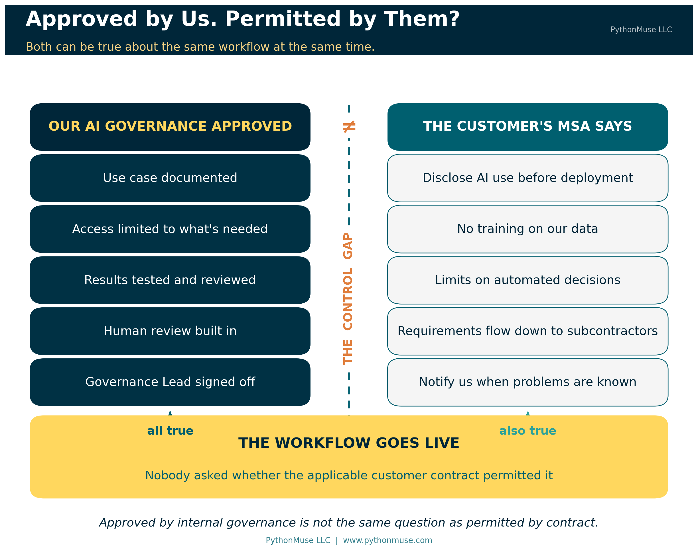
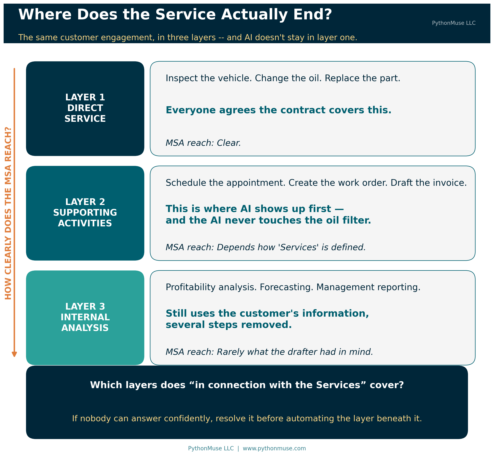
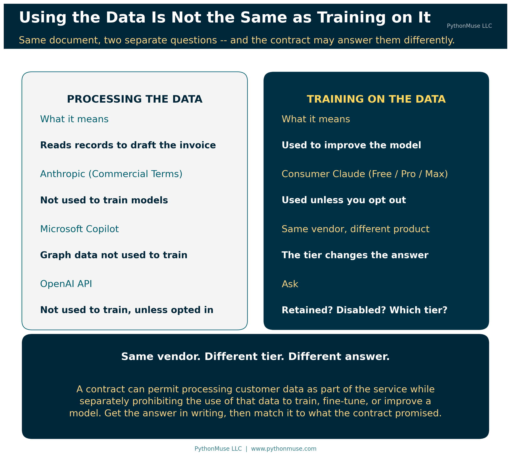
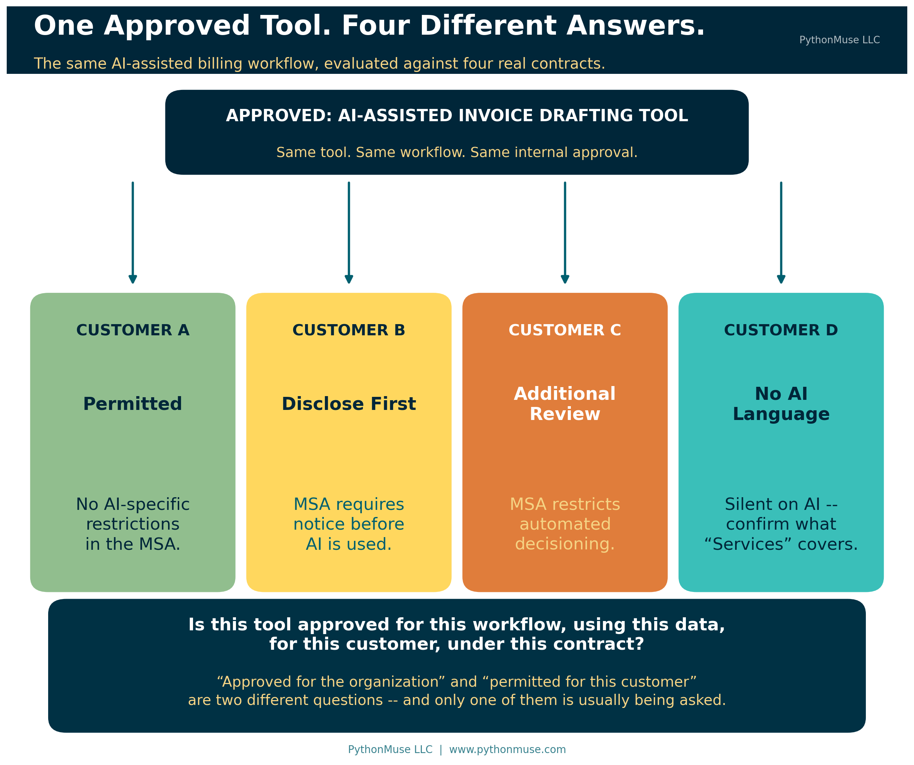
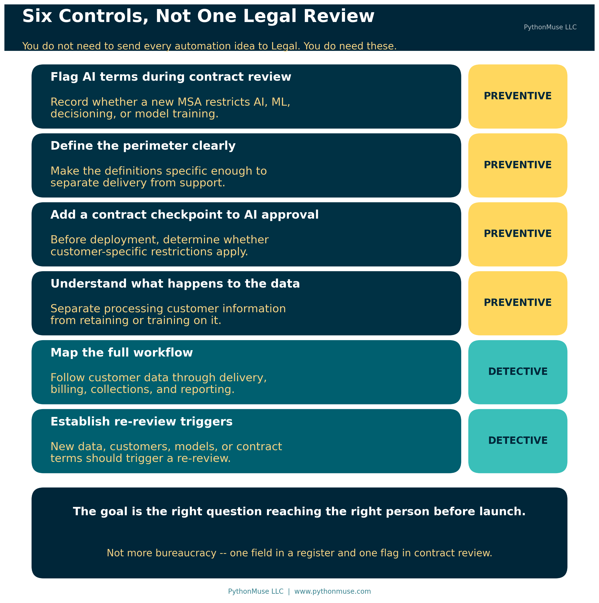

# Your AI Workflow Was Approved. Did Anyone Read the Customer Contract?

*Why your AI use-case register and your contract register need to start talking to each other*

---

**PythonMuse LLC**
*Published September 2026*

---

Imagine this.

Your accounting team spends several weeks building an AI-assisted workflow. The use case is documented. Access is limited. The team identifies the data involved, tests the results, builds in human review, and keeps evidence of the testing. Finally, the AI Governance Lead approves the workflow.

Then the workflow goes live.

A few weeks later, someone asks a question that was not part of the approval process:

**Does this workflow touch customer data?**

It does.

That leads to another question:

**What does the customer's contract say about AI?**

Someone opens the Master Services Agreement that Sales negotiated months earlier. Inside the contract is language about the use of artificial intelligence, machine learning, automated decisioning, or automated tools.

Now you may have a problem.

> **A quick definition:** A **Master Services Agreement**, or MSA, is the umbrella contract between your company and a customer. It sets the standing terms — confidentiality, data handling, liability, subcontracting, service standards — that apply across every engagement, statement of work, or purchase order underneath it. It is usually negotiated once, signed, filed, and then rarely read again by anyone who is not a lawyer. That last part is the problem this article is about.

The workflow may be secure. It may be accurate. It may have passed every internal control you created.

But it may not comply with a contract your company already signed.

Nobody did anything wrong. That is the uncomfortable part. Legal reviewed the contract. Sales negotiated it. IT vetted the tool. Accounting designed the controls. The AI Governance Lead approved the use case. Every department did its job correctly, and the risk still landed in the gap between them.

So what do you do next?

More importantly, how do you prevent this from happening again?

---

## This Is No Longer a Hypothetical Risk

AI-specific language has started appearing in customer MSAs, and I have seen it firsthand.

In one case, the contract effectively required the vendor to disclose certain uses of AI, machine learning, or automated tools before using them in connection with services provided to the customer. It restricted the use of customer information to train, fine-tune, or improve AI models without written approval. It also placed limits on automated tools supporting certain decisions, extended some requirements to subcontractors, and required human oversight and notification when problems with the technology became known.

> **A note on legal advice:** This article is an operational observation about how contract language affects workflow design — not legal analysis, and not a reading of anyone's specific agreement. The exact interpretation of any contract belongs with qualified legal counsel. What follows is about the questions an accounting or finance team should be asking *before* that conversation becomes urgent.

What caught my attention was not the legal wording. It was the operational question sitting underneath it:

> **What does it mean to use AI "in connection with the Services"?**

That sounds simple until you look at a real process.

Suppose a company provides vehicle maintenance. The direct service is easy to identify. A technician inspects the vehicle, changes the oil, replaces a part, or performs a repair.

But the service has many supporting steps.

A customer schedules an appointment. A work order is created. A reminder is sent. A technician is assigned. The completed work is recorded. An invoice is prepared. Accounts Receivable may follow up later.

Now imagine that AI is introduced into some of those steps.

An AI agent schedules the appointment. Another tool creates the work order from the customer's email. AI summarizes technician notes and drafts the invoice description.

The AI never touched the oil filter.

But is it being used in connection with the service?

That may depend on how the contract is written.

---

## Where Does the Service Actually End?

This is why the definition of **Services** matters so much, and why it is worth thinking about the process in layers.

The first layer is the direct service promised to the customer.

The second includes the activities that support delivery of that service — scheduling, administration, customer communication, billing, and collections.

The third includes broader internal activities that may still use customer information, such as profitability analysis, forecasting, and management reporting.

If a contract limits the use of AI "in connection with the Services," which of those layers does it cover?

The definition of AI matters just as much.

Contracts may refer to artificial intelligence, machine learning, automated decisioning, or simply automated tools. Those terms can describe very different technologies.

A generative AI agent is not the same as a machine-learning scoring model. A bot that copies data between two systems is not the same as an AI tool that reviews information and recommends an outcome. And an automated appointment reminder — which has existed since long before anyone was worried about AI — should not automatically inherit the same risk profile as a decision engine.

For new contracts, it may be worth making those boundaries clearer during negotiation.

For contracts already in place, the practical question is simpler:

> **Where does the customer's contracted service end, and where do our internal supporting processes begin?**

If nobody in the organization can answer that confidently, it is worth resolving before building automation on the assumption that a process falls outside the contract.

---

## Why Accountants Should Care

At first glance, this sounds like a Legal problem, or maybe an IT problem.

It is also an accounting problem — and arguably it lands on accounting harder than anywhere else, because accounting sits downstream of everything.

Accounting and finance teams are increasingly using AI around billing, collections, project accounting, contract review, reconciliations, expense review, forecasting, variance analysis, and reporting. Many of those workflows run directly on customer or vendor information.

Consider an AI-assisted billing workflow.

The tool may read project records, employee time, billing instructions, contract terms, and customer correspondence. It may identify missing support, prepare an invoice narrative, calculate charges, or route the draft for review.

From an accounting-control perspective, that workflow may look excellent. If you have been following the [audit-ready workflow framework](../12-audit-ready-ai-workflows/README.md) in this series, it checks every box.

But there is now another control question:

> **Does the applicable customer contract permit the workflow?**

That is a different question from whether *your company* permits the workflow.

And that is the control gap.

Here is the version that should feel familiar. No accountant would recognize revenue on a contract without reading the contract. We read it for performance obligations, for variable consideration, for termination clauses, for anything that changes the timing or amount. We would never dream of booking it from the sales summary alone.

Then we build an AI workflow that processes that same customer's data — and never open the same document.

---

## Using Customer Data Is Not the Same as Training on Customer Data

There is another distinction worth getting right, because it is the one most likely to be blurred in a hallway conversation.

An AI billing tool may need customer project records to prepare a draft invoice. The provider may contractually agree not to use those records to train or improve its models. Another provider may have entirely different terms — retaining inputs, or using information to improve its service unless a particular tier or setting is in place.

A contract may allow customer information to be **processed** as part of the service while separately restricting whether that information can be used to **train, fine-tune, or improve a model**.

So the AI review cannot stop at "does this workflow touch customer data?" You also need to understand what happens to the data after the tool receives it.

These are answerable questions, and the answers are usually published. A few real examples, current as of this writing:

- Microsoft states that for Microsoft Copilot, "prompts, responses, and data accessed through Microsoft Graph aren't used to train foundation LLMs, including those used by Microsoft Copilot." Interaction data is stored, encrypted, and subject to your organization's retention policies through Microsoft Purview — stored is not the same as trained on, and both facts matter to a contract review.
- Anthropic's Commercial Terms state that "Anthropic may not train models on Customer Content from Services." Those terms govern commercial products such as Claude for Work and the Anthropic API. The consumer plans are a separate document with a separate answer, where model improvement is a privacy setting the individual user controls.
- OpenAI states that data sent to the API "is not used to train or improve OpenAI models (unless you explicitly opt in to share data with us)," while abuse-monitoring logs are retained for a limited window unless a customer has approved controls such as zero data retention.

Notice the pattern. In each case the answer is not "the vendor" — it is "the vendor, on this product, under these terms, with these settings." Same company, different tier, different answer. That is why "we use an enterprise tool" is not a sufficient response to a contractual question.

Subprocessors deserve their own line in the review. Microsoft's own documentation notes that Anthropic and OpenAI models may be available inside Copilot experiences as subprocessors, with separate terms and, in one case, a different data-residency footprint. If the customer's contract extends its AI requirements to subcontractors — and the one I described earlier did — then the model sitting three layers underneath your approved tool is inside the scope of that clause.

So the review questions become concrete:

Is the data retained? For how long? Can the provider use it to improve its models or services? Are subprocessors involved, and who are they? Can those uses be disabled, and does disabling them require a particular tier? What do the applicable terms actually say, in writing, today?

Suddenly a tool's data-use settings are not just an IT configuration detail.

They may be a contract compliance control. Which means somebody should be keeping evidence of how they were set — and when. ([How to Use AI in Accounting Without Sending the Wrong Data](../06-safe-ai-data-workflows/README.md) covers the data-boundary side of this in depth.)

---

## Human Review May Not Solve Every Contract Problem

Organizations should also be careful with the phrase **human in the loop**.

Human review is an important control. This series has argued for it repeatedly. But it is not a universal contractual solvent.

A contract may prohibit AI not only from *making* a decision but also from *supporting* certain decisions.

Imagine an AI tool reviews a large population of transactions or claims and identifies the ones it considers suspicious. A qualified employee reviews those items and makes the final decision.

The human made the final decision. That is real, and it matters.

But the AI still determined what received attention. Everything it did not flag was never seen by the human reviewer at all. The population the human reviewed was selected by a model.

Whether that is permitted depends on the contract and on the nature of the decision. The lesson is not that human review is weak — it is that human review answers a different question than the contract may be asking:

> **Do not assume that adding a human reviewer automatically satisfies every contractual AI restriction.**

Read what the company actually promised.

---

## AI Approval May Need a Customer Dimension

This changes how we think about AI approval.

Organizations are beginning to create approved-tool lists, and that is genuinely useful. Employees know which platforms have passed the company's security and governance review. This series has written about what it is like to work inside one of those lists in [When Copilot Is the Only Approved AI Tool](../33-copilot-only-approved-ai-tool/README.md).

But a tool that is approved for the organization may still be restricted for a particular customer. The same may be true for an entire workflow.

Customer A may permit it. Customer B may require prior disclosure. Customer C may require additional review. Customer D may have no special AI language at all.

So the approval question becomes more specific:

> **Is this AI tool approved for this workflow, using this data, for this customer, under this contract?**

That sounds complicated. The actual control is fairly simple.

The problem today is not that the information is unavailable. It is scattered across the same departments from the opening — Legal, Sales, IT, Accounting, the AI Governance Lead — and connecting it is nobody's job.

One field added to the AI use-case register can close most of it:

> **Customer or third-party contractual restrictions reviewed: Yes / No / Not Applicable**

The AI Governance Lead does not need to become a contract attorney. The field simply creates a trigger. If a workflow uses customer information or directly supports customer services, somebody has to determine whether relevant contractual restrictions exist — and record that they did.

The reverse control helps just as much. When a new MSA is reviewed, Legal or contract management flags whether it contains AI restrictions.

The AI register and the contract register need to start talking to each other. That is the whole idea. ([AI Governance for Controllers](../07-ai-governance-for-controllers/README.md) covers building the register itself, if you do not have one yet.)

> **Further reading:** The [PythonMuse Contract Checkpoint](https://github.com/PythonMuse/pythonmuse-contract-checkpoint) is a small, runnable companion repository that implements exactly this control. It reads an AI use-case register and a customer contract register, cross-references them, and returns the exceptions — a workflow approved without a contract review, a customer who requires disclosure that was never given, a tool whose terms conflict with a clause, an approval that predates a contract renewal. The sample data is fictional and deliberately seeded with those exceptions so you can see what the control catches.

> **🛠️ Reminder — this is a framework.** The companion repository was built and tested using Claude in Visual Studio Code through the GitHub Copilot extension, which is the daily setup behind most of this series. None of it is Claude-specific, and none of it is Python-specific either. The same control works as a column in your existing GRC platform, a lookup in the contract management system, a ChatGPT Enterprise workflow reading two exported registers, a Gemini prompt inside Google Workspace, or a Copilot Studio agent pointed at a SharePoint list. Honestly, it works as two spreadsheets and a `VLOOKUP`. The control is the cross-reference, not the tooling. This series teaches the framework, not the vendor.

---

## Think Beyond the AI You Intentionally Built

There is one more complication, and it is the one that catches careful organizations.

Your company may not be the one that introduced the AI.

A CRM adds an AI assistant. A billing platform adds automated review. A scheduling tool starts generating summaries. A subcontractor quietly starts using AI in its own process.

Nobody launched a formal AI project. Nobody filled out a use-case form. The technology simply changed, and it arrived in a release note that went to an IT distribution list.

Even the models underneath an approved tool move. Microsoft says plainly that the models powering Copilot "are regularly updated and enhanced" — noting that updates bring improved capability without changing your security, privacy, or compliance settings. That is a reassuring statement about configuration, and it is also a reminder that the thing you evaluated in March is not necessarily the thing running in September. [Model Selection Is an Accounting Control](../36-model-selection-is-a-control/README.md) makes the case that model changes deserve change control; this is the contractual reason why.

That is why AI approval cannot be treated as permanent.

A workflow deserves another look when the data changes, a new customer is added, a different model or vendor is introduced, access expands, the workflow begins taking actions it did not take before — or the contract itself changes: a renewal, a new customer with different restrictions, new language negotiated that nobody thought to mention to the AI Governance Lead.

The workflow you approved six months ago may not be the workflow you are operating today. Nobody changed it. It changed.

---

## Practical Ways to Reduce the Risk

The answer is not to send every automation idea to Legal. That would slow the organization to a crawl and make AI governance something people route around rather than through.

A few targeted controls go a long way.

**Flag AI terms during contract review.** A simple **AI Restrictions: Yes / No / Review Required** field on the contract register is enough to start.

**Define the perimeter clearly.** For new contracts, get the definitions of Services, AI, and automated tools tight enough to separate direct delivery from supporting and internal work.

**Add a contract checkpoint to AI approval.** The register field described above, enforced before deployment rather than after.

**Understand what happens to the data.** Separate processing customer information from retaining it, training on it, or using it to improve a provider's models or services. Record which tier and which settings that answer depends on.

**Map the full workflow.** Do not review only the obvious AI step. Follow customer data through the whole process — service delivery, billing, collections, reporting, and retention.

**Establish re-review triggers.** Write the trigger list from the previous section into the register so it is checked, not remembered.

None of these needs to be complicated.

This is also not a novel idea in the standards world, which is worth knowing if you ever need to defend the control to an auditor. The NIST AI Risk Management Framework devotes an entire category to third-party risk: GOVERN 6.1 calls for "policies and procedures ... in place that address AI risks associated with third-party entities," and GOVERN 6.2 asks for contingency processes when third-party AI systems fail. ISO/IEC 42001, the AI management system standard, closes its Annex A controls with a section on third-party and customer relationships. And in the EU, the AI Act's Article 50 transparency obligations — applicable since August 2026 — mean disclosure duties are no longer only a matter of private contract.

The frameworks already point outward. Most organizations' AI registers still point inward.

---

## What Have We Promised the Customer?

Accounting controls have always required us to ask basic questions.

Who has access? Who approves the transaction? Where is the evidence? Can the result be reproduced? Does it tie back to the source?

AI adds more.

What data is the model using? What systems can it access? What actions can it take? Who reviews the output? What evidence do we keep?

Customer contracts add one more:

> **What have we promised the customer?**

An AI workflow can be secure. It can be tested. It can have a human reviewer. It can be documented. It can pass the company's AI governance process with a perfect score.

And it can still conflict with a contract the company already signed.

The answer is not to stop using AI. The answer is to make customer commitments part of the control environment — one field in a register, one flag in contract review, one question asked before deployment instead of after.

As AI moves from isolated chat tools into accounting workflows, agents, and automated processes, governance can no longer stop at the edge of the organization. This is the same argument as [AI in Accounting Isn't Just About Efficiency — It's About Control](../13-zero-trust-ai-accounting/README.md), pointed one step further out: past your own policies, past your own approved-tool list, all the way to what you agreed to in writing.

Sometimes the next AI control is not in a framework, a policy, or a vendor's security documentation.

Sometimes it is already sitting in the customer's MSA, waiting for somebody to open the file.

---

## Sources

The guidance and vendor terms referenced in this article are publicly available and worth reading directly:

- NIST — [AI Risk Management Framework Playbook, GOVERN function](https://airc.nist.gov/AI_RMF_Knowledge_Base/Playbook/Govern) (third-party risk is GOVERN 6.1 and GOVERN 6.2)
- ISO — [ISO/IEC 42001:2023, Artificial intelligence management system](https://www.iso.org/standard/42001) (Annex A control objective A.10 covers third-party and customer relationships)
- EU AI Act — [Article 50, Transparency obligations for providers and deployers of certain AI systems](https://artificialintelligenceact.eu/article/50/)
- Microsoft Learn — [Data, Privacy, and Security for Microsoft Copilot](https://learn.microsoft.com/en-us/copilot/microsoft-365/microsoft-365-copilot-privacy)
- Anthropic — [Commercial Terms of Service](https://www.anthropic.com/legal/commercial-terms)
- OpenAI — [How we use your data (API)](https://developers.openai.com/api/docs/guides/your-data)

Vendor terms change. Every statement above was verified against the linked source in September 2026, which is exactly the point of the re-review trigger.

---

**A note on how this article was made.** This article started with me. The observation is mine, and it came from reading a real agreement. ChatGPT (5.5 Sol) helped me shape my notes into a first structured draft. Claude Sonnet and Claude Opus reviewed that draft and co-built the practice repository this article points to, which is where the seeded exception cases came from. Claude Code (Claude Opus 5, handing off mid-session to Claude Sonnet 5) then built the final article, the visuals, and the site wiring — the draft carried no external citations at all, so every NIST, ISO, EU AI Act, Microsoft, Anthropic, and OpenAI claim in the published version was researched and verified against the primary source from scratch rather than taken on faith. I reviewed every output, pushed back on things I didn't like, and made all final content decisions. That process — bringing your own experience, using AI to build and iterate, and staying in the editorial seat throughout — is exactly what this series is about.

---

*Related: [AI in Accounting Is Not the Wild West Anymore](../04-ai-governance-in-accounting/README.md) | [How to Use AI in Accounting Without Sending the Wrong Data](../06-safe-ai-data-workflows/README.md) | [AI Governance for Controllers](../07-ai-governance-for-controllers/README.md) | [When to Trust AI to Run Your Accounting Workflows](../12-audit-ready-ai-workflows/README.md) | [AI in Accounting Isn't Just About Efficiency — It's About Control](../13-zero-trust-ai-accounting/README.md) | [When Copilot Is the Only Approved AI Tool](../33-copilot-only-approved-ai-tool/README.md)*

*© 2026 PythonMuse LLC. Content licensed under [CC BY-NC-SA 4.0](../../LICENSE); code licensed under [MIT](../../LICENSE-CODE).*
