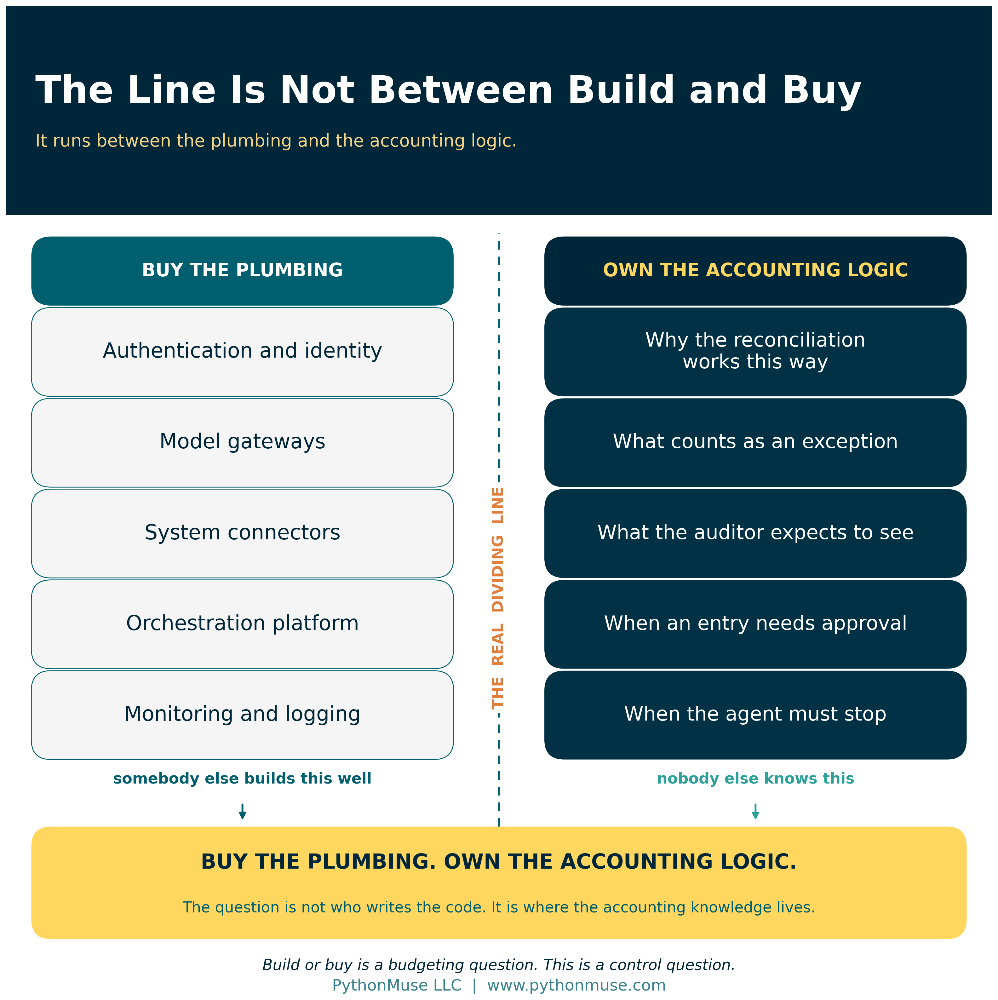
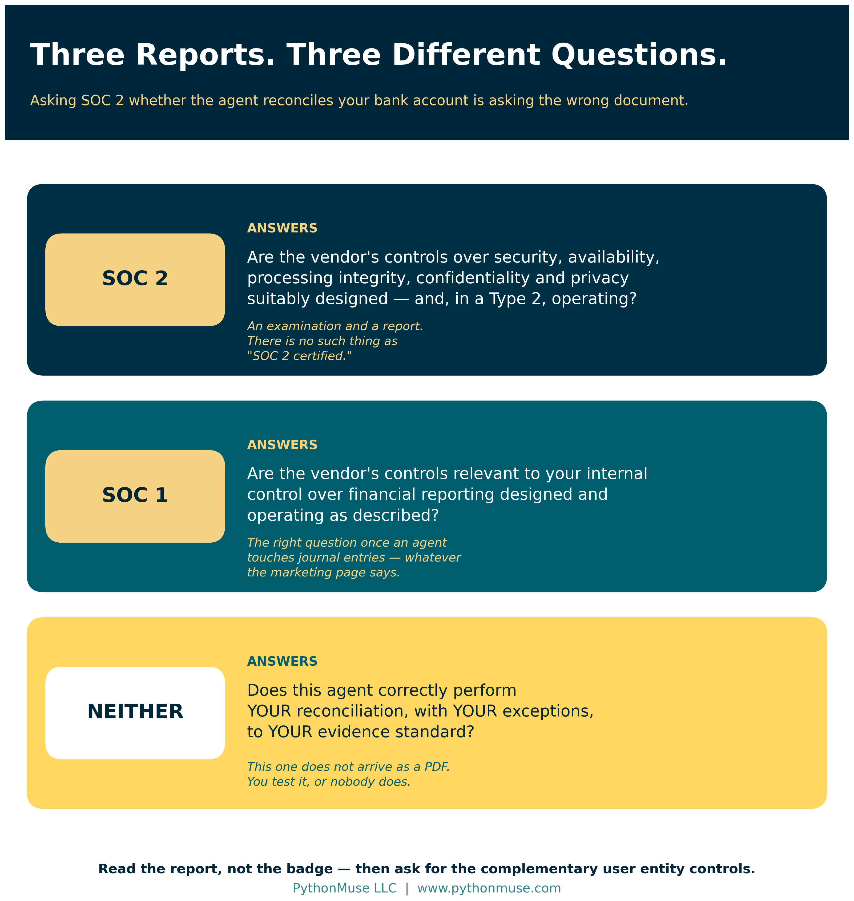
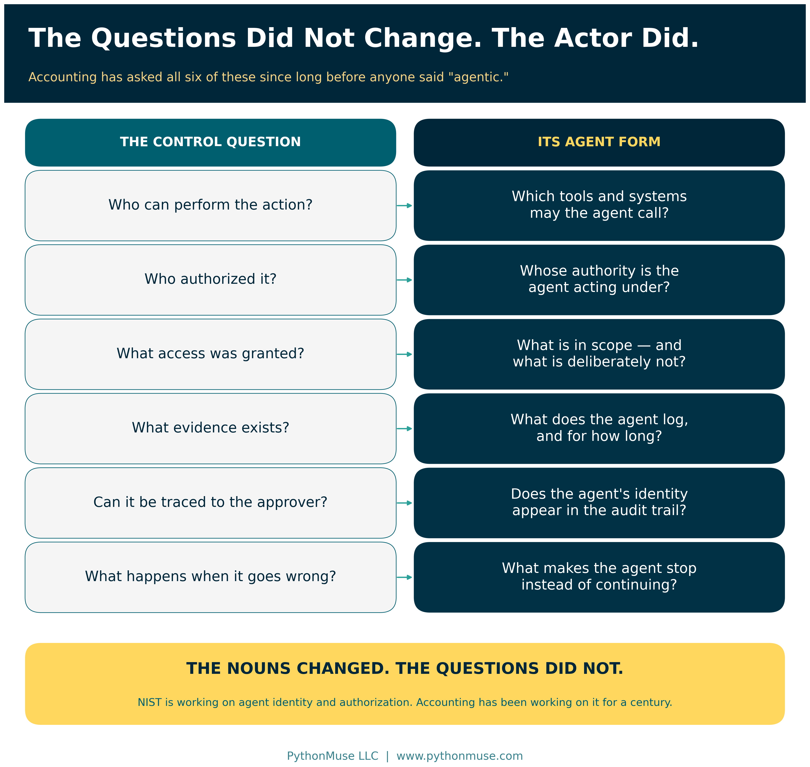
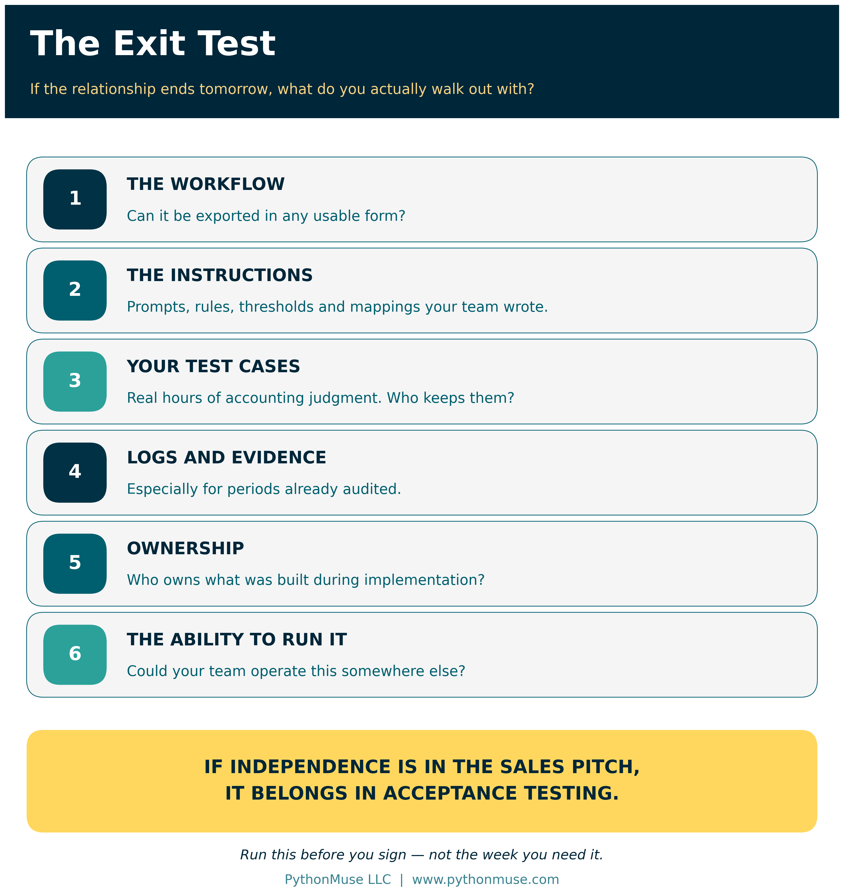
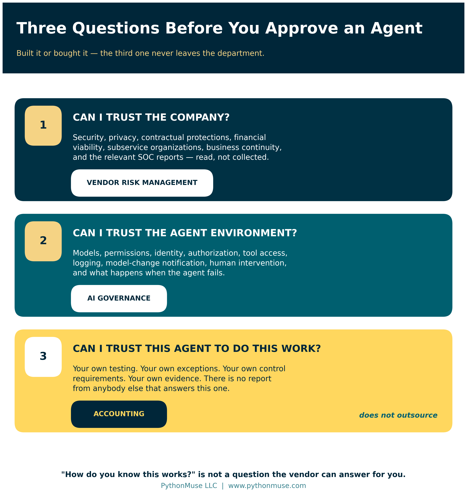

# Buy the Platform. Own the Accounting Logic.

*Why "build or buy" is the wrong question for AI accounting agents — and what to ask instead*

---

**PythonMuse LLC**
*Published September 2026*

---

My inbox is starting to look different.

More companies are offering AI agents built specifically for accounting. Some reconcile accounts. Some review invoices. Some analyze variances, prepare journal entries, or support the close. The pitch is usually attractive: the agent is already built, the vendor will help implement it, and after setup your accounting team can operate it without much outside help.

Many also point to SOC 2 as evidence that the platform is ready for enterprise use. Pricing often includes a platform fee plus predictable usage charges, even when the agents themselves run on frontier models from OpenAI, Anthropic, or Google.

It is an appealing offer. It is supposed to be.

There is also another option. Someone on your team who genuinely understands your reconciliations, your reports, your exceptions, and your controls could learn to build an agent internally. That has become dramatically easier. Modern AI tools handle much of the work that would have required a developer two years ago.

So which direction should you take? Build the capability inside accounting, or buy what somebody else already made?

That is not actually the right question.

The better question is:

> **Where do you want the accounting knowledge, the control knowledge, and the ability to validate the process to live?**

Everything else follows from that.

---

## The Case for Letting Accountants Build

There is an obvious advantage to having accountants build their own workflows.

They already know the process.

The senior accountant who owns a reconciliation knows which items are routine and which ones need investigation. She knows why something that technically matches may still deserve a second look. She knows which reports cannot be trusted without another check. She knows the strange exceptions that never made it into the written procedure — the ones that live in her head and in a tab on her worksheet called "notes."

That knowledge is very hard to transfer to a vendor across three implementation meetings.

There is a second benefit, and it is the one people underestimate. **The person helping build the workflow is also learning how it works.** When something changes later — a new bank file format, a new entity, a new exception — somebody inside the company understands the instructions, the assumptions, the data sources, the tests, and the expected results. That person can maintain the workflow instead of opening a support ticket and waiting.

Over time, that is how a department builds real capability rather than a subscription.

But let us be honest about the cost.

That accountant already has a job.

Month-end close still happens. Reconciliations still have deadlines. Reports still go out. Auditors still ask questions. If someone spends 40 or 60 hours designing and testing an AI-assisted workflow, those hours did not become free just because no vendor invoice arrived.

Internal development also creates a control problem if you are not careful. **The person who designs a significant workflow should not be the only person who decides whether it works.**

Accounting already understands this instinct. The preparer and the reviewer are different people for a reason. AI does not repeal that.

An accountant may be exactly the right person to design an agent. Someone else still needs to test it independently. The process owner still needs to approve it before production use. Significant changes still need regression testing. If you want the pattern in detail, [Pull Requests Are Internal Controls](../20e-pull-requests-are-controls/README.md) covers how a review-and-approve step gets built into the work rather than bolted on afterward.

Building internally can give accounting more control — but only if you actually apply controls to the building.

> **🛠️ Reminder — this is a framework.** The worked examples in this series run Claude through the Claude extension in Visual Studio Code, because that is what our environment uses. Nothing in this article depends on that choice. The same questions apply to a ChatGPT Enterprise workspace, a Gemini Enterprise agent, a deployment on Amazon Bedrock, or a vendor's packaged accounting agent. The tool changes; the questions do not. This series teaches the framework, not the vendor.

---

## Buying the Agent Does Not Eliminate the Work

Now consider the alternative.

A vendor tells you it already has a bank reconciliation agent.

Great. But what exactly does that mean?

The first question is not whether the demo looks impressive. Demos are built to look impressive. The question is whether the agent can perform **your reconciliation**.

How does it handle one-to-many matches? What does it do with bank fees? How does it treat stale checks? What happens when four transactions sit within a few dollars of each other? Does it propose journal entries, or post them? When does it stop and ask a human? What evidence does it keep? Could you reconstruct, three months later, why it matched a particular transaction?

Buying the software answers none of those questions. Neither does a vendor telling you that hundreds of other companies use the agent. Their process is not your process.

Which means you still need to validate it.

You need expected results. Normal transactions. Exceptions. Transactions that *should* fail. You need to understand its false positives and its false negatives, because those two failure modes cost you very different things.

In other words: most of the testing you would perform if your own employee built the agent still exists when you buy it instead.

**The development work may disappear. The controller's responsibility does not.**

### The Vendor Agent Acceptance Test

Here is the practical version. Before a purchased agent touches a production close, run your own data through it and confirm each of these. This is not a procurement questionnaire — it is a test plan, and the vendor's demo environment is a perfectly good place to run it.

- **A clean match.** The boring case works and is documented.
- **A one-to-many match.** One deposit against six invoices. Does it find it, or quietly leave all seven items open?
- **A near-duplicate.** Four transactions within a few dollars. Does it pick the right one, or the first one?
- **A stale check.** Something that should be flagged for treatment, not matched away.
- **A bank fee with no counterpart.** Does it propose the entry, post the entry, or ignore it?
- **A transaction that should fail.** Seed a break deliberately. If the agent reconciles it, you have learned something very important.
- **The stop condition.** Find the input that makes it escalate to a human. If you cannot find one, that is your finding.
- **The evidence.** Pull the audit trail for one matched item and ask whether it would satisfy your auditor in March.

If you cannot run that test, you do not yet know what you are buying. [From AI Answers to Audit Trails](../32-from-ai-answers-to-audit-trails/README.md) goes deeper on what validating AI output actually looks like in practice.

---

## SOC 2 Is Important. It Is Also Not the Answer to Every Question.

This is where accounting teams need to get more precise, because a lot of diligence conversations end the moment a badge appears on a slide.

SOC 2 matters. The AICPA describes a SOC 2 engagement as an examination of controls at a service organization relevant to security, availability, processing integrity, confidentiality, or privacy. Those are exactly the right questions to ask before handing a vendor access to your systems and your financial data.

But notice what SOC 2 does not tell you.

It does not tell you that the vendor's bank reconciliation agent correctly reconciles *your* bank account. It does not tell you that an AP agent understands *your* approval policy. It does not tell you that a variance-analysis agent knows when a fluctuation on *your* P&L requires escalation.

That is not a failure of SOC 2. It means you are asking SOC 2 a question it was never designed to answer.

Three practical refinements are worth carrying into your next vendor call.

**First: there is no such thing as SOC 2 certification.** The AICPA consistently calls it an examination, resulting in a report. When a vendor says "we're SOC 2 certified," that is usually enthusiasm rather than deception — but it is a useful signal about how closely anyone on their side has read the thing. Ask for the report, not the badge. Then ask about its scope, its period, its exceptions, and its subservice organizations.

**Second: Type 1 and Type 2 are not the same assurance.** A Type 1 report describes whether controls were *suitably designed* at a point in time. A Type 2 report describes whether they *operated effectively* over a period. Controllers accept Type 1 reports all the time believing they received something they did not. A well-designed control that was never tested in operation is a plan, not evidence.

**Third: ask for the complementary user entity controls.** Buried in every SOC report is a list of the controls the service organization assumes *you* are performing. They have a name — CUECs — precisely so you can ask for the list by name. The vendor's report is only valid if your side of it is true. That list is the most useful page in the document and the one most likely to have never been read.

And if the service performs activities that could affect financial reporting, ask whether SOC 1 is the relevant report. SOC 1 specifically addresses controls at a service organization relevant to a user entity's internal control over financial reporting. An agent that prepares journal entries has wandered into SOC 1 territory, whatever the marketing page says.

Neither report validates your accounting workflow. That part does not come in a PDF.

---

## Agents Are Creating a New Layer of Questions

There is another reason not to stop at traditional vendor diligence.

AI agents differ from ordinary software because we increasingly give them **authority to act**. They read files, query systems, prepare entries, send messages, call other tools, and sometimes initiate transactions. Software that only produces a report has a small blast radius. Software that can post an entry does not.

That changes the questions a controller should ask.

In February 2026, NIST's Center for AI Standards and Innovation launched an [AI Agent Standards Initiative](https://www.nist.gov/news-events/news/2026/02/announcing-ai-agent-standards-initiative-interoperable-and-secure) focused on agent security, interoperability, identity, and trusted adoption. NIST is specifically examining how agents should be identified and authorized, and how their actions can be audited. The work raises questions about least privilege, delegation of authority, logging, human authorization, and prompt-injection controls.

Those concepts should sound extremely familiar.

Who can perform the action? Who authorized it? What access was granted? What evidence exists? Can the action be traced back to the person who approved it? What happens when something goes wrong?

Accounting has been asking those six questions since long before anyone said "agentic." The nouns changed. The questions did not.

NIST's [May 2026 analysis of industry responses](https://www.nist.gov/publications/summary-analysis-responses-request-information-regarding-security-considerations-ai) reached a conclusion worth quoting to anyone who thinks this is all brand new: fundamental cybersecurity principles and practices remain relevant, but they will require adaptation to address agent security satisfactorily.

International standards are developing alongside. ISO/IEC 42001 addresses AI management systems and ongoing governance. ISO/IEC TS 42119-2 applies a risk-based approach to testing AI systems, extending established software-testing practice rather than replacing it.

None of this means you should demand a particular AI certification from every vendor tomorrow. The landscape is still forming, and a checkbox that does not exist yet is not a control.

It does mean the diligence conversation should go somewhere past "do you have a SOC 2?"

If you want the deeper version of the authority question — what happens when an agent reads a document that tries to give it instructions — [When the Invoice Starts Giving Orders](../37-when-the-invoice-gives-orders/README.md) covers it directly.

---

## The Price Is Known Today. What About Tomorrow?

Some vendors offer refreshingly simple pricing: an annual platform fee and a fixed usage charge. That is genuinely attractive, because frontier-model pricing is hard for a finance team to forecast.

But predictable billing is not the same as predictable economics.

Which models are actually running underneath? Can the vendor change them? If a model provider raises prices mid-contract, who absorbs it? What happens at renewal? Can the vendor route your workflow to a cheaper model without telling you? What happens when a materially better model ships?

And the one that matters most for a controlled process:

> **Will you know when the underlying model changes?**

If you validated a workflow on one model and the vendor quietly moves it to another, your previous testing may no longer support the conclusion you drew from it. That is not a technology question. That is a change-control question, and it belongs in the contract.

This is the same argument as [Model Selection Is an Accounting Control](../36-model-selection-is-a-control/README.md), applied to a model you do not choose and cannot see. When you build internally, the model is a documented design decision. When you buy, it is a vendor decision — so the control becomes notification and re-validation rights rather than selection.

Put it in writing. "We will tell you before we change the model" is a clause. "We use the latest and greatest" is a mood.

---

## Then There Is the Vendor Itself

One more risk feels especially live in this market.

What happens if the vendor does not exist in three years?

That is not an argument against startups. Some of the best technology in this space is coming from young companies, and waiting for the market to settle has its own cost. But AI is moving unusually fast. Products will consolidate. Business models will change. Some companies get acquired. Some quietly stop returning emails.

So include an exit test in your evaluation — and run it before you sign, not after you need it.

### The Exit Test

If the relationship ends tomorrow, what can you actually take with you?

- **The workflow itself.** Can it be exported in any usable form?
- **The instructions and configuration.** The prompts, rules, thresholds, and mappings your team built.
- **Your test cases.** The ones you wrote to validate it. These represent real hours of accounting judgment.
- **Execution logs and evidence.** Especially for periods already audited.
- **Ownership of custom work.** Who owns what was built during implementation? Check the contract, not the kickoff deck.
- **The ability to operate it elsewhere.** Could your team run an equivalent process somewhere else, or does the knowledge leave with the login?

This matters most when a vendor makes the independence pitch: *"We help you get started, and then you don't need us anymore."*

That is a wonderful thing to say. It is also testable.

So test it. Let your accounting team administer the workflow. Let them modify an instruction. Let them run the test suite. Let them retrieve the evidence. **If independence is part of the sales pitch, independence belongs in acceptance testing.**

---

## Do Not Forget the People Who Have to Use It

Buying the agent can also create a problem that never appears in the implementation proposal.

Somebody still has to use it.

An accountant who helped build a workflow usually understands what it does and why it works. An accountant who arrives on Monday to find an AI agent doing part of her job may react rather differently.

She may not trust it. She may reperform the work manually. She may maintain a parallel spreadsheet — which, let us be honest, she is very good at. She may avoid it entirely.

Or she may use it without understanding where it can fail, which is the expensive one.

All of those outcomes create risk, and none of them show up on the invoice. [The 3 Mindsets of AI Adoption in Accounting](../21-three-mindsets-of-ai-adoption/README.md) covers why the same rollout lands completely differently depending on who receives it.

So the economics of buying an agent include more than the subscription. There is implementation, validation, training, change management, process redesign, monitoring, vendor management, and eventually exit.

Internal development has its own hidden costs: employee time, learning curve, testing, governance, maintenance, and the opportunity cost of pulling a talented accountant away from the work only she can do.

Neither option is free. They just put the costs in different places, and only one of them sends you an invoice that makes the cost visible.

---

## Maybe the Answer Is Not Build or Buy

Most accounting departments will land on a hybrid, and that is the right instinct.

You do not need accountants building infrastructure. There is very little value in your team recreating authentication systems, model gateways, connectors, orchestration platforms, or monitoring tools that other companies already build well and maintain around the clock. Buy that. Buy it happily.

But outsourcing the knowledge of *why* a reconciliation works a certain way, *what* counts as an exception, *what* an auditor will expect to see, *when* a journal entry requires approval, or *when* an agent should stop instead of acting — that is a different transaction entirely.

That is accounting knowledge. Accounting should keep it.

The future finance department may well need internal builders without becoming a software-development department. Those builders understand the process, configure purchased technology, define the controls, write the test cases, challenge the vendor's agent, and maintain the workflow as the business changes.

Which gives you a cleaner way to make the decision:

> **Buy the plumbing. Own the accounting logic.**

---

## The Three Questions I Would Ask

Before approving an accounting agent — whether you built it or bought it — you want satisfactory answers to three questions.

**1. Can I trust the company?** Security, privacy, contractual protections, financial viability, subservice organizations, data handling, business continuity, and the relevant SOC reports — read, not collected.

**2. Can I trust the agent environment?** Models, permissions, identity, authorization, tool access, logging, model-change notification, security controls, human intervention, and what happens when the agent fails.

**3. Can I trust this agent to perform this accounting process?** That answer comes only from your own testing, your own exceptions, your own control requirements, and your own evidence.

The first question belongs largely to vendor risk management. The second is becoming part of AI governance. The third still belongs squarely to accounting.

That is the one I would not outsource.

Because whether your employee built the agent, a hyperscaler supplied it, or a startup sold it to you, someone — an auditor, a CFO, a customer, a board member — will eventually ask:

**"How do you know this works?"**

You do not want the answer to be:

*"The vendor told us it did."*

You want to be able to show them.

---

## Sources

The standards and guidance referenced in this article are publicly available and worth reading directly:

- NIST — [Announcing the "AI Agent Standards Initiative" for Interoperable and Secure Innovation](https://www.nist.gov/news-events/news/2026/02/announcing-ai-agent-standards-initiative-interoperable-and-secure) (launched February 2026 by the Center for AI Standards and Innovation)
- NIST — [Summary Analysis of Responses to the Request for Information Regarding Security Considerations for AI Agents](https://www.nist.gov/publications/summary-analysis-responses-request-information-regarding-security-considerations-ai) (May 2026)
- ISO — [ISO/IEC 42001:2023, Artificial intelligence management system](https://www.iso.org/standard/42001)
- ISO — [ISO/IEC TS 42119-2:2025, Artificial intelligence — Testing of AI — Part 2: Overview of testing AI systems](https://www.iso.org/standard/84127.html)
- AICPA & CIMA — [SOC 2: Reporting on an Examination of Controls at a Service Organization Relevant to Security, Availability, Processing Integrity, Confidentiality, or Privacy](https://www.aicpa-cima.com/cpe-learning/publication/soc-2-reporting-on-an-examination-of-controls-at-a-service-organization-relevant-to-security-availability-processing-integrity-confidentiality-or-privacy)
- AICPA & CIMA — [SOC 1: Reporting on an Examination of Controls at a Service Organization Relevant to User Entities' Internal Control Over Financial Reporting](https://www.aicpa-cima.com/cpe-learning/publication/reporting-on-an-examination-of-controls-at-a-service-organization-relevant-to-user-entities-internal-control-over-financial-reporting-soc-1-guide)
- AICPA & CIMA — [SOC Suite of Services](https://www.aicpa-cima.com/topic/audit-assurance/audit-and-assurance-greater-than-soc-2/)

Every statement above was verified against the linked source in September 2026. The standards landscape for AI agents is moving quickly — re-check before you cite any of it in a memo.

---

**A note on how this article was made.** This article started with me. The argument — that build-versus-buy is the wrong question, and that the real decision is where the accounting knowledge lives — is mine, and it came from reading a stack of vendor pitches. ChatGPT (5.5 Sol) helped me shape my notes into a first structured draft. Claude Sonnet and Claude Opus reviewed that draft and co-built the practice repository the series points to. Claude Code (Claude Opus 5) then built the final article, the visuals, and the site wiring — the draft carried no citations at all, so every NIST, ISO, and AICPA claim in the published version was researched and verified against the primary source from scratch rather than taken on faith, and the SOC Type 1 versus Type 2 distinction and the complementary user entity controls were added during that review because the original draft stopped one question short. I reviewed every output, pushed back on things I didn't like, and made all final content decisions. That process — bringing your own experience, using AI to build and iterate, and staying in the editorial seat throughout — is exactly what this series is about.

---

*Related: [When to Trust AI to Run Your Accounting Workflows](../12-audit-ready-ai-workflows/README.md) | [AI in Accounting Isn't Just About Efficiency — It's About Control](../13-zero-trust-ai-accounting/README.md) | [From AI Answers to Audit Trails](../32-from-ai-answers-to-audit-trails/README.md) | [When Copilot Is the Only Approved AI Tool](../33-copilot-only-approved-ai-tool/README.md) | [Model Selection Is an Accounting Control](../36-model-selection-is-a-control/README.md) | [Your AI Workflow Was Approved. Did Anyone Read the Customer Contract?](../38-ai-workflow-customer-contract/README.md)*

*© 2026 PythonMuse LLC. Content licensed under [CC BY-NC-SA 4.0](../../LICENSE); code licensed under [MIT](../../LICENSE-CODE).*
