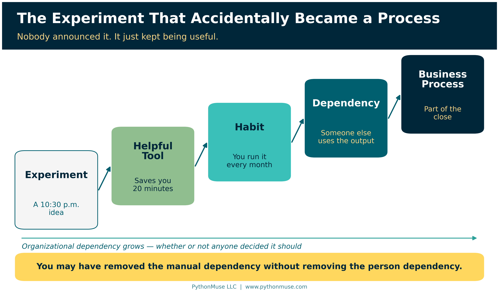
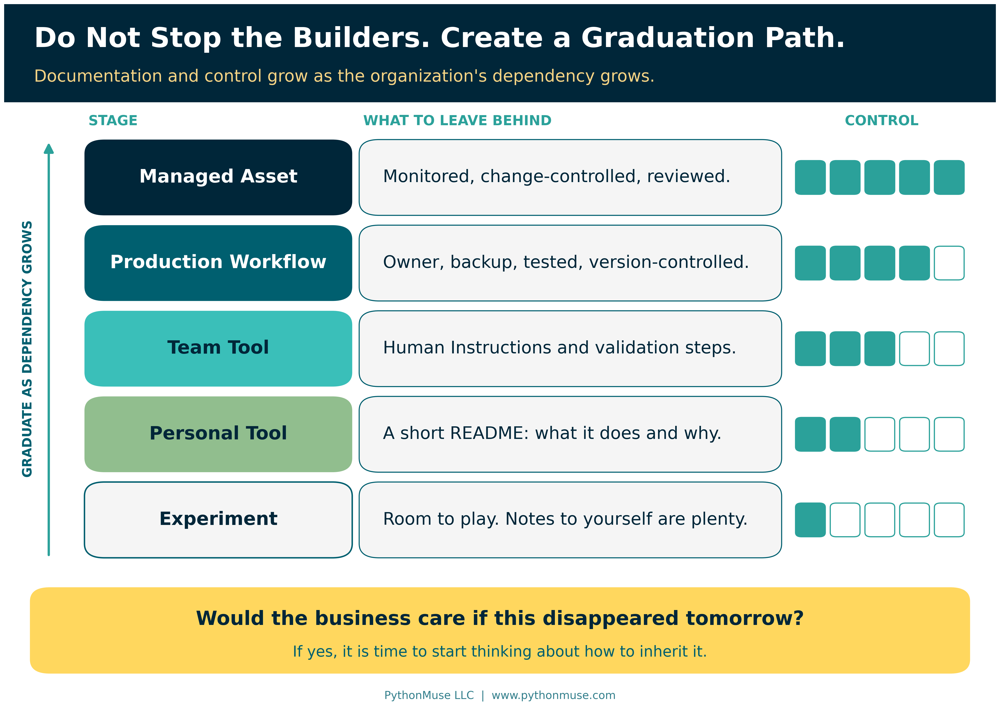
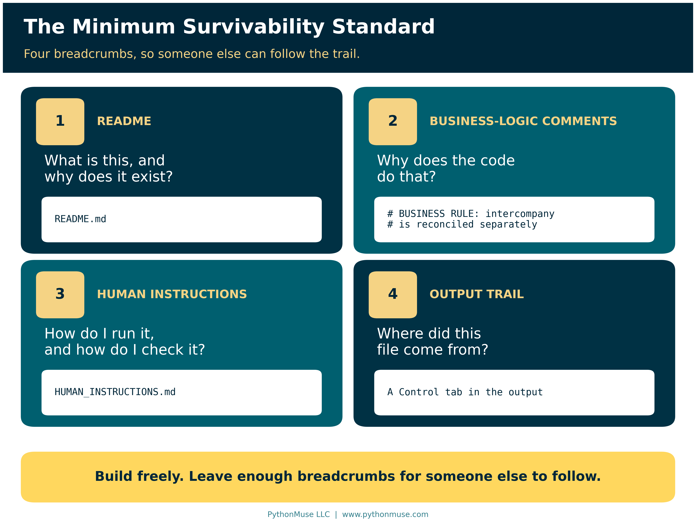
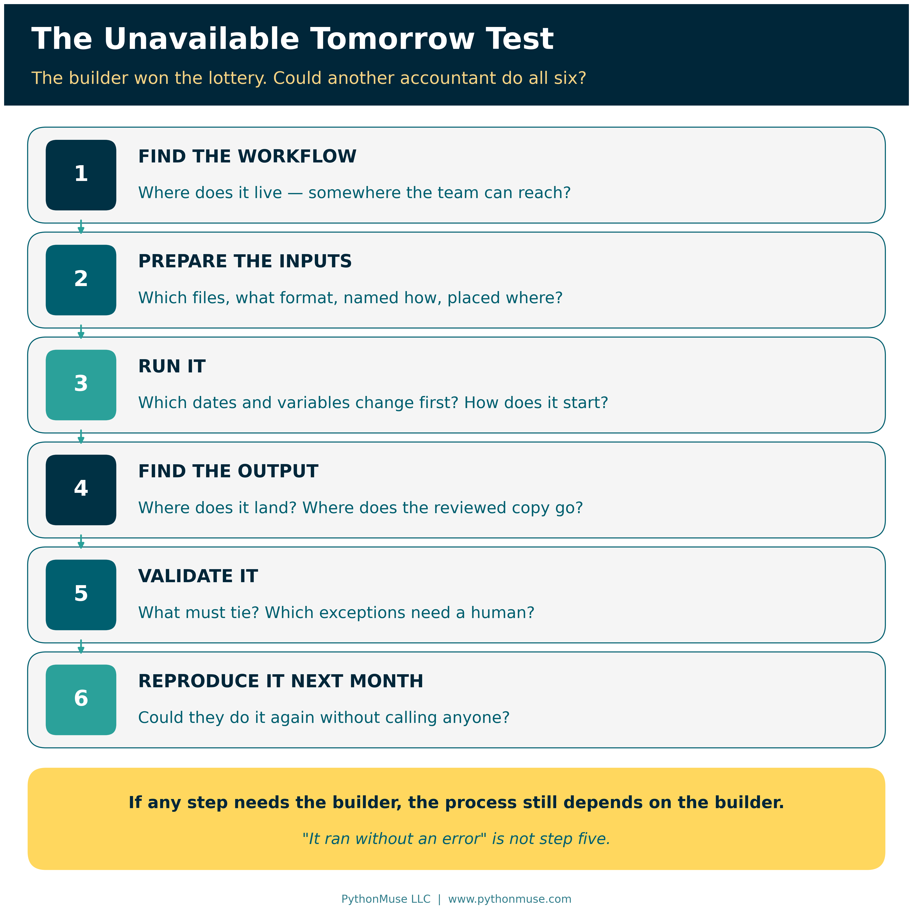
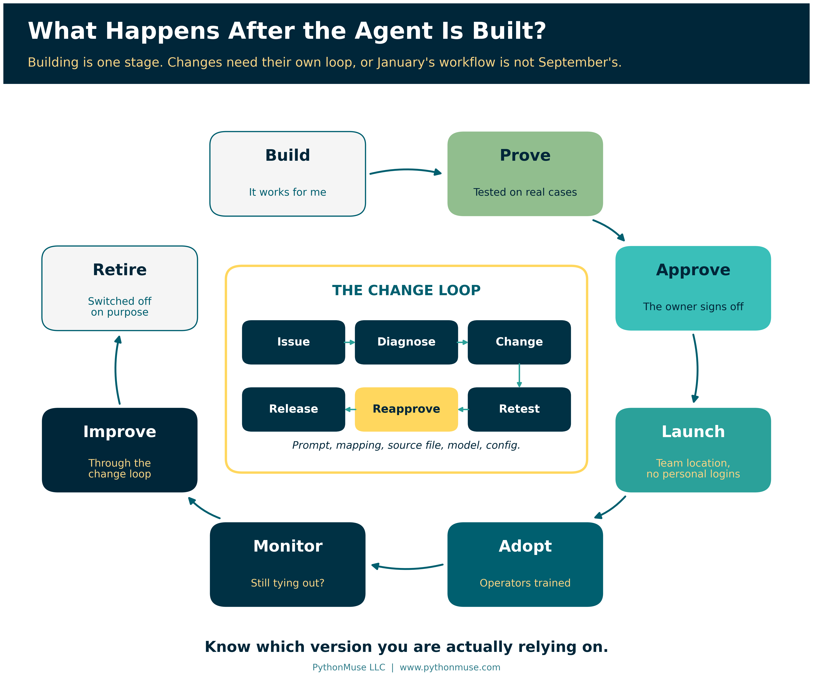

# You Built an AI Workflow. What Happens If You Win the Lottery?

*Employee-built workflows are a good thing. Here is how to make the successful ones inheritable.*

---

**PythonMuse LLC**
*Published September 2026*



---

We are entering a builder boom. Accountants who would never have called themselves developers are building scripts, agents, automations, workflows, and small internal tools. Some are using Python. Others are working in Copilot, Claude Code, Codex, Power Automate, or whatever tool happens to solve the problem in front of them.

A lot of it starts with experimentation. I know because I do it myself. I see something repetitive and think, "I wonder if I can automate this." Sometimes I cannot. Sometimes the idea ends up in the vibe-coding graveyard alongside dozens of other experiments that seemed brilliant at 10:30 p.m. But every once in a while, something works. Then it works really well, so I use it again. And again.

Eventually, the experiment is no longer really an experiment. It has quietly become part of how I do my job. That is where the interesting problem begins.

*(Stick with me. This ends with a practical, no-fluff repository of templates you can use on a workflow you already rely on — not just a thought exercise.)*

---

## The Experiment That Accidentally Became a Process

There is rarely a ceremony where someone announces, "Effective today, this Python script has officially become part of the monthly close." It happens much more naturally. You experiment with something, it saves you 20 minutes, then it saves you an hour. You improve it, trust it more, and perhaps someone else starts relying on the output.

Eventually, the progression looks something like this:

**Experiment → Helpful Tool → Habit → Dependency → Business Process**

The problem is that the organization may still think the process works the way it did six months ago. The employee may have eliminated a manual dependency without eliminating the dependency on themselves.

> **You may have removed the manual dependency without removing the person dependency.**

I have caught myself thinking about this with things I build. What happens if something happens to me? There is the old "hit by a bus" expression, although I prefer a more optimistic scenario: what if I win the lottery and simply do not show up Monday?

For those who know me well, you know that obviously would not happen. Even if I won $100 million, I would still show up and give notice first.

But the question still stands. Would someone on my team know what I built and where it lives? Would they know which source files it expects, how those files need to be named, what reporting period needs to be updated, where the output goes, and what needs to be validated? Could they reproduce what I did last month without having to reverse-engineer the entire process?

If the answer is no, I may have automated the work, but I have not yet made the process sustainable.

---

## Three Versions of the Builder Boom

I think organizations are going to experience this builder boom in very different ways.

**Some organizations will know their employees are building** and will create a path for experimentation to become a controlled production process. Useful workflows will eventually be registered, tested, documented, assigned an owner, approved where necessary, monitored, and maintained. These organizations are not trying to stop people from building. They are simply creating somewhere for successful experiments to go.

> **If that is your organization:** this article stays deliberately lightweight. For the fuller toolkit — policy, risk rating, approvals, sign-off — see the [Accounting and Finance AI Governance repository](https://github.com/PythonMuse/accounting_and_finance-ai-governance) and [AI Governance for Controllers](../07-ai-governance-for-controllers/README.md).

**A second group may not even realize how much is being built.** Employees will quietly create tools to make themselves more productive, eliminate frustrating work, or simply make their jobs more enjoyable. The organization may discover those tools only when the employee changes roles or leaves. Then someone opens the monthly Close folder and asks a surprisingly difficult question: "How did they create this?"

Suddenly, the organization owns something it did not know it owned. Does someone maintain it? Can anyone maintain it? Should it be rebuilt or replaced? Or does the team return to the old manual process nobody wanted to perform in the first place?

**Then there is a third group, and I suspect it will become very large.** Leadership knows people are building and may even be actively encouraging it. But now ten people have built twenty-five different things. Some are experiments. Some are personal productivity tools. Some are being used by entire teams. Some touch financial data or depend on personal credentials. Others may contain important accounting logic that exists nowhere else.

Leadership does not want to shut down that creativity. It just does not want to wake up one day and discover that a critical process depends on something nobody can find, understand, validate, or maintain.

This article is primarily for that third group.

---

## Do Not Stop the Builders. Create a Graduation Path.

The answer is not to treat every experiment like an enterprise implementation. An accountant testing a script to rename ten files does not need a governance committee. Experimentation needs room to remain experimentation.

But somewhere between "I am playing with this" and "our monthly reporting depends on this," the workflow needs to graduate.

A simple path might look like:

**Experiment → Personal Tool → Team Tool → Production Workflow → Managed Asset**

If you are wondering how that differs from the progression above: the first one describes how dependency *happens* — quietly, without anyone deciding. This one describes how it gets *managed* — on purpose, one step at a time.



The level of documentation and control should increase as the organizational dependency increases. A personal productivity tool has probably stopped being personal when:

- **Other employees begin relying on it.**
- **Production financial or customer data is involved.**
- **A recurring business process depends on its output.**
- **The tool receives system access.**
- **Failure could disrupt reporting.**

An even simpler question is this: **Would the business care if this disappeared tomorrow?**

If the answer is yes, the organization does not need to punish the builder. It needs to start thinking about how to inherit the process.

---

## The Minimum Survivability Standard

Not every useful workflow needs a fifty-page technical manual. In fact, if documentation becomes too burdensome, people may avoid doing it altogether. But once something becomes part of a real accounting process, another person should be able to understand enough to operate it.

At a minimum, I would leave four things behind.



**First, leave a README.** It should explain what the workflow does, why it exists, where the code or agent lives, what systems or files it interacts with, how it starts, and the major assumptions someone should understand before using it. A new person should not need to read the underlying code just to figure out the business purpose.

**Second, explain important logic inside the workflow itself.** Comments should not simply state that `read_excel()` reads an Excel file. They should explain why intercompany transactions are excluded, why a particular threshold is used, where a reporting date needs to be updated, which naming convention is expected, or which source-specific rule could cause the process to break. Those comments may eventually be more valuable to the next accountant than the code itself because they preserve the reasoning behind it.

The difference looks like this:

```python
# Read Excel file
```

```python
# BUSINESS RULE:
# Intercompany customers are excluded because they are
# reconciled separately under the intercompany close process.
```

The first comment tells the next person what they could already see. The second tells them what they could not.

**Third, leave Human Instructions.** These can live in the README or in a separate `HUMAN_INSTRUCTIONS.md` file. Write them for the accountant who inherits the process, not for another developer. Spell out every required input, the expected file format and naming convention, where each file should be placed, and which dates, entities, account names, source names, or other variables need to be updated before running the workflow. Explain how to start it, where the outputs will appear, and what to do when something does not look right.

Most importantly, explain how to validate the result. In accounting, "the script finished without an error" is not a control. The next person should know which totals must tie, which exceptions require review, which reasonableness checks should be performed, and what differences require investigation.

**Fourth, leave a trail from the output back to the workflow.** This one is easy to overlook. Imagine that a workflow creates a reconciliation and the final reviewed version is moved into the September Close folder. Six months later, an auditor or another employee opens that file. The output should contain enough information for someone to determine how it was created.

That might include the workflow name, reporting period, location of the underlying workflow or repository, version or commit reference, run date, and reviewer. The final accounting support should not become disconnected from the process that created it. Someone should be able to find the workflow, test it, reproduce the result, and run it again next month — even if the original builder is now enjoying lottery winnings somewhere without Wi-Fi.

If that trail sounds familiar, it should. [From AI Answers to Audit Trails](../32-from-ai-answers-to-audit-trails/README.md) makes the same argument about AI output in general, and [Pull Requests Are Internal Controls](../20e-pull-requests-are-controls/README.md) explains where that commit reference comes from.

---

## Yes, AI Can Probably Figure It Out

Of course, there is another option. You can give the entire workflow to AI and ask, "Tell me what this does, what files I need, what dates I have to change, where the output goes, and what could break."

And honestly, that works surprisingly well. It is useful, it saves time, and it can be an excellent way to understand unfamiliar code.

But it also uses tokens.

If it is month-end close, you are already 87% through your token allowance, three reconciliations are still open, and the person who built the workflow just won the lottery, you may wish they had left you a few breadcrumbs.

So help your future team out. AI can help the next person reverse-engineer what you built, but good documentation means they should not have to.

Better still, spend those tokens once — now, while you still remember why the intercompany rule exists.

> **Try it Monday:** Open a workflow you already rely on and give your co-pilot this prompt:
>
> *"Read the script in this folder and draft a `HUMAN_INSTRUCTIONS.md` for an accountant who has never seen this workflow and does not write code. Cover the purpose, every input file with its required format, naming convention and folder, how to start it, where the output lands, and how to confirm the result is correct. Flag every hard-coded date, file path, account, entity or threshold that needs changing before a run. Where you cannot tell why a rule exists, say so and ask me instead of guessing. Do not change the script."*
>
> Then read the draft as if you were the one inheriting it. The co-pilot drafts; you validate. If you cannot follow your own instructions, neither can anyone else.

> **Framework reminder:** I run that prompt in the Claude extension in Visual Studio Code, because that is what our environment uses. Nothing about it depends on that choice. The same request works in GitHub Copilot Chat with the script open in VS Code, in ChatGPT or Codex pointed at the same folder, or in Gemini with the file attached. If the workflow lives in Microsoft Copilot Studio or Power Automate, the idea is the same: describe or paste the flow's steps and ask for instructions a colleague could follow. The tool changes; the breadcrumbs do not. This series teaches the framework, not the vendor.

---

## The Unavailable Tomorrow Test

A simple test can tell you whether the documentation is good enough. Imagine the builder is unavailable tomorrow. They may be sick, on vacation, in a new role, working for another company, or enjoying that hypothetical lottery win.

Could another accountant:

**Find the workflow → Prepare the inputs → Run it → Find the output → Validate it → Reproduce it next month?**



If not, the process still depends heavily on the builder. That is where documentation stops being merely a developer best practice and becomes part of business continuity.

It also provides a much better test than asking whether a workflow is "documented." A README may technically exist, but if another accountant cannot use it to operate and validate the process, the documentation is not doing its job.

> **Run it for real:** The companion repository turns this into a short, no-score checklist — [LOTTERY_TEST.md](https://github.com/PythonMuse/pythonmuse-builder-to-production/blob/main/LOTTERY_TEST.md). Hand it and your documentation to a colleague, and let them try.

---

## What Happens After the Agent Is Built?

Documentation, however, is only part of the answer. Building is just one stage in the life of an AI-assisted workflow.

Once a workflow becomes important enough, the organization needs a path to prove that it works, approve its use where appropriate, launch it into a controlled environment, train the people who will operate it, monitor its performance, manage changes, and eventually replace or retire it.

A useful lifecycle is:

**Build → Prove → Approve → Launch → Adopt → Monitor → Improve → Retire**

Changes need their own discipline as well:

**Issue → Diagnose → Change → Retest → Reapprove → Release**



Without that process, a workflow that was carefully tested in January can become something very different by September. Someone updates a prompt. Someone changes a mapping. A source-system export changes. A different model gets selected. Another employee adds a new exception. Each change may seem small, but eventually the production workflow no longer matches what was originally tested and approved.

The organization therefore needs to know more than whether an automation exists. It needs to know which version it is actually relying on.

> **Going further:** When a workflow reaches the point of formal risk rating, sign-off, and change control, the [Accounting and Finance AI Governance repository](https://github.com/PythonMuse/accounting_and_finance-ai-governance) covers that ground — including [change management](https://github.com/PythonMuse/accounting_and_finance-ai-governance/blob/main/docs/change-management.md), [review and sign-off](https://github.com/PythonMuse/accounting_and_finance-ai-governance/blob/main/docs/review-and-signoff.md), [risk methodology](https://github.com/PythonMuse/accounting_and_finance-ai-governance/blob/main/docs/risk-methodology.md), and [data classification](https://github.com/PythonMuse/accounting_and_finance-ai-governance/blob/main/docs/data-classification.md). And if "a different model gets selected" made you wince, [Model Selection Is an Accounting Control](../36-model-selection-is-a-control/README.md) is written for you.

---

## Successful Experiments Need Somewhere to Go

The builder boom is a good thing. The people closest to accounting processes often understand the problems better than anyone else. They know where the manual work lives, which exceptions matter, what needs validation, and where existing systems fall short. Increasingly, they also have access to tools that allow them to solve those problems themselves.

We should not discourage that behavior. But organizations do need to recognize what happens when those experiments succeed.

A successful employee-built workflow is no longer just code. It contains process knowledge. It may contain accounting judgment. It may reflect years of small decisions and exceptions that the builder has translated into instructions, mappings, scripts, and validation rules.

If nobody else knows how that workflow operates, a new form of key-person dependency has quietly been created.

The goal is not to prevent employees from building. The goal is to make successful experiments inheritable. Organizations should give employees room to experiment while creating a lightweight path for useful tools to graduate into durable business processes.

So build. Experiment. Let the ideas that do not work join the vibe-coding graveyard. Keep the ones that do.

But when one of those experiments starts becoming part of how the business operates, leave some breadcrumbs behind.

Your future coworkers — and perhaps your future lottery-winning self — will appreciate it.

## Leave Your Breadcrumbs

This is the part of the article worth bookmarking. The **[Builder-to-Production repository](https://github.com/PythonMuse/pythonmuse-builder-to-production)** is the practical companion to everything above — copy it, don't just read about it:

- **[Lottery Test](https://github.com/PythonMuse/pythonmuse-builder-to-production/blob/main/LOTTERY_TEST.md)** — the short, no-score checklist from earlier in this article
- **[Workflow Passport](https://github.com/PythonMuse/pythonmuse-builder-to-production/blob/main/WORKFLOW_PASSPORT.md)** — the one-page record so someone can discover what exists without reading the code
- **[Human Instructions guide](https://github.com/PythonMuse/pythonmuse-builder-to-production/blob/main/HUMAN_INSTRUCTIONS_GUIDE.md)** — written for the accountant who inherits the process, not another developer
- **[Builder Handoff](https://github.com/PythonMuse/pythonmuse-builder-to-production/blob/main/BUILDER_HANDOFF.md)** — what to leave behind before you move on
- **[Output Traceability](https://github.com/PythonMuse/pythonmuse-builder-to-production/blob/main/OUTPUT_TRACEABILITY.md)** — linking a final accounting output back to the workflow that produced it
- **[Production Readiness](https://github.com/PythonMuse/pythonmuse-builder-to-production/blob/main/PRODUCTION_READINESS.md)** — the Build → Prove → Approve → Launch checklist
- **[Change Management](https://github.com/PythonMuse/pythonmuse-builder-to-production/blob/main/CHANGE_MANAGEMENT.md)** — the Issue → Diagnose → Change → Retest → Reapprove → Release loop
- **[Takeover Assessment](https://github.com/PythonMuse/pythonmuse-builder-to-production/blob/main/TAKEOVER_ASSESSMENT.md)** — Discover → Stabilize → Understand → Decide, for when the builder has already left

It also includes a small, runnable monthly reconciliation example that shows all four breadcrumbs in place end to end. Clone it, copy the templates, and use them on a workflow you already rely on — this week, not "eventually."

---

## Sources

This article draws on PythonMuse's own companion material rather than external standards:

- PythonMuse — [Builder-to-Production companion repository](https://github.com/PythonMuse/pythonmuse-builder-to-production) (templates, Lottery Test, and the monthly reconciliation example)
- PythonMuse — [Accounting and Finance AI Governance repository](https://github.com/PythonMuse/accounting_and_finance-ai-governance): [Change Management for AI Workflows](https://github.com/PythonMuse/accounting_and_finance-ai-governance/blob/main/docs/change-management.md), [Review and Signoff Requirements](https://github.com/PythonMuse/accounting_and_finance-ai-governance/blob/main/docs/review-and-signoff.md), [AI Risk Assessment Methodology](https://github.com/PythonMuse/accounting_and_finance-ai-governance/blob/main/docs/risk-methodology.md), [Data Classification for AI Workflows](https://github.com/PythonMuse/accounting_and_finance-ai-governance/blob/main/docs/data-classification.md)

Every link above was checked in September 2026.

---

**A note on how this article was made.** This article started with me. The worry — that the things I build are quietly becoming part of how the work gets done, and that nobody else would know how to run them if I did not show up Monday — is mine. ChatGPT (5.5 Sol) helped me shape my notes into a first structured draft. Claude Sonnet and Claude Opus reviewed that draft and co-built the practice repository this article points to, including the monthly reconciliation example. Claude Code (Claude Opus 5.5) then built the final article, the visuals, and the site wiring — working from my direction and feedback at each step. I reviewed every output, pushed back on things I didn't like, and made all final content decisions. That process — bringing your own experience, using AI to build and iterate, and staying in the editorial seat throughout — is exactly what this series is about.

---

*Related: [From One-Time Analysis to Repeatable Workflows](../11-one-time-to-repeatable-workflows/README.md) | [When to Trust AI to Run Your Accounting Workflows](../12-audit-ready-ai-workflows/README.md) | [Pull Requests Are Internal Controls](../20e-pull-requests-are-controls/README.md) | [From AI Answers to Audit Trails](../32-from-ai-answers-to-audit-trails/README.md) | [Don't Just Prompt AI. ONBOARD It.](../35-onboard-ai-workflows/README.md) | [Buy the Platform. Own the Accounting Logic.](../39-buy-platform-own-accounting-logic/README.md)*

*© 2026 PythonMuse LLC. Content licensed under [CC BY-NC-SA 4.0](../../LICENSE); code licensed under [MIT](../../LICENSE-CODE).*
